# 🔥 Master Class: Broadcast Variables
## Overview

At its core, an Apache Spark Broadcast Variable is a distributed read-only, shared memory construct designed to eliminate catastrophic network bottlenecks during complex distributed operations like joins. In standard Spark execution, when a task requires an external variable (like a lookup map or a small DataFrame), Spark automatically serializes and ships that variable alongside the task closure to every single task executing on the executor JVMs. If a node hosts twenty tasks, the identical variable is serialized and shipped twenty times, causing extreme network saturation, explosive JVM heap bloat, and aggressive garbage collection (GC) pauses.

Broadcast variables solve this by decoupling the variable shipping from the task closure. Instead of sending the variable with every task, the Driver node serializes the data exactly once per executor (rather than per task). The executor JVM then caches this data globally within its BlockManager, allowing all concurrent task threads on that executor to read the exact same memory instance. This fundamentally shifts the distribution mechanism from task-level redundancy to executor-level singleton caching.

By leveraging a highly optimized BitTorrent-like peer-to-peer distribution protocol (TorrentBroadcast), Spark guarantees that massive lookup tables, machine learning models, or dimension tables can be distributed across clusters with hundreds of nodes without overwhelming the Driver's network interface. It is the fundamental mechanism enabling the Broadcast Hash Join, physically bypassing the Shuffle phase for small-to-large table joins. 

---




```mermaid
graph TD
    DRV[Driver
broadcast val bc = sc.broadcast
countryMap large Map] -->|serialized once
via BitTorrent protocol| E0["Executor 0
local cache of countryMap"]
    DRV --> E1["Executor 1
local cache of countryMap"]
    DRV --> E2["Executor 2
local cache of countryMap"]
    E0 & E1 & E2 -->|bc.value lookup per row
no network per record| OUT[Result
no shuffle needed]
    style DRV fill:#1a1a3b,stroke:#6366f1
    style OUT fill:#0f2d1f,stroke:#22c55e
```

## 🏗️ Architectural Deep Dive 

### How It Works Under the Hood
The architecture of broadcast variables integrates tightly with Spark's BlockManager, the Catalyst optimizer, and Tungsten's memory management. When a user explicitly broadcasts a variable (or when Catalyst's physical planning phase evaluates a join and triggers an automatic broadcast via `spark.sql.autoBroadcastJoinThreshold`, which defaults to 10MB), the Driver serializes the object using either Java or the heavily optimized Kryo serializer. This serialized payload is then chunked into discrete blocks, typically sized at 4MB, to optimize network transfer and avoid memory fragmentation.

Rather than the Driver directly pushing this data to all executors, Spark employs the `TorrentBroadcast` mechanism. The Driver stores the serialized blocks in its local BlockManager and registers them with the BlockManagerMaster. When executor tasks begin executing and request the broadcast variable, they first check their local executor BlockManager. If missing, the executor fetches the blocks. Crucially, once an executor acquires a block, it immediately acts as a peer seeder. Subsequent executors can fetch blocks not just from the Driver, but from any executor that already holds them. This peer-to-peer distribution scales logarithmically rather than linearly, preventing Driver Out-Of-Memory (OOM) errors and network interface saturation.

On the execution side, Tungsten's Whole-Stage Code Generation seamlessly integrates broadcasted variables. During a Broadcast Hash Join, Tungsten generates optimized Java bytecode that reads directly from the broadcasted hash relation residing in the executor's memory. This memory is typically managed off-heap to circumvent JVM garbage collection overhead. By avoiding the shuffle phase entirely—bypassing local disk spills, network fetches, and sort-merge operations—broadcast variables enable a direct map-side join, operating at the speed of raw memory access.


### Key Internal Components
- **TorrentBroadcastFactory:** The internal factory responsible for instantiating the peer-to-peer broadcast mechanism, completely replacing the legacy HttpBroadcast which suffered from Driver bottlenecks at scale.
- **BlockManager:** Spark's distributed key-value store that physically caches the broadcast blocks in memory or on disk on both the Driver and all Executor JVMs, managing the eviction lifecycle.
- **BroadcastExchangeExec:** The physical plan operator generated by Catalyst that coordinates the asynchronous collection and broadcasting of a DataFrame partition directly to all worker nodes during a Broadcast Hash Join.
- **KryoSerializer:** The preferred serialization framework for broadcast variables, offering significantly reduced footprint and faster serialization/deserialization cycles compared to standard Java serialization, drastically reducing network I/O. 

---

## ⚠️ Critical Concepts & Common Pitfalls 

### The Driver OOM Death Spiral
A severe anti-pattern in Spark engineering is assuming broadcast variables completely bypass the Driver. During an automatic Broadcast Hash Join, or when a user calls `df.collect()` to explicitly broadcast, Catalyst triggers an action that gathers all partitions of the DataFrame back to the Driver JVM over the network. The Driver must hold the *entire* uncompressed dataset in its heap to serialize and chunk it for the `TorrentBroadcast`. 

If the dataset size approaches the Driver's configured memory (`spark.driver.memory`), this results in a catastrophic Driver OutOfMemoryError (OOM), instantly killing the entire application. Engineers frequently raise `spark.sql.autoBroadcastJoinThreshold` beyond the default 10MB to force Broadcast Hash Joins on larger tables without correspondingly increasing the Driver memory or tuning `spark.driver.maxResultSize`, leading to inevitable cluster failures. Always monitor the Driver heap when bumping the broadcast threshold. 

### Late-Stage Deserialization Overhead
While the Torrent protocol efficiently distributes the serialized bytes to Executor BlockManagers, those bytes must be deserialized into Java objects before the executor tasks can evaluate them. This deserialization happens lazily when the first task on the executor explicitly calls `.value` on the broadcast variable. 

If the broadcasted object is incredibly complex—such as a heavily nested machine learning model or a massive `Map[String, Object]`—the initial deserialization process can take tens of seconds and trigger a massive CPU spike on the executor. Furthermore, the resulting deserialized object lives permanently in the executor's JVM heap, competing with the execution memory for Tungsten aggregations. This often causes severe Garbage Collection (GC) pauses during the exact moments Tungsten requires memory. To mitigate this, engineers should broadcast primitive arrays or heavily optimized structures (like RoaringBitmaps) instead of dense object graphs. 

---

## 📊 Performance Characteristics

| Operation | Complexity | Shuffle? | Notes |
|-----------|-----------|---------|-------|
| Task Closure Shipping | O(N * T) | No | Without broadcast, sends variable N times per node (T=tasks), maxing out network. |
| TorrentBroadcast Setup | O(N / K) | No | Logarithmic P2P distribution of chunks (K=peers) significantly reduces Driver I/O. |
| Broadcast Hash Join | O(N) | No | Skips Sort-Merge Shuffle entirely; complexity is O(N) where N is the large table size. |
| Executor Deserialization | O(V) | No | One-time penalty per executor to unpack the serialized blocks (V=variable size). | 

---

## 💻 Code Examples

### Example 1: Manual Broadcast for Map-Side Lookups

> **What this demonstrates:** This illustrates how to manually broadcast a large immutable dictionary and safely access it inside a highly parallelized UDF, bypassing task-closure serialization redundancy.

```scala
import org.apache.spark.sql.SparkSession
import org.apache.spark.sql.functions._
import scala.io.Source

val spark = SparkSession.builder().appName("BroadcastDeepDive").getOrCreate()

// 1. Driver-side construction of a reference mapping (e.g., loaded from a DB or API)
// This object exists purely in the Driver's JVM heap.
val ipToCountryMap: Map[String, String] = Map(
 "192.168.1.1" -> "US",
 "10.0.0.1" -> "UK"
 // Imagine 5 million entries here
)

// 2. Explicitly register with SparkContext to utilize TorrentBroadcast
// Spark serializes this Map and chunks it in the Driver's BlockManager.
val broadcastedIpMap = spark.sparkContext.broadcast(ipToCountryMap)

// 3. Define a UDF that references the BROADCAST VARIABLE, not the local Map.
// The task closure only captures the lightweight Broadcast object reference.
val resolveCountryUdf = udf((ip: String) => {
 // 4. Lazy evaluation: The executor's first task calls .value, triggering 
 // the P2P fetch from other BlockManagers and local deserialization.
 broadcastedIpMap.value.getOrElse(ip, "UNKNOWN")
})

val trafficDf = spark.read.parquet("hdfs://traffic_logs/")

// 5. Execution happens purely map-side. No shuffle is generated.
val enrichedDf = trafficDf.withColumn("Country", resolveCountryUdf(col("ip_address")))
enrichedDf.write.parquet("hdfs://enriched_logs/")

// 6. Explicitly clear the BlockManager caches to prevent Executor/Driver OOMs
// on long-running structured streaming applications.
broadcastedIpMap.unpersist()
```

> **Mastery Note:** A senior engineer will recognize the critical importance of `broadcastedIpMap.unpersist()`. In continuously running Spark Streaming jobs, failing to unpersist broadcast variables causes severe memory leaks within the BlockManager, eventually crashing the executors. Furthermore, the UDF captures the `Broadcast` wrapper, not the `ipToCountryMap` itself. If the raw map was captured, Spark's closure cleaner would serialize the entire 5-million entry map and ship it for every single task, paralyzing the cluster's network.

---

### Example 2: Forcing a Broadcast Hash Join (BHJ)

> **What this demonstrates:** How to explicitly instruct the Catalyst optimizer's physical planning phase to bypass the SortMergeJoin algorithm in favor of a BroadcastHashJoin.

```scala
import org.apache.spark.sql.functions.broadcast

val largeTransactionDf = spark.read.parquet("hdfs://transactions/") // 10 Terabytes
val smallMerchantDf = spark.read.parquet("hdfs://merchants/") // 50 Megabytes

// 1. Catalyst usually evaluates table sizes against `spark.sql.autoBroadcastJoinThreshold`.
// However, if table statistics are missing (e.g., no ANALYZE TABLE run), Catalyst defaults 
// to a massive SortMergeJoin, causing a 10TB data shuffle.

// 2. We use the broadcast() hint to override the physical planner.
// This injects a BroadcastHint into the Logical Plan.
val joinedDf = largeTransactionDf.join(
 broadcast(smallMerchantDf), 
 largeTransactionDf("merchant_id") === smallMerchantDf("merchant_id"),
 "inner"
)

// 3. The execution plan will now show a BroadcastExchangeExec operator
// feeding into a BroadcastHashJoinExec operator.
joinedDf.explain(extended = false)
/*
== Physical Plan ==
*(2) BroadcastHashJoin [merchant_id#10L], [merchant_id#25L], Inner, BuildRight
:- *(2) Filter isnotnull(merchant_id#10L)
: +- *(2) ColumnarToRow
: +- FileScan parquet [merchant_id#10L, amount#11] ...
+- BroadcastExchange HashedRelationBroadcastMode(List(input[0, bigint, false])), [id=#42]
 +- *(1) Filter isnotnull(merchant_id#25L)
 +- *(1) ColumnarToRow
 +- FileScan parquet [merchant_id#25L, name#26] ...
*/
```

> **Mastery Note:** The `explain` plan reveals `BroadcastExchange HashedRelationBroadcastMode`. This proves Tungsten is deeply integrated with the broadcast mechanism. Instead of broadcasting the raw rows, Spark physically transforms `smallMerchantDf` into a highly optimized binary `HashedRelation` inside the Driver before broadcasting it. During the join phase, Tungsten's Whole-Stage Code Generation emits bytecode that directly probes this off-heap hash map for every row in `largeTransactionDf`, executing at blistering L2/L3 CPU cache speeds.

---

### Example 3: The Danger of Auto-Broadcasting Highly Skewed Data

> **What this demonstrates:** The architectural limitation where a broadcast relation still requires massive memory footprint if the underlying cardinality is unexpectedly large after a filter.

```python
# Assuming PySpark environment
from pyspark.sql.functions import col

# spark.sql.autoBroadcastJoinThreshold is set to default 10MB
# The metadata for user_profiles claims it is 8MB on disk.
users_df = spark.read.parquet("s3a://data/user_profiles") 

# Fact table is 500GB
events_df = spark.read.parquet("s3a://data/events")

# 1. Catalyst checks the Parquet metadata. It sees 8MB.
# 8MB < 10MB (Threshold). It plans a Broadcast Hash Join.
# 2. HOWEVER, the 8MB Parquet file is highly compressed (Snappy).
# When decompressed and deserialized into Tungsten internal rows, 
# it expands to 150MB of JVM memory.

joined_df = events_df.join(users_df, "user_id")
joined_df.write.parquet("s3a://data/output")

# ERROR: java.lang.OutOfMemoryError: Java heap space
# at org.apache.spark.sql.execution.joins.HashedRelation$.apply
```

> **Mastery Note:** This is the classic "Parquet Compression Trap". Catalyst bases its auto-broadcast decisions on the *compressed on-disk statistics* or metadata estimations. A highly compressed Parquet dictionary can easily expand by 10x-20x when deserialized into the Driver's memory to build the `HashedRelation`. This instantly triggers a Driver OOM. Senior engineers resolve this by either configuring `spark.sql.broadcastTimeout` to a higher value, disabling auto-broadcast (`SET spark.sql.autoBroadcastJoinThreshold = -1`), or dynamically updating table statistics via `ANALYZE TABLE COMPUTE STATISTICS`.

---

### Example 4: Broadcasting Machine Learning Models

> **What this demonstrates:** Advanced integration pattern using Broadcast variables for deploying custom, non-Spark ML inference directly onto executor nodes.

```python
import xgboost as xgb
import pandas as pd
from pyspark.sql.functions import pandas_udf, PandasUDFType

# 1. Driver-side model loading. We don't want every task to load this from S3.
# The XGBoost model might be 50MB of binary data.
local_booster = xgb.Booster()
local_booster.load_model("s3a://models/fraud_detection.bin")

# 2. Broadcast the model state. 
# Note: Complex C++ bound objects (like xgb) might fail Kryo serialization.
# A common pro-tip is to broadcast the raw bytes instead of the instantiated object.
with open("local_model.bin", "rb") as f:
 model_bytes = f.read()

broadcast_model = spark.sparkContext.broadcast(model_bytes)

# 3. Vectorized Pandas UDF for massive throughput
@pandas_udf('double')
def predict_fraud(features_series: pd.Series) -> pd.Series:
 # 4. Lazy instantiation on the Executor JVM. 
 # Reconstruct the model from the broadcasted bytes once per Python worker process.
 global model_instance
 if 'model_instance' not in globals():
 import tempfile
 with tempfile.NamedTemporaryFile() as tmp:
 tmp.write(broadcast_model.value)
 tmp.flush()
 model_instance = xgb.Booster()
 model_instance.load_model(tmp.name)
 
 # 5. Execute vectorized inference using Arrow memory mapping
 dmatrix = xgb.DMatrix(pd.DataFrame(features_series.tolist()))
 predictions = model_instance.predict(dmatrix)
 return pd.Series(predictions)

```

> **Mastery Note:** This code leverages Apache Arrow via `pandas_udf` alongside Spark Broadcast variables. By broadcasting the raw bytes rather than the Python object graph, we bypass Pickle/Kryo serialization failures common with native C++ bindings. Furthermore, the `globals()` caching trick ensures that the XGBoost model is only deserialized and loaded from the broadcast payload once per Executor Python worker process, rather than once per partition/task, minimizing CPU thrashing and achieving near real-time inference latency.

---

## 🎯 Mastery Checklist

To achieve true mastery of Broadcast Variables:
- [ ] Understand how `TorrentBroadcast` prevents Driver network interface saturation through peer-to-peer chunk sharing.
- [ ] Know when a Broadcast Hash Join outperforms a Sort-Merge Join (typically when one side fits completely in executor memory without triggering GC pressure).
- [ ] Be able to diagnose Driver OOMs caused by the Parquet compression trap expanding data beyond `spark.driver.memory` during `BroadcastExchange`.
- [ ] Understand the tradeoff between the network savings of broadcasting versus the JVM heap cost and CPU deserialization overhead on the executors.
- [ ] Know how `spark.sql.autoBroadcastJoinThreshold` interacts with Catalyst's physical planning and metadata statistics.

---

## 📚 Summary

Broadcast variables represent a critical architectural pillar in Apache Spark's distributed memory model, fundamentally shifting the paradigm of dependency distribution. Rather than indiscriminately shipping identical state within thousands of task closures, Spark leverages the highly efficient `TorrentBroadcast` peer-to-peer protocol. This delegates the caching responsibility directly to the BlockManager of each Executor JVM, ensuring that large, immutable datasets or complex machine learning models are materialized exactly once per node, drastically reducing network I/O and garbage collection thrashing. 

Deeply integrated into the Catalyst Optimizer and the Tungsten execution engine, broadcast mechanisms are the engine behind the Broadcast Hash Join. By materializing a heavily optimized, off-heap `HashedRelation` and distributing it via Torrent protocol, Tungsten can generate highly performant Java bytecode that performs map-side joins at bare-metal memory speeds. This completely bypasses the catastrophic performance penalties of the traditional shuffle-sort phase, enabling interactive analytics on petabyte-scale data lakes. 

However, true mastery requires acute awareness of the inherent dangers, specifically the Driver OOM death spiral. Because Catalyst demands the entirety of the broadcasted data be collected, deserialized, and chunked on the Driver JVM prior to distribution, miscalculating compression ratios or blindly raising the broadcast threshold guarantees cluster failure. By carefully managing lifecycle state via `unpersist()` and understanding the mechanical transition from serialized chunk to JVM object graph, engineers can wield broadcast variables to achieve orders-of-magnitude performance gains in production environments.
</🔥 Master Class: Broadcast Variables>

---

<div style="font-size: 0.82rem; color: #64748b; border-top: 1px solid #1e3a5f; padding-top: 12px; margin-top: 24px; line-height: 1.8;">
<strong style="color: #94a3b8;">📚 Book References (Spark in Action, 2nd Ed.):</strong>&nbsp;
<a href="spark_book.pdf#page=90" style="color: #60a5fa; text-decoration: none; margin-right: 10px;" title="Broadcast Variables">p.90</a> <a href="spark_book.pdf#page=92" style="color: #60a5fa; text-decoration: none; margin-right: 10px;" title="Driver-to-Executor Broadcast">p.92</a> <a href="spark_book.pdf#page=94" style="color: #60a5fa; text-decoration: none; margin-right: 10px;" title="Broadcast Join Optimization">p.94</a>
</div>
