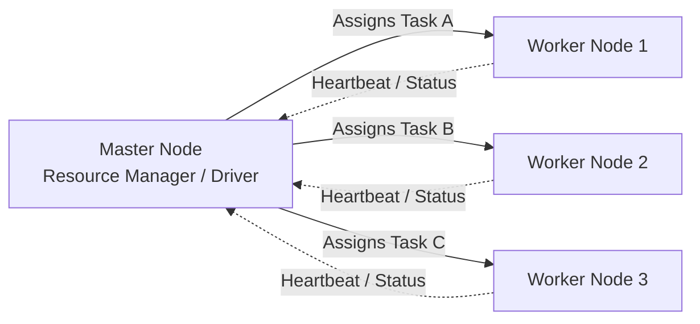

## 2. Master-Worker Architecture

Master-Worker (or Controller-Agent) is the foundational design pattern for almost all distributed computing frameworks. Instead of a single monolithic server attempting to process petabytes of data, a "Master" orchestrates the execution of tasks across hundreds or thousands of "Worker" nodes.

### The Role of Cluster Managers
In modern Big Data, the Master-Worker setup is typically managed by a Cluster Manager like **YARN** (Yet Another Resource Negotiator) or **Kubernetes**. The Master distributes code and data to the workers, monitors their health via heartbeats, and reassigns failed tasks.

### Practical Examples
1. **Hadoop YARN:** The ResourceManager (Master) allocates RAM and CPU to NodeManagers (Workers) executing MapReduce jobs. [Spark in Action (YARN & Cluster Managers) : 9, 16, 23, 24]
2. **Spark Standalone:** The Spark Master schedules tasks directly to Spark Workers, bypassing YARN entirely for simpler deployments. [Beginning Apache Spark 2 : 14, 15]
3. **Kubernetes Pods:** A K8s Control Plane (Master) schedules containerized PySpark applications onto individual worker nodes.
4. **Web Scraping:** A central controller dispatches URLs to hundreds of distributed scrapers (workers), combining the HTML results later.

---
