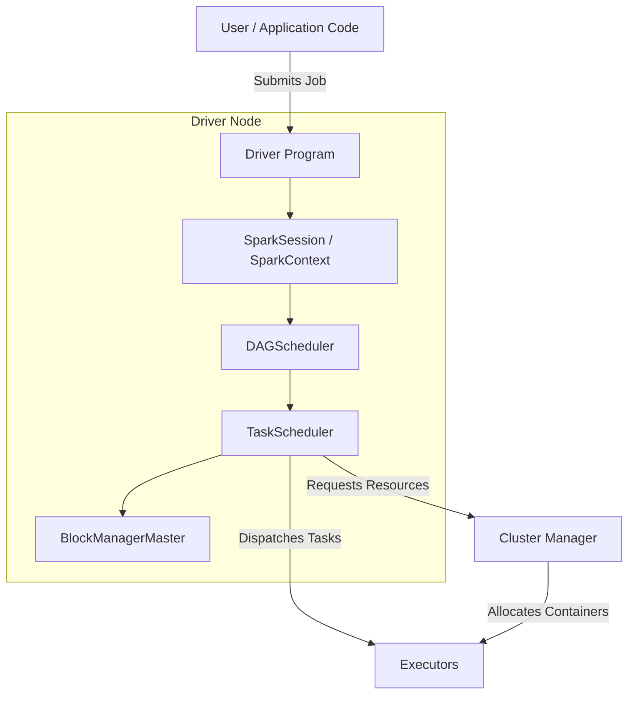
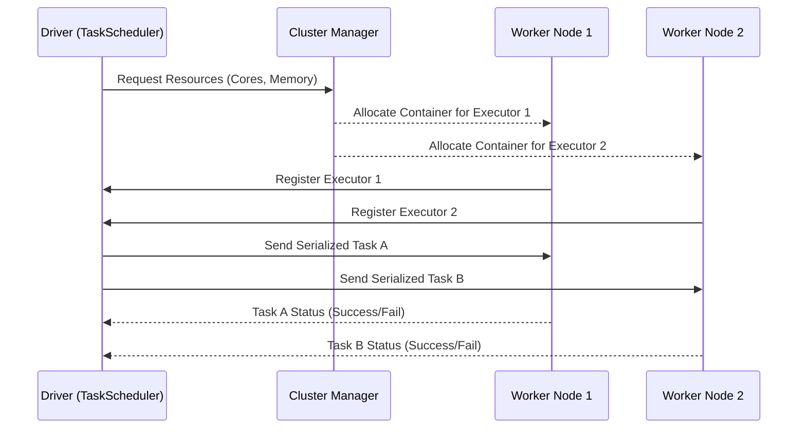

# Deep Dive: The Master-Worker Architecture in Apache Spark

The paradigm shift in large-scale data processing over the past decade can largely be attributed to the evolution of distributed computing frameworks. At the core of this revolution lies the Master-Worker architecture, a robust and scalable topology that fundamentally changed how we process terabytes and petabytes of data. Before distributed computing, organizations relied heavily on monolithic mainframes, vertically scaling hardware at exorbitant costs. As data volumes exploded, this approach hit physical and financial ceilings. The Master-Worker design pattern, adopted and perfected by Apache Spark, provides a paradigm where workloads are decoupled, enabling a central coordinator to divide and conquer massive tasks across a horizontally scalable fleet of interconnected machines. This comprehensive deep dive explores the profound technical intricacies of the Driver, Cluster Manager, and Executors, how they communicate, and how they achieve fault tolerance in a highly distributed environment.

## The Triad of Distributed Execution

To understand the mechanics of Apache Spark, we must dissect its three primary architectural pillars: the Driver (Master), the Cluster Manager, and the Executors (Workers). Unlike traditional client-server models, this triad operates on a continuous feedback loop of resource negotiation, task serialization, execution, and state reporting.

### 1. The Driver Program (The Mastermind)
The Driver is the brain of the Spark application. It is where the `main()` method of your application runs, and where the `SparkSession` or `SparkContext` resides. When a user submits a Spark application, the Driver constructs a logical execution plan based on the user's transformations and actions. 

Internally, the Driver encompasses several critical components:
- **DAGScheduler**: Translates the logical plan into a Directed Acyclic Graph (DAG) of physical execution stages. It breaks the application down at shuffle boundaries.
- **TaskScheduler**: Submits individual tasks to the cluster manager to be executed on the allocated worker nodes. It tracks the status of each task, handling retries if necessary.
- **BlockManagerMaster**: Keeps track of where blocks of data are stored across the entire cluster, crucial for caching and shuffle operations.

The Driver is not designed to process massive datasets itself; it is the orchestrator. It holds metadata, tracks executor heartbeats, and collects final results if requested (e.g., via `collect()`).



### 2. The Cluster Manager
The Cluster Manager acts as the resource broker. While the Driver knows *what* needs to be executed, the Cluster Manager knows *where* it can be executed. Spark is agnostic to the underlying cluster manager and supports several out of the box, including YARN (Yet Another Resource Negotiator), Apache Mesos, Kubernetes, and its own Standalone mode.

When the Driver starts, it requests resources (CPU cores and Memory) from the Cluster Manager. The Cluster Manager assesses the physical nodes available in the cluster, reserves the requested resources, and spins up containers where the Executors will live. In dynamic environments, the Cluster Manager can scale these resources up or down based on the workload demands.

#### Example 1: Architectural Example - Driver and Resource Configuration
In this example, we configure the Driver to interact with the YARN cluster manager, requesting specific memory limits and fair scheduling for advanced orchestration.

```python
# Example 1: Creating a SparkSession with specific Driver configurations
from pyspark.sql import SparkSession

spark = SparkSession.builder \
    .appName("DeepDiveArchitecture") \
    .config("spark.driver.memory", "4g") \
    .config("spark.driver.cores", "2") \
    .config("spark.driver.maxResultSize", "2g") \
    .config("spark.scheduler.mode", "FAIR") \
    .config("spark.submit.deployMode", "cluster") \
    .master("yarn") \
    .getOrCreate()
    
# The driver orchestrates the DAG creation and task dispatching via YARN.
```

### 3. Executors (The Workers)
Executors are distributed JVM processes launched on the worker nodes. They are the true muscle of the operation. Once the Cluster Manager allocates the containers, the Executors are instantiated and immediately register themselves with the Driver's BlockManagerMaster and TaskScheduler.

Executors serve two primary purposes:
1. **Task Execution**: They receive serialized tasks (code and data references) from the Driver, execute the computation on their local CPU cores, and return the result state (success or failure) back to the Driver.
2. **Data Storage**: They provide in-memory storage for RDDs, DataFrames, and Datasets that the user chooses to cache. They also manage disk spills and shuffle file data.

Each Executor operates independently, ensuring that if one crashes, the others can continue their work unaffected.



## Deep Dive into Executor Memory and Execution

The memory architecture within an Executor is highly sophisticated. Spark utilizes a unified memory management model, divided primarily into **Execution Memory** (used for shuffles, joins, sorts, and aggregations) and **Storage Memory** (used for caching RDDs and broadcast variables). This dynamic memory boundary allows execution memory to borrow from storage memory if storage memory is not heavily utilized, and vice versa.

When a task executes on a worker node, it processes a specific partition of data. The efficiency of the Master-Worker architecture relies heavily on data locality—the principle of moving computation to the data rather than moving the data over the network to the computation. The Driver prioritizes assigning tasks to Executors that already have the required data partitions in their local storage or nearby HDFS nodes.

#### Example 2: Dynamic Resource Allocation Configuration
In modern clusters, static allocation leads to underutilization. Here is an architectural configuration enabling dynamic allocation, allowing the Cluster Manager to add or remove worker nodes elastically.

```yaml
# Example 2: Spark Defaults (spark-defaults.conf) for Dynamic Allocation
spark.dynamicAllocation.enabled true
spark.dynamicAllocation.shuffleTracking.enabled true
spark.dynamicAllocation.minExecutors 2
spark.dynamicAllocation.maxExecutors 50
spark.dynamicAllocation.initialExecutors 5
spark.dynamicAllocation.executorIdleTimeout 60s
spark.dynamicAllocation.cachedExecutorIdleTimeout 120s
```

#### Example 3: Worker Memory and Partition Optimization
This code snippet demonstrates how to optimize the workload distributed to the Executors. By aligning partitions with the total cluster cores and utilizing specific storage levels, we maximize the efficiency of the Worker nodes.

```python
# Example 3: Repartitioning and Caching for Executor Efficiency
df = spark.read.parquet("hdfs://namenode:8020/data/large_dataset")

# Repartition to align with the total number of cores across all executors
# For example, if we have 10 executors with 4 cores each, 40 or 120 partitions is ideal.
df_optimized = df.repartition(120)

# Persist in memory and disk (Optimizing Storage Memory utilization on Workers)
from pyspark import StorageLevel
df_optimized.persist(StorageLevel.MEMORY_AND_DISK_DESER)

# Trigger an action to materialize the data in the Executors' memory
df_optimized.count() 
```

## Resilience and Fault Tolerance

One of the most profound benefits of the decoupled Master-Worker architecture is its inherent fault tolerance. Distributed systems inevitably experience hardware failures, network partitions, and out-of-memory errors. The architecture handles these gracefully through lineage tracking and task rescheduling.

When the DAGScheduler creates a logical plan, it records the exact sequence of transformations—the **lineage**—required to build an RDD or DataFrame partition from the base data. If a Worker node suddenly goes offline, the Driver stops receiving heartbeats from that Executor. The TaskScheduler marks the tasks assigned to that Executor as failed.

Because the Driver possesses the lineage graph, it knows exactly which partitions were lost and the exact operations needed to recreate them. The Driver simply reschedules those specific tasks onto a healthy, surviving Executor in the cluster. This design eliminates the need for expensive data replication across the network during intermediate computation stages.

```mermaid
graph LR
    subgraph Data Lineage DAG
        A[Base Data: HDFS] -->|Map| B[Transformed Partition]
        B -->|Filter| C[Filtered Partition]
    end
    C -.->|Executor Crashes| D[Driver detects failure]
    D -.->|Reschedules Task| E[New Executor computes Filter(Map(A))]
```

#### Example 4: Demonstrating Lineage and Execution Plans
To truly understand how the Master delegates work, one must examine the physical execution plan. This example shows how the Driver plans the workflow across the distributed Workers.

```python
# Example 4: Inspecting Lineage Graph via explain()
# If an executor fails, Spark uses the lineage to recompute the lost partitions.
df_filtered = df_optimized.filter(df_optimized.value > 100)
df_grouped = df_filtered.groupBy("category").count()

# The physical plan shows the exact execution steps the Driver will send to Workers,
# including Exchange (shuffle) boundaries and HashAggregate operations.
df_grouped.explain(extended=True)

# Calling collect triggers the final execution across the cluster.
# The Master gathers the distributed results from all resilient Workers.
final_results = df_grouped.collect()
```

## Conclusion

The Master-Worker architecture is the bedrock of Apache Spark's capability to process immense volumes of data with lightning speed and unwavering reliability. By completely separating the orchestration and management responsibilities (the Driver) from the sheer computational heavy-lifting (the Executors), the framework achieves unparalleled scalability. Understanding the intricate dance between the DAGScheduler, the Cluster Manager resource broker, and the dynamic memory management of the Worker JVMs is the key to mastering distributed data engineering. It is this elegant design that transforms a scattered collection of commodity servers into a unified, high-performance supercomputer.

## Book References
> **📖 Spark In Action (2nd Edition) References:**
> - [D (Page 453)](spark_book.pdf#page=453)
> - [K (Page 458)](spark_book.pdf#page=458)
> - [E (Page 455)](spark_book.pdf#page=455)
> - [S (Page 464)](spark_book.pdf#page=464)
> - [O (Page 461)](spark_book.pdf#page=461)
> - [W (Page 470)](spark_book.pdf#page=470)
> - [M (Page 459)](spark_book.pdf#page=459)
> - [A (Page 451)](spark_book.pdf#page=451)
> - [R (Page 463)](spark_book.pdf#page=463)
> - [T (Page 469)](spark_book.pdf#page=469)
> - [I (Page 457)](spark_book.pdf#page=457)
> - [U (Page 470)](spark_book.pdf#page=470)
> - [V (Page 470)](spark_book.pdf#page=470)
> - [H (Page 457)](spark_book.pdf#page=457)
> - [N (Page 461)](spark_book.pdf#page=461)
> - [P (Page 462)](spark_book.pdf#page=462)
> - [C (Page 452)](spark_book.pdf#page=452)
