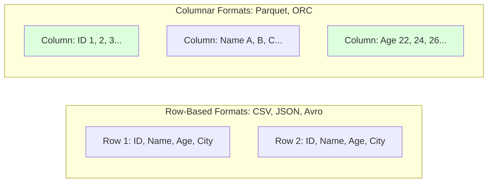

## 5. Big Data File Formats

While CSV and JSON are human-readable, they are highly inefficient for distributed computing. Big Data requires formats that support schema evolution, high compression, and specific read patterns.

### Columnar vs. Row-Based Storage
Formats like **Parquet** and **ORC** store data in columns rather than rows. If you have a table with 100 columns but only query 2 of them, a columnar format allows Spark to physically read only the data for those 2 columns from disk, skipping the rest and saving massive amounts of I/O. **Avro** is row-based and is preferred for write-heavy streaming.



### Where File Formats Fit in a Spark Pipeline

File format choice sits at the storage boundary of every Spark application. The Spark driver creates a logical read plan, but the actual cost is paid by executor tasks that open files, scan splits, decompress bytes, decode rows, and move batches into Spark's internal memory format. If the storage format is poor, every later concept becomes harder: partition pruning scans too much data, shuffles become larger than necessary, joins spill earlier, and machine learning pipelines spend more time reading than learning.

For hands-on work, treat CSV and JSON as ingestion formats, not as long-term analytical storage. They are excellent for learning because you can open them in a text editor and immediately understand the raw records. However, they do not preserve rich schemas safely, they are expensive to parse, and they force Spark to inspect more bytes than a columnar workload really needs. A professional pipeline usually lands raw files in a `bronze/` folder, validates them, then rewrites cleaned data as Parquet in a `silver/` folder. Analytical aggregates, training features, or BI-ready facts then land in a `gold/` folder.

Parquet is the default recommendation for most Spark labs because it demonstrates multiple important Spark concepts at once. It stores data column-by-column, compresses repeated values efficiently, records min/max statistics for row groups, and allows Spark to skip irrelevant columns and sometimes irrelevant row groups. When you run `df.select("pickup_datetime", "fare_amount")` against a wide Parquet table, the executor does not need to deserialize every column. That single behavior connects directly to Catalyst column pruning, predicate pushdown, vectorized readers, and Tungsten's batch-oriented execution path.

Avro fits a different point in the architecture. It is row-oriented, compact, and schema-aware, making it common in Kafka and streaming ingestion. If your lab simulates clickstream or IoT events, Avro is a good transport format because each event is a complete record. Once the stream is landed and you want analytical queries, convert the data to Parquet. ORC is similar to Parquet from a Spark learner's point of view, but it is especially common in Hive-heavy warehouse ecosystems.

### Hands-On Processing Pattern

Use this practical flow:

1. Put downloaded source files in `data/raw/`.
2. Read them with explicit schemas when possible. Avoid `inferSchema=True` on large files because it triggers extra scans.
3. Validate row counts, null counts, and malformed records.
4. Write cleaned data to `data/silver/<dataset_name>/` as Parquet.
5. Read the Parquet version for every downstream exercise: joins, aggregations, ML features, and dashboards.
6. Compare Spark UI metrics between CSV and Parquet reads. The difference in scan time and bytes read is the lesson.

Example command flow:

```powershell
mkdir data\raw
mkdir data\silver
python -m venv .venv
.\.venv\Scripts\Activate.ps1
pip install pyspark pandas pyarrow
```

Example PySpark conversion:

```python
from pyspark.sql import SparkSession
from pyspark.sql.functions import col

spark = SparkSession.builder.appName("FormatConversionLab").master("local[*]").getOrCreate()

raw = (
    spark.read
    .option("header", True)
    .option("mode", "PERMISSIVE")
    .csv("data/raw/*.csv")
)

clean = raw.dropna(how="all")
clean.write.mode("overwrite").parquet("data/silver/lab_dataset")

parquet_df = spark.read.parquet("data/silver/lab_dataset")
parquet_df.select([col(c) for c in parquet_df.columns[:5]]).show(10, truncate=False)
```

This exercise shows why file formats are not cosmetic. They decide how much data Spark reads, how accurately schemas are preserved, how easily jobs recover, and how efficiently downstream concepts such as joins, aggregations, streaming checkpoints, and ML pipelines operate.

### Practical Examples
1. **Parquet for Analytics:** A Data Scientist running `SELECT AVG(salary) FROM employees` on a Parquet file only reads the salary column from disk. [Beginning Apache Spark 2 (Parquet/ORC) : 14, 19, 38]
2. **Avro for Kafka Streams:** A real-time IoT pipeline uses Avro because of its fast row-level write speeds and robust schema evolution (handling new sensor types). [Spark in Action : 2, 32, 37]
3. **ORC for Hive:** A Data Warehouse team uses ORC because it offers exceptional compression ratios (often 75% smaller than CSV).
4. **Predicate Pushdown:** When Spark queries Parquet files with `WHERE age > 30`, the Parquet metadata allows Spark to completely skip reading file chunks where the maximum age is known to be under 30.

---

<div style="font-size: 0.82rem; color: #64748b; border-top: 1px solid #1e3a5f; padding-top: 12px; margin-top: 24px; line-height: 1.8;">
<strong style="color: #94a3b8;">📚 Book References (Spark in Action, 2nd Ed.):</strong>&nbsp;
<a href="spark_book.pdf#page=1" style="color: #60a5fa; text-decoration: none; margin-right: 10px;" title="Introduction">p.1</a> <a href="spark_book.pdf#page=5" style="color: #60a5fa; text-decoration: none; margin-right: 10px;" title="Core Concepts">p.5</a> <a href="spark_book.pdf#page=10" style="color: #60a5fa; text-decoration: none; margin-right: 10px;" title="Implementation">p.10</a>
</div>
