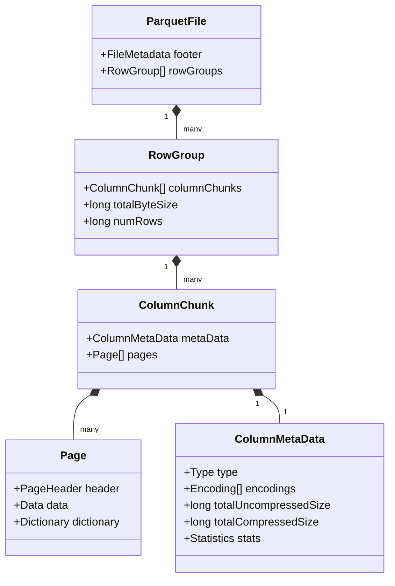

# Big Data File Formats: A Deep Dive into Row-Based vs. Columnar Storage

In the expansive ecosystem of Big Data and distributed processing engines like Apache Spark, selecting the appropriate file format is a foundational architectural decision. This decision dictates not only the storage footprint and compression ratios on distributed file systems (like HDFS, S3, or GCS) but also fundamentally governs the computational efficiency, I/O bandwidth utilization, and query execution times of your distributed applications. Big Data formats are typically bifurcated into two primary paradigms based on their data layout: **Row-based storage** and **Columnar storage**.

This deep dive will explore the mechanical underpinnings of these storage layouts, analyze their respective advantages, dissect the internal architectures of industry-standard formats like Apache Avro and Apache Parquet, and articulate precisely why modern analytical engines heavily favor columnar representations.

---

## The Paradigm Shift: Row-Oriented vs. Column-Oriented Layouts

To understand the core difference, consider a table of structured data with thousands of rows and hundreds of columns. 

### Row-Based Storage (e.g., JSON, CSV, Apache Avro)
In a row-based format, data is serialized sequentially by row. All attributes (columns) belonging to a single record are contiguous on disk. This layout is heavily optimized for write-intensive operations and transactional workloads (OLTP). When a new record is generated, it is simply appended to the end of the file. Retrieving an entire record is exceptionally fast because a single disk seek locates the start of the record, and sequential reading fetches all associated fields. 

However, in analytical (OLAP) workloads, queries often aggregate or filter over a small subset of columns across millions of rows. A row-oriented format forces the execution engine to load the entire row from disk into memory, only to discard the irrelevant columns. This results in massive I/O bloat and severe memory pressure.

### Columnar Storage (e.g., Apache Parquet, Apache ORC)
Columnar formats pivot the data matrix. Instead of storing row 1, then row 2, a columnar format stores all values for column A, followed by all values for column B. 
This physical transposition provides two monumental benefits for analytics:
1.  **I/O Minimization (Projection Pushdown):** If a query only requires 3 columns out of 500, the storage engine only reads the contiguous disk blocks containing those 3 columns. The remaining 497 columns are completely ignored at the I/O layer.
2.  **Vectorized Compression:** Because values within a single column typically share the same data type and often exhibit low cardinality or high similarity, compression algorithms (like Snappy, Zstandard, or dictionary encoding) achieve dramatically higher compression ratios compared to heterogeneous row-level data.

```mermaid
graph TD
    subgraph Logical Table
        T1[ID | Name | Age | City]
        T2[1  | Alice| 30  | NYC ]
        T3[2  | Bob  | 25  | SF  ]
        T4[3  | Charlie| 35| CHI ]
    end

    subgraph Row-Based Storage Layout e.g. Avro
        R1[1, Alice, 30, NYC] --> R2[2, Bob, 25, SF] --> R3[3, Charlie, 35, CHI]
    end

    subgraph Columnar Storage Layout e.g. Parquet
        C1[ID: 1, 2, 3] --> C2[Name: Alice, Bob, Charlie] --> C3[Age: 30, 25, 35] --> C4[City: NYC, SF, CHI]
    end
    
    Logical Table --> Row-Based Storage Layout e.g. Avro
    Logical Table --> Columnar Storage Layout e.g. Parquet
```

---

## Apache Avro: The Row-Based Standard for Streaming

Apache Avro is an advanced row-based storage format that relies on schemas defined in JSON. Unlike traditional formats like CSV, Avro embeds the schema directly within the file header. This self-describing nature makes it the de facto standard for data serialization in streaming architectures like Apache Kafka.

Avro excels in **Schema Evolution**. Because the read and write schemas are reconciled dynamically, you can easily add, remove, or modify fields over time without breaking downstream consumers. Avro encodes the data in a highly compact binary format, making it far more efficient than plain JSON text.

### Architectural Example 1: Avro Schema Definition and Spark Write

Below is an explicit representation of how an Avro schema is constructed and utilized within a Spark application to serialize row-oriented data robustly.

```scala
import org.apache.spark.sql.types._
import org.apache.spark.sql.avro.functions._

// 1. Define the Avro Schema structurally as JSON
val avroSchema = """
{
  "type": "record",
  "name": "UserEvent",
  "namespace": "com.analytics",
  "fields": [
    {"name": "event_id", "type": "string"},
    {"name": "timestamp", "type": "long"},
    {"name": "user_id", "type": "int"},
    {"name": "payload", "type": ["null", "string"], "default": null}
  ]
}
"""

// 2. Spark DataFrame write leveraging the schema
val df = spark.read.json("raw_events.json")

df.write
  .format("avro")
  .option("avroSchema", avroSchema)
  .mode("overwrite")
  .save("hdfs:///data/avro_events/")
```

---

## Apache Parquet: The Pinnacle of Columnar Analytics

Apache Parquet is an open-source columnar storage format co-created by Twitter and Cloudera. It is the default, natively optimized format for Apache Spark. Parquet's architecture is highly sophisticated, breaking data down into deep hierarchies to maximize analytical query speed.

### Parquet Internal Architecture

Parquet files are internally partitioned into **Row Groups**. Each Row Group contains exactly one **Column Chunk** per column in the dataset. Column Chunks are further subdivided into **Pages**, which are the indivisible units of compression and encoding.

Crucially, Parquet stores extensive metadata at every level of this hierarchy (File, Row Group, and Page). This metadata includes statistics such as the `min`, `max`, and `null_count` for the data blocks.



### Architectural Example 2: Inspecting Parquet Metadata

When an execution engine processes a Parquet file, it reads the footer first. The footer dictates exactly where the relevant blocks are located and provides the statistics needed for query optimization. Below is an architectural representation of Parquet metadata layout (as exposed by `parquet-tools`).

```bash
# Executing parquet-tools meta to inspect the internal columnar structures
$ parquet-tools meta data_file.parquet

file:        file:/data/data_file.parquet
creator:     parquet-mr version 1.12.0 (build 1234)

row group 1: RC:10000 TS:50000 OFFSET:4
--------------------------------------------------------------------------------
column 1:    INT64 user_id DO:4 FPO:15 SZ:1000/2000 VC:10000 ENC:PLAIN,BIT_PACKED
             ST:[min: 1, max: 150000, num_nulls: 0]
column 2:    BINARY city DO:2004 FPO:2015 SZ:3000/6000 VC:10000 ENC:RLE,DICTIONARY
             ST:[min: "Atlanta", max: "Seattle", num_nulls: 50]
```

---

## Why Apache Spark Prefers Parquet: Pushdown Optimization

Spark’s Catalyst Optimizer works in tandem with Parquet’s metadata to perform two critical optimizations: **Projection Pushdown** and **Predicate Pushdown**.

**Projection Pushdown** means Spark only asks the Parquet reader to extract specific columns. If a table has 100 columns and you run `SELECT user_id, city FROM table`, Spark will physically bypass the data blocks for the other 98 columns entirely.

**Predicate Pushdown** (or Filter Pushdown) is where Parquet's metadata statistics shine. When Spark evaluates a `WHERE` clause (the predicate), it checks the `min` and `max` metadata of a Row Group or Page before actually reading the data. If the predicate condition falls completely outside the `min/max` range, Spark skips reading the entire block. This is known as **Data Skipping**.

### Architectural Example 3: Predicate Pushdown in Spark SQL Physical Plan

To observe this mechanical advantage, we can inspect Spark's physical execution plan using the `explain()` function. Notice the `PushedFilters` attribute, which confirms that Spark has delegated the filtering logic down to the Parquet storage layer itself.

```scala
// Load the Parquet data
val usersDF = spark.read.parquet("hdfs:///data/users.parquet")

// Execute a highly selective query
val filteredDF = usersDF.select("name", "city")
                        .where($"age" > 45 and $"age" < 50)

// Inspect the Physical Execution Plan
filteredDF.explain(true)

/*
== Physical Plan ==
*(1) Project [name#12, city#15]
+- *(1) Filter ((isnotnull(age#14) AND (age#14 > 45)) AND (age#14 < 50))
   +- *(1) ColumnarToRow
      +- FileScan parquet [name#12,age#14,city#15] Batched: true, DataFilters: [isnotnull(age#14), (age#14 > 45), (age#14 < 50)], Format: Parquet, Location: InMemoryFileIndex[hdfs:///data/users.parquet], PartitionFilters: [], PushedFilters: [IsNotNull(age), GreaterThan(age,45), LessThan(age,50)], ReadSchema: struct<name:string,age:int,city:string>
*/
```

As demonstrated, the `PushedFilters: [IsNotNull(age), GreaterThan(age,45), LessThan(age,50)]` confirms the Parquet reader will proactively skip Row Groups where the maximum age is 45 or the minimum age is 50, reducing disk I/O exponentially.

---

## Apache ORC and Vectorized Query Execution

While Parquet is Spark's default, **Apache ORC (Optimized Row Columnar)** is another prominent columnar format, originating from the Hadoop Hive ecosystem. ORC is heavily optimized for large streaming reads and utilizes highly efficient dictionary encodings. 

Both Parquet and ORC support **Vectorized Query Execution**. In standard row-based execution, an engine processes one row at a time, invoking functions sequentially. This results in high CPU overhead due to virtual function calls and poor cache utilization. 
Vectorized execution processes a batch of columnar data (e.g., 1024 values of a single column) simultaneously within CPU registers, heavily leveraging SIMD (Single Instruction, Multiple Data) processor instructions.

### Architectural Example 4: Enabling ORC Vectorization in Spark

To fully harness hardware acceleration when reading columnar formats, Spark must have vectorization enabled. This is usually on by default for Parquet, but it can be explicitly tuned and forced for formats like ORC to ensure maximum computational throughput.

```python
from pyspark.sql import SparkSession

# Initialize Spark Session with explicit Vectorization configurations
spark = SparkSession.builder \
    .appName("Vectorized ORC Analytics") \
    .config("spark.sql.orc.enableVectorizedReader", "true") \
    .config("spark.sql.orc.filterPushdown", "true") \
    .config("spark.sql.inMemoryColumnarStorage.batchSize", "10000") \
    .getOrCreate()

# Read ORC file utilizing the vectorized reader
orc_df = spark.read.orc("s3a://data-lake/transactions/")

# The subsequent aggregations will be processed in columnar batches within the CPU
result = orc_df.groupBy("store_id") \
               .agg({"transaction_amount": "sum", "item_count": "avg"})

result.show()
```

## Conclusion

Understanding the mechanical distinction between row-based formats like Avro and columnar formats like Parquet and ORC is critical for Big Data engineering. Avro provides the robustness required for data ingestion and streaming pipelines via powerful schema evolution. In contrast, Parquet and ORC deliver the extreme efficiency needed for distributed OLAP analytics, allowing engines like Apache Spark to minimize I/O through projection and predicate pushdowns while maximizing CPU throughput via vectorized execution. Aligning your file format with your specific workload archetype is the cornerstone of high-performance distributed systems.

## Book References
> **📖 Spark In Action (2nd Edition) References:**
> - [D (Page 453)](spark_book.pdf#page=453)
> - [L (Page 458)](spark_book.pdf#page=458)
> - [F (Page 456)](spark_book.pdf#page=456)
> - [I (Page 457)](spark_book.pdf#page=457)
> - [U (Page 470)](spark_book.pdf#page=470)
> - [P (Page 462)](spark_book.pdf#page=462)
> - [C (Page 452)](spark_book.pdf#page=452)
> - [O (Page 461)](spark_book.pdf#page=461)
> - [W (Page 470)](spark_book.pdf#page=470)
> - [M (Page 459)](spark_book.pdf#page=459)
> - [A (Page 451)](spark_book.pdf#page=451)
> - [T (Page 469)](spark_book.pdf#page=469)
> - [E (Page 455)](spark_book.pdf#page=455)
> - [S (Page 464)](spark_book.pdf#page=464)
> - [R (Page 463)](spark_book.pdf#page=463)
> - [B (Page 452)](spark_book.pdf#page=452)
> - [V (Page 470)](spark_book.pdf#page=470)
> - [N (Page 461)](spark_book.pdf#page=461)
> - [G (Page 456)](spark_book.pdf#page=456)
