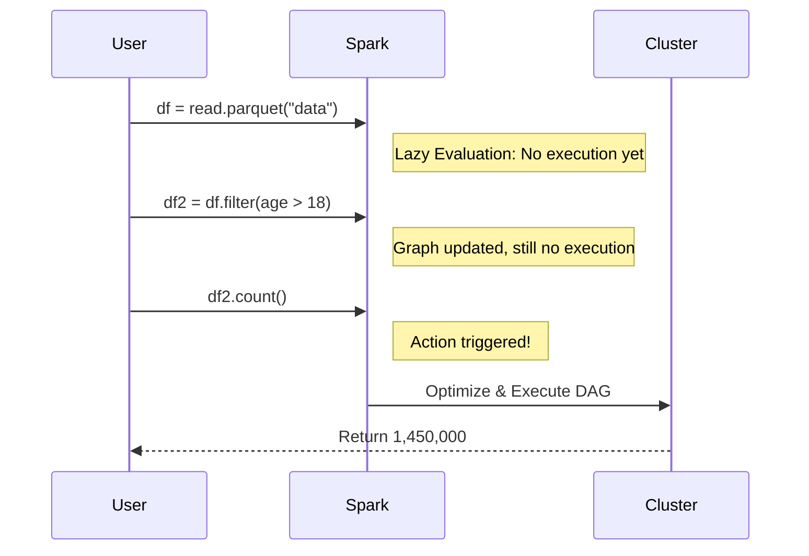

## 4. Functional Programming Paradigms

Big Data frameworks heavily rely on functional programming concepts. Because data is distributed across multiple physical machines, mutating state (changing variables in-place) leads to race conditions and inconsistent data.

### Immutability & Lazy Evaluation
In Spark, DataFrames and RDDs are **immutable**—they cannot be changed once created. Instead, you apply transformations (like `map` or `filter`) which return *new* DataFrames. Furthermore, Spark uses **lazy evaluation**: it doesn't actually execute any transformations until an action (like `count` or `collect`) is called, allowing the engine to optimize the entire execution plan.

### Practical Examples
1. **Map (Transformation):** Applying a function to every row in a massive dataset simultaneously without side effects. [Beginning Apache Spark 2 (Immutability) : 5, 18, 32]
2. **Filter (Transformation):** Removing corrupted JSON lines from a dataset. Spark records this intent but waits to execute it. [Spark in Action : 32, 35]
3. **Reduce (Action):** Aggregating total sales across millions of transactions, forcing Spark to finally execute the DAG.
4. **Fault Recovery:** Because RDDs are immutable and lineage is tracked, if a node crashes, Spark simply re-computes that specific partition from the original source.

---
