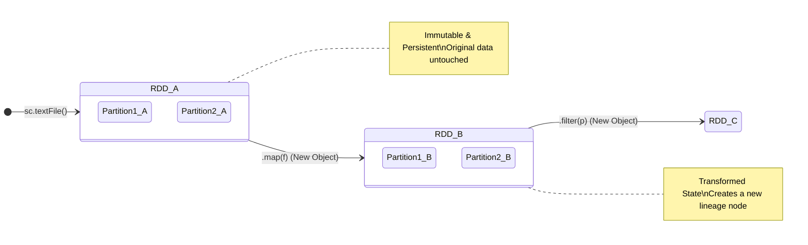

# Functional Programming Paradigms in Apache Spark: A Deep Dive

Apache Spark's architecture and processing model are intrinsically bound to the principles of functional programming. At its core, functional programming is a declarative programming paradigm that treats computation as the evaluation of mathematical functions, strictly avoiding changing state or mutating data. By modeling programs as a series of expressions rather than imperative control flows, developers can build highly scalable, predictable, and fault-tolerant distributed systems. In traditional imperative programming, developers manipulate memory and state explicitly, often leading to concurrency issues such as race conditions, deadlocks, and unpredictable mutations when deployed across a massive distributed cluster. Conversely, functional programming champions pure functions and immutable data structures, creating a paradigm where data flows through a pipeline of transformations without any side effects. In the context of Apache Spark, understanding these paradigms is not just a theoretical exercise; it is an absolute prerequisite for mastering the framework. Spark’s foundational abstractions—Resilient Distributed Datasets (RDDs), DataFrames, and Datasets—are deeply rooted in functional concepts. By adopting this mindset, engineers can leverage Spark's lazy evaluation, lineage tracking, and the Catalyst Optimizer to their full potential, ensuring massive parallelization is achieved safely, deterministically, and efficiently.

## Immutability and State Management

One of the most foundational tenets of functional programming is immutability. In this paradigm, once a data structure is created, it can never be altered. If a change is required, a completely new data structure must be generated, representing the updated state. This concept is fully embraced by Apache Spark through its core data abstraction: the Resilient Distributed Dataset (RDD). RDDs, as well as higher-level abstractions like DataFrames and Datasets, are strictly immutable collections of objects partitioned across a cluster. When you apply a transformation (such as a map, filter, or join) to an RDD, Spark does not modify the original dataset in place. Instead, it yields a newly constructed RDD that represents the transformed data. 

This strict adherence to immutability solves a multitude of problems in distributed computing. Foremost, it eliminates the possibility of race conditions. Since multiple threads or executor nodes are reading from the same data source but never writing to it concurrently, the need for complex distributed locking mechanisms vanishes. This vastly simplifies the orchestration of parallel tasks and allows executors to operate independently. Furthermore, immutability is the bedrock of Spark's fault tolerance mechanism. Because datasets are never overwritten, Spark can reliably recreate any lost partition of data by simply reapplying the deterministic transformations that produced it from the original, immutable source data.



## Pure Functions and Side Effects

A pure function is defined by two critical characteristics: its return value is identical for identical arguments (absolute determinism), and its evaluation produces no side effects (no mutation of local static variables, non-local variables, mutable reference arguments, or input/output streams). In Apache Spark, transformations applied to distributed collections must heavily favor pure functions. Because Spark distributes the execution of these functions across a cluster of independent JVMs (executors), relying on shared mutable state or executing impure functions can lead to catastrophic data inconsistencies, non-deterministic behavior, or silent logical failures.

When developers pass closures (anonymous functions or lambdas) to Spark transformations, Spark orchestrates the serialization of these functions and ships them over the network to the executor nodes. If a function attempts to update an external variable declared in the driver program, that variable is serialized and copied to the executors; the updates will only affect the local executor's copy and will never propagate back to the driver. This is a classic anti-pattern that directly violates functional programming paradigms. Instead, Spark provides specific, functionally-sound constructs for distributed state management, such as Accumulators (for commutative and associative reductions) and Broadcast Variables (for read-only shared state).

```scala
// Scala Example 1: Pure vs Impure Functions in Spark Distributed Execution
val rawRDD = sc.parallelize(1 to 1000000, 100)

// PURE FUNCTION: Deterministic, no side effects, easily serialized
// This correctly applies the mathematical transformation across all executors independently.
val processedRDD = rawRDD.map(x => x * 2 + 1)

// IMPURE FUNCTION (ANTI-PATTERN): Mutating external state
var externalCounter = 0
val flawedRDD = rawRDD.map { x => 
  // DANGER: externalCounter is serialized to executors. 
  // Updates here mutate executor-local copies, NOT the driver's master variable.
  // The driver's externalCounter will permanently remain 0 after execution.
  externalCounter += 1 
  x * 2 
}
```

## Higher-Order Functions and Transformations

Higher-order functions are an indispensable staple of the functional programming paradigm. They are functions that can accept other functions as arguments, return a function as their result, or both. In Spark, nearly all transformation operations—such as `map`, `flatMap`, `filter`, and `reduceByKey`—are higher-order functions. They take user-defined functions (UDFs) or lambda expressions and mathematically apply them over vast streams of distributed data. By treating functions as first-class citizens, Spark allows developers to compose complex data processing pipelines with concise, highly readable code.

Modern Spark SQL has pushed this concept even further by introducing native higher-order functions for complex array and map processing directly within the DataFrame API. Instead of relying on expensive Python or Scala User-Defined Functions (UDFs) that require deserializing data out of Catalyst's internal Tungsten binary format, developers can use SQL-native higher-order functions to apply transformations element-wise over nested structures. This approach retains the functional elegance of mapping and filtering while allowing the Catalyst Optimizer to fully optimize the physical execution plan.

```python
# Python/PySpark Example 2: Higher-Order Functions on Complex Types
from pyspark.sql import SparkSession
from pyspark.sql.functions import col, transform, filter as spark_filter

spark = SparkSession.builder.appName("HigherOrderFunctions").getOrCreate()
data = [([1, 2, 3, 4, 5],), ([6, 7, 8, 9, 10],)]
df = spark.createDataFrame(data, ["numbers"])

# We utilize native higher-order functions `transform` and `filter`
# to process arrays functionally without exploding rows or using Python UDFs.
# The lambda functions are applied natively inside the Tungsten execution engine.
processed_df = df.withColumn(
    "evens_squared",
    transform(
        spark_filter(col("numbers"), lambda x: x % 2 == 0),
        lambda y: y * y
    )
)
processed_df.show(truncate=False)
# Output:
# +-------------------+-------------+
# |numbers            |evens_squared|
# +-------------------+-------------+
# |[1, 2, 3, 4, 5]    |[4, 16]      |
# |[6, 7, 8, 9, 10]   |[36, 64, 100]|
# +-------------------+-------------+
```

## Lazy Evaluation and Lineage DAGs

Another profound concept inherited directly from functional languages like Haskell is lazy evaluation. In Spark, transformations (like `map` and `filter`) do not trigger immediate computation on the cluster. Instead, they merely append to an execution plan, progressively building a logical Directed Acyclic Graph (DAG) of computations known as the lineage. Data is not actually loaded from disk or processed across the network until an Action (such as `collect`, `count`, or `saveAsTextFile`) is explicitly invoked by the developer.

Lazy evaluation empowers the framework to optimize the execution plan holistically. Because the driver program is aware of the entire chain of functional transformations before a single byte of data is processed, it can pipeline operations together (a technique known as loop fusion). For example, a `map` followed by a `filter` can be collapsed into a single physical pass over the data, avoiding intermediate disk I/O or unnecessary memory overhead. Furthermore, this lineage graph is the secret to Spark's unparalleled resilience. If a worker node fails during execution, Spark uses the functional lineage DAG to deterministically trace back and recompute only the missing data partitions from the closest available ancestor.

```mermaid
graph TD
    subgraph Logical Lineage DAG (Lazy Evaluation)
        A[Read HDFS: textFile] --> B(map: parse JSON)
        B --> C(filter: event_type = 'CLICK')
        C --> D(mapToPair: key by user_id)
        D --> E(reduceByKey: sum clicks)
    end
    subgraph Physical Execution (Stages triggered by Action)
        A --> Stage1_Task1
        B --> Stage1_Task1
        C --> Stage1_Task1
        D --> Stage1_Task1
        
        Stage1_Task1 -->|Shuffle Write| ShuffleBuffer
        
        ShuffleBuffer -->|Shuffle Read| Stage2_Task1
        E --> Stage2_Task1
        Stage2_Task1 --> F[Action: saveAsTextFile]
    end
```

```scala
// Scala Example 3: Inspecting the Lineage Graph
// The following transformations are evaluated lazily. No data is physically processed yet.
val lines = sc.textFile("hdfs://cluster/logs/*.txt")
val errors = lines.filter(_.contains("ERROR"))
val messages = errors.map(_.split("\t")(1))
val cachedMessages = messages.cache()

// The Action 'count()' acts as the strict evaluation trigger.
val errorCount = cachedMessages.count()

// We can inspect the immutable functional lineage that Spark built internally:
println(cachedMessages.toDebugString)
/* Output explicitly reveals the DAG structure:
(2) MapPartitionsRDD[3] at map at <console>:26 [Memory Serialized 1x Replicated]
 |  MapPartitionsRDD[2] at filter at <console>:25 [Memory Serialized 1x Replicated]
 |  hdfs://cluster/logs/*.txt MapPartitionsRDD[1] at textFile at <console>:24 [Memory Serialized 1x Replicated]
 |  hdfs://cluster/logs/*.txt HadoopRDD[0] at textFile at <console>:24 [Memory Serialized 1x Replicated]
*/
```

## Monadic Operations and Distributed Contexts

While the term "Monad" often terrifies imperative developers, it is a mathematically elegant and crucial design pattern in functional programming that deals with wrapping values in a computational context. In Spark, the RDD itself can be viewed conceptually as a monad. It acts as an abstract wrapper around distributed data, providing a unified context for executing parallel computations without exposing the underlying cluster topology. The functional `bind` operation is represented perfectly by the `flatMap` transformation in Spark. 

When you apply a `flatMap`, you are conceptually taking a function that returns a new monadic context (a collection of elements), applying it to the inner values of the original RDD, and flattening the resulting sequence of collections back into a single, unified distributed context. This allows developers to chain complex data manipulations seamlessly, transforming inputs of one cardinality into outputs of an entirely different cardinality, while Spark silently handles the underlying orchestration, network serialization, and distributed execution constraints.

```scala
// Scala Example 4: Monadic Operations and Context Flattening
val sentencesRDD = sc.parallelize(Seq(
  "Functional programming in Spark",
  "Monads simplify distributed computation"
))

// The flatMap operation acts as the monadic bind (>>=).
// It applies the split function (which returns an Array, a new local context)
// and mathematically flattens the resulting Arrays into a single distributed RDD of Strings.
val wordsRDD = sentencesRDD.flatMap(sentence => sentence.split(" "))

// The map operation transforms values strictly within the existing context
val wordPairsRDD = wordsRDD.map(word => (word.toLowerCase, 1))

// reduceByKey performs a distributed fold over the contextual data
val wordCountsRDD = wordPairsRDD.reduceByKey(_ + _)

wordCountsRDD.collect().foreach(println)
// Output: (functional, 1), (programming, 1), (in, 1), (spark, 1), (monads, 1)...
```

In conclusion, moving from imperative programming to functional paradigms is a fundamental paradigm shift for data engineers working with Spark. Recognizing data streams as immutable flows operated on by composable, pure functions unlocks Spark's immense potential. Not only does this functional approach map intuitively to distributed data operations, but it drastically reduces the cognitive load required to debug, scale, and maintain massive big data pipelines.
