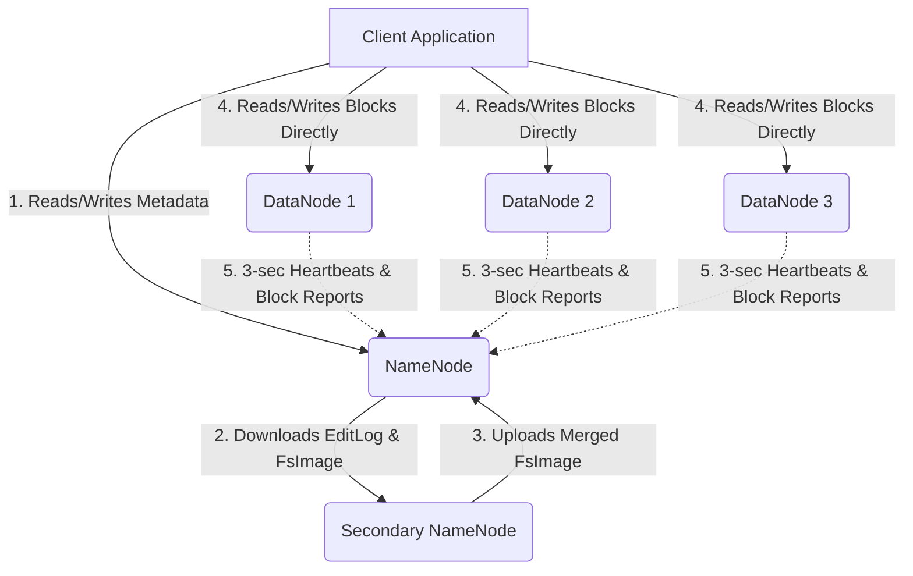
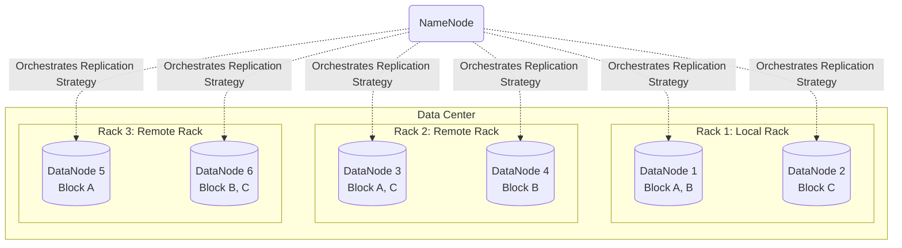

# HDFS (Hadoop Distributed File System): An Architectural Deep Dive

**HDFS (Hadoop Distributed File System)** is the foundational cornerstone of big data storage, engineered specifically as a highly fault-tolerant, distributed file system designed to run efficiently on commodity hardware. Initially built as the primary storage layer for the Apache Hadoop ecosystem, HDFS is meticulously optimized for high-throughput access to application data. This design paradigm makes it exceptionally well-suited for applications that manage massive, terabyte- or petabyte-scale data sets. HDFS intentionally sacrifices low-latency, real-time data access in favor of massive high-bandwidth throughput. This architectural trade-off aligns perfectly with the batch-processing nature of analytical engines like Apache Spark and MapReduce. 

In modern data architectures, despite the explosive rise of cloud-native object stores such as AWS S3 or Azure Data Lake Storage, understanding the underlying principles of HDFS remains a fundamentally crucial prerequisite for mastering distributed computing frameworks like Apache Spark. Spark was inherently designed to seamlessly interact with HDFS, processing distributed data in parallel while relentlessly leveraging core HDFS principles like data locality and block-based partitioning to maximize execution speed.

## 1. The Master-Slave Architecture

HDFS operates on a strict, centralized master-slave architecture, separating the concerns of metadata management from actual physical data storage. This rigid decoupling is vital for ensuring horizontal scalability across thousands of machines.

### The NameNode (Master)
The NameNode is the singular master server that actively manages the file system namespace and rigorously regulates access to files by distributed clients. It maintains the entire directory tree and vital metadata for all files and directories embedded within the cluster. This metadata securely encapsulates permissions, modification timestamps, access times, and the profoundly critical mapping of files to their constituent physical blocks. Importantly, the NameNode executes file system namespace operations such as opening, closing, renaming, and deleting files and directories. Because all metadata is stored in the NameNode's RAM for rapid access, the NameNode's memory footprint strictly dictates the total number of files the cluster can harbor.

### The DataNode (Worker)
Concurrently, multiple DataNodes function as the relentless workers. Usually, there is exactly one DataNode daemon per physical node in the cluster. These DataNodes manage the physical storage drives attached to the nodes they run on. They are unequivocally responsible for serving read and write requests directly from the file system's clients. They also tirelessly perform block creation, block deletion, and block replication upon explicit instruction from the overarching NameNode.

### The Secondary NameNode
A remarkably common misconception is that the Secondary NameNode serves as a high-availability failover backup for the primary NameNode. Instead, it is a dedicated helper node that periodically downloads the namespace image (FsImage) and the transaction log (EditLog) from the NameNode. It merges them to prevent the EditLog from becoming overwhelmingly large, a process known as checkpointing, before uploading the newly merged FsImage back to the primary NameNode.

### Architectural Example 1: Core HDFS Topology and Heartbeats
DataNodes communicate with the NameNode using a mechanism called Heartbeats. Every 3 seconds, each DataNode sends a heartbeat to the NameNode to confirm it is alive. Additionally, DataNodes periodically send Block Reports—detailed lists of all HDFS blocks they currently store. If a NameNode misses heartbeats from a DataNode for 10 minutes, it marks the DataNode as dead and initiates the replication of its lost blocks to other healthy nodes to maintain the configured replication factor.



## 2. Block Storage and Rack-Aware Replication Strategy

HDFS is ingeniously designed to reliably store exceedingly large files across volatile machines in a massive cluster. It transparently stores each file as a sequence of discrete blocks. All blocks in a file except the terminal block are of uniform size, with the default size traditionally being 64 MB, but virtually always configured to 128 MB or 256 MB in contemporary deployments. 

The HDFS block size is astronomically larger than a standard operating system file system block (which is typically a mere 4 KB). This is deliberately designed to minimize the painful cost of disk seeks. By making a block sufficiently massive, the time required to continuously transfer the data from the spinning disk or SSD becomes significantly longer than the time required to seek to the start of the block, thereby maximizing sustained disk throughput.

To guarantee robust reliability and extreme high availability, blocks are redundantly replicated across multiple distinct DataNodes. The industry-standard default replication factor is 3. HDFS employs an intelligent Rack Awareness policy to optimize data reliability, availability, and network bandwidth utilization across complex data center topologies.

### Architectural Example 2: Rack Awareness Replication Placement
HDFS's default replica placement policy is to place the first replica on the local machine (if the writer client is co-located on a datanode), place the second replica on a different node situated within the exact same local rack, and place the critical third replica on a node located in an entirely different remote rack. This sophisticated policy dramatically cuts inter-rack write traffic, which generally improves write performance and bandwidth, while still providing robust, ironclad fault tolerance against an entire top-of-rack switch failure.



## 3. Data Read and Write Anatomy

Understanding the profound anatomy of read and write operations illuminates exactly why HDFS is highly scalable and unapologetically throughput-oriented.

### The Pipelined Write Process
When a client application attempts to create a file, the NameNode meticulously verifies that the file does not already exist and that the client possesses the requisite authorization permissions. If successfully validated, the NameNode determines the specific DataNodes where the file's blocks will be securely replicated. The client then streams the data to a designated pipeline of DataNodes. 

### Architectural Example 3: Data Pipelining for Sequential Writes
During an HDFS write operation, data is emphatically *not* written to all three replicas simultaneously by the client. Instead, it dynamically forms a cascading pipeline. The client writes the block solely to the first DataNode in the chain. The first DataNode receives the data in tiny 64 KB packets, immediately writes each packet to its local physical repository, and simultaneously forwards it to the second DataNode in the designated pipeline. The second DataNode mirrors this behavior, forwarding packets to the third DataNode. This elegant pipelining architecture ensures optimal network bandwidth utilization and minimizes the client's direct network burden.

### The Read Process
When a client wants to read a file, it first contacts the NameNode to retrieve the physical network locations of the constituent blocks that compose the file. For every individual block, the NameNode returns a sorted list of the IP addresses of the DataNodes that currently hold a copy of that block. The client then bypasses the NameNode entirely and establishes a direct TCP connection with the geographically closest DataNode to stream the data, effectively eliminating the NameNode as a potential data transfer bottleneck.

## 4. HDFS Integration with Apache Spark

Understanding HDFS is unequivocally critical for Spark developers precisely because Spark's underlying distributed execution engine is deeply, inextricably coupled with the foundational concepts of HDFS blocks and data locality.

### Data Locality: Moving Computation to Data
When Apache Spark reads a massive file stored within HDFS, it natively and aggressively leverages a paradigm known as "data locality." Spark explicitly queries the NameNode for block locations and actively attempts to assign discrete computational tasks (Tasks within Stages) to the exact specific worker nodes (Executors) where the underlying HDFS data blocks physically reside on disk. 

This behavior drastically minimizes network I/O and expensive data shuffling. Moving the relatively minuscule computation bytecode to the data is orders of magnitude cheaper and faster than shifting terabytes of raw data across the network core to a central computation engine.

### Code Example 4: Spark Partitioning Aligned with HDFS Blocks
Spark intrinsically utilizes the HDFS block structure to mathematically determine its initial number of RDD (Resilient Distributed Dataset) or DataFrame partitions. When you load a file using a SparkContext, Spark deliberately creates exactly one partition for every HDFS block it encounters. 

Consider an HDFS file named `large_historical_dataset.csv` that is exactly 10 GB (10,240 MB) in size, stored on an HDFS cluster configured with the standard 128 MB block size.

Total HDFS Blocks = 10,240 MB / 128 MB = 80 blocks.

When you execute the following PySpark code:
```python
# Initialize a SparkSession named 'spark' with HDFS integration
from pyspark.sql import SparkSession
spark = SparkSession.builder.appName("HDFS_DeepDive").getOrCreate()

# Read the massive CSV file directly from the HDFS cluster
df = spark.read.csv("hdfs://namenode_host:8020/user/data/large_historical_dataset.csv")

# The number of partitions will perfectly, deterministically align with the HDFS blocks
# No network shuffle is required to achieve this initial parallelism
print(f"Number of initial DataFrame partitions: {df.rdd.getNumPartitions()}") 
# Expected Output: Number of initial DataFrame partitions: 80
```
This seamless architectural integration allows Spark to load, distribute, and aggressively process massive datasets in a highly optimized, inherently parallel fashion right from the very start, without requiring any explicit user intervention for initial repartitioning.

## Conclusion

HDFS is profoundly more than just a simplistic location to persistently dump flat files. Its highly sophisticated architecture—expertly balancing colossal block sizes, cascaded pipelined replication, intelligent rack awareness, and centralized metadata management—provides an unbreakable, high-throughput foundation for all distributed computing paradigms. For Apache Spark practitioners, intimately understanding precisely how HDFS structures physical data into distributed blocks and actively exposes locality metadata is the golden key to architecting and writing highly optimized, linearly scalable, and fiercely performant data processing pipelines. By carefully aligning Spark's memory-based computational model with HDFS's physical on-disk storage model, modern organizations can truly harness the raw, unbridled power of their sprawling data ecosystems.

## Book References
> **📖 Spark In Action (2nd Edition) References:**
> - [D (Page 453)](spark_book.pdf#page=453)
> - [L (Page 458)](spark_book.pdf#page=458)
> - [F (Page 456)](spark_book.pdf#page=456)
> - [I (Page 457)](spark_book.pdf#page=457)
> - [U (Page 470)](spark_book.pdf#page=470)
> - [P (Page 462)](spark_book.pdf#page=462)
> - [C (Page 452)](spark_book.pdf#page=452)
> - [O (Page 461)](spark_book.pdf#page=461)
> - [Y (Page 470)](spark_book.pdf#page=470)
> - [M (Page 459)](spark_book.pdf#page=459)
> - [A (Page 451)](spark_book.pdf#page=451)
> - [T (Page 469)](spark_book.pdf#page=469)
> - [E (Page 455)](spark_book.pdf#page=455)
> - [S (Page 464)](spark_book.pdf#page=464)
> - [R (Page 463)](spark_book.pdf#page=463)
> - [H (Page 457)](spark_book.pdf#page=457)
> - [B (Page 452)](spark_book.pdf#page=452)
> - [V (Page 470)](spark_book.pdf#page=470)
> - [N (Page 461)](spark_book.pdf#page=461)
