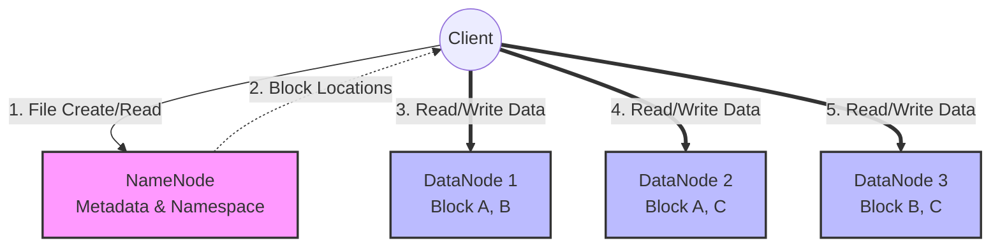

## 1. HDFS (Hadoop Distributed File System)

The Hadoop Distributed File System (HDFS) is the primary storage system used by Hadoop applications. HDFS creates multiple replicas of data blocks and distributes them on compute nodes throughout a cluster to enable reliable, extremely rapid computations.

### Architecture Overview
HDFS uses a **NameNode** and **DataNode** architecture. The NameNode acts as the master, maintaining the directory tree and the metadata for all the files and directories in the cluster. DataNodes act as the workers, storing the actual data blocks (typically 128MB in size).

### Practical Examples
1. **Log Aggregation:** Millions of small server logs are appended to a continuous file in HDFS for nightly batch processing.
2. **Data Lake Storage:** Raw CSV and JSON files from web scrapers are dumped into HDFS before being structured into Parquet.
3. **Machine Learning Archives:** Massive datasets (like ImageNet) are stored in HDFS so Spark MLlib can process them in parallel.
4. **Fault Tolerance:** If a DataNode rack goes down due to a power outage, the NameNode automatically redirects queries to the replicated blocks on surviving nodes.

> [!TIP]
> **Library References:**
> *   *Beginning Apache Spark 2* — Pages 12, 15, 18
> *   *Spark in Action* — Pages 2, 23, 32

---
