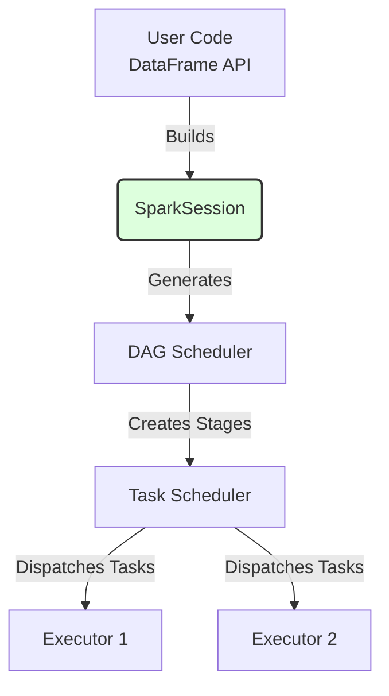

## 3. SparkSession & SparkContext

Historically (before Spark 2.0), developers had to create multiple contexts (e.g., `SparkContext`, `SQLContext`, `HiveContext`) to interact with different Spark features. Today, the **SparkSession** is the unified entry point for all Spark functionality.

### The DAG and Execution Engine
When you write Spark code, the SparkSession translates your queries into a Directed Acyclic Graph (DAG). The DAG Scheduler breaks this graph into stages, and the Task Scheduler sends those tasks to the executors.

### Practical Examples
1. **Reading CSVs:** `spark.read.csv("hdfs://data.csv")` uses the SparkSession to infer schemas automatically. [Beginning Apache Spark 2 : 15, 37, 38]
2. **Executing SQL:** `spark.sql("SELECT * FROM users WHERE age > 18")` executes distributed SQL queries across the cluster. [Spark in Action : Page 35]
3. **Configuration:** Setting `spark.conf.set("spark.executor.memory", "4g")` dynamically configures resources via the session.
4. **Legacy RDDs:** While DataFrames are preferred, `spark.sparkContext.parallelize()` is still used to create lower-level Resilient Distributed Datasets.

---
