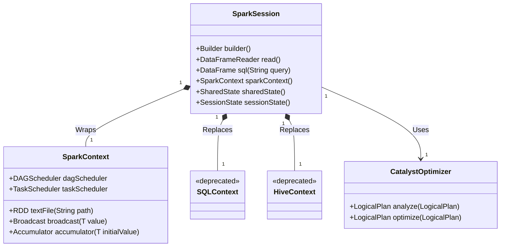
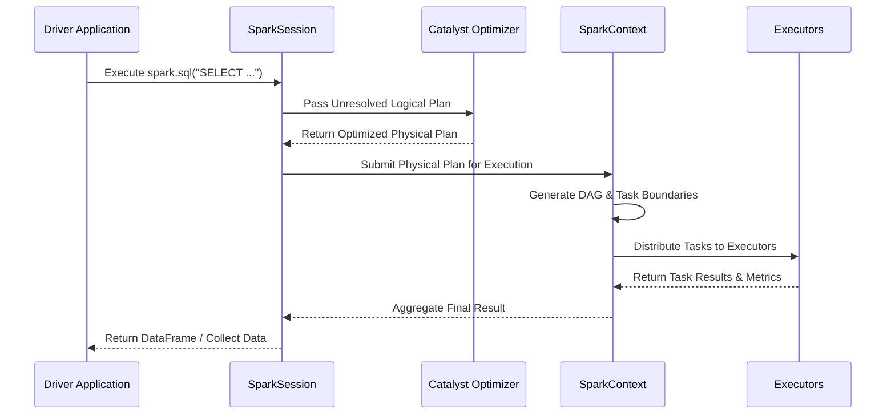

# SparkSession & SparkContext: Deep Dive into Spark Entry Points

In the landscape of Big Data processing with Apache Spark, understanding the core entry points—`SparkSession` and `SparkContext`—is not merely an academic exercise, but a fundamental prerequisite for engineering robust, distributed, and fault-tolerant applications. The entry points dictate how a Spark driver program communicates with a distributed cluster, allocates resources across worker nodes, instantiates job graphs, and ultimately orchestrates the execution of parallelized tasks. This comprehensive deep dive will unpack the historical evolution, architectural underpinnings, lifecycle management, and practical intricacies of both `SparkContext` and `SparkSession`.

## The Historical Core: SparkContext

Prior to the release of Apache Spark 2.0, the `SparkContext` stood as the undisputed primary entry point for any Spark application. It serves as the nexus of connectivity to the underlying cluster manager—be it Hadoop YARN, Apache Mesos, Kubernetes, or Spark's native Standalone cluster manager. At its core, the `SparkContext` represents the connection to a Spark cluster, providing the foundational functionality necessary to create Resilient Distributed Datasets (RDDs), manage accumulators, configure broadcast variables, and orchestrate the Directed Acyclic Graph (DAG) Scheduler.

A fundamental rule of the Spark architecture is that exactly one `SparkContext` may be active per Java Virtual Machine (JVM). Attempting to instantiate multiple contexts within the same JVM without explicitly stopping the prior one results in runtime exceptions. The `SparkContext` is essentially the master of your Spark application context. Without it, the driver program cannot translate logical RDD transformations into physical execution plans.

When a `SparkContext` is initialized, it spins up several crucial components on the driver node, including the `DAGScheduler`, `TaskScheduler`, `SchedulerBackend`, and `BlockManagerMaster`. These components collaboratively map logical RDD lineage into execution stages and distribute physical tasks to executors across the network.

### Example 1: Low-Level SparkContext Instantiation
```scala
import org.apache.spark.{SparkConf, SparkContext}

// Example 1: Direct SparkContext Initialization
val conf = new SparkConf()
  .setAppName("LowLevelSparkContextApp")
  .setMaster("yarn")
  .set("spark.executor.memory", "4g")
  .set("spark.serializer", "org.apache.spark.serializer.KryoSerializer")

// The fundamental connection to the cluster
val sc = new SparkContext(conf)

// RDD creation using the SparkContext
val rawDataRDD = sc.textFile("hdfs://namenode:8020/data/raw/transactions.csv")
val mappedRDD = rawDataRDD.map(line => line.split(","))

// Triggering an action executes the DAG via the SparkContext
val count = mappedRDD.count()
println(s"Total records: $count")

sc.stop()
```

## The Paradigm Shift: The Rise of SparkSession

As Apache Spark evolved, introducing DataFrames and Datasets APIs alongside Spark SQL, developers faced a fragmented API ecosystem. Constructing a complete application often required instantiating a `SparkContext` for RDDs, a `SQLContext` for DataFrames, and a `HiveContext` if interacting with the Hive Metastore. This disjointed approach inflated boilerplate code and complicated dependency management.

To resolve this architectural friction, Spark 2.0 introduced the `SparkSession`. The `SparkSession` acts as a unified, higher-level entry point that seamlessly encapsulates the underlying `SparkContext`, `SQLContext`, and `HiveContext` within a single, cohesive facade. Built around the Builder design pattern, `SparkSession` provides a streamlined API for reading data, executing distributed SQL queries, and interacting with the Catalyst Optimizer and Tungsten execution engine.

Despite the introduction of `SparkSession`, the `SparkContext` was not deprecated. Rather, it was elegantly abstracted. The `SparkSession` maintains a reference to the `SparkContext`, meaning that while you interact with the modern DataFrame API, the `SparkContext` continues to govern the underlying cluster negotiation, stage generation, and task scheduling.

### Architectural Blueprint: Entry Point Relationships



## Advanced Instantiation and Configuration

The transition to `SparkSession` brought a robust Builder API that standardizes how applications are configured and initialized. The `SparkSession.builder()` interface allows developers to chain configuration properties seamlessly, enabling or disabling features like Hive support, specifying the execution master, and overriding Spark properties.

One of the most powerful features of the `SparkSession` Builder is the `getOrCreate()` method. In interactive environments (like Apache Zeppelin or Jupyter Notebooks) or shared application runtimes, multiple components might attempt to initialize Spark. `getOrCreate()` intelligently checks for an existing, active `SparkSession` in the current thread and returns it if available; otherwise, it instantiates a new one based on the provided configuration.

### Example 2: Modern SparkSession Builder Pattern
```scala
import org.apache.spark.sql.SparkSession

// Example 2: Unified SparkSession Instantiation
val spark = SparkSession.builder()
  .appName("ModernSparkSessionApp")
  .master("local[*]")
  // Dynamically injecting configuration properties
  .config("spark.sql.shuffle.partitions", "200")
  .config("spark.sql.adaptive.enabled", "true")
  .config("spark.sql.adaptive.coalescePartitions.enabled", "true")
  // Enabling legacy Hive support if required
  .enableHiveSupport()
  .getOrCreate()

// Accessing the underlying SparkContext when necessary
val sc = spark.sparkContext
sc.setLogLevel("WARN")

// Modern DataFrame read operation utilizing the Session
val df = spark.read.parquet("s3a://data-lake/bronze/events/")
df.createOrReplaceTempView("events_view")

val aggregatedDF = spark.sql("""
  SELECT event_type, COUNT(*) as event_count 
  FROM events_view 
  GROUP BY event_type
""")
aggregatedDF.show()
```

## Shared State and Session Isolation

A critical distinction between `SparkContext` and `SparkSession` involves application state management. Because there is exactly one `SparkContext` per JVM, all cluster-level state (such as registered executors, accumulators, and broadcast variables) is globally shared.

Conversely, `SparkSession` introduces a dual-state architecture: `SharedState` and `SessionState`. The `SharedState` maintains global information across the entire Spark application, encompassing the underlying `SparkContext`, cached data blocks, global temporary views, and external catalog integrations (like the Hive Metastore). The `SessionState`, however, isolates session-specific elements, such as active current databases, local temporary views, user-defined functions (UDFs), and SQL configuration properties (e.g., `spark.sql.shuffle.partitions`).

This isolation enables multi-tenancy within a single Spark application. A single Spark application (with one JVM and one `SparkContext`) can host multiple independent `SparkSession` instances, each possessing isolated temporary views and configurations, whilst sharing the underlying cluster resources and cached datasets.

### Example 3: Multi-Session Isolation
```scala
// Example 3: Creating an isolated SparkSession for concurrent workloads
val globalSession = SparkSession.builder().appName("GlobalApp").getOrCreate()
globalSession.conf.set("spark.sql.shuffle.partitions", "100")

// Create a new isolated session sharing the same SparkContext
val isolatedSession = globalSession.newSession()
// Local configuration override - does not affect globalSession
isolatedSession.conf.set("spark.sql.shuffle.partitions", "10")

// This temporary view is only visible within isolatedSession
val localDF = isolatedSession.range(100)
localDF.createOrReplaceTempView("isolated_view")

// Querying succeeds in isolatedSession
isolatedSession.sql("SELECT * FROM isolated_view").show()

// Querying fails in globalSession as the view is isolated
// globalSession.sql("SELECT * FROM isolated_view").show() // Throws AnalysisException
```

## The Execution Lifecycle

The interaction between the driver application, the `SparkSession`, and the execution framework forms the core lifecycle of a Spark job. When a developer issues a transformation or an action via the DataFrame API, the `SparkSession` validates the syntax and invokes the Catalyst Optimizer. Catalyst transforms the unresolved logical plan into a resolved logical plan, applies rule-based optimizations, and generates multiple physical plans.

Once the optimal physical plan is selected, the `SparkSession` delegates the execution back to the `SparkContext`. The `SparkContext` translates the physical plan into an execution DAG consisting of Stages (boundaries defined by shuffle operations). These Stages are further subdivided into Tasks, which are dispatched by the `TaskScheduler` to the worker node Executors.



## Legacy Integration and Context Extraction

In scenarios demanding maximum performance or specific low-level cluster control, developers occasionally need to circumvent the high-level DataFrame abstractions provided by `SparkSession` and interact directly with RDDs via the `SparkContext`. This hybrid approach is completely supported.

### Example 4: Hybrid Execution with Catalyst and RDDs
```scala
// Example 4: Bridging SparkSession and SparkContext for custom partitioning
val spark = SparkSession.builder().master("local[*]").getOrCreate()

// Read data utilizing the highly optimized SparkSession Parquet reader
val df = spark.read.parquet("/path/to/optimized/data")

// Extract the underlying RDD from the DataFrame
val rdd = df.rdd

// Access the underlying SparkContext to apply custom, low-level partitioning logic
import org.apache.spark.HashPartitioner
val pairedRDD = rdd.map(row => (row.getString(0), row.getLong(1)))
val customPartitionedRDD = pairedRDD.partitionBy(new HashPartitioner(100))

// Perform an RDD-level action
val result = customPartitionedRDD.reduceByKey(_ + _).collect()

spark.stop()
```

## Conclusion

Understanding `SparkSession` and `SparkContext` is absolutely imperative for engineering performant Apache Spark applications. The `SparkContext` remains the fundamental gateway to cluster resources, DAG scheduling, and raw RDD manipulation. The `SparkSession` elegantly wraps this complexity, delivering a unified, optimizer-backed API that supports SQL, DataFrames, isolated multi-tenant execution, and seamless metadata catalog integration. Mastering both paradigms ensures developers can seamlessly transition between high-level optimizations and low-level execution tuning when diagnosing complex distributed processing anomalies.

## Book References
> **📖 Spark In Action (2nd Edition) References:**
> - [D (Page 453)](spark_book.pdf#page=453)
> - [K (Page 458)](spark_book.pdf#page=458)
> - [E (Page 455)](spark_book.pdf#page=455)
> - [X (Page 470)](spark_book.pdf#page=470)
> - [S (Page 464)](spark_book.pdf#page=464)
> - [O (Page 461)](spark_book.pdf#page=461)
> - [Y (Page 470)](spark_book.pdf#page=470)
> - [R (Page 463)](spark_book.pdf#page=463)
> - [A (Page 451)](spark_book.pdf#page=451)
> - [T (Page 469)](spark_book.pdf#page=469)
> - [I (Page 457)](spark_book.pdf#page=457)
> - [V (Page 470)](spark_book.pdf#page=470)
> - [N (Page 461)](spark_book.pdf#page=461)
> - [P (Page 462)](spark_book.pdf#page=462)
> - [C (Page 452)](spark_book.pdf#page=452)
