# Master Class: Random Forests in Apache Spark

Apache Spark's Random Forest implementation within the MLlib library represents a highly scalable, distributed approach to ensemble learning. Unlike traditional single-node frameworks like scikit-learn, Spark's `RandomForestClassifier` and `RandomForestRegressor` are fundamentally designed to leverage the Spark execution engine, capitalizing on data parallelism and in-memory computation. At its core, a Random Forest is an ensemble of decision trees, each trained on a bootstrapped sample of the dataset with a random subset of features evaluated at each split. This bagging and feature randomness significantly reduce the model's variance, mitigating the overfitting commonly associated with individual, deep decision trees.

From an architectural standpoint, Spark builds these trees in parallel. The training process leverages a breadth-first search (BFS) approach rather than a depth-first search. In a distributed environment, computing splits for multiple nodes at the same level of the tree simultaneously minimizes the number of passes over the training data. This is crucial because reading data from distributed memory (or disk, if spilled) involves considerable overhead. Spark employs an optimized communication strategy where worker nodes compute sufficient statistics—histograms of label distributions for each feature at each proposed split—and send these aggregates to the driver. The driver then determines the optimal splits and broadcasts the updated tree structure back to the workers for the next depth level.

Furthermore, Spark MLlib uses maximum-binning optimization. Continuous features are discretized into a configurable number of bins (`maxBins`). This avoids the prohibitively expensive operation of sorting massive continuous datasets at every tree node. By evaluating splits only at bin boundaries, the Catalyst optimizer and Tungsten execution engine can aggressively optimize memory access patterns and minimize network serialization costs, allowing the algorithm to scale seamlessly across terabytes of data.

## 💻 Code Example 1: Distributed Training with Advanced Parameters

```python
from pyspark.ml.classification import RandomForestClassifier
from pyspark.ml.feature import VectorAssembler, StringIndexer
from pyspark.sql import SparkSession

spark = SparkSession.builder.appName("RF_MasterClass").getOrCreate()

# Assume 'df' is a massive dataset with continuous and categorical features
assembler = VectorAssembler(inputCols=["feature1", "feature2", "feature3"], outputCol="features")
data = assembler.transform(df)

rf = RandomForestClassifier(
 labelCol="label", 
 featuresCol="features",
 numTrees=200, # High number of trees for stability
 maxDepth=10, # Deep enough to capture complex interactions
 maxBins=64, # Increased bins for fine-grained continuous splits
 featureSubsetStrategy="sqrt", # Random subspace method
 impurity="gini",
 seed=42
)

model = rf.fit(data)
```

In this initial example, we construct a robust `RandomForestClassifier` tailored for a large-scale dataset. The `VectorAssembler` consolidates our feature columns into a dense or sparse vector, which is the required format for MLlib algorithms. Setting `numTrees=200` ensures a robust ensemble, while `maxDepth=10` controls the complexity of individual trees to prevent overfitting. We specifically increase `maxBins` to 64; this is a critical tuning parameter. While a higher `maxBins` value allows the algorithm to evaluate more potential split points for continuous features, thereby potentially increasing accuracy, it also increases the computational overhead and network communication required during the distributed histogram aggregation phase.

## Spark's Distributed Tree Construction and Tungsten Optimization

Understanding the underlying performance mechanics of Spark's Random Forest requires diving into its distributed tree construction and its synergy with the Tungsten execution engine. When training an ensemble of trees, Spark does not train them sequentially. Instead, it trains them concurrently, level by level. To manage the combinatorial explosion of potential splits across a massive dataset, Spark MLlib relies on the concept of *sufficient statistics*. 

For every node at the current depth of the trees, and for every feature, workers compute histograms that tally the class labels falling into each bin. These histograms are then aggregated via a tree-reduce operation to minimize driver bottleneck. The network serialization involved here can be intense. This is where Spark's Tungsten engine plays a pivotal role. Tungsten's explicit memory management (operating off-heap) completely bypasses the JVM garbage collector for these vast arrays of histogram statistics. 

By utilizing cache-aware algorithms and compact binary data representations, Tungsten dramatically reduces the memory footprint and the CPU cycles required for serialization/deserialization. When categorical features have high cardinality, the number of potential splits grows exponentially. Spark handles this gracefully by either ordering categorical features based on label statistics (for binary classification or regression) or by restricting the depth at which high-cardinality features can be evaluated. If memory pressure becomes extreme, the RDDs containing the tree nodes and split candidates may spill to disk. Properly sizing executor memory, increasing `spark.network.timeout`, and tuning `spark.rpc.message.maxSize` are critical operational tasks when training deep forests on wide datasets.

## 💻 Code Example 2: Feature Importance and Model Inspection

```python
import pandas as pd
import matplotlib.pyplot as plt

# Extracting feature importances from the trained model
importances = model.featureImportances.toArray()
feature_names = ["feature1", "feature2", "feature3"]

# Creating a DataFrame for visualization
importance_df = pd.DataFrame({
 "Feature": feature_names,
 "Importance": importances
}).sort_values(by="Importance", ascending=False)

print("Top Features:")
print(importance_df.head(10))

# Debugging the underlying decision trees
tree_models = model.trees
print(f"Total Trees Generated: {len(tree_models)}")
print(f"Depth of first tree: {tree_models[0].depth}")
# Print the raw string representation of the first tree structure (use with caution on deep trees)
# print(tree_models[0].toDebugString)
```

Beyond raw predictive power, Random Forests provide invaluable interpretability through feature importance metrics. Spark calculates feature importance by assessing the total reduction in the impurity criterion (e.g., Gini impurity or variance) achieved by splits on that specific feature, averaged across all trees in the ensemble. This code snippet demonstrates how to extract the `featureImportances` vector, convert it to a dense array, and map it back to the original feature names. Additionally, we directly inspect the underlying array of `DecisionTreeClassificationModel` instances (`model.trees`). This allows us to programmatically analyze the depth and structure of individual trees, which is instrumental when diagnosing issues like highly imbalanced splits or overly dominant features.

## Advanced Strategies: Handling Imbalanced Data

Real-world datasets are rarely perfectly balanced. In fraud detection or rare disease prediction, the minority class is often obscured. Standard Random Forests optimize for overall accuracy, which can lead to disastrously poor recall for the minority class. While Spark MLlib doesn't have a native `class_weight="balanced"` parameter like scikit-learn, we can explicitly compute and inject class weights into the dataset.

## 💻 Code Example 3: Injecting Class Weights for Imbalanced Datasets

```python
from pyspark.sql.functions import col, when

# Calculate class frequencies to derive weights
dataset_size = data.count()
num_positives = data.filter(col("label") == 1).count()
num_negatives = dataset_size - num_positives

balancing_ratio = num_negatives / dataset_size
positive_weight = balancing_ratio
negative_weight = 1.0 - balancing_ratio

# Append a weight column to the DataFrame
weighted_data = data.withColumn(
 "weight", 
 when(col("label") == 1, positive_weight).otherwise(negative_weight)
)

# Train the Random Forest utilizing the weight column
rf_weighted = RandomForestClassifier(
 labelCol="label", 
 featuresCol="features",
 weightCol="weight", # Crucial parameter for imbalanced data
 numTrees=100
)

weighted_model = rf_weighted.fit(weighted_data)
```

By calculating the inverse frequency of each class and appending a `weight` column to our Spark DataFrame, we force the Random Forest's split criterion to heavily penalize misclassifications of the minority class. The `weightCol` parameter instructs the algorithm to multiply the impurity reduction of any potential split by the cumulative weight of the instances involved, fundamentally altering the tree construction process to prioritize the separation of rare events.

## 💻 Code Example 4: Hyperparameter Tuning via Cross-Validation

```python
from pyspark.ml.tuning import ParamGridBuilder, CrossValidator
from pyspark.ml.evaluation import MulticlassClassificationEvaluator

# Define the base model and evaluator
rf_base = RandomForestClassifier(labelCol="label", featuresCol="features")
evaluator = MulticlassClassificationEvaluator(
 labelCol="label", predictionCol="prediction", metricName="f1"
)

# Construct a grid of hyperparameters to search over
paramGrid = (ParamGridBuilder()
 .addGrid(rf_base.numTrees, [50, 100, 200])
 .addGrid(rf_base.maxDepth, [5, 10, 15])
 .addGrid(rf_base.maxBins, [32, 64])
 .build())

# Configure the CrossValidator
cv = CrossValidator(
 estimator=rf_base,
 estimatorParamMaps=paramGrid,
 evaluator=evaluator,
 numFolds=3,
 parallelism=4 # Train multiple models concurrently
)

# Execute the grid search
cvModel = cv.fit(data)
best_rf = cvModel.bestModel
print(f"Optimal maxDepth: {best_rf.getOrDefault('maxDepth')}")
```

Finally, extracting peak performance from a Random Forest necessitates rigorous hyperparameter tuning. This example leverages Spark's `CrossValidator` and `ParamGridBuilder`. We search across a multi-dimensional space encompassing `numTrees`, `maxDepth`, and `maxBins`. Critically, we set `parallelism=4`. This parameter enables Spark to evaluate multiple hyperparameter combinations simultaneously on the cluster, dramatically reducing the wall-clock time required for the grid search. We also optimize for the F1-score rather than raw accuracy, which provides a more robust evaluation metric for complex datasets.

---

```mermaid
graph TD
    DATA2[Training Data
1M rows] -->|Bootstrap sample 1| T1["Decision Tree 1
(random subset of features)"]
    DATA2 -->|Bootstrap sample 2| T2["Decision Tree 2
(different feature subset)"]
    DATA2 -->|Bootstrap sample N| TN["Decision Tree N
(different feature subset)"]
    T1 & T2 & TN -->|majority vote
or average| ENS["Ensemble Prediction
Low variance, high accuracy
Reduces overfitting"]
    style ENS fill:#0f2d1f,stroke:#22c55e
    style T1 fill:#1a1a3b,stroke:#6366f1
    style T2 fill:#1a1a3b,stroke:#6366f1
    style TN fill:#1a1a3b,stroke:#6366f1
```




<div style="font-size: 0.82rem; color: #64748b; border-top: 1px solid #1e3a5f; padding-top: 12px; margin-top: 24px; line-height: 1.8;">
<strong style="color: #94a3b8;">📚 Book References (Spark in Action, 2nd Ed.):</strong>&nbsp;
<a href="spark_book.pdf#page=1" style="color: #60a5fa; text-decoration: none; margin-right: 10px;" title="Introduction">p.1</a> <a href="spark_book.pdf#page=5" style="color: #60a5fa; text-decoration: none; margin-right: 10px;" title="Core Concepts">p.5</a> <a href="spark_book.pdf#page=10" style="color: #60a5fa; text-decoration: none; margin-right: 10px;" title="Implementation">p.10</a>
</div>
