# Master Class: Spark Components

Apache Spark's architecture is a sophisticated distributed computing paradigm designed for immense scalability and fault tolerance. At its core, a Spark application consists of a Driver process and a set of Executor processes, all coordinated by a Cluster Manager. This master-worker topology is crucial for parallel data processing, but truly mastering Spark requires looking beneath the surface into its JVM memory model, network serialization mechanics, and advanced execution engines like Catalyst and Tungsten.

The **Driver** is the brain of your Spark application. It maintains information about the Spark application, responds to a user's program or input, and analyzes, distributes, and schedules work across the executors. When you write a DataFrame transformation, the Driver's Catalyst Optimizer translates this declarative code into an optimized physical execution plan. 

The **Executors** are the workhorses. They are dedicated JVM processes that run the actual computational tasks (running code on data partitions) and store data in memory or on disk for your application. Executors utilize Spark's unified memory management, partitioning JVM heap space into execution memory (for shuffling, joining, sorting) and storage memory (for caching DataFrames/RDDs). 

The **Cluster Manager** (like YARN, Kubernetes, or Spark Standalone) is responsible for acquiring these resources on the cluster. When you submit an application, the Cluster Manager allocates the requested Executor containers.

Understanding how these components interact is vital for performance tuning. If your Driver is overwhelmed with metadata, you get out-of-memory (OOM) errors before tasks even launch. If your Executors are starving for CPU cycles or experiencing high garbage collection (GC) pauses, your entire pipeline stalls. Spark's power lies in its ability to abstract this complexity, but a master data engineer must know how to peek under the hood and tune these components for optimal performance.

## 💻 Code Example 1: Architecting the SparkSession for Advanced Memory Tuning

```python
from pyspark.sql import SparkSession

# Architecting a robust SparkSession with fine-tuned Driver/Executor memory settings
# and advanced Tungsten/Catalyst configurations for a high-throughput workload.
spark = SparkSession.builder \
 .appName("MasterClass-SparkComponents") \
 .config("spark.driver.memory", "8g") \
 .config("spark.driver.maxResultSize", "4g") \
 .config("spark.executor.memory", "16g") \
 .config("spark.executor.cores", "4") \
 .config("spark.memory.fraction", "0.8") \
 .config("spark.memory.storageFraction", "0.3") \
 .config("spark.sql.shuffle.partitions", "200") \
 .config("spark.sql.adaptive.enabled", "true") \
 .config("spark.executor.extraJavaOptions", "-XX:+UseG1GC -XX:InitiatingHeapOccupancyPercent=35") \
 .getOrCreate()
```

In this advanced configuration, we are explicitly sizing the Driver and Executors while tuning the JVM Garbage Collector. `spark.driver.maxResultSize` is crucial; it limits the total size of serialized results sent to the driver, preventing Driver OOMs when using `collect()`. We configure the Executors with 16GB of memory and 4 cores, striking a balance between parallelism and HDFS throughput limitations. Furthermore, we manipulate the unified memory fraction (`spark.memory.fraction` and `spark.memory.storageFraction`). By reducing the storage fraction, we allocate more JVM heap to execution memory, preventing painful disk spills during heavy shuffles and aggregations. Finally, passing `-XX:+UseG1GC` to the executor's JVM optimizes garbage collection pauses, which is a common bottleneck in long-running streaming or heavy ETL jobs.

## Beneath the Surface: Catalyst Optimizer and Tungsten

Spark SQL's blazing speed isn't magic; it is the direct result of the **Catalyst Optimizer** and the **Tungsten Execution Engine**. When you define a DataFrame operation, you are building an unresolved Logical Plan. Catalyst takes this plan and pushes it through a rigorous pipeline: Analysis (resolving column names against the catalog), Logical Optimization (predicate pushdown, constant folding, column pruning), Physical Planning (generating multiple physical plans and selecting the most cost-effective one using cost-based optimization), and finally, Code Generation.

Tungsten kicks in during the final phase with Whole-Stage Code Generation. Instead of using the Volcano iterator model (which incurs massive virtual function call overhead), Tungsten generates optimized Java bytecode for an entire query stage, collapsing multiple operations into a single function. 

Furthermore, Tungsten implements a custom memory manager that operates off-heap. It stores data in a dense, binary format (UnsafeRow) rather than creating standard JVM objects. This drastically reduces memory footprint and eliminates Garbage Collection overhead for cached data. Tungsten also aligns data in memory to leverage CPU L1/L2 caches and allows for cache-aware algorithms for sorting and hashing. When data is serialized for network transfer during a shuffle, Tungsten's binary format avoids the heavy CPU cost of Java serialization. This deep integration with hardware architecture is what elevates Spark from a simple map-reduce framework to a high-performance database engine.

## 💻 Code Example 2: Inspecting and Enforcing Catalyst Execution Plans

```python
from pyspark.sql.functions import col, broadcast

df_large = spark.table("enterprise_data.massive_transactions")
df_small = spark.table("enterprise_data.dim_store_locations")

# Forcing a BroadcastHashJoin by hinting the Catalyst Optimizer
# This avoids a costly SortMergeJoin and massive network shuffle
joined_df = df_large.join(broadcast(df_small), "store_id")

# Extracting the physical plan to verify Tungsten's Whole-Stage CodeGen
# and Catalyst's optimization strategy
plan = joined_df._jdf.queryExecution().executedPlan()
print(plan.toString())

# You can also use explain() for a readable format
joined_df.explain(mode="cost")
```

Mastering the Catalyst Optimizer requires active verification. In this example, we use the `broadcast()` hint to force Catalyst to generate a `BroadcastHashJoin` physical plan instead of defaulting to a `SortMergeJoin`. This is critical when one DataFrame is small enough to fit into the Executor's memory, completely eliminating network shuffling. By inspecting `queryExecution().executedPlan()`, a data engineer can explicitly verify if Whole-Stage CodeGen (often denoted by `*(1)`, `*(2)` in the explain output) is being applied. The `explain(mode="cost")` command goes a step further, revealing the Cost-Based Optimizer's (CBO) row counts and data size estimations, which is essential for debugging skewed joins and inefficient query paths.

## 💻 Code Example 3: Managing Cluster Network Serialization with Broadcast Variables

```python
# Assuming a complex dictionary mapping that needs to be distributed
tax_rates_dict = {"NY": 0.08875, "CA": 0.0725, "TX": 0.0625, "FL": 0.06}

# Broadcasting the read-only variable to all Executors efficiently
# This prevents the Driver from serializing the dict with EVERY task closure
broadcast_tax_rates = spark.sparkContext.broadcast(tax_rates_dict)

def calculate_tax(state, amount):
 # Accessing the local copy of the broadcasted variable on the Executor
 rate = broadcast_tax_rates.value.get(state, 0.0)
 return amount * rate

from pyspark.sql.functions import udf
from pyspark.sql.types import DoubleType

tax_udf = udf(calculate_tax, DoubleType())

# Applying the UDF across a partitioned DataFrame
transactions_df = spark.createDataFrame([("NY", 100.0), ("CA", 200.0)], ["state", "amount"])
transactions_df.withColumn("tax", tax_udf(col("state"), col("amount"))).show()
```

When building custom UDFs or mapping functions, a common anti-pattern is referencing large local variables inside the function closure. The Driver must serialize this variable and send it over the network for *every single task* scheduled on an Executor. This crushes network bandwidth and inflates task deserialization time. `SparkContext.broadcast` solves this component architecture limitation by utilizing a BitTorrent-like protocol to distribute a read-only variable to each Executor precisely once. The variable is then cached in the Executor's block manager. This demonstrates a deep understanding of the Driver-Executor network topology and ensures that large lookup tables do not cripple the cluster's network fabric during highly parallelized operations.

## 💻 Code Example 4: Dealing with RDD Partitioning and Memory Pressure

```python
import pyspark

# Creating an RDD and demonstrating manual partition control to avoid memory skew
raw_rdd = spark.sparkContext.textFile("hdfs://cluster/data/massive_logs.txt")

# Custom partitioner to hash by a specific key prefix to ensure even distribution
def custom_hash(key):
 return hash(key.split("_")[0]) % 500

# Repartitioning using the custom partitioner to alleviate Executor memory pressure
# and avoid OOM errors on specific executor nodes due to data skew
paired_rdd = raw_rdd.map(lambda line: (line.split(",")[0], line)) \
 .partitionBy(500, custom_hash) \
 .persist(storageLevel=pyspark.StorageLevel.MEMORY_AND_DISK_SER)

# Triggering an action to materialize the cache
count = paired_rdd.count()

# Checking the storage status of our RDD components across Executors
for name, status in paired_rdd.context.getRDDStorageInfo():
 print(f"RDD Name: {name}, Storage: {status.storageLevel}, Memory Used: {status.memSize}")
```

While DataFrames hide much of Spark's internal complexity, mastering raw RDD partitioning is essential for edge cases where Catalyst struggles, particularly with massive data skews. In this example, we bypass the default hash partitioner and implement a custom partitioning logic to evenly distribute data across 500 partitions. This directly impacts the Executor memory profile; if one partition is significantly larger than the others, a single Executor will OOM while others sit idle. Furthermore, we use `MEMORY_AND_DISK_SER` as our StorageLevel. This leverages Java serialization (or preferably Kryo if configured) to store the RDD as serialized byte arrays in the Executor JVM, drastically reducing the memory footprint compared to deserialized Java objects, providing a safety net that spills to disk if the heap limit is breached.

---

```mermaid
graph TD
    SPARK["Apache Spark
Unified Analytics Engine"] --> CORE["Spark Core
RDD, DAGScheduler
Task Scheduling, I/O"]
    CORE --> SQL2["Spark SQL
DataFrame / Dataset
Catalyst + Tungsten"]
    CORE --> STREAM["Structured Streaming
Micro-batch / Continuous
Event-time windows"]
    CORE --> MLLIB["MLlib
Pipelines, Models
Feature Engineering"]
    CORE --> GX["GraphX
Graph computation
PregelAPI"]
    CORE --> CLUSTER3["Cluster Managers
Standalone / YARN
Mesos / Kubernetes"]
    style SPARK fill:#1a1a3b,stroke:#6366f1
    style SQL2 fill:#0f2d1f,stroke:#22c55e
    style STREAM fill:#0f2d1f,stroke:#22c55e
```




<div style="font-size: 0.82rem; color: #64748b; border-top: 1px solid #1e3a5f; padding-top: 12px; margin-top: 24px; line-height: 1.8;">
<strong style="color: #94a3b8;">📚 Book References (Spark in Action, 2nd Ed.):</strong>&nbsp;
<a href="spark_book.pdf#page=15" style="color: #60a5fa; text-decoration: none; margin-right: 10px;" title="Spark Core">p.15</a> <a href="spark_book.pdf#page=17" style="color: #60a5fa; text-decoration: none; margin-right: 10px;" title="SparkContext">p.17</a> <a href="spark_book.pdf#page=19" style="color: #60a5fa; text-decoration: none; margin-right: 10px;" title="Cluster Manager">p.19</a> <a href="spark_book.pdf#page=21" style="color: #60a5fa; text-decoration: none; margin-right: 10px;" title="Executors & Drivers">p.21</a>
</div>
