# 🔥 Master Class: Spark ML Library

## Overview

Apache Spark's ML library (`spark.ml`) is a DataFrame-based machine learning framework built on top of the Spark SQL engine, designed to run distributed training, feature engineering, and model evaluation pipelines across clusters of hundreds of nodes. Unlike its predecessor `spark.mllib`, which operated on low-level RDDs, `spark.ml` treats every transformation and estimation as a first-class DataFrame operation, enabling seamless integration with Catalyst query optimization, Tungsten's binary execution engine, and Spark's unified data plane.

The central abstraction is the **Pipeline**: a directed acyclic graph of `Transformer` and `Estimator` stages that converts raw input DataFrames into trained models through a single `fit()` call. Each `Estimator` stage (e.g., `StringIndexer`, `RandomForestClassifier`) learns parameters from the training data, while each `Transformer` (e.g., `Tokenizer`, `VectorAssembler`) applies a stateless mapping. When `Pipeline.fit()` is called, each stage is materialized in order, with intermediate DataFrames flowing through the Catalyst plan without necessarily being fully materialized to disk — the optimizer can collapse adjacent projections into a single physical stage.

The library solves three critical production problems: reproducible preprocessing (by bundling feature engineering with the model into a single serializable artifact), scalable hyperparameter search (via `CrossValidator` and `TrainValidationSplit`), and lifecycle management (via `MLWriter`/`MLReader` and native MLflow integration). These primitives transform Spark from a batch ETL engine into a full ML platform. 

---




```mermaid
graph LR
    RAW2[(Raw Data)] -->|DataFrame| FE["Feature Engineering
VectorAssembler
StringIndexer
StandardScaler"]
    FE --> PIPE["ML Pipeline
Stage 1: Tokenizer
Stage 2: HashingTF
Stage 3: IDF
Stage 4: LogisticRegression"]
    PIPE -->|fit on training data| MODEL["Trained PipelineModel"]
    MODEL -->|transform on test data| PRED["Predictions DataFrame
features, label, prediction, probability"]
    PRED --> EVAL["Evaluator
BinaryClassificationEvaluator
AUC, F1, Accuracy"]
    EVAL --> CV["CrossValidator
k-fold + ParamGrid"]
    CV -->|best model| MODEL
    style PIPE fill:#1a1a3b,stroke:#6366f1
    style MODEL fill:#0f2d1f,stroke:#22c55e
```

## 🏗️ Architectural Deep Dive 

### How It Works Under the Hood

A `Pipeline` object is itself an `Estimator`. When `Pipeline.fit(df)` is called from the driver, the DAGScheduler decomposes the execution into a series of Spark jobs — one per `Estimator` stage that requires a pass over the data. The driver submits each job via `SparkContext.runJob()`, and the TaskScheduler distributes tasks to executor JVMs. Within each executor, Tungsten's Whole-Stage Code Generation (WSCG) fuses consecutive row-level operations — for example, a `VectorAssembler` followed by a `StandardScaler` — into a single compiled Java bytecode loop, eliminating virtual dispatch overhead and intermediate object allocation on the JVM heap.

Hyperparameter tuning via `CrossValidator` is architecturally distinct. Given `k` folds and `n` parameter combinations, Spark must execute up to `k × n` independent `fit()` and `evaluate()` pairs. Since Spark 3.x, `CrossValidator` leverages **parallelism tuning** via `spark.ml.parallelism`: when set to a value greater than 1, it submits multiple model fits concurrently using Scala `Future`s on the driver's thread pool, each spawning its own Spark job, enabling different parameter grid points to be evaluated simultaneously across the cluster rather than sequentially. Without this, a 5-fold CV over a 20-parameter grid fires 100 sequential jobs — a catastrophic throughput bottleneck on large datasets.

`MLWriter` and `MLReader` serialize `PipelineModel` artifacts to a structured directory layout on any Hadoop-compatible filesystem (HDFS, S3, GCS, ADLS). Each stage in the pipeline writes its parameters as a Parquet file (or JSON for metadata) under `stages/<stage_index>_<uid>/`. The model's transformer parameters — coefficients, tree structures, vocabulary indices — are stored as typed Parquet files, not Java-serialized blobs, making them interoperable across Spark versions and readable by downstream systems without a Spark dependency.

MLflow integration closes the experiment tracking loop. When `mlflow.spark.autolog()` is enabled, the MLflow PySpark flavor intercepts `Pipeline.fit()` calls via Python monkey-patching, logging all `ParamMap` entries as MLflow run parameters, training metrics as run metrics, and the full `PipelineModel` artifact to the configured `mlflow.set_tracking_uri()` artifact store. The model is serialized using `MLWriter` internally and wrapped in an MLflow model format that supports `python_function`, `spark`, and optionally `mleap` flavors for low-latency serving.


### Key Internal Components

- **`Estimator` / `Transformer` Contract:** Every ML algorithm implements either `Estimator[M <: Model]` or `Transformer`. `Estimator.fit()` returns an immutable `Model` (which is a `Transformer`), ensuring that pipeline stages are stateless after fitting and safe to broadcast to executors for scoring without re-serialization.

- **`ParamMap` and `Params` Trait:** All hyperparameters in `spark.ml` are stored as typed `Param[T]` objects registered on the class, not as loose constructor arguments. This allows `CrossValidator` to clone estimators with different `ParamMap` overlays via `Params.copy()` without spawning new JVM instances, and enables Catalyst to serialize parameter sets as JSON in MLWriter artifacts.

- **`BinaryClassificationEvaluator` / `MulticlassClassificationEvaluator`:** These evaluators compute metrics (AUC-ROC, F1, accuracy) over the predictions DataFrame using Spark aggregations — not local Python loops. This means evaluation scales linearly with data size, and metrics like AUC are computed via distributed trapezoid integration over sorted prediction scores, not by collecting predictions to the driver.

- **`MLWriter` / `MLReader` (Persistence Layer):** The persistence layer uses a two-phase protocol: first writing a `metadata/` JSON directory with the class name, UID, Spark version, and parameter values, then writing stage-specific data directories containing the learned numeric parameters. This separation makes it trivial to inspect or patch model parameters without loading the full Spark model. 

---

## ⚠️ Critical Concepts & Common Pitfalls 

### Data Leakage Through Incorrect Pipeline Stage Ordering

The most dangerous failure mode in Pipeline API usage is inadvertent data leakage when fit-transform stages that aggregate training statistics (e.g., `StringIndexer`, `StandardScaler`, `Imputer`) are applied *before* train/test splitting rather than *inside* the cross-validation loop. If you call `pipeline.fit(fullDataset)` before splitting, the `StandardScaler` has observed the test set's mean and standard deviation during fitting — an information leak that inflates evaluation metrics by 5–15% in typical tabular benchmarks, producing models that appear production-ready but degrade significantly in deployment.

The correct pattern is to pass the raw (unsplit) training fold into `CrossValidator` or `TrainValidationSplit`, which internally calls `pipeline.fit(trainFold)` on each partition. This guarantees that every preprocessing `Estimator` in the pipeline is blind to validation and test data at all times. A practical sign of leakage is suspiciously high CV scores that do not reproduce on a held-out test set — check the Spark UI's job timeline to see whether a `.fit()` job ran over the full dataset before the CV loop. 

### `CrossValidator` Parallelism and Driver OOM Under Large Parameter Grids

`CrossValidator` with `parallelism > 1` submits multiple Spark jobs concurrently from the driver's Scala `ExecutionContext`. Each concurrent job materializes an intermediate DataFrame representing one fold — meaning `parallelism × folds` DataFrames can be simultaneously alive in executor BlockManagers. On a 64-node cluster running 5-fold CV with `parallelism=10`, this means 50 concurrent DataFrame materializations, each potentially occupying gigabytes of executor memory. The symptom is `java.lang.OutOfMemoryError: GC overhead limit exceeded` on executors or `SparkOutOfMemoryError` in the BlockManager.

The practical limit for `parallelism` on most clusters is 2–4. Beyond that, the marginal speedup from concurrency is offset by executor memory pressure, GC pauses, and shuffle spill to disk. Profile the Spark UI's memory tab: if executor Storage Memory is above 80% during CV, reduce `parallelism`. Additionally, avoid caching the input DataFrame with `df.cache()` during CV unless the dataset fits fully in the executor's `spark.memory.storageFraction` allocation — otherwise the cache eviction during GBT tree building will cause repeated re-scans of the source data, negating the cache benefit entirely. 

---

## 📊 Performance Characteristics

| Operation | Complexity | Shuffle? | Notes |
|-----------|-----------|---------|-------|
| `Pipeline.fit()` (k stages) | O(k × N) scans | Depends on stage | Each Estimator stage is a full data pass; Transformer stages may be fused by WSCG |
| `CrossValidator.fit()` (k-fold, n params) | O(k × n × N) | Yes (per fold split) | Set `parallelism` ≥ 2; fold splits require a hash-partition shuffle |
| `TrainValidationSplit.fit()` (n params) | O(n × N) | Yes (1 split shuffle) | Single train/validation split; far cheaper than CV for large datasets |
| `PipelineModel.transform()` | O(N) | No | Pure DataFrame projection/scoring; fully WSCG-compiled on executors |
| `MLWriter.save()` | O(P) where P = parameters | No | Writes metadata as JSON + learned params as Parquet; fast even for large forests |
| `MLReader.load()` | O(P) | No | Driver reads metadata JSON; stage Parquet is lazy-loaded per executor on first transform |
| `CrossValidatorModel.avgMetrics` | O(k × n) | No | Metric aggregation is done driver-side over small float arrays | 

---

## 💻 Code Examples

### Example 1: Production-Grade Pipeline with Feature Engineering and GBT Classifier

> **What this demonstrates:** How to compose a multi-stage `Pipeline` where preprocessing `Estimator`s (indexers, assembler, scaler) and the model are encapsulated as a single fittable unit — ensuring preprocessing statistics are always learned only from training data.

```python
from pyspark.ml import Pipeline
from pyspark.ml.feature import (
 StringIndexer, VectorAssembler, StandardScaler, OneHotEncoder
)
from pyspark.ml.classification import GBTClassifier
from pyspark.sql import SparkSession

spark = SparkSession.builder \
 .appName("MLPipeline-GBT") \
 .config("spark.sql.shuffle.partitions", "200") \
 .getOrCreate()

# Load raw data — pipeline will handle all transformations
raw_df = spark.read.parquet("s3://my-bucket/churn_features/")

# Stage 0: Convert string label "Yes"/"No" → 0.0/1.0
# StringIndexer.fit() makes a single aggregation pass to build the vocabulary.
label_indexer = StringIndexer(
 inputCol="churn_label",
 outputCol="label",
 handleInvalid="keep" # Unseen labels at score time → extra index, not exception
)

# Stage 1: Index high-cardinality categorical columns to integer indices
# Each StringIndexer is a separate Estimator — each requires one scan of the data.
# Fitting them inside the Pipeline ensures they never see validation data.
cat_indexers = [
 StringIndexer(
 inputCol=c,
 outputCol=f"{c}_idx",
 handleInvalid="keep"
 )
 for c in ["plan_type", "region", "device_os"]
]

# Stage 2: One-hot encode the indexed categoricals
# OneHotEncoder is stateful — it needs the vocabulary size from Stage 1 to set vector length.
ohe = OneHotEncoder(
 inputCols=[f"{c}_idx" for c in ["plan_type", "region", "device_os"]],
 outputCols=[f"{c}_ohe" for c in ["plan_type", "region", "device_os"]]
)

# Stage 3: Assemble all numeric + OHE features into a single DenseVector
# Catalyst will push this VectorAssembler into a single projection — no extra shuffle.
numeric_cols = ["tenure_months", "monthly_spend", "support_calls", "data_gb_used"]
assembler = VectorAssembler(
 inputCols=numeric_cols + [f"{c}_ohe" for c in ["plan_type", "region", "device_os"]],
 outputCol="raw_features",
 handleInvalid="skip" # Rows with null numerics are dropped silently
)

# Stage 4: StandardScaler normalizes numeric features to zero mean, unit variance.
# CRITICAL: StandardScaler.fit() computes mean/stddev via a distributed aggregation.
# Inside the pipeline, this aggregation only sees the training partition, never test.
scaler = StandardScaler(
 inputCol="raw_features",
 outputCol="features",
 withMean=True, # Subtracts mean → requires dense vector (cannot use with sparse OHE efficiently)
 withStd=True
)

# Stage 5: Gradient Boosted Tree Classifier.
# GBT builds trees iteratively; each iteration is one Spark job.
# maxIter=50 → up to 50 jobs submitted sequentially by the DAGScheduler.
gbt = GBTClassifier(
 labelCol="label",
 featuresCol="features",
 maxIter=50,
 maxDepth=6,
 stepSize=0.1, # Learning rate — lower → more trees needed but better generalization
 subsamplingRate=0.8, # Row subsampling per tree → reduces variance without extra I/O
 seed=42
)

# Compose all stages into a single Pipeline Estimator.
# pipeline.fit() fires Spark jobs in stage order, passing intermediate DataFrames forward.
pipeline = Pipeline(stages=[label_indexer] + cat_indexers + [ohe, assembler, scaler, gbt])

# Train/test split BEFORE fitting — the pipeline sees only trainDF during fit().
train_df, test_df = raw_df.randomSplit([0.8, 0.2], seed=42)

# pipeline.fit() triggers a sequence of Spark jobs:
# Job 1: StringIndexer (label) aggregation
# Job 2-4: StringIndexer (cat cols) aggregations (may run in one stage if fused)
# Job 5: OneHotEncoder metadata pass
# Job 6: StandardScaler aggregation (mean/std)
# Jobs 7-56: GBT tree iterations (50 jobs, one per boosting round)
pipeline_model = pipeline.fit(train_df)

# PipelineModel.transform() is a pure Transformer — no Spark jobs for fitting,
# just a single DAG execution that passes the test data through all fitted stages.
predictions = pipeline_model.transform(test_df)
predictions.select("label", "prediction", "probability").show(10)
```

> **Mastery Note:** The `StandardScaler` with `withMean=True` forces the feature vector to be **dense**, since subtracting the mean from a sparse vector destroys sparsity. This can increase per-row memory by 10–50× for high-cardinality OHE outputs. If your OHE vectors are very sparse (cardinality > 100), disable `withMean=True` and use only `withStd=True` — Tungsten's `UnsafeRow` format handles sparse `SparseVector` types with a compact bitmap, but dense vectors are stored as raw float arrays. Also note that GBT's `subsamplingRate < 1.0` is implemented via row sampling on the executor using each task's `TaskContext.partitionId()` as a random seed — this is reproducible only when the partition layout is stable.

---

### Example 2: `CrossValidator` with Parallel Hyperparameter Tuning

> **What this demonstrates:** How `CrossValidator` with `parallelism > 1` submits concurrent Spark jobs to evaluate multiple `ParamGrid` combinations simultaneously, and how `TrainValidationSplit` offers a cheaper alternative for large-scale datasets.

```python
from pyspark.ml.tuning import CrossValidator, ParamGridBuilder, TrainValidationSplit
from pyspark.ml.evaluation import BinaryClassificationEvaluator
from pyspark.ml import Pipeline
from pyspark.ml.classification import LogisticRegression
from pyspark.ml.feature import VectorAssembler, StandardScaler

# Assume train_df is already loaded with raw numeric features
assembler = VectorAssembler(inputCols=["f1", "f2", "f3", "f4"], outputCol="raw_features")
scaler = StandardScaler(inputCol="raw_features", outputCol="features", withStd=True, withMean=False)
lr = LogisticRegression(featuresCol="features", labelCol="label", maxIter=100)

pipeline = Pipeline(stages=[assembler, scaler, lr])

# ParamGridBuilder generates a Cartesian product of all specified parameter values.
# 3 regParam × 3 elasticNetParam = 9 parameter combinations.
# With 5-fold CV: 9 × 5 = 45 Pipeline.fit() calls total.
param_grid = ParamGridBuilder() \
 .addGrid(lr.regParam, [0.001, 0.01, 0.1]) \
 .addGrid(lr.elasticNetParam, [0.0, 0.5, 1.0]) \
 .build()

# BinaryClassificationEvaluator computes AUC-ROC via distributed aggregation.
# The metric computation is a Spark SQL aggregate — NOT a Python loop on collected data.
evaluator = BinaryClassificationEvaluator(
 labelCol="label",
 rawPredictionCol="rawPrediction",
 metricName="areaUnderROC"
)

# CrossValidator with parallelism=3 submits 3 concurrent Pipeline.fit() jobs.
# This uses a Scala ExecutionContext with a fixed thread pool of size `parallelism`.
# CRITICAL: Set parallelism based on cluster capacity — too high causes executor OOM.
cv = CrossValidator(
 estimator=pipeline,
 estimatorParamMaps=param_grid,
 evaluator=evaluator,
 numFolds=5,
 parallelism=3, # 3 concurrent fit() Futures; Spark jobs overlap in the scheduler
 seed=42,
 collectSubModels=False # False → discard sub-models after evaluation to save driver memory
)

cv_model = cv.fit(train_df)

# avgMetrics is a Python list of floats (one per param combination), computed driver-side.
# Best model is the Pipeline trained on the FULL training set with the best params.
best_params = param_grid[cv_model.avgMetrics.index(max(cv_model.avgMetrics))]
print(f"Best AUC: {max(cv_model.avgMetrics):.4f}")
print(f"Best Params: {best_params}")

# --- ALTERNATIVE: TrainValidationSplit for large datasets ---
# TrainValidationSplit performs a SINGLE train/validation split (no k-fold repetition).
# Total fits = n (param combos), not k×n. Use when dataset > 10M rows and k-fold is too slow.
tvs = TrainValidationSplit(
 estimator=pipeline,
 estimatorParamMaps=param_grid,
 evaluator=evaluator,
 trainRatio=0.8, # 80% train, 20% validation — fixed split, no stratification by default
 parallelism=3,
 seed=42
)

tvs_model = tvs.fit(train_df)
print(f"TVS Best AUC: {max(tvs_model.validationMetrics):.4f}")
```

> **Mastery Note:** `CrossValidator.fit()` internally calls `MLUtils.cross_validate()`, which uses Spark's `randomSplit()` to partition data into `k` folds. Each `randomSplit()` is deterministic given the `seed`, but generates a new hash-partition shuffle — meaning `k` additional shuffle stages are written to the shuffle service before a single model is trained. For a 100GB dataset, this overhead alone can consume 30–45 minutes. A key optimization is calling `train_df.cache()` before `cv.fit()` if the dataset fits in executor memory: subsequent fold accesses hit the BlockManager's memory store (off-heap if `spark.memory.offHeap.enabled=true`) instead of re-scanning S3. The `collectSubModels=False` setting is critical for driver stability — with 45 sub-models collected, each GBT model can occupy 500MB+ in driver heap, easily causing `java.lang.OutOfMemoryError`.

---

### Example 3: `MLWriter` / `MLReader` — Production Model Persistence

> **What this demonstrates:** The full MLWriter serialization protocol for a `PipelineModel`, including what gets written to each directory, and how to load and serve a saved model in a completely separate Spark session without the original training code.

```python
from pyspark.ml import PipelineModel
from pyspark.ml.classification import GBTClassificationModel
import json, os

# --- SAVING THE FITTED PIPELINE MODEL ---

# Save path can be any Hadoop-compatible URI: HDFS, S3, GCS, local filesystem
model_path = "s3://my-bucket/models/churn-gbt-v1"

# PipelineModel.write() returns an MLWriter instance.
# .overwrite() sets the overwrite flag — without it, save() fails if path exists.
# .save() triggers a distributed write: each stage writes its own Parquet/JSON files.
pipeline_model.write().overwrite().save(model_path)

# The saved directory structure looks like:
# churn-gbt-v1/
# ├── metadata/
# │ └── part-00000 (JSON: class name, uid, Spark version, stage UIDs)
# └── stages/
# ├── 0_StringIndexerModel_<uid>/
# │ ├── metadata/part-00000 (JSON: params like handleInvalid)
# │ └── data/part-00000.snappy.parquet (vocabulary array)
# ├── 1_StandardScalerModel_<uid>/
# │ ├── metadata/part-00000
# │ └── data/part-00000.snappy.parquet (mean vector, std vector as Row)
# └── 2_GBTClassificationModel_<uid>/
# ├── metadata/part-00000 (numTrees, maxDepth, featureImportances)
# └── data/part-00000.snappy.parquet (tree structure as Node rows)

# Inspect metadata without loading the full model (useful for versioning/audits)
# metadata is plain JSON — no Spark dependency required to read it
metadata_path = f"{model_path}/metadata/part-00000"
# In a real environment: spark.read.text(metadata_path).show(truncate=False)

# --- LOADING THE MODEL IN A NEW SESSION ---

# MLReader reconstructs the full PipelineModel graph from the saved artifacts.
# The driver reads metadata JSON first to determine class names and instantiate objects.
# Stage data (Parquet) is lazy — executors load it on first transform() call.
loaded_model = PipelineModel.load(model_path)

# Loaded model is fully equivalent to the original — same transform() behavior
scoring_df = spark.read.parquet("s3://my-bucket/new_customers/")
scored = loaded_model.transform(scoring_df)
scored.select("customer_id", "prediction", "probability").write \
 .mode("overwrite") \
 .parquet("s3://my-bucket/scores/churn-predictions/")

# --- INSPECTING THE GBT STAGE DIRECTLY ---
# Access individual stages of the loaded PipelineModel for diagnostics.
# stages[-1] is the GBTClassificationModel (last stage in our pipeline).
gbt_model = loaded_model.stages[-1]

# featureImportances is a SparseVector computed from average gain across all trees.
# This is stored in the metadata JSON at save time — no recomputation on load.
print("Top Feature Importances:")
importances = gbt_model.featureImportances
for idx in importances.indices[:10]:
 print(f" Feature {idx}: {importances[idx]:.4f}")

# totalNumNodes across all trees — useful for model complexity audits
print(f"Total nodes across {gbt_model.getNumTrees} trees: {gbt_model.totalNumNodes}")
```

> **Mastery Note:** The MLWriter format stores GBT tree structures as Parquet rows where each `Node` is a struct with fields `id`, `impurityStats`, `gain`, `leftChild`, `rightChild`, and `split`. This columnar storage means loading a 500-tree GBT forest (which might have 50,000+ nodes) is a vectorized Parquet scan — not a Java object deserialization. When loading in a serving environment, the Parquet data for stage-specific files is not read eagerly by the driver; it is pulled lazily by executor tasks during the first `transform()` call, which means the first batch of predictions after a load may be ~2–5× slower than subsequent batches due to the Parquet scan and deserialization overhead. Warm up the model by calling `loaded_model.transform(spark.range(1).toDF())` before exposing it to production traffic.

---

### Example 4: MLflow Integration with `autolog()` and Manual Artifact Logging

> **What this demonstrates:** End-to-end MLflow experiment tracking for a Spark ML Pipeline — combining `mlflow.spark.autolog()` for automatic parameter capture with manual metric logging and `mlflow.spark.log_model()` for multi-flavor model registration.

```python
import mlflow
import mlflow.spark
from mlflow.tracking import MlflowClient
from pyspark.ml import Pipeline
from pyspark.ml.classification import RandomForestClassifier
from pyspark.ml.feature import VectorAssembler, StringIndexer
from pyspark.ml.evaluation import MulticlassClassificationEvaluator
from pyspark.ml.tuning import CrossValidator, ParamGridBuilder

# Configure MLflow tracking server — can be a local path, HTTP server, or Databricks
mlflow.set_tracking_uri("http://mlflow-server:5000")
mlflow.set_experiment("/production/churn-model")

# autolog() patches Pipeline.fit() at the Python level to automatically capture:
# - All ParamMap values as mlflow run parameters (e.g., "RandomForestClassifier_maxDepth": "10")
# - Training duration as a metric
# - The fitted PipelineModel as an artifact (spark + pyfunc flavors)
# IMPORTANT: autolog() must be called BEFORE pipeline.fit(), not after.
mlflow.spark.autolog(
 log_models=True, # Save PipelineModel to MLflow artifact store
 log_input_examples=True, # Log a small sample of training data for schema inference
 log_model_signatures=True # Infer input/output schema for model serving validation
)

# Build pipeline
label_indexer = StringIndexer(inputCol="label_str", outputCol="label")
assembler = VectorAssembler(
 inputCols=["feature_1", "feature_2", "feature_3"],
 outputCol="features"
)
rf = RandomForestClassifier(
 featuresCol="features",
 labelCol="label",
 numTrees=100,
 maxDepth=10,
 seed=42
)
pipeline = Pipeline(stages=[label_indexer, assembler, rf])

# Manual mlflow.start_run() gives us the run context for custom logging.
# autolog() will attach its logs to this same run.
with mlflow.start_run(run_name="RF-100trees-depth10") as run:
 run_id = run.info.run_id

 train_df, val_df = raw_df.randomSplit([0.8, 0.2], seed=42)

 # pipeline.fit() is intercepted by autolog() — all RF params are logged automatically
 model = pipeline.fit(train_df)

 # Evaluate on validation set and log metrics manually for full control
 evaluator_acc = MulticlassClassificationEvaluator(
 labelCol="label",
 predictionCol="prediction",
 metricName="accuracy"
 )
 evaluator_f1 = MulticlassClassificationEvaluator(
 labelCol="label",
 predictionCol="prediction",
 metricName="f1"
 )

 val_preds = model.transform(val_df)
 val_accuracy = evaluator_acc.evaluate(val_preds)
 val_f1 = evaluator_f1.evaluate(val_preds)

 # Log custom metrics to the active run — these augment autolog's automatic metrics
 mlflow.log_metric("val_accuracy", val_accuracy)
 mlflow.log_metric("val_f1", val_f1)

 # Log model explicitly with a registered name for Model Registry promotion.
 # This saves the model in BOTH "spark" and "python_function" flavors:
 # - "spark" flavor: loads via MLReader, requires a SparkSession
 # - "python_function" flavor: loads via mlflow.pyfunc.load_model(), Pandas DataFrame input
 mlflow.spark.log_model(
 spark_model=model,
 artifact_path="pipeline-model",
 registered_model_name="ChurnPipelineModel", # Registers in Model Registry
 # conda_env is auto-generated from current environment; pin for reproducibility
 )

 # Log feature importance as a custom artifact for model interpretability audits
 rf_model = model.stages[-1] # RandomForestClassificationModel
 importances_dict = {
 f"feature_{i}": float(imp)
 for i, imp in enumerate(rf_model.featureImportances)
 }
 mlflow.log_dict(importances_dict, "feature_importances.json")

 print(f"Run ID: {run_id}")
 print(f"Val Accuracy: {val_accuracy:.4f}, Val F1: {val_f1:.4f}")

# --- LOADING FROM MODEL REGISTRY FOR BATCH SCORING ---
# Transition the model to "Production" stage programmatically
client = MlflowClient()
client.transition_model_version_stage(
 name="ChurnPipelineModel",
 version=1,
 stage="Production"
)

# Load the production model as a PySpark UDF-compatible pyfunc model
# This loads the "spark" flavor, reconstructing the full PipelineModel via MLReader
production_model = mlflow.spark.load_model("models:/ChurnPipelineModel/Production")
new_data = spark.read.parquet("s3://my-bucket/daily_batch/")
final_scores = production_model.transform(new_data)
final_scores.write.mode("overwrite").parquet("s3://my-bucket/daily_scores/")
```

> **Mastery Note:** `mlflow.spark.autolog()` works by wrapping `Pipeline.fit()` and `CrossValidator.fit()` with a Python decorator at import time — it does **not** modify JVM bytecode. This means autolog captures parameters only from Python-accessible `Param` objects (the `spark.ml` Python API), which are shadows of the Scala `Params` trait. If you use raw Scala Spark ML in a mixed PySpark/Scala deployment, autolog will not capture parameters from the Scala side. Additionally, `log_model_signatures=True` triggers a `model.transform()` call on a small sample of the training data (`log_input_examples` sample) to infer the input/output schema — this adds a small but non-zero Spark job to your training run. In high-throughput training pipelines (e.g., nightly retraining of 50 models), disable signature inference to save 5–10% of total training time.

---

## 🎯 Mastery Checklist

To achieve true mastery of the Spark ML Library:

- [ ] Understand why `Pipeline.fit()` must be called inside `CrossValidator` / `TrainValidationSplit`, not before it, and what data leakage looks like in Spark UI job timelines
- [ ] Know how `spark.ml.parallelism` affects driver-side thread scheduling and executor BlockManager memory pressure, and how to set it safely
- [ ] Be able to diagnose `CrossValidator` OOM failures from the Spark UI's executor memory tab and distinguish between storage pressure (fold caching) and execution pressure (GBT histogram buffers)
- [ ] Understand the MLWriter two-phase protocol (metadata JSON + data Parquet) and know how to inspect persisted model parameters without a Spark session
- [ ] Know when `TrainValidationSplit` outperforms `CrossValidator` (datasets > 10M rows, time-constrained pipelines) and the statistical trade-off (variance of the metric estimate)
- [ ] Understand how `withMean=True` in `StandardScaler` converts `SparseVector` to `DenseVector` and the memory implications for high-cardinality OHE pipelines
- [ ] Be able to trace `mlflow.spark.autolog()` limitations in mixed PySpark/Scala deployments and configure `log_model_signatures` appropriately for high-throughput pipelines
- [ ] Know how `PipelineModel.stages` indexing maps to the saved directory structure under `stages/<index>_<uid>/` and use this for surgical model artifact patching

---

## 📚 Summary

The `spark.ml` Pipeline API fundamentally changes how machine learning is operationalized at scale by treating every preprocessing step and model as a composable, serializable unit within a single `Estimator` contract. The architectural insight is that bundling `StringIndexer`, `StandardScaler`, and a classifier into a single `Pipeline` is not merely an organizational convenience — it is a correctness guarantee, ensuring that statistical parameters learned during training (vocabulary mappings, normalization moments, PCA projections) are computed exclusively on training partitions and never contaminated by held-out data. This guarantee is enforced by the `CrossValidator`'s internal `fold-fit` loop, which clones the pipeline for each fold using `Params.copy()` and isolates training context at the Spark job level. 

Persistence via `MLWriter`/`MLReader` elevates Spark ML to a production-grade ML platform by storing models as structured Parquet artifacts rather than opaque Java serialized blobs. This makes models introspectable, version-diffable, and loadable across Spark versions — critical properties for regulated industries requiring model audits. The integration with MLflow closes the experiment lifecycle loop: `autolog()` captures the full parameter space of a `ParamGridBuilder` sweep, enabling reproducibility and rollback through the MLflow Model Registry, while the multi-flavor model format (`spark`, `pyfunc`, `mleap`) supports everything from batch PySpark scoring to low-latency REST serving without retraining. 

The performance failure modes in production Spark ML are almost always rooted in one of three causes: data leakage through incorrect pipeline construction order, executor OOM during `CrossValidator` parallel fit due to over-aggressive `parallelism` settings, or first-batch latency spikes after `MLReader.load()` due to lazy Parquet deserialization. Mastering the Spark UI's job timeline, executor memory tab, and SQL plan visualization tools is the non-negotiable path to diagnosing and eliminating these issues in real deployments.

---

<div style="font-size: 0.82rem; color: #64748b; border-top: 1px solid #1e3a5f; padding-top: 12px; margin-top: 24px; line-height: 1.8;">
<strong style="color: #94a3b8;">📚 Book References (Spark in Action, 2nd Ed.):</strong>&nbsp;
<a href="spark_book.pdf#page=1" style="color: #60a5fa; text-decoration: none; margin-right: 10px;" title="Introduction">p.1</a> <a href="spark_book.pdf#page=5" style="color: #60a5fa; text-decoration: none; margin-right: 10px;" title="Core Concepts">p.5</a> <a href="spark_book.pdf#page=10" style="color: #60a5fa; text-decoration: none; margin-right: 10px;" title="Implementation">p.10</a>
</div>
