# 🔥 Master Class: Spark Stages And Tasks
## Overview

Apache Spark achieves its massive distributed data processing capabilities by breaking down monolithic job logic into a highly optimized, distributed execution plan composed of Stages and Tasks. At a fundamental level, when an action is called on a DataFrame or RDD, Spark constructs a Directed Acyclic Graph (DAG) of physical execution steps. This DAG must be logically and physically partitioned to parallelize the work effectively across the cluster's distributed executors. Stages represent sets of parallel operations that can be pipelined together without requiring data to be moved across the network, while Tasks represent the atomic, indivisible units of execution applied to a single partition of data within a specific Stage.

This hierarchical abstraction exists to solve the critical problem of distributed coordination, state management, and data locality. Without Stages, the execution engine would not know when a wide transformation (such as a large group by, window function, or sort) requires a cluster-wide data shuffle. Without Tasks, there would be no concrete mechanism to assign discrete units of computational work to individual executor CPU cores. By dividing the DAG strictly at shuffle boundaries (where partitions must inherently exchange data), the `DAGScheduler` enables the Catalyst optimizer and Tungsten execution engine to maximize CPU cache utilization and minimize disk/network I/O, generating highly optimized Java byte-code that operates directly on off-heap memory. 

---




```mermaid
graph TD
    APP[Spark Application] --> JOB[Job
triggered by action]
    JOB --> S0["Stage 0
Narrow ops: map, filter, flatMap
(pipelined, no shuffle)"]
    JOB --> S1["Stage 1
Wide op: reduceByKey
(requires shuffle)"]
    S0 -->|"shuffle write
(SortShuffleManager)"| DISK[(Shuffle Files
on local disk)]
    DISK -->|"shuffle read
(BlockManager RPC)"| S1
    S0 --> T0A[Task 0
Partition 0] & T0B[Task 1
Partition 1] & T0C[Task 2
Partition 2]
    S1 --> T1A[Task 0
Partition 0] & T1B[Task 1
Partition 1]
    style S0 fill:#0f2d1f,stroke:#22c55e
    style S1 fill:#1a1a3b,stroke:#6366f1
    style DISK fill:#2d2d2d,stroke:#94a3b8
```

## 🏗️ Architectural Deep Dive 

### How It Works Under the Hood
The lifecycle of a Spark execution plan begins when the Catalyst optimizer finalizes its Physical Planning phase, translating declarative logical operators into one or more executable physical operators. Tungsten's Whole-Stage CodeGen then intercepts this physical plan, collapsing compatible physical operators—such as filters, maps, and local hash aggregations—into a single optimized, tightly looped Java function. This design intentionally avoids virtual function calls and significantly reduces CPU cycle overhead. This physical plan is subsequently handed over to the `DAGScheduler`, which walks the execution graph in reverse to precisely compute the Stage boundaries. It severs the graph wherever a `ShuffleExchangeExec` operator is present, effectively isolating pipelinable narrow transformations into discrete `ResultStage` (the final output stage) and `ShuffleMapStage` (intermediate shuffle preparation stages) components.

Within each constructed Stage, the physical data dictates the precise level of parallelism. For every data partition (be it an underlying block from HDFS, a Parquet row group, or a materialized shuffle output file), the `DAGScheduler` generates a corresponding Task. These Tasks are inherently stateless closures that are serialized using either Java Serialization or the much faster Kryo serialization framework. The serialized closures are passed to the `TaskScheduler`. The `TaskScheduler` then uses a delay scheduling algorithm to negotiate with the cluster manager (like YARN or Kubernetes), dispatching these Tasks to the physical `Executor` JVMs. It explicitly aims for strict data locality (prioritizing `NODE_LOCAL` or `PROCESS_LOCAL` execution) to ensure that the executor processing the Task already has the data residing in its local `BlockManager` or local NVMe disk, thereby completely avoiding expensive cross-network data fetches.

Upon arriving at the Worker Executor JVM, the serialized Task is deserialized and handed to the Executor Thread Pool. Each Task runs within a dedicated CPU thread. As the Task executes the Tungsten-generated bytecode, it interacts directly with data stored in off-heap memory encoded in Tungsten's dense binary format. This fundamentally eliminates object instantiation and garbage collection overhead on the JVM heap, allowing vectorized readers to process columnar data efficiently via SIMD instructions. If the executing Task belongs to a `ShuffleMapStage`, its final action is to write the partitioned output to local disk via the `ShuffleWriter` and register the block locations with the driver's `MapOutputTracker`, setting the stage for downstream Tasks to perform network fetches in the subsequent Stage.


### Key Internal Components
- **DAGScheduler:** The core scheduling engine that computes a DAG of stages for each job. It dictates where to cleanly cut the graph based on shuffle dependencies and keeps track of which RDD partitions and stage outputs are already materialized in the cluster to find a minimal schedule to run the job efficiently.
- **TaskScheduler:** Responsible for receiving task sets from the `DAGScheduler`, managing their execution across the cluster's executors, and handling transient stragglers through speculative execution. It focuses heavily on strict data locality when scheduling threads on specific executors.
- **ShuffleMapTask:** A specific type of task that executes operations up to a network shuffle boundary. Instead of returning a final result to the driver, it writes its partitioned output to local disk, which are subsequently tracked and fetched by tasks in the succeeding stage.
- **ResultTask:** A task that computes a final materialized result and sends the data back to the Driver (e.g., in terminal operations like `collect()`, `count()`, or `show()`). It always represents the terminal point of an execution DAG. 

---

## ⚠️ Critical Concepts & Common Pitfalls 

### Shuffle Dependency and Stage Bloat
A major, non-obvious aspect of stage generation is how Catalyst handles multiple consecutive wide transformations that introduce shuffle dependencies, such as `repartition()` followed by `groupByKey()` and then a `join()`. Each of these wide transformations fundamentally introduces a `ShuffleExchangeExec` node in the physical plan, which the `DAGScheduler` forcibly cuts into separate Stages. Naive chained operations can rapidly lead to "Stage Bloat", where the execution DAG contains dozens of small, heavily networked stages. Every single stage boundary incurs disk I/O because intermediate data must be fully materialized and spilled to the local `BlockManager` via the `ShuffleWriter` before the next stage can begin. 

The catastrophic anti-pattern here is aggressively repartitioning or joining dataframes without aligning partition keys. If two massive dataframes are joined, but neither is properly partitioned by the explicit join key, Spark executes an expensive SortMergeJoin that requires two concurrent network shuffles. This causes a massive spike in disk I/O and network serialization bottlenecks (especially if Kryo serialization is not explicitly enabled). Furthermore, the execution engine throws out Tungsten pipeline efficiency because Whole-Stage CodeGen categorically cannot cross a shuffle boundary, forcing intermediate data instantiation. 

### Straggler Tasks and Data Skew
An expert-level insight regarding execution Tasks is that a Stage's total completion time is strictly bottlenecked by its absolute slowest Task. If one partition contains 80% of the total dataset due to a highly skewed key (e.g., null values, empty strings, or a highly prevalent default status code), the Executor assigned to that specific Task will grind away for hours while the other cluster cores sit completely idle. This is the classic "Data Skew" failure scenario. The aggressive memory pressure on that single Executor's JVM heap can easily exhaust the available allocation and metaspace, leading to cascading `java.lang.OutOfMemoryError: GC Overhead Limit Exceeded` failures and critical executor lost events.

Performance degrades non-linearly; a task dealing with 10x the data size might realistically take 100x longer if it forces the internal `ExternalSorter` to spill intermediate shuffle files to disk continuously under memory pressure. In production environments, this insidious issue necessitates Salting techniques (appending random integers to keys before a join to artificially distribute the hash) or relying on Adaptive Query Execution (AQE), which dynamically coalesces shuffle partitions or converts SortMerge joins to Broadcast joins at runtime, effectively rewriting the Stage boundaries mid-flight based on accurately materialized statistics. 

---

## 📊 Performance Characteristics

| Operation | Complexity | Shuffle? | Notes |
|-----------|-----------|---------|-------|
| `map` / `filter` | O(N) | No | Compiled into a single Task pipeline via Whole-Stage CodeGen. Operates strictly in memory. |
| `repartition(n)` | O(N) | Yes | Forces a `ShuffleMapStage`. Involves serializing all data and distributing uniformly across `n` Tasks. |
| `coalesce(n)` | O(N) | No | Merges partitions on the same node. Does not trigger a shuffle or a new Stage boundary. |
| `join` (SortMerge) | O(N log N) | Yes | Highly expensive. Creates two `ShuffleMapStages` (one for each table) and one `ResultStage`. Causes disk spills. |
| `groupBy`.`agg` | O(N) | Yes | Hash aggregate. Can perform partial aggregation in the map stage before the shuffle to reduce network payload. | 

---

## 💻 Code Examples

### Example 1: Stage Pipelining vs Shuffle Boundaries

> **What this demonstrates:** This code illustrates how Tungsten Whole-Stage CodeGen collapses narrow transformations into a single Stage, and how a wide transformation forces a strict Stage boundary.

```scala
// Assume df is a massive Parquet dataset loaded efficiently using vectorized readers.
val df = spark.read.parquet("hdfs://cluster/data/transactions")

// Catalyst combines the read, filter, and withColumn into a single Whole-Stage CodeGen pipeline.
// These narrow transformations execute completely within a single Stage (Stage 0).
// No network transfer occurs; memory is managed entirely off-heap.
val filteredDF = df
 .filter($"transaction_amount" > 1000)
 .withColumn("tax", $"transaction_amount" * 0.2)

// The groupBy is a wide transformation. It explicitly forces the DAGScheduler to cut the graph.
// Stage 0 will now terminate with a ShuffleWrite (ShuffleMapTask).
// Stage 1 will immediately begin with a ShuffleRead, followed by the hash aggregation.
val aggregatedDF = filteredDF
 .groupBy("store_id")
 .agg(sum("tax").alias("total_tax"))

// The action triggers DAG execution, spawning ResultTasks for the final stage.
aggregatedDF.write.format("delta").save("/data/gold/store_taxes")
```

> **Mastery Note:** A senior engineer looking at this execution DAG would immediately notice that the `filter` is pushed completely down to the Parquet reader by the Catalyst optimizer, ensuring only relevant row groups are scanned and deserialized from disk. The subsequent `withColumn` requires absolutely no JVM object instantiation due to Tungsten's dense binary representation. However, the `groupBy` introduces a `HashAggregateExec` which forces an unavoidable network shuffle. The engineer would explicitly ensure `spark.sql.shuffle.partitions` is tuned appropriately for the cluster size to avoid spawning 200 micro-tasks (the default) if the post-filter dataset is extremely small, or too few tasks if the payload is massive.

---

### Example 2: Diagnosing Data Skew at the Task Level

> **What this demonstrates:** This demonstrates a classic data skew anti-pattern where a single Task will process disproportionately more data, entirely breaking cluster parallelism.

```python
from pyspark.sql.functions import col, lit, rand, expr

# Reading a massive billion-row dataset of user clicks
clicks_df = spark.read.parquet("s3a://bucket/clicks")

# Anti-pattern: Grouping by a key with extreme heavy skew (e.g., 'unregistered' users).
# If 90% of the traffic is from unregistered users, one partition receives 90% of the data.
# skewed_agg = clicks_df.groupBy("user_id").count()

# Mastery Approach: Implementing "Salting" to dynamically distribute the skewed key across multiple Tasks.
# We append a random integer (0-9) to the user_id to artificially split the large group.
salted_df = clicks_df.withColumn(
 "salted_key",
 expr("concat(user_id, '_', cast(rand() * 10 as int))")
)

# Stage 1: Partial aggregation across the distributed salted keys.
# This runs in highly parallel, evenly distributed Tasks across all executor cores.
partial_agg = salted_df.groupBy("salted_key").count()

# Stage 2: Final aggregation to roll up the salted keys back to the original logical key.
# The data volume is now vastly reduced, preventing OOM on the final ShuffleStage.
final_agg = partial_agg \
 .withColumn("original_user", expr("split(salted_key, '_')[0]")) \
 .groupBy("original_user") \
 .sum("count")
```

> **Mastery Note:** The un-salted approach invariably leads to a Stage where 199 tasks finish rapidly in 5 seconds, and 1 straggler task grinds heavily for 45 minutes before eventually failing with a GC overhead limit or physical memory limit error on the executor JVM. By deliberately introducing the salt, Catalyst is forced to generate a two-phase aggregation plan (partial and final). The `DAGScheduler` translates this into two distinct shuffle stages. While adding a shuffle technically increases disk I/O, the forceful parallelization of the massive workload across all Executor threads ensures cluster stability and vastly superior overall job latency.

---

### Example 3: Forcing Data Locality with Broadcast Joins

> **What this demonstrates:** Controlling Stage boundaries and Task behavior by overriding Catalyst's default SortMerge join with a Broadcast Hash Join, eliminating the expensive shuffle stage entirely.

```scala
import org.apache.spark.sql.functions.broadcast

val massiveFactTable = spark.read.parquet("/data/sales") // 5 TB
val smallDimTable = spark.read.parquet("/data/stores") // 50 MB

// Catalyst might naturally pick a SortMergeJoin if statistics are stale or missing,
// resulting in a massive cross-cluster shuffle for both dataframes (creating 3 distinct stages).
// We explicitly hint the optimizer to use a BroadcastHashJoin instead.
val joinedDF = massiveFactTable.join(
 broadcast(smallDimTable),
 massiveFactTable("store_id") === smallDimTable("store_id")
)

// The resulting physical plan requires absolutely NO shuffle boundary.
// The driver serializes smallDimTable, and sends it to all Executor BlockManagers via BitTorrent.
// The DAGScheduler compiles this into a single Stage of highly parallel Tasks mapping over the fact table.
joinedDF.filter($"region" === "EMEA").show()
```

> **Mastery Note:** The `broadcast()` hint strictly dictates the physical planning phase. By actively removing the `ShuffleExchangeExec` node, the `DAGScheduler` does not cut the DAG. The entire execution pipeline—reading Parquet, filtering, and joining—is collapsed seamlessly by Tungsten's Whole-Stage CodeGen into a single tightly-looped Java function running within one singular Stage. Severe memory pressure on the driver JVM is the primary operational risk here; if `smallDimTable` exceeds the configured `spark.driver.memory`, the JVM will fatally crash during the initial broadcast collection phase before execution even begins.

---

### Example 4: Utilizing Coalesce to Prevent Task Overhead

> **What this demonstrates:** Managing the exact number of Tasks in the final Stage to strictly optimize HDFS/S3 output files without triggering an expensive, unneeded shuffle boundary.

```python
# A heavy transformation pipeline resulting in 2000 shuffle partitions.
# This strictly means the current Stage has 2000 Tasks executing concurrently (or queued up).
heavy_processed_df = df.repartition(2000).filter("is_valid = true").groupBy("category").count()

# Anti-pattern: repartition(10) would inject a brand new ShuffleExchangeExec, 
# forcing data across the network just to reduce the output file count.
# bad_output = heavy_processed_df.repartition(10)

# Mastery Approach: coalesce(10) does NOT force a shuffle dependency.
# It directly modifies the logical plan to merge partitions on the SAME executor node.
# The DAGScheduler simply maps multiple input partitions to a single output Task.
optimal_output = heavy_processed_df.coalesce(10)

# The job writes exactly 10 consolidated Parquet files to S3, heavily preventing the "small file problem" 
# metadata overhead on the storage layer, while completely avoiding a network shuffle.
optimal_output.write.parquet("s3a://data-lake/clean_categories/")
```

> **Mastery Note:** A `repartition()` operation algorithmically redistributes data using a HashPartitioner, which inherently demands a cluster-wide shuffle and strictly creates a new Stage. A `coalesce()` operation cleverly leverages existing physical partition locations, safely reducing the degree of computational parallelism inside the *current* Stage without forcing data to move across the network. A senior engineer rigorously uses `coalesce()` when narrowing down task counts right before writing out to object storage, effectively bridging the execution engine's critical need for high parallelism with the storage layer's rigid need for contiguous, massive file blocks.

---

## 🎯 Mastery Checklist

To achieve true mastery of Spark Stages And Tasks:
- [ ] Understand exactly how `DAGScheduler` translates logical execution plans into physical Stages by splitting strictly at `ShuffleExchangeExec` nodes.
- [ ] Know definitively when `coalesce()` heavily outperforms `repartition()` and why (avoiding unnecessary network shuffles and redundant stage boundaries).
- [ ] Be able to rapidly diagnose data skew failure modes (OOM, GC Overhead) directly from the Task execution time distributions visualized in the Spark UI.
- [ ] Understand the severe tradeoff between a SortMergeJoin (creates multiple stages and heavy disk spills) and a BroadcastHashJoin (single stage, heavy driver memory reliance).
- [ ] Know precisely how Tungsten Whole-Stage CodeGen collapses narrow transformations within a single Stage to operate directly on off-heap memory without object creation.

---

## 📚 Summary

The conceptual and physical framework of Stages and Tasks is the beating heart of Apache Spark's massively distributed architecture. It represents the vital bridge between the Catalyst optimizer's idealized algebraic plans and the harsh physical reality of networked JVMs operating at scale. By aggressively isolating pipelined narrow transformations into individual Stages, separated exclusively by the unavoidable network I/O of shuffle boundaries, Spark meticulously manages to localize execution down to the CPU cache level. Tasks, acting as the concrete atomic instances of these Stages, execute highly optimized Tungsten-generated bytecode against discrete data partitions, completely bypassing the JVM heap garbage collector and vastly accelerating execution via SIMD instructions. 

Understanding this deep architecture separates junior developers who write code that merely "works" on laptops from senior data engineers who write robust code that scales reliably in the cloud. When jobs inevitably fail at petabyte scale, they rarely fail because of bad SQL syntax or logical errors; they fail critically because a skewed partition caused a single straggler Task to completely overwhelm an executor's heap memory, or because unnecessary shuffles caused Stage bloat, bringing the entire cluster network to a standstill. The Spark UI exposes these realities plainly—tracing long-running tasks, spilled disk metrics, and shuffle read/write statistics directly back to Catalyst's physical plan. 

Ultimately, mastering Stages and Tasks means truly mastering the JVM, the cluster network, and the underlying disk I/O. It allows engineers to proactively structure their DAGs—using advanced techniques like broadcast joins, explicit salting, and smart partition management—to keep data tightly localized, CPU pipelines completely saturated, and cluster utilization at its absolute theoretical peak.

---

<div style="font-size: 0.82rem; color: #64748b; border-top: 1px solid #1e3a5f; padding-top: 12px; margin-top: 24px; line-height: 1.8;">
<strong style="color: #94a3b8;">📚 Book References (Spark in Action, 2nd Ed.):</strong>&nbsp;
<a href="spark_book.pdf#page=55" style="color: #60a5fa; text-decoration: none; margin-right: 10px;" title="DAGScheduler">p.55</a> <a href="spark_book.pdf#page=58" style="color: #60a5fa; text-decoration: none; margin-right: 10px;" title="Stage Boundaries">p.58</a> <a href="spark_book.pdf#page=61" style="color: #60a5fa; text-decoration: none; margin-right: 10px;" title="Task Scheduling">p.61</a> <a href="spark_book.pdf#page=64" style="color: #60a5fa; text-decoration: none; margin-right: 10px;" title="Speculative Execution">p.64</a>
</div>
