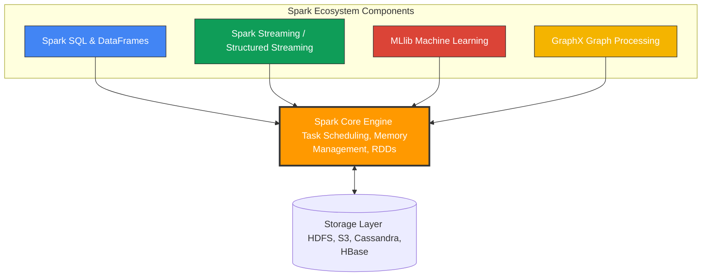

# Spark Components

**Apache Spark is a unified analytics engine comprised of five integrated components: Spark Core, Spark SQL, Spark Streaming, MLlib, and GraphX, all built on top of a single execution engine.**

## Why It Matters
Before Spark, organizations had to stitch together "Frankenstein" architectures to handle different types of big data workloads. You might use Hadoop MapReduce for batch processing, Apache Storm for real-time streaming, Apache Giraph for graph processing, and Apache Mahout for machine learning. Moving data between these disparate systems was a logistical nightmare, requiring complex ETL pipelines, different programming languages, and maintaining multiple clusters. Spark changed this by providing a unified stack. Understanding these components matters because it allows you to build end-to-end data pipelines—from ingesting real-time streams to training ML models—using a single framework, a single cluster, and a single API.

## How It Works
The architecture of Apache Spark is elegantly simple: a base foundation supporting a suite of higher-level libraries. 

**1. Spark Core:** 
This is the foundational engine. It provides the basic functionality of Spark: task scheduling, memory management, fault recovery, and interaction with storage systems. It defines the API for Resilient Distributed Datasets (RDDs), the immutable, distributed collections of objects that are the building blocks of Spark. All higher-level components compile down to Spark Core operations.

**2. Spark SQL:**
Spark SQL is arguably the most widely used component today. It allows you to query structured data using SQL or the DataFrame/Dataset API. It features the Catalyst Optimizer, a powerful engine that analyzes your queries and generates highly optimized execution plans. It abstracts away the complexity of RDDs, providing a tabular view of data that is familiar to anyone who knows SQL or Pandas.

**3. Spark Streaming (and Structured Streaming):**
This component enables processing of live data streams (e.g., log files, Kafka messages, financial tickers). Originally implemented as "Micro-batching" (Spark Streaming using DStreams), it has evolved into Structured Streaming, which uses the Spark SQL engine to process continuous streams of data seamlessly, allowing developers to write streaming queries the same way they write batch queries.

**4. MLlib (Machine Learning Library):**
MLlib provides a scalable machine learning framework. It includes common learning algorithms like classification, regression, clustering, and collaborative filtering, as well as tools for feature extraction, transformations, and pipeline construction. Because it runs on Spark, MLlib algorithms are designed to scale across a cluster, avoiding the memory limits of single-node libraries like Scikit-Learn.

**5. GraphX:**
GraphX is Spark's API for graphs and graph-parallel computation. It extends Spark RDDs by introducing a new Graph abstraction: a directed multigraph with properties attached to each vertex and edge. It is used for algorithms like PageRank, connected components, and triangle counting, commonly used in social network analysis and fraud detection.

## Flow Diagram


## Data Visualization
| Component | Primary Data Abstraction | Typical Use Case | Target Persona |
| :--- | :--- | :--- | :--- |
| **Spark Core** | RDD (Resilient Distributed Dataset) | Complex, low-level unstructured data manipulation | Platform Engineer, Core Contributor |
| **Spark SQL** | DataFrame / Dataset | ETL pipelines, BI reporting, Data Warehousing | Data Engineer, Data Analyst |
| **Structured Streaming** | Unbounded DataFrame | Real-time fraud detection, live dashboarding | Data Engineer, Backend Developer |
| **MLlib** | DataFrame (ML Pipelines) | Predictive modeling, Recommendation systems | Data Scientist, ML Engineer |
| **GraphX** | Graph / EdgeRDD / VertexRDD | Social network analysis, shortest path finding | Data Scientist, Graph Researcher |

## Code Example
```scala
// This Scala example demonstrates the power of Spark's UNIFIED architecture.
// We use Spark SQL to read data, process it, and seamlessly pass it to MLlib.

import org.apache.spark.sql.SparkSession
import org.apache.spark.ml.clustering.KMeans
import org.apache.spark.ml.feature.VectorAssembler

// 1. Initialize Spark Core & SQL via SparkSession
val spark = SparkSession.builder()
  .appName("UnifiedComponentsExample")
  .master("local[*]")
  .getOrCreate()

// 2. Use Spark SQL to load and transform data (ETL)
// Assuming a CSV with 'age', 'income', and 'spending_score'
val rawData = spark.read.option("header", "true").option("inferSchema", "true").csv("customer_data.csv")

// Clean data using Spark SQL DataFrame API
val cleanData = rawData.na.drop()

// 3. Prepare data for MLlib
// MLlib requires features to be combined into a single Vector column
val assembler = new VectorAssembler()
  .setInputCols(Array("age", "income", "spending_score"))
  .setOutputCol("features")

val mlData = assembler.transform(cleanData)

// 4. Use MLlib to train a K-Means clustering model
val kmeans = new KMeans().setK(3).setSeed(1L)
val model = kmeans.fit(mlData)

// 5. Use Spark SQL to view the predictions
val predictions = model.transform(mlData)
predictions.select("age", "income", "prediction").show(5)

spark.stop()
```

## Common Pitfalls
*   **Using RDDs when DataFrames are better:** Defaulting to Spark Core (RDDs) for structured data instead of Spark SQL (DataFrames). DataFrames benefit from the Catalyst Optimizer, making them significantly faster and more memory-efficient than native RDDs.
*   **Mixing Frameworks Unnecessarily:** Exporting data out of Spark just to run a scikit-learn model on a single node, instead of utilizing MLlib to keep the computation distributed and within the same pipeline.
*   **DStreams vs Structured Streaming:** Using the legacy Spark Streaming (DStreams/RDD based) for new projects instead of the modern, robust Structured Streaming (DataFrame based).
*   **Ignoring GraphX limitations:** GraphX has not seen major updates in recent years compared to other components. For complex, massive-scale graph databases, dedicated systems like Neo4j (which integrates with Spark) are sometimes preferred.

## Key Takeaway
Spark's greatest strength is its unified architecture, allowing you to perform batch processing, SQL queries, real-time streaming, and machine learning all on a single execution engine and dataset.


---

## 🎓 Deep Learning Questions

### Q1: Why Was This Concept Introduced?
Before Apache Spark, the big data landscape was highly fragmented. Organizations relied on Hadoop MapReduce for batch processing, Apache Storm for streaming, Apache Giraph for graphs, and Apache Mahout for machine learning. This forced engineers to learn multiple APIs, maintain separate clusters, and write complex ETL pipelines to move data between them, which was slow and error-prone. Spark introduced a unified engine with these integrated components to solve this problem. By providing Spark SQL, Streaming, MLlib, and GraphX on top of one foundational layer (Spark Core), data teams could finally process disparate workloads within a single framework. This eliminated the massive I/O overhead of writing intermediate data to disk just to pass it to a different tool, dramatically speeding up development and execution.

### Q2: What Exactly Is This Concept and How Does It Work?
Spark's architecture consists of a base engine (Spark Core) and four high-level libraries. 
- **Spark Core** handles memory management, fault recovery, task scheduling, and the base Resilient Distributed Dataset (RDD) API. 
- **Spark SQL** allows querying structured data via SQL or DataFrames, optimizing queries using the Catalyst Optimizer.
- **Spark Streaming** (and Structured Streaming) ingests live data streams in micro-batches (or continuously) using the same engine.
- **MLlib** provides scalable machine learning algorithms (classification, clustering, etc.) tailored for distributed processing.
- **GraphX** handles graph-parallel computation.
Because all components share the same underlying RDD/DataFrame abstraction and run on Spark Core, data can be passed seamlessly from a streaming ingestion pipeline directly into an MLlib model, all within the same memory space.

### Q3: Where Should This Concept Be Used?
This unified stack is ideal for modern, complex data pipelines. 
- **Retail (e.g., Amazon, Walmart):** Ingesting live clickstream data (Streaming), joining it with historical customer tables (SQL), and feeding it into a recommendation engine (MLlib) in real-time.
- **Finance & Banking:** Detecting credit card fraud by ingesting transaction streams, matching them against known fraud graph networks (GraphX), and scoring them via ML models (MLlib).
- **Healthcare:** Processing massive batches of clinical records (Spark Core/SQL) to predict patient readmission rates (MLlib).
If your workload requires more than one type of processing (e.g., ETL + Machine Learning), the integrated component model is the perfect fit.

### Q4: Where Should This Concept NOT Be Used?
- **Small Datasets:** If your data fits comfortably in a single machine's RAM, using Spark Components (like MLlib) is overkill. Pandas and Scikit-Learn will be significantly faster due to the absence of network overhead.
- **Transactional Systems (OLTP):** Spark SQL is designed for OLAP (analytics) and bulk transformations, not for point queries or high-concurrency ACID transactions like a traditional PostgreSQL or MySQL database.
- **Ultra-low Latency Streaming:** If your system requires hard sub-millisecond response times (e.g., high-frequency trading), Spark Streaming's micro-batching architecture might not be suitable; Apache Flink or specialized hardware is better.

### Q5: How Is This Concept Different from Hadoop?

| Aspect | Hadoop Ecosystem | Apache Spark Components |
| :--- | :--- | :--- |
| **Architecture** | Highly fragmented (MapReduce, Storm, Giraph, Mahout). | Unified engine (Core, SQL, Streaming, MLlib, GraphX). |
| **Performance** | Slower due to high disk I/O between disparate tools. | 10x-100x faster due to in-memory processing and shared data formats. |
| **Processing Model** | Strict Map and Reduce phases; batch only. | DAG execution engine supporting batch, interactive, and streaming. |
| **Ease of Development**| Steep learning curve, requiring different APIs and languages. | Unified API (Scala, Python, Java, R) across all workloads. |
| **Data Sharing** | Requires writing to HDFS to pass data between components. | Components seamlessly share DataFrames/RDDs in memory. |

### Q6: How Can This Concept Be Related to a Traditional RDBMS?

| Traditional RDBMS | Spark Component Equivalent | Difference |
| :--- | :--- | :--- |
| Core Database Engine | Spark Core | Spark is distributed and in-memory, while RDBMS is typically single-node and disk-centric. |
| SQL Query Engine | Spark SQL | Spark SQL scales across thousands of nodes and optimizes distributed joins (Catalyst). |
| Stored Procedures / Triggers | Spark Streaming (loosely) | Spark Streaming processes continuous unbounded data instead of event-triggered SQL scripts. |
| External ML Integrations (e.g., PL/Python) | MLlib | MLlib scales algorithms across the cluster natively rather than exporting data to an external process. |
| Recursive CTEs | GraphX | GraphX is purpose-built for massive graph traversal and algorithms like PageRank. |

### Q7: What Happens Behind the Scenes?
When you write an application mixing these components (e.g., SQL + MLlib), here is the execution flow:
1. **Driver:** Your PySpark/Scala code defines the transformations using DataFrames (SQL) and MLlib pipelines.
2. **Catalyst Optimizer:** The SQL queries are parsed, optimized, and converted into a physical plan.
3. **DAG Scheduler:** Spark builds a single Directed Acyclic Graph (DAG) for the entire pipeline, ignoring component boundaries.
4. **Task Execution:** The DAG is broken into Stages (separated by shuffles) and Tasks. 
5. **Executors:** Tasks execute in parallel across worker nodes. Data flows seamlessly from the SQL transformation step directly into the MLlib training step in-memory, without writing to disk.

```text
[Driver] --> Translates SQL + MLlib code to DAG
   |
   v
[DAG Scheduler] --> Breaks DAG into Stages based on Shuffles
   |
   v
[Task Scheduler] --> Assigns Tasks to Executors
   |
   v
[Executors] --> Run Tasks (e.g., SQL Filter --> MLlib VectorAssembler) in RAM
```

### Q8: Performance Considerations, Best Practices, and Common Mistakes

| Category | Recommendation | Why It Matters |
| :--- | :--- | :--- |
| **Best Practice** | Use DataFrames/Spark SQL over RDDs for everything. | DataFrames utilize the Catalyst Optimizer and Tungsten engine for massive performance gains over native Python/Scala RDDs. |
| **Optimization** | Use Structured Streaming instead of legacy DStreams. | Structured Streaming uses the fast Spark SQL engine underneath and handles event-time processing and late data gracefully. |
| **Common Mistake** | Mixing PySpark (Core/RDDs) with standard Python libraries heavily. | Using UDFs or iterating RDDs in Python forces expensive serialization/deserialization between the JVM and Python. Use Spark SQL built-in functions. |
| **Production Tip** | Cache data right before iterative MLlib algorithms. | ML models pass over the same data multiple times. If not cached, Spark will re-evaluate the entire ETL lineage on every iteration. |

### Q9: Interview Questions

**Beginner:**
1. **What are the main components of the Apache Spark ecosystem?** 
   *Answer:* Spark Core, Spark SQL, Spark Streaming (Structured Streaming), MLlib, and GraphX.
2. **Which Spark component is responsible for task scheduling and memory management?** 
   *Answer:* Spark Core.
3. **What makes Spark MLlib different from Scikit-Learn?** 
   *Answer:* MLlib is designed to execute distributed algorithms across a cluster of machines, while Scikit-Learn typically runs on a single node.

**Intermediate:**
4. **Why is it advantageous that Spark has a unified architecture?** 
   *Answer:* It eliminates the need to manage different systems for batch, streaming, and ML. Data can be passed seamlessly in-memory between components without expensive disk I/O.
5. **How does Structured Streaming differ from the old Spark Streaming?** 
   *Answer:* Old Spark Streaming (DStreams) used a micro-batch RDD API. Structured Streaming is built on Spark SQL DataFrames, offering better optimizations, event-time processing, and exactly-once semantics.
6. **When would you use GraphX?** 
   *Answer:* For graph-parallel computations like PageRank, finding connected components, or social network analysis.

**Advanced:**
7. **Explain how the Catalyst Optimizer benefits MLlib pipelines.** 
   *Answer:* Because modern MLlib uses DataFrames, feature engineering and data preparation steps are optimized by Catalyst before the actual ML algorithm runs, pushing down filters and optimizing memory layouts.
8. **If you have a heavy MLlib training job, what memory configuration is critical?** 
   *Answer:* Executor memory and specifically the `spark.memory.fraction` to ensure enough Execution Memory is available for intermediate ML computations and caching.
9. **Can you combine Structured Streaming and MLlib? How?** 
   *Answer:* Yes. You can train an MLlib model offline, load the saved model, and use its `.transform()` method directly on a streaming DataFrame to score live data.

**Scenario-Based:**
10. **Your team needs to parse live JSON logs from Kafka, filter invalid records, and predict user churn in real-time. Which components do you use?** 
    *Answer:* Use Structured Streaming to ingest from Kafka, Spark SQL built-in JSON functions to parse and filter the data, and a pre-trained MLlib model to generate the churn predictions on the streaming DataFrame.

### Q10: Complete Real-World Example

**Business Problem:** A retail company (like Target) wants to segment their customers based on purchasing behavior to send targeted promotions. 
**Dataset:** `customers.csv` containing `customer_id`, `age`, `annual_income`, and `spending_score`.
**Approach:** We will use **Spark SQL** to ingest and clean the data, and **MLlib** to apply a K-Means clustering algorithm.

```python
from pyspark.sql import SparkSession
from pyspark.ml.feature import VectorAssembler
from pyspark.ml.clustering import KMeans

# 1. Initialize Spark Core & SQL Components
spark = SparkSession.builder \\
    .appName("UnifiedSparkComponents_Retail") \\
    .getOrCreate()

# 2. Spark SQL: Ingest and clean the data
# Simulating a dataset
data = [(1, 25, 40000, 60), (2, 34, 75000, 85), (3, 45, 120000, 20), (4, 22, 25000, 90)]
columns = ["customer_id", "age", "annual_income", "spending_score"]
df = spark.createDataFrame(data, columns)

# Drop any nulls (ETL Phase)
clean_df = df.na.drop()

# 3. MLlib: Feature Engineering
# Combine features into a single vector column required by MLlib
assembler = VectorAssembler(
    inputCols=["age", "annual_income", "spending_score"],
    outputCol="features"
)
ml_df = assembler.transform(clean_df)

# Cache data before ML training (Best Practice)
ml_df.cache()

# 4. MLlib: Train the Model
# Group customers into 2 segments
kmeans = KMeans().setK(2).setSeed(42).setFeaturesCol("features")
model = kmeans.fit(ml_df)

# 5. Spark SQL & MLlib: Generate and view predictions
predictions = model.transform(ml_df)
predictions.select("customer_id", "annual_income", "prediction").show()

# Expected Output:
# +-----------+-------------+----------+
# |customer_id|annual_income|prediction|
# +-----------+-------------+----------+
# |          1|        40000|         1|
# |          2|        75000|         1|
# |          3|       120000|         0|
# |          4|        25000|         1|
# +-----------+-------------+----------+
# Performance Note: Because ml_df was cached, the KMeans iterative algorithm didn't re-read the dataframe on every pass.
```

### 💡 Key Takeaways
- Spark is a unified engine; you only need to manage one cluster for batch, streaming, SQL, and ML.
- Spark Core provides the execution engine and RDDs; all other components compile down to it.
- Spark SQL is the most critical component today, powering DataFrames, Structured Streaming, and modern MLlib.
- Data flows seamlessly between components in memory, eliminating expensive disk I/O bottlenecks.
- MLlib brings machine learning to distributed computing, allowing models to train on terabytes of data.

### ⚠️ Common Misconceptions
- **Spark is a database:** False. Spark is a processing engine; it has no native storage and relies on external systems like HDFS or S3.
- **Spark Streaming is truly real-time:** False. It uses micro-batches (though Structured Streaming continuous processing mode minimizes this).
- **You must use RDDs for complex tasks:** False. DataFrames (Spark SQL) are almost always faster and can handle complex data via UDFs.
- **MLlib replaces Scikit-Learn:** False. Scikit-learn is often better for single-node, smaller datasets. MLlib is strictly for distributed Big Data.

### 🔗 Related Spark Concepts
- Spark Core & RDDs
- Spark SQL and the Catalyst Optimizer
- Structured Streaming
- MLlib and Machine Learning Pipelines
- Spark Execution Engine (DAG, Tasks, Executors)

### 📚 References for Further Reading
- Apache Spark Official Documentation
- Learning Spark (O'Reilly)
- Spark: The Definitive Guide (O'Reilly)
