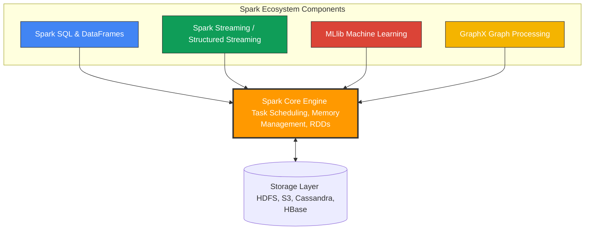

# Spark Components

**Apache Spark is a unified analytics engine comprised of five integrated components: Spark Core, Spark SQL, Spark Streaming, MLlib, and GraphX, all built on top of a single execution engine.**

## Why It Matters
Before Spark, organizations had to stitch together "Frankenstein" architectures to handle different types of big data workloads. You might use Hadoop MapReduce for batch processing, Apache Storm for real-time streaming, Apache Giraph for graph processing, and Apache Mahout for machine learning. Moving data between these disparate systems was a logistical nightmare, requiring complex ETL pipelines, different programming languages, and maintaining multiple clusters. Spark changed this by providing a unified stack. Understanding these components matters because it allows you to build end-to-end data pipelines—from ingesting real-time streams to training ML models—using a single framework, a single cluster, and a single API.

## How It Works
The architecture of Apache Spark is elegantly simple: a base foundation supporting a suite of higher-level libraries. 

**1. Spark Core:** 
This is the foundational engine. It provides the basic functionality of Spark: task scheduling, memory management, fault recovery, and interaction with storage systems. It defines the API for Resilient Distributed Datasets (RDDs), the immutable, distributed collections of objects that are the building blocks of Spark. All higher-level components compile down to Spark Core operations.

**2. Spark SQL:**
Spark SQL is arguably the most widely used component today. It allows you to query structured data using SQL or the DataFrame/Dataset API. It features the Catalyst Optimizer, a powerful engine that analyzes your queries and generates highly optimized execution plans. It abstracts away the complexity of RDDs, providing a tabular view of data that is familiar to anyone who knows SQL or Pandas.

**3. Spark Streaming (and Structured Streaming):**
This component enables processing of live data streams (e.g., log files, Kafka messages, financial tickers). Originally implemented as "Micro-batching" (Spark Streaming using DStreams), it has evolved into Structured Streaming, which uses the Spark SQL engine to process continuous streams of data seamlessly, allowing developers to write streaming queries the same way they write batch queries.

**4. MLlib (Machine Learning Library):**
MLlib provides a scalable machine learning framework. It includes common learning algorithms like classification, regression, clustering, and collaborative filtering, as well as tools for feature extraction, transformations, and pipeline construction. Because it runs on Spark, MLlib algorithms are designed to scale across a cluster, avoiding the memory limits of single-node libraries like Scikit-Learn.

**5. GraphX:**
GraphX is Spark's API for graphs and graph-parallel computation. It extends Spark RDDs by introducing a new Graph abstraction: a directed multigraph with properties attached to each vertex and edge. It is used for algorithms like PageRank, connected components, and triangle counting, commonly used in social network analysis and fraud detection.

## Flow Diagram


## Data Visualization
| Component | Primary Data Abstraction | Typical Use Case | Target Persona |
| :--- | :--- | :--- | :--- |
| **Spark Core** | RDD (Resilient Distributed Dataset) | Complex, low-level unstructured data manipulation | Platform Engineer, Core Contributor |
| **Spark SQL** | DataFrame / Dataset | ETL pipelines, BI reporting, Data Warehousing | Data Engineer, Data Analyst |
| **Structured Streaming** | Unbounded DataFrame | Real-time fraud detection, live dashboarding | Data Engineer, Backend Developer |
| **MLlib** | DataFrame (ML Pipelines) | Predictive modeling, Recommendation systems | Data Scientist, ML Engineer |
| **GraphX** | Graph / EdgeRDD / VertexRDD | Social network analysis, shortest path finding | Data Scientist, Graph Researcher |

## Code Example
```scala
// This Scala example demonstrates the power of Spark's UNIFIED architecture.
// We use Spark SQL to read data, process it, and seamlessly pass it to MLlib.

import org.apache.spark.sql.SparkSession
import org.apache.spark.ml.clustering.KMeans
import org.apache.spark.ml.feature.VectorAssembler

// 1. Initialize Spark Core & SQL via SparkSession
val spark = SparkSession.builder()
  .appName("UnifiedComponentsExample")
  .master("local[*]")
  .getOrCreate()

// 2. Use Spark SQL to load and transform data (ETL)
// Assuming a CSV with 'age', 'income', and 'spending_score'
val rawData = spark.read.option("header", "true").option("inferSchema", "true").csv("customer_data.csv")

// Clean data using Spark SQL DataFrame API
val cleanData = rawData.na.drop()

// 3. Prepare data for MLlib
// MLlib requires features to be combined into a single Vector column
val assembler = new VectorAssembler()
  .setInputCols(Array("age", "income", "spending_score"))
  .setOutputCol("features")

val mlData = assembler.transform(cleanData)

// 4. Use MLlib to train a K-Means clustering model
val kmeans = new KMeans().setK(3).setSeed(1L)
val model = kmeans.fit(mlData)

// 5. Use Spark SQL to view the predictions
val predictions = model.transform(mlData)
predictions.select("age", "income", "prediction").show(5)

spark.stop()
```

## Common Pitfalls
*   **Using RDDs when DataFrames are better:** Defaulting to Spark Core (RDDs) for structured data instead of Spark SQL (DataFrames). DataFrames benefit from the Catalyst Optimizer, making them significantly faster and more memory-efficient than native RDDs.
*   **Mixing Frameworks Unnecessarily:** Exporting data out of Spark just to run a scikit-learn model on a single node, instead of utilizing MLlib to keep the computation distributed and within the same pipeline.
*   **DStreams vs Structured Streaming:** Using the legacy Spark Streaming (DStreams/RDD based) for new projects instead of the modern, robust Structured Streaming (DataFrame based).
*   **Ignoring GraphX limitations:** GraphX has not seen major updates in recent years compared to other components. For complex, massive-scale graph databases, dedicated systems like Neo4j (which integrates with Spark) are sometimes preferred.

## Key Takeaway
Spark's greatest strength is its unified architecture, allowing you to perform batch processing, SQL queries, real-time streaming, and machine learning all on a single execution engine and dataset.
