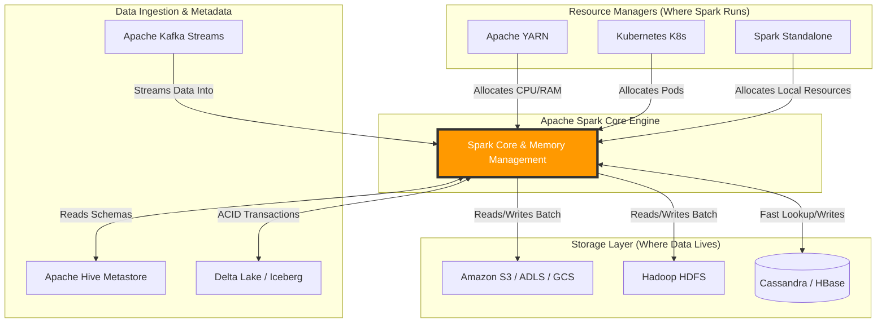

# The Spark Ecosystem

**Apache Spark does not operate in a vacuum; it sits at the center of a vast big data ecosystem, acting as the compute engine while delegating storage and resource management to specialized external systems.**

## Why It Matters
A common misconception among beginners is that Spark is a database. It is not. Spark is purely a data *processing* engine. It has no built-in long-term storage system, and while it has a standalone cluster manager, it is rarely used in enterprise production. Understanding the Spark ecosystem matters because building a modern data platform requires integrating Spark with storage layers (like S3 or HDFS), resource managers (like YARN or Kubernetes), and messaging systems (like Kafka). Mastering these integrations is what separates a developer who can write a Spark script on their laptop from a Data Engineer who can deploy robust, scalable data pipelines in the cloud.

## How It Works
The Spark ecosystem can be broadly categorized into three distinct layers: Storage, Resource Management, and Data Sources/Integrations.

**1. The Storage Layer:**
Because Spark is a compute engine, it must read data from somewhere. Originally, Spark was heavily tied to the Hadoop Distributed File System (HDFS), which provides highly fault-tolerant storage across commodity hardware. However, the modern ecosystem has shifted towards cloud object storage. Amazon S3, Azure Data Lake Storage (ADLS), and Google Cloud Storage (GCS) are now the de-facto storage layers for Spark. Spark also natively integrates with NoSQL databases like Apache Cassandra and HBase for high-speed, wide-column reads, though these are typically used for specific operational workloads rather than raw data lakes.

**2. The Resource Management Layer:**
When you submit a Spark job to a cluster of 100 machines, something needs to figure out which machines have available CPU and RAM to run the tasks. This is the Resource Manager. 
*   **Apache YARN:** The legacy Hadoop resource manager. Still widely used in on-premise environments.
*   **Apache Mesos:** An older resource manager that is largely being phased out.
*   **Kubernetes (K8s):** The modern standard. Spark can run natively on Kubernetes, spinning up Docker containers (Pods) for the Spark Driver and Executors, scaling dynamically based on load, and spinning them down when the job finishes.
*   **Standalone:** Spark's built-in, lightweight cluster manager, mostly used for local development and testing.

**3. Data Sources and Integrations:**
Spark acts as a universal router for data. It connects to message brokers like Apache Kafka to ingest real-time streaming data. It connects to Apache Hive to read metadata and schemas, allowing Spark SQL to act as a massive distributed data warehouse. It utilizes Apache ZooKeeper for high availability and coordination in streaming scenarios. This pluggable architecture means that as new technologies emerge, Spark simply needs a connector to integrate them into its ecosystem.

## Flow Diagram


## Data Visualization
| Category | Technology | Role in the Ecosystem | Modern Cloud Equivalent |
| :--- | :--- | :--- | :--- |
| **Storage** | HDFS | Distributed File System | Amazon S3, ADLS Gen2 |
| **Storage (NoSQL)** | HBase | High-speed random read/write | DynamoDB, CosmosDB |
| **Resource Manager** | YARN | Cluster resource allocation | Kubernetes (EKS, GKE, AKS) |
| **Streaming Broker**| Kafka | High-throughput message queue | AWS Kinesis, GCP Pub/Sub |
| **Metadata Catalog**| Hive Metastore | Table schemas and partitioning data | AWS Glue Data Catalog |
| **Table Format** | Parquet/ORC | Columnar file storage | Delta Lake, Apache Iceberg |

## Code Example
```python
# This PySpark example demonstrates interacting with the broader ecosystem.
# We will simulate reading from AWS S3, utilizing Hive metadata, and writing to Parquet.

from pyspark.sql import SparkSession

# Initialize Spark Session with Ecosystem Configurations
# Note: In a real environment, you need the aws-java-sdk and hadoop-aws jars.
spark = SparkSession.builder \
    .appName("EcosystemIntegration") \
    .config("spark.hadoop.fs.s3a.impl", "org.apache.hadoop.fs.s3a.S3AFileSystem") \
    .config("spark.hadoop.fs.s3a.access.key", "YOUR_ACCESS_KEY") \
    .config("spark.hadoop.fs.s3a.secret.key", "YOUR_SECRET_KEY") \
    .enableHiveSupport() \
    .getOrCreate()

# 1. Read data from the Storage Layer (Amazon S3)
s3_path = "s3a://my-big-data-bucket/raw-logs/2023/10/24/"
df = spark.read.json(s3_path)

# 2. Register as a temporary view to use Spark SQL
df.createOrReplaceTempView("raw_logs")

# 3. Filter data
error_logs = spark.sql("SELECT timestamp, error_code, message FROM raw_logs WHERE level = 'ERROR'")

# 4. Write data back to Storage as columnar Parquet files
# Using SaveMode.Append to simulate a daily batch job
output_path = "s3a://my-big-data-bucket/processed-errors/"
error_logs.write.mode("append").parquet(output_path)

# 5. Interact with the Hive Metastore (Catalog)
# We can create a permanent table definition in Hive so analysts can query it later
error_logs.write.mode("overwrite").saveAsTable("hive_db.error_logs_table")

spark.stop()
```

## Common Pitfalls
*   **Treating Spark like an RDBMS:** Trying to run transactional `UPDATE` or `DELETE` statements on single rows in Spark. Spark is designed for bulk analytics. If you need ACID transactions, you must integrate an ecosystem tool like Delta Lake or Apache Iceberg.
*   **Dependency Hell:** When connecting to Kafka, S3, or Cassandra, failing to include the exact matching JAR versions for your specific Spark and Scala version, resulting in `ClassNotFoundException`.
*   **Ignoring Data Locality in the Cloud:** In on-prem HDFS, Spark tries to run compute on the same node where the data disk lives (data locality). In the cloud (S3), compute and storage are decoupled. Failing to account for network bandwidth bottlenecks between Spark (EC2) and S3 can degrade performance.
*   **Misconfiguring Resource Managers:** Asking YARN or K8s for more memory than exists on the physical nodes, causing the cluster to reject the Spark job entirely.

## Key Takeaway
Apache Spark is a pure compute engine; its true power is unlocked only when properly architected alongside robust storage layers (S3/HDFS), resource managers (Kubernetes/YARN), and messaging brokers (Kafka) to form a complete data platform.
