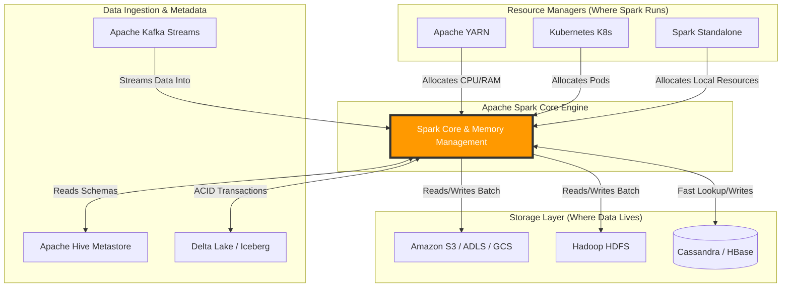

# The Spark Ecosystem

**Apache Spark does not operate in a vacuum; it sits at the center of a vast big data ecosystem, acting as the compute engine while delegating storage and resource management to specialized external systems.**

## Why It Matters
A common misconception among beginners is that Spark is a database. It is not. Spark is purely a data *processing* engine. It has no built-in long-term storage system, and while it has a standalone cluster manager, it is rarely used in enterprise production. Understanding the Spark ecosystem matters because building a modern data platform requires integrating Spark with storage layers (like S3 or HDFS), resource managers (like YARN or Kubernetes), and messaging systems (like Kafka). Mastering these integrations is what separates a developer who can write a Spark script on their laptop from a Data Engineer who can deploy robust, scalable data pipelines in the cloud.

## How It Works
The Spark ecosystem can be broadly categorized into three distinct layers: Storage, Resource Management, and Data Sources/Integrations.

**1. The Storage Layer:**
Because Spark is a compute engine, it must read data from somewhere. Originally, Spark was heavily tied to the Hadoop Distributed File System (HDFS), which provides highly fault-tolerant storage across commodity hardware. However, the modern ecosystem has shifted towards cloud object storage. Amazon S3, Azure Data Lake Storage (ADLS), and Google Cloud Storage (GCS) are now the de-facto storage layers for Spark. Spark also natively integrates with NoSQL databases like Apache Cassandra and HBase for high-speed, wide-column reads, though these are typically used for specific operational workloads rather than raw data lakes.

**2. The Resource Management Layer:**
When you submit a Spark job to a cluster of 100 machines, something needs to figure out which machines have available CPU and RAM to run the tasks. This is the Resource Manager. 
*   **Apache YARN:** The legacy Hadoop resource manager. Still widely used in on-premise environments.
*   **Apache Mesos:** An older resource manager that is largely being phased out.
*   **Kubernetes (K8s):** The modern standard. Spark can run natively on Kubernetes, spinning up Docker containers (Pods) for the Spark Driver and Executors, scaling dynamically based on load, and spinning them down when the job finishes.
*   **Standalone:** Spark's built-in, lightweight cluster manager, mostly used for local development and testing.

**3. Data Sources and Integrations:**
Spark acts as a universal router for data. It connects to message brokers like Apache Kafka to ingest real-time streaming data. It connects to Apache Hive to read metadata and schemas, allowing Spark SQL to act as a massive distributed data warehouse. It utilizes Apache ZooKeeper for high availability and coordination in streaming scenarios. This pluggable architecture means that as new technologies emerge, Spark simply needs a connector to integrate them into its ecosystem.

## Flow Diagram


## Data Visualization
| Category | Technology | Role in the Ecosystem | Modern Cloud Equivalent |
| :--- | :--- | :--- | :--- |
| **Storage** | HDFS | Distributed File System | Amazon S3, ADLS Gen2 |
| **Storage (NoSQL)** | HBase | High-speed random read/write | DynamoDB, CosmosDB |
| **Resource Manager** | YARN | Cluster resource allocation | Kubernetes (EKS, GKE, AKS) |
| **Streaming Broker**| Kafka | High-throughput message queue | AWS Kinesis, GCP Pub/Sub |
| **Metadata Catalog**| Hive Metastore | Table schemas and partitioning data | AWS Glue Data Catalog |
| **Table Format** | Parquet/ORC | Columnar file storage | Delta Lake, Apache Iceberg |

## Code Example
```python
# This PySpark example demonstrates interacting with the broader ecosystem.
# We will simulate reading from AWS S3, utilizing Hive metadata, and writing to Parquet.

from pyspark.sql import SparkSession

# Initialize Spark Session with Ecosystem Configurations
# Note: In a real environment, you need the aws-java-sdk and hadoop-aws jars.
spark = SparkSession.builder \
    .appName("EcosystemIntegration") \
    .config("spark.hadoop.fs.s3a.impl", "org.apache.hadoop.fs.s3a.S3AFileSystem") \
    .config("spark.hadoop.fs.s3a.access.key", "YOUR_ACCESS_KEY") \
    .config("spark.hadoop.fs.s3a.secret.key", "YOUR_SECRET_KEY") \
    .enableHiveSupport() \
    .getOrCreate()

# 1. Read data from the Storage Layer (Amazon S3)
s3_path = "s3a://my-big-data-bucket/raw-logs/2023/10/24/"
df = spark.read.json(s3_path)

# 2. Register as a temporary view to use Spark SQL
df.createOrReplaceTempView("raw_logs")

# 3. Filter data
error_logs = spark.sql("SELECT timestamp, error_code, message FROM raw_logs WHERE level = 'ERROR'")

# 4. Write data back to Storage as columnar Parquet files
# Using SaveMode.Append to simulate a daily batch job
output_path = "s3a://my-big-data-bucket/processed-errors/"
error_logs.write.mode("append").parquet(output_path)

# 5. Interact with the Hive Metastore (Catalog)
# We can create a permanent table definition in Hive so analysts can query it later
error_logs.write.mode("overwrite").saveAsTable("hive_db.error_logs_table")

spark.stop()
```

## Common Pitfalls
*   **Treating Spark like an RDBMS:** Trying to run transactional `UPDATE` or `DELETE` statements on single rows in Spark. Spark is designed for bulk analytics. If you need ACID transactions, you must integrate an ecosystem tool like Delta Lake or Apache Iceberg.
*   **Dependency Hell:** When connecting to Kafka, S3, or Cassandra, failing to include the exact matching JAR versions for your specific Spark and Scala version, resulting in `ClassNotFoundException`.
*   **Ignoring Data Locality in the Cloud:** In on-prem HDFS, Spark tries to run compute on the same node where the data disk lives (data locality). In the cloud (S3), compute and storage are decoupled. Failing to account for network bandwidth bottlenecks between Spark (EC2) and S3 can degrade performance.
*   **Misconfiguring Resource Managers:** Asking YARN or K8s for more memory than exists on the physical nodes, causing the cluster to reject the Spark job entirely.

## Key Takeaway
Apache Spark is a pure compute engine; its true power is unlocked only when properly architected alongside robust storage layers (S3/HDFS), resource managers (Kubernetes/YARN), and messaging brokers (Kafka) to form a complete data platform.

---

## 🎓 Deep Learning Questions

### Q1: Why Was This Concept Introduced?
Before the modern Spark ecosystem emerged, the big data landscape was heavily dominated by monolithic systems like Hadoop, where processing (MapReduce), storage (HDFS), and resource management (YARN) were tightly coupled. Upgrading one component often meant upgrading the whole stack, creating a rigid and hard-to-maintain infrastructure. Furthermore, organizations started transitioning to the cloud, demanding separation of compute and storage.

Spark was built with a decoupled architecture in mind. By acting strictly as a compute engine without a built-in storage layer, Spark allowed companies to leverage their existing storage systems (like HDFS or S3) and data ingestion pipelines (like Kafka). This introduced the flexibility to swap out underlying technologies—for instance, replacing on-premise HDFS with cloud-native Amazon S3—without rewriting the data processing logic. This decoupling significantly reduced infrastructure costs and allowed engineers to choose the best-in-class tool for each layer of their data architecture.

### Q2: What Exactly Is This Concept and How Does It Work?
The Spark Ecosystem refers to the network of complementary technologies that surround Spark to provide storage, resource management, and metadata cataloging. Spark itself is the processing core, while it delegates other responsibilities to external systems. 

When a Spark job is submitted, a Resource Manager (like YARN or Kubernetes) dynamically allocates the necessary CPU and RAM across the cluster. The Spark Executors then spin up and establish connections to the Storage Layer (such as S3, HDFS, or Cassandra) to ingest data. For streaming jobs, Spark connects to a Message Broker like Kafka to consume real-time events. Throughout the process, Spark may consult a Metadata Catalog (like the Hive Metastore) to understand the schemas and table partitions. The entire ecosystem acts as a symphony, with Spark as the conductor, orchestrating tasks while relying on specialized tools for persistence and infrastructure management.

### Q3: Where Should This Concept Be Used?
The complete Spark ecosystem is essential in almost every enterprise-scale production environment. 
- **Streaming & Analytics (Netflix):** Integrating Spark Structured Streaming with Kafka to process user viewing events in real-time and recommending shows.
- **Log Processing & Threat Detection (Cybersecurity):** Ingesting terabytes of network logs from Amazon S3, processing them with Spark, and saving the anomalies back to S3 in Parquet format.
- **Data Warehousing (Retail):** Using Spark SQL to process raw transaction data, leveraging the Hive Metastore for table schemas, and writing the cleansed data to a data lakehouse format like Delta Lake for BI analysts.
- **Machine Learning (Uber):** Pulling rider and driver data from cloud storage, utilizing YARN to scale the Spark MLlib training job across 500 nodes, and saving the trained model to a model registry.

### Q4: Where Should This Concept NOT Be Used?
While powerful, the Spark ecosystem is overkill for small-scale datasets or purely transactional workloads. 
- **Small Data:** If your data fits easily into a single machine's RAM or can be processed by a simple Python Pandas script, introducing the complexity of Spark, YARN, and HDFS will only slow you down and increase costs.
- **OLTP Workloads:** The Spark ecosystem is fundamentally designed for Online Analytical Processing (OLAP). It should not be used as the backend for a web application requiring millisecond-latency point lookups, inserts, or updates. In such cases, traditional RDBMS (like PostgreSQL) or operational NoSQL databases (like DynamoDB) are far superior.
- **Simple ETL:** For highly straightforward ELT processes where data is already in a cloud data warehouse (like Snowflake or BigQuery), native SQL transformations via tools like dbt are often more efficient than spinning up a Spark cluster.

### Q5: How Is This Concept Different from Hadoop?
| Aspect | Hadoop Ecosystem | Spark Ecosystem |
| :--- | :--- | :--- |
| **Architecture** | Tightly coupled (MapReduce + HDFS + YARN). | Decoupled (Spark compute + Any storage/RM). |
| **Performance** | Disk I/O bound, slower processing. | In-memory processing, significantly faster. |
| **Processing Model** | Batch-only (MapReduce). | Batch, micro-batch streaming, and SQL. |
| **Memory Usage** | Writes intermediate data to disk. | Retains intermediate data in RAM. |
| **Fault Tolerance** | Replicates data across HDFS nodes. | Recovers lost partitions using RDD Lineage. |
| **Scalability** | Scales compute and storage together. | Can scale compute independently of storage. |
| **Ease of Development** | Verbose Java code. | High-level APIs in Python, Scala, SQL, R. |
| **Typical Use Cases** | Legacy on-premise batch processing. | Modern cloud-native analytics, ML, streaming. |
| **Advantages** | Highly stable, native data locality. | Extremely fast, flexible, cloud-ready. |
| **Disadvantages** | Rigid, slow, poor cloud adaptation. | High memory requirements, complex tuning. |

### Q6: How Can This Concept Be Related to a Traditional RDBMS?
| RDBMS Concept | Spark Ecosystem Equivalent | Explanation |
| :--- | :--- | :--- |
| Database Engine (MySQL, Oracle) | Apache Spark Core | The actual compute engine processing the data. |
| Hard Drive (Disk Storage) | HDFS / Amazon S3 / ADLS | Where the raw data files are persistently stored. |
| System Catalog (INFORMATION_SCHEMA) | Hive Metastore | Stores metadata, schemas, and table definitions. |
| Tables & Rows | DataFrames / Parquet Files | The logical representation of data over physical files. |
| Message Queue | Apache Kafka | In RDBMS, queues are external; in big data, Kafka feeds Spark. |
| OS Process Scheduler | YARN / Kubernetes | Allocates resources to the running queries/jobs. |

### Q7: What Happens Behind the Scenes?
When Spark interacts with its ecosystem, a complex orchestration occurs:
1. **Submission:** The user submits a job to the Cluster Manager (e.g., Kubernetes).
2. **Allocation:** Kubernetes provisions Docker containers for the Spark Driver and Executors.
3. **Metadata Lookup:** The Driver connects to the Hive Metastore to determine where the data resides on S3 and its schema.
4. **Data Ingestion:** Executors establish parallel HTTP connections to Amazon S3 to read raw Parquet files directly into memory partitions.
5. **Processing:** The Executors process the data in RAM, shuffling data across the network if an aggregation is required.
6. **Writing:** The output data is written back to S3, and the Metastore is updated with new partition locations.

```text
[Submit Job] --> (Cluster Manager: YARN/K8s) --> [Allocates Resources]
                                                       |
                                                       v
                                          [Spark Driver] <---> [Hive Metastore]
                                                |
                                          [Spark Executors]
                                                |
                                     (Parallel Reads/Writes)
                                                |
                                         [Storage: S3/HDFS]
```

### Q8: Performance Considerations, Best Practices, and Common Mistakes
| Category | Recommendation | Why It Matters |
| :--- | :--- | :--- |
| **Storage** | Use Columnar Formats (Parquet/ORC). | Drastically reduces I/O when selecting specific columns compared to JSON/CSV. |
| **Cloud Storage** | Beware of S3 throttling and eventual consistency. | Rapid creation of thousands of small files can throttle S3 and slow down write operations. |
| **Resource Allocation** | Right-size your Executor memory and cores. | Asking for too much memory wastes money; asking for too little causes OutOfMemory (OOM) crashes. |
| **Streaming** | Monitor Kafka consumer lag. | If Spark processes data slower than Kafka receives it, the lag will grow, leading to stale analytics. |
| **Metastore** | Partition tables optimally (e.g., by date). | Prevents Spark from scanning the entire S3 bucket, pushing down filters to only read required partitions. |

### Q9: Interview Questions

**Beginner**
1. **Is Apache Spark a database?**
   *No. Spark is a distributed compute engine. It relies on external storage systems like S3 or HDFS for data persistence.*
2. **What is the role of YARN or Kubernetes in the Spark ecosystem?**
   *They act as resource managers, responsible for allocating CPU and RAM across the cluster to run Spark applications.*
3. **Why do we use Parquet files with Spark instead of CSVs?**
   *Parquet is a columnar format that includes schema metadata, offers superior compression, and allows Spark to only read the specific columns requested in a query, saving massive I/O.*

**Intermediate**
1. **How does Spark integrate with the Hive Metastore?**
   *Spark uses the Hive Metastore as a metadata catalog to store and retrieve table schemas, partition information, and locations of data files in storage, enabling SQL-like table querying.*
2. **Explain the separation of compute and storage in modern Spark architectures.**
   *Unlike Hadoop where compute and storage were tied to the same nodes, cloud architectures run Spark compute clusters (EC2/EKS) independently from storage (S3). This allows scaling compute or storage independently based on exact needs.*
3. **What is Apache Kafka's role when used alongside Spark?**
   *Kafka acts as a distributed messaging broker that buffers high-throughput real-time data streams. Spark Structured Streaming consumes from Kafka for real-time processing.*

**Advanced**
1. **When reading from cloud object storage (like S3), what is the "small file problem" and how does it impact Spark?**
   *Cloud object stores have high latency per HTTP request. Reading 10,000 tiny files of 1MB each takes vastly longer than reading 10 files of 1GB each due to request overhead. This destroys Spark's read performance.*
2. **How do table formats like Delta Lake or Apache Iceberg enhance the Spark ecosystem?**
   *They sit on top of data lakes (like S3) and provide ACID transactions, time travel, and schema enforcement, bridging the gap between raw data lakes and traditional data warehouses.*
3. **Explain the impact of data locality when running Spark on Kubernetes in the cloud.**
   *In the cloud, data locality (processing data on the same physical disk) is usually impossible since compute and storage are decoupled. Network bandwidth between the compute nodes and object storage becomes the primary bottleneck.*

**Scenario-Based**
1. **Your Spark streaming job reading from Kafka is suddenly falling behind (high consumer lag). How do you troubleshoot the ecosystem?**
   *Check if the data volume in Kafka spiked. If so, increase the number of Kafka partitions and proportionally increase the number of Spark executor cores. Also check if writing to the downstream sink (e.g., Cassandra) is the actual bottleneck slowing the job down.*
2. **Your company wants to migrate from on-premise Hadoop (YARN + HDFS) to AWS. Propose the new ecosystem.**
   *Migrate storage from HDFS to Amazon S3. Replace YARN with Amazon EKS (Kubernetes) or EMR for resource management. Replace the on-prem Hive Metastore with AWS Glue Data Catalog. Spark code will require minimal changes beyond connection strings.*

### Q10: Complete Real-World Example
**Business Problem:** A retail analytics company receives millions of JSON transaction logs daily in raw Amazon S3 storage. They need to convert these to an optimized Parquet format, partition them by date, and register them in the Hive Metastore so analysts can query the clean data.

**Dataset:** Raw JSON files containing `transaction_id`, `user_id`, `amount`, and `transaction_date`.

```python
from pyspark.sql import SparkSession
from pyspark.sql.functions import col, to_date

# Initialize Spark Session with Ecosystem Configurations
# Connects to S3 for storage and enables Hive support for the Metastore
spark = SparkSession.builder \
    .appName("RetailEcosystemETL") \
    .config("spark.hadoop.fs.s3a.impl", "org.apache.hadoop.fs.s3a.S3AFileSystem") \
    .enableHiveSupport() \
    .getOrCreate()

# 1. Storage Integration: Read raw JSON from S3
input_path = "s3a://retail-data-lake/raw/transactions/2023/10/*"
raw_df = spark.read.json(input_path)

# 2. Spark Compute: Process and transform the data in-memory
processed_df = raw_df.withColumn("date", to_date(col("transaction_date"))) \
                     .filter(col("amount") > 0) # Remove invalid transactions

# 3. Ecosystem Integration: Write to S3 & Register in Hive Metastore
# We write as Parquet (optimized storage format) and partition by date.
# saveAsTable registers the schema in the Metastore.
processed_df.write \
    .mode("overwrite") \
    .partitionBy("date") \
    .format("parquet") \
    .saveAsTable("retail_db.clean_transactions")

# Analysts can now run queries like:
# spark.sql("SELECT SUM(amount) FROM retail_db.clean_transactions WHERE date = '2023-10-24'")

spark.stop()
```

**Step-by-Step Execution:**
1. Spark requests resources and launches executors.
2. Executors read the raw JSON files from the S3 bucket over HTTP.
3. The DataFrame API applies the date transformation and filters out negative amounts in-memory.
4. Executors write the cleaned data back to S3, structured as Parquet files nested in `date=YYYY-MM-DD` folders.
5. Spark communicates with the Hive Metastore to update the table definition, pointing to the newly created S3 paths.

**Performance Notes:** Partitioning by `date` is crucial. When analysts query a specific date later, Spark will only read the Parquet files in that specific folder, avoiding a full scan of the entire S3 bucket.

### 💡 Key Takeaways
- Spark is a compute engine, not a database or storage system.
- The modern Spark ecosystem heavily favors decoupled cloud storage (S3, ADLS) over tightly coupled HDFS.
- Kubernetes is rapidly replacing YARN as the preferred resource manager.
- Columnar formats like Parquet and table formats like Delta Lake are essential for optimizing the storage layer.
- Integrating Kafka provides robust real-time streaming capabilities to Spark.

### ⚠️ Common Misconceptions
- **"Spark stores my data."** (No, Spark processes data and relies on S3/HDFS/DBs for storage).
- **"I don't need a resource manager in the cloud."** (Even in the cloud, you need EMR, Databricks, or Kubernetes to manage cluster resources).
- **"Spark can replace my relational database."** (Spark is for analytics and big data processing, not OLTP transactions).

### 🔗 Related Spark Concepts
- Apache Spark Architecture
- Spark Structured Streaming
- Storage Formats (Parquet, ORC, Avro)
- Table Formats (Delta Lake, Apache Iceberg)

### 📚 References for Further Reading
- Apache Spark Official Documentation
- Learning Spark (O'Reilly)
- Spark: The Definitive Guide (O'Reilly)
