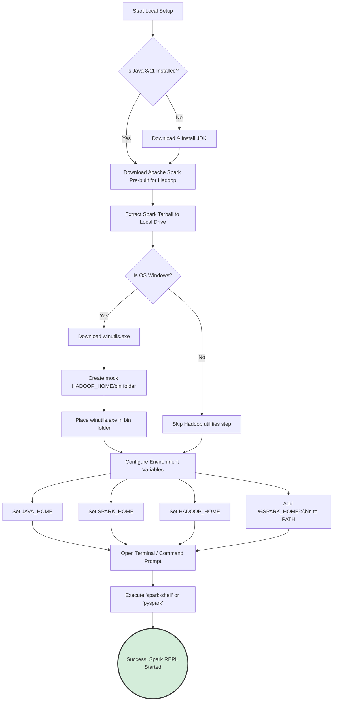

# Spark-in-Action VM Setup

**Setting up a local Spark environment—including Java, Hadoop utilities, and environment variables—is the crucial first step to transitioning from theoretical concepts to executing hands-on Spark code.**

## Why It Matters
Learning Apache Spark solely by reading documentation is like trying to learn to swim by reading a physics textbook. You must get your hands dirty. However, configuring a distributed big data cluster is incredibly complex and costly. The "Spark-in-Action" VM (Virtual Machine) or local setup provides a sandboxed, risk-free environment. It mimics a single-node cluster right on your laptop. Mastering the local setup matters because it teaches you about the underlying dependencies (like Java and Hadoop) and environment variables required for Spark to function. If you cannot configure Spark locally, you will be completely lost when trying to debug deployment issues in a production cloud environment.

## How It Works
Apache Spark is written in Scala, which runs on the Java Virtual Machine (JVM). Therefore, the absolute first prerequisite for any Spark setup is installing a compatible version of Java (typically Java 8 or Java 11). Spark will not boot without the JVM.

Second, although Spark can run independently of Hadoop's resource manager (YARN), it still heavily relies on Hadoop's core libraries for interacting with file systems (even local file systems). When you download the pre-built Apache Spark binaries, you must select the version built "for Hadoop."

For Windows users, there is a notorious quirk. Spark expects a POSIX-compliant file system. Windows is not POSIX-compliant. To bridge this gap, Windows users must download a specific Hadoop utility called `winutils.exe` and place it in a mock Hadoop `bin` directory. Without `winutils.exe`, Spark will throw debilitating `java.io.IOException: Could not locate executable null\bin\winutils.exe` errors when trying to read or write files locally.

Once the binaries are downloaded and extracted, the operating system must be told where to find them. This is done via Environment Variables. You must set `SPARK_HOME` pointing to the Spark directory, `JAVA_HOME` pointing to your Java installation, and `HADOOP_HOME` pointing to your winutils directory (on Windows). Finally, adding `$SPARK_HOME/bin` to your system `PATH` allows you to open a terminal from anywhere and launch the `spark-shell` (for Scala) or `pyspark` (for Python), initiating your local standalone cluster.

## Flow Diagram


## Data Visualization
| Environment Variable | What it Points To | Why it is Required | Consequence of Failure |
| :--- | :--- | :--- | :--- |
| `JAVA_HOME` | `C:\Program Files\Java\jdk11` | Spark runs on the JVM. | Spark will immediately crash on startup. |
| `SPARK_HOME` | `C:\spark\spark-3.x.x-bin-hadoop` | Base directory of Spark binaries. | System won't recognize Spark configuration files. |
| `HADOOP_HOME` | `C:\hadoop` (Windows only) | Directory containing `bin\winutils.exe`. | Errors when writing/reading DataFrames to local disk. |
| `PATH` | `%SPARK_HOME%\bin` appended | Allows running commands globally. | "Command 'pyspark' not found" error in terminal. |

## Code Example
```bash
# This is a representation of the terminal commands used to verify your setup.
# These commands should be run in PowerShell or Command Prompt (Windows) or Bash (Linux/Mac).

# 1. Verify Java is installed correctly
java -version
# Expected Output: openjdk version "11.0.x" ...

# 2. (Windows Only) Verify HADOOP_HOME is set
echo %HADOOP_HOME%
# Expected Output: C:\hadoop

# 3. Launch the PySpark Interactive Shell
pyspark

# ==============================================================================
# Welcome to
#       ____              __
#      / __/__  ___ _____/ /__
#     _\ \/ _ \/ _ `/ __/  '_/
#    /__ / .__/\_,_/_/ /_/\_\   version 3.x.x
#       /_/
#
# Using Python version 3.x.x
# SparkSession available as 'spark'.
# ==============================================================================

# 4. Once inside the PySpark shell, run a simple test to verify local execution
```
```python
# --- Inside the PySpark REPL ---
# Create a simple DataFrame in memory
data = [("Alice", 25), ("Bob", 30), ("Charlie", 35)]
df = spark.createDataFrame(data, ["Name", "Age"])

# Perform a transformation and action
avg_age = df.agg({"Age": "avg"}).collect()[0][0]
print(f"The average age is {avg_age}")
# Expected Output: The average age is 30.0

# Exit the shell
exit()
```

## Common Pitfalls
*   **Space in Directory Paths:** Installing Spark or Java in a directory with spaces (e.g., `C:\Program Files\Spark`). This frequently breaks Spark's internal scripts. Always install to a root folder like `C:\spark`.
*   **Mismatched Java Versions:** Installing Java 17 or higher. While modern Spark versions are improving compatibility, Java 8 or 11 are historically the most stable for Spark local development. Newer JVMs enforce stricter encapsulation that breaks older Spark code.
*   **Missing winutils.exe on Windows:** The most common cause of frustration for Windows users. Without it, you cannot save DataFrames to your local machine.
*   **Conflicting Python Installations:** Having multiple Python versions (Anaconda, standard Python, Windows Store Python) and not setting the `PYSPARK_PYTHON` environment variable, leading to driver/worker version mismatches.

## Key Takeaway
A successful local Spark setup requires strict attention to detail regarding JVM dependencies, OS-specific Hadoop utilities (winutils), and environment variables, serving as the essential foundation for all hands-on learning.
