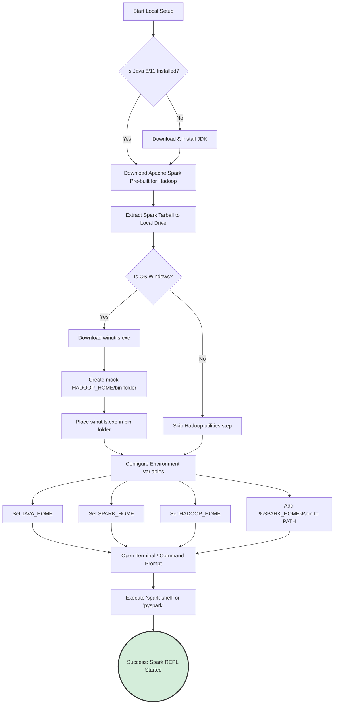

# Spark-in-Action VM Setup

**Setting up a local Spark environment—including Java, Hadoop utilities, and environment variables—is the crucial first step to transitioning from theoretical concepts to executing hands-on Spark code.**

## Why It Matters
Learning Apache Spark solely by reading documentation is like trying to learn to swim by reading a physics textbook. You must get your hands dirty. However, configuring a distributed big data cluster is incredibly complex and costly. The "Spark-in-Action" VM (Virtual Machine) or local setup provides a sandboxed, risk-free environment. It mimics a single-node cluster right on your laptop. Mastering the local setup matters because it teaches you about the underlying dependencies (like Java and Hadoop) and environment variables required for Spark to function. If you cannot configure Spark locally, you will be completely lost when trying to debug deployment issues in a production cloud environment.

## How It Works
Apache Spark is written in Scala, which runs on the Java Virtual Machine (JVM). Therefore, the absolute first prerequisite for any Spark setup is installing a compatible version of Java (typically Java 8 or Java 11). Spark will not boot without the JVM.

Second, although Spark can run independently of Hadoop's resource manager (YARN), it still heavily relies on Hadoop's core libraries for interacting with file systems (even local file systems). When you download the pre-built Apache Spark binaries, you must select the version built "for Hadoop."

For Windows users, there is a notorious quirk. Spark expects a POSIX-compliant file system. Windows is not POSIX-compliant. To bridge this gap, Windows users must download a specific Hadoop utility called `winutils.exe` and place it in a mock Hadoop `bin` directory. Without `winutils.exe`, Spark will throw debilitating `java.io.IOException: Could not locate executable null\bin\winutils.exe` errors when trying to read or write files locally.

Once the binaries are downloaded and extracted, the operating system must be told where to find them. This is done via Environment Variables. You must set `SPARK_HOME` pointing to the Spark directory, `JAVA_HOME` pointing to your Java installation, and `HADOOP_HOME` pointing to your winutils directory (on Windows). Finally, adding `$SPARK_HOME/bin` to your system `PATH` allows you to open a terminal from anywhere and launch the `spark-shell` (for Scala) or `pyspark` (for Python), initiating your local standalone cluster.

## Flow Diagram


## Data Visualization
| Environment Variable | What it Points To | Why it is Required | Consequence of Failure |
| :--- | :--- | :--- | :--- |
| `JAVA_HOME` | `C:\Program Files\Java\jdk11` | Spark runs on the JVM. | Spark will immediately crash on startup. |
| `SPARK_HOME` | `C:\spark\spark-3.x.x-bin-hadoop` | Base directory of Spark binaries. | System won't recognize Spark configuration files. |
| `HADOOP_HOME` | `C:\hadoop` (Windows only) | Directory containing `bin\winutils.exe`. | Errors when writing/reading DataFrames to local disk. |
| `PATH` | `%SPARK_HOME%\bin` appended | Allows running commands globally. | "Command 'pyspark' not found" error in terminal. |

## Code Example
```bash
# This is a representation of the terminal commands used to verify your setup.
# These commands should be run in PowerShell or Command Prompt (Windows) or Bash (Linux/Mac).

# 1. Verify Java is installed correctly
java -version
# Expected Output: openjdk version "11.0.x" ...

# 2. (Windows Only) Verify HADOOP_HOME is set
echo %HADOOP_HOME%
# Expected Output: C:\hadoop

# 3. Launch the PySpark Interactive Shell
pyspark

# ==============================================================================
# Welcome to
#       ____              __
#      / __/__  ___ _____/ /__
#     _\ \/ _ \/ _ `/ __/  '_/
#    /__ / .__/\_,_/_/ /_/\_\   version 3.x.x
#       /_/
#
# Using Python version 3.x.x
# SparkSession available as 'spark'.
# ==============================================================================

# 4. Once inside the PySpark shell, run a simple test to verify local execution
```
```python
# --- Inside the PySpark REPL ---
# Create a simple DataFrame in memory
data = [("Alice", 25), ("Bob", 30), ("Charlie", 35)]
df = spark.createDataFrame(data, ["Name", "Age"])

# Perform a transformation and action
avg_age = df.agg({"Age": "avg"}).collect()[0][0]
print(f"The average age is {avg_age}")
# Expected Output: The average age is 30.0

# Exit the shell
exit()
```

## Common Pitfalls
*   **Space in Directory Paths:** Installing Spark or Java in a directory with spaces (e.g., `C:\Program Files\Spark`). This frequently breaks Spark's internal scripts. Always install to a root folder like `C:\spark`.
*   **Mismatched Java Versions:** Installing Java 17 or higher. While modern Spark versions are improving compatibility, Java 8 or 11 are historically the most stable for Spark local development. Newer JVMs enforce stricter encapsulation that breaks older Spark code.
*   **Missing winutils.exe on Windows:** The most common cause of frustration for Windows users. Without it, you cannot save DataFrames to your local machine.
*   **Conflicting Python Installations:** Having multiple Python versions (Anaconda, standard Python, Windows Store Python) and not setting the `PYSPARK_PYTHON` environment variable, leading to driver/worker version mismatches.

## Key Takeaway
A successful local Spark setup requires strict attention to detail regarding JVM dependencies, OS-specific Hadoop utilities (winutils), and environment variables, serving as the essential foundation for all hands-on learning.


---

## 🎓 Deep Learning Questions

### Q1: Why Was This Concept Introduced?
Before local Spark installations and sandboxed VM environments, developers had to rely on expensive, fully-fledged on-premise clusters or cloud infrastructure just to learn and test Spark code. Setting up a distributed Hadoop/Spark cluster involved complex network configurations, node provisioning, and distributed file system administration. Spark introduced local mode execution to allow developers to run the entire Spark ecosystem inside a single Java Virtual Machine (JVM) on their personal laptops. This overcomes the limitations of high costs and complex administrative overhead, enabling rapid prototyping, unit testing, and learning in a risk-free, sandboxed environment without needing a physical cluster.

### Q2: What Exactly Is This Concept and How Does It Work?
The local Spark setup, often encapsulated in a VM or a direct OS installation, is a single-node configuration where all Spark components (Driver, Executor, Cluster Manager) run on a single machine. Spark is built on Scala and requires a JVM to execute. When you launch Spark locally using `local[*]`, the master acts as the cluster manager, but instead of distributing tasks across physical machines, it spawns executor threads within the same JVM as the driver. For Windows environments, the architecture requires a utility called `winutils.exe` to emulate POSIX-compliant file system permissions that Hadoop’s underlying libraries expect, bridging the gap between Windows OS and Hadoop’s native Linux design.

### Q3: Where Should This Concept Be Used?
Local Spark environments are heavily used in the development and testing phases across all industries. At companies like Netflix or Uber, data engineers do not write their first draft of an ETL pipeline directly on a 100-node production cluster. They use local Spark setups on their laptops or Docker containers to write, debug, and unit-test data transformations using small samples of data. It is the industry standard for continuous integration (CI) pipelines where automated tests run PySpark or Scala Spark jobs locally before deploying the verified code to cloud environments like AWS EMR or Databricks.

### Q4: Where Should This Concept NOT Be Used?
A local Spark setup or VM should NEVER be used for production data processing or handling massive datasets. Because it runs on a single machine, it is entirely constrained by the local CPU, memory, and disk I/O. It lacks the defining feature of Apache Spark: distributed horizontal scalability. Furthermore, local mode offers zero fault tolerance—if the machine crashes or runs out of memory (OOM), the entire job fails and data is lost. It is an anti-pattern to try and process terabytes of data locally instead of utilizing a managed cloud service or an on-premise distributed cluster.

### Q5: How Is This Concept Different from Hadoop?
| Aspect | Hadoop MapReduce (Pseudo-Distributed) | Apache Spark (Local Mode) |
| :--- | :--- | :--- |
| **Architecture** | Requires running HDFS and YARN daemons locally | Runs self-contained within a single JVM |
| **Performance** | High disk I/O as it writes intermediate steps to disk | Extremely fast due to in-memory processing |
| **Processing Model** | Strict Map-then-Reduce phases | Flexible DAG (Directed Acyclic Graph) execution |
| **Memory Usage** | Lower memory footprint, relies on disk | High memory consumption, heavily reliant on RAM |
| **Fault Tolerance** | Handled by disk replication (HDFS) | Handled by RDD lineage (recomputation) |
| **Scalability** | Not meant for local scaling | Not meant for local scaling |
| **Ease of Development**| Requires writing verbose Java code | Interactive REPLs (spark-shell, pyspark) available |
| **Typical Use Cases** | Legacy batch processing testing | Rapid prototyping, interactive data exploration |
| **Advantages** | Mimics true distributed HDFS closely | Fast, developer-friendly, interactive |
| **Disadvantages** | Slow, heavy, cumbersome to set up | Can easily run out of local memory |

### Q6: How Can This Concept Be Related to a Traditional RDBMS?
| RDBMS Concept | Spark Local Setup Equivalent | Explanation |
| :--- | :--- | :--- |
| **Database Server (e.g., PostgreSQL)** | **Local Spark JVM** | Both act as the engine executing the queries on the local machine. |
| **SQL Client (e.g., pgAdmin, DBeaver)** | **spark-shell / pyspark (REPL)** | The interactive interface where the developer submits queries/code. |
| **Temp Tables / Memory Cache** | **Local RAM (Executor Memory)** | Where intermediate data is stored during query execution. |
| **Configuration File (postgresql.conf)** | **spark-env.sh / spark-defaults.conf** | Files dictating memory limits, threading, and performance tuning. |

### Q7: What Happens Behind the Scenes?
When you start a local Spark session, a specific execution flow occurs within your machine:
1. **Driver Initialization**: The `spark-shell` or `pyspark` command starts a JVM process acting as the Driver.
2. **SparkSession Creation**: The entry point for Spark is instantiated.
3. **Task Allocation**: Because the master is set to `local[*]`, Spark determines how many logical CPU cores your machine has.
4. **Executor Threading**: Instead of launching separate executor JVMs on different nodes, Spark spawns one executor thread per logical core inside the single local JVM.
5. **Execution**: The Driver translates your code into a DAG, splits it into stages and tasks, and assigns those tasks to the local threads.

```text
[ Developer Machine ]
       |
       v
+---------------------------------------------------+
|                   Single JVM                      |
|                                                   |
|  +--------+       +----------------------------+  |
|  | Driver | ----> | Local Cluster Environment  |  |
|  | (Main) |       |                            |  |
|  +--------+       |  +----------+ +----------+ |  |
|       ^           |  | Thread 1 | | Thread 2 | |  |
|       |           |  +----------+ +----------+ |  |
|       v           |  | Thread 3 | | Thread 4 | |  |
|  [ DAG ]          |  +----------+ +----------+ |  |
+---------------------------------------------------+
       |
       v
[ Local Disk / Memory ]
```

### Q8: Performance Considerations, Best Practices, and Common Mistakes
| Category | Recommendation | Why It Matters |
| :--- | :--- | :--- |
| **Installation** | Never install Spark/Java in paths with spaces (e.g., `C:\Program Files`). | Spark scripts parse paths using spaces as delimiters; spaces in folder names will break the execution commands. |
| **Memory** | Increase driver memory using `--driver-memory 4g`. | Local mode defaults to a small memory footprint (usually 1GB), which will quickly cause OutOfMemory errors on medium datasets. |
| **Concurrency** | Use `local[*]` instead of `local`. | `local` uses a single thread. `local[*]` utilizes all available logical cores on your machine, simulating parallel execution. |
| **Windows OS** | Ensure `winutils.exe` matches your Hadoop version. | Mismatched versions will lead to cryptic NullPointerExceptions when reading/writing files. |
| **Dependencies** | Stick to Java 8 or Java 11. | Newer Java versions have strict module encapsulation that breaks Spark's internal reflection mechanisms. |

### Q9: Interview Questions
**Beginner**
1. **What is the purpose of `winutils.exe` in a Windows Spark setup?**
   It provides POSIX-like file permissions and utilities that Hadoop's underlying libraries require to interact with the Windows file system.
2. **What does setting the master to `local[*]` mean?**
   It tells Spark to run locally and use as many worker threads as there are logical CPU cores on the machine.
3. **Why do you need Java installed to run PySpark?**
   Apache Spark is built on Scala, which runs on the Java Virtual Machine. PySpark uses Py4J to bridge Python code to the underlying JVM engine.

**Intermediate**
1. **How does local mode differ from cluster mode in terms of architecture?**
   In local mode, the driver and executors run in the exact same single JVM. In cluster mode, the driver runs on one node, while executors run on entirely separate worker nodes across the network.
2. **If your local Spark job fails with an OutOfMemoryError, what is the first thing you should adjust?**
   You should increase the driver memory, as local mode executes within the driver's JVM space. This is done via `spark-submit --driver-memory 4g`.
3. **Why should you avoid paths with spaces when setting `SPARK_HOME`?**
   Spark's bash and cmd startup scripts often fail to properly escape spaces, causing them to treat parts of the directory path as separate command-line arguments.

**Advanced**
1. **Explain the role of Py4J in a local PySpark setup.**
   Py4J is a library that allows Python programs to dynamically access Java objects. It translates PySpark API calls into JVM calls, allowing Python to control the Spark JVM locally without compiling Java code.
2. **Can you simulate a network partition or node failure in Spark local mode?**
   No, because local mode runs entirely within a single JVM. If the JVM crashes, the entire application dies. To simulate distributed failures, you must use a containerized (e.g., Docker) or pseudo-distributed setup.
3. **What happens if `HADOOP_HOME` is not set on a Linux machine running Spark locally?**
   Generally, nothing fatal. Linux is natively POSIX-compliant, so Spark can interact with the local file system using standard OS calls without needing Hadoop's specific Windows workarounds.

**Scenario-Based**
1. **You are running PySpark on Windows. Reading a CSV works, but writing a DataFrame to disk throws a `java.io.IOException: Could not locate executable null\bin\winutils.exe`. How do you fix this?**
   You must download `winutils.exe`, place it in a mock directory structure like `C:\hadoop\bin`, and set the system environment variable `HADOOP_HOME` to `C:\hadoop`.
2. **Your local Spark application runs perfectly on a 10MB dataset but crashes on a 2GB dataset. You cannot increase the RAM on your laptop. How do you process this data locally?**
   You should increase the number of partitions to reduce the memory required per task, process the data in smaller chunks, or leverage disk spilling by ensuring Spark can write intermediate shuffle data to a fast local SSD.

### Q10: Complete Real-World Example
**Business Problem:** A data engineer at a retail company needs to write a unit test on their laptop to ensure a data transformation script correctly calculates total sales per store before deploying the code to a Databricks production cluster.

**Sample Dataset (`sales.csv`):**
```csv
StoreID,Item,Price,Quantity
101,Apple,1.00,50
101,Banana,0.50,100
102,Apple,1.00,30
102,Orange,0.75,80
```

**PySpark Code:**
```python
from pyspark.sql import SparkSession
from pyspark.sql.functions import col, sum as _sum

# 1. Initialize local SparkSession
# 'local[*]' ensures it uses all available laptop CPU cores
spark = SparkSession.builder \
    .appName("LocalUnitTesting") \
    .master("local[*]") \
    .getOrCreate()

# 2. Load the sample CSV data from the local file system
# In a real environment, this path might be an S3 bucket or HDFS
df = spark.read.csv("sales.csv", header=True, inferSchema=True)

# 3. Perform the transformation: Calculate total revenue per store
# Revenue = Price * Quantity
revenue_df = df.withColumn("Total_Revenue", col("Price") * col("Quantity"))

# Group by StoreID and sum the revenue
store_revenue_df = revenue_df.groupBy("StoreID") \
    .agg(_sum("Total_Revenue").alias("Store_Total_Revenue"))

# 4. Display the results locally in the terminal
print("Expected Output:")
store_revenue_df.show()

# 5. Stop the local Spark JVM process
spark.stop()
```

**Step-by-step Execution Walkthrough:**
1. The developer runs `python test_script.py` in their terminal.
2. A single JVM is launched locally due to `master("local[*]")`.
3. The CSV is read from the local hard drive.
4. Spark calculates `Total_Revenue` in memory across multiple local threads.
5. The `show()` action triggers execution, printing the result to the console.
6. The `spark.stop()` command cleanly shuts down the local JVM.

**Expected Output:**
```text
Expected Output:
+-------+-------------------+
|StoreID|Store_Total_Revenue|
+-------+-------------------+
|    101|              100.0|
|    102|               90.0|
+-------+-------------------+
```

**Performance Notes:**
Running this locally is instantaneous because the data is tiny and avoids network latency. However, if `sales.csv` were 50GB, this script would likely crash the laptop.

**When this approach is best:**
This local setup is perfect for Test-Driven Development (TDD), validating syntax, and ensuring logic is sound before incurring cloud compute costs.

### 💡 Key Takeaways
- Spark requires Java (JVM) as a fundamental prerequisite to run, even if you are writing Python code.
- Local mode (`local[*]`) executes the Driver and Executors within a single JVM on your personal machine.
- Windows users must explicitly install `winutils.exe` to bridge the gap between Windows NTFS and Hadoop's expected POSIX file system.
- Environment variables (`JAVA_HOME`, `SPARK_HOME`, `HADOOP_HOME`, `PATH`) are critical for the OS to locate and execute Spark binaries.
- Local mode is strictly for development, unit testing, and learning; it provides no fault tolerance or true distributed processing.

### ⚠️ Common Misconceptions
- **"I don't need Java because I'm using PySpark."** Wrong. PySpark is just a Python wrapper over the Scala/Java engine. The JVM is always required.
- **"Local mode is a miniature distributed cluster."** Wrong. Local mode runs entirely inside one JVM process. There is no network communication between nodes.
- **"I can test YARN configurations in local mode."** Wrong. Local mode uses Spark's standalone local scheduler, completely bypassing YARN or Mesos.

### 🔗 Related Spark Concepts
- Spark Architecture (Driver, Executor, Master)
- RDDs (Resilient Distributed Datasets)
- Py4J and PySpark Internals
- Spark Submit and Deployment Modes

### 📚 References for Further Reading
- Apache Spark Official Documentation
- Learning Spark (O'Reilly)
- Spark: The Definitive Guide (O'Reilly)
