# Chapter 1: Introduction to Apache Spark

**This chapter serves as the foundational introduction to Apache Spark, exploring its origins, its revolutionary approach to distributed computing, and the ecosystem it empowers.**

## Why It Matters
Understanding the theoretical underpinnings of Apache Spark is critical for any data engineer or data scientist. Before diving into code, you must understand the "why" behind the technology. Spark did not emerge in a vacuum; it was designed specifically to address the crippling limitations of Hadoop MapReduce. By mastering the concepts in this chapter, you will be able to make informed architectural decisions, understand when to use Spark versus other tools, and grasp the fundamental shift from disk-based to in-memory processing. This knowledge is the bedrock upon which all efficient Spark applications are built. Without it, you are merely writing code without understanding the distributed system mechanics that make it work (or fail).

## How It Works
The chapter is divided into several interconnected topics that progressively build your understanding of the Spark ecosystem. We begin with the "Spark Revolution," exploring how the AMPLab at UC Berkeley conceptualized a new computational model to overcome the rigid, disk-heavy paradigms of the past. You will learn how the transition to Resilient Distributed Datasets (RDDs) and in-memory processing changed the landscape of big data analytics.

Following this, we dive deep into "MapReduce Shortcomings." This section is crucial because it provides the historical context necessary to appreciate Spark's design. We analyze the traditional Map and Reduce phases, highlighting the I/O bottlenecks and why iterative algorithms (like those used in machine learning and graph processing) suffer under this model. By comparing MapReduce's disk-centric approach to Spark's memory-centric one, the advantages of Spark become immediately apparent.

Next, we dissect the "Spark Components." Spark is not a single monolith but a unified engine encompassing Core, SQL, Streaming, MLlib, and GraphX. You will learn how these components sit on top of the same execution engine, allowing you to seamlessly mix SQL queries with machine learning models and stream processing. This unified approach eliminates the need to stitch together disparate systems, simplifying both development and operations.

Finally, we explore the broader "Spark Ecosystem" and guide you through the "Spark-in-Action VM Setup." You will understand how Spark interacts with resource managers (YARN, Mesos, Kubernetes) and storage layers (HDFS, S3, Cassandra). The practical setup guide ensures you have a working environment to execute the code examples in subsequent chapters, bridging the gap between theory and practice.

## Flow Diagram

```mermaid
graph TD
    A["Chapter 1: Introduction to Apache Spark"] --> B("01: The Spark Revolution")
    A --> C("02: MapReduce Shortcomings")
    A --> D("03: Spark Components")
    A --> E("04: The Spark Ecosystem")
    A --> F("05: Spark VM Setup")
    
    B --> B1[In-Memory Computing]
    B --> B2[AMPLab Origins]
    B --> B3[Performance Benchmarks]
    
    C --> C1["Disk I/O Bottlenecks"]
    C --> C2[Rigid 2-Stage Model]
    C --> C3[Iterative Algorithm Failures]
    
    D --> D1[Spark Core]
    D --> D2[Spark SQL]
    D --> D3[Spark Streaming]
    D --> D4[MLlib]
    D --> D5[GraphX]
    
    E --> E1["Storage: HDFS, S3, Cassandra"]
    E --> E2["Resource Managers: YARN, K8s"]
    E --> E3["Data Sources: Kafka, Hive"]
    
    F --> F1["Prerequisites: Java, Hadoop"]
    F --> F2[Downloading Spark]
    F --> F3[Environment Variables]
    F --> F4[Running spark-shell]
```


## Data Visualization
| Topic | Key Concept | Problem Addressed | Modern Solution |
| :--- | :--- | :--- | :--- |
| **Spark Revolution** | In-Memory Processing | Slow disk-based MapReduce jobs | Resilient Distributed Datasets (RDDs) |
| **MapReduce Shortcomings** | Rigid Architecture | Inability to run iterative ML algorithms efficiently | Directed Acyclic Graphs (DAGs) and lazy evaluation |
| **Spark Components** | Unified Engine | Managing multiple disparate big data tools | Single stack for Batch, SQL, Streaming, and ML |
| **Spark Ecosystem** | Decoupled Storage/Compute | Tightly coupled Hadoop clusters | Pluggable storage (S3, HDFS) and resource managers |
| **VM Setup** | Local Development | Complex cluster provisioning for learning | Standalone mode and pre-configured VMs |

## Code Example
```scala
// This is a conceptual overview of what you will achieve after mastering Chapter 1.
// You will be able to launch a Spark session and execute code that utilizes multiple components seamlessly.

import org.apache.spark.sql.SparkSession

// 1. Initialize the Unified Engine (Spark Core & SQL)
val spark = SparkSession.builder()
  .appName("Chapter1_Overview_Example")
  .master("local[*]") // Run locally using all available cores
  .getOrCreate()

// 2. Load Data from the Ecosystem (e.g., local file system representing HDFS/S3)
// In a real scenario, this could be "hdfs://namenode:8020/data/users.csv"
val dataPath = "data/sample_users.csv"
val df = spark.read
  .option("header", "true")
  .option("inferSchema", "true")
  .csv(dataPath)

// 3. Utilize Spark SQL for Data Manipulation
df.createOrReplaceTempView("users")
val activeUsers = spark.sql("""
  SELECT name, age, signup_date 
  FROM users 
  WHERE status = 'active' AND age > 18
""")

// 4. Show the results (Triggers execution of the DAG)
activeUsers.show()

// 5. Stop the session to release resources
spark.stop()
```

## Common Pitfalls
*   **Skipping the Theory:** Jumping straight into Spark code without understanding the underlying concepts (like lazy evaluation and DAGs) leads to horribly inefficient applications.
*   **Assuming Spark is always faster:** Thinking Spark will magically speed up any task. If your data is small enough to fit on one machine, Pandas or simple scripts are often faster.
*   **Ignoring the Ecosystem:** Trying to use Spark as a database. Spark is a compute engine, not a storage engine; understanding the ecosystem is vital.
*   **Misconfiguring the Setup:** Failing to set `HADOOP_HOME` or path variables correctly on Windows, leading to frustrating `winutils.exe` errors.
*   **Over-allocating Resources locally:** Trying to run Spark with massive datasets on a local VM without tuning memory settings, causing OutOfMemory (OOM) errors.

## Key Takeaway
Chapter 1 establishes the critical foundation that Apache Spark is a unified, in-memory distributed computing engine designed to overcome the I/O bottlenecks of MapReduce, acting as the compute layer within a broader, pluggable big data ecosystem.
