# Chapter 1: Introduction to Apache Spark

**This chapter serves as the foundational introduction to Apache Spark, exploring its origins, its revolutionary approach to distributed computing, and the ecosystem it empowers.**

## Why It Matters
Understanding the theoretical underpinnings of Apache Spark is critical for any data engineer or data scientist. Before diving into code, you must understand the "why" behind the technology. Spark did not emerge in a vacuum; it was designed specifically to address the crippling limitations of Hadoop MapReduce. By mastering the concepts in this chapter, you will be able to make informed architectural decisions, understand when to use Spark versus other tools, and grasp the fundamental shift from disk-based to in-memory processing. This knowledge is the bedrock upon which all efficient Spark applications are built. Without it, you are merely writing code without understanding the distributed system mechanics that make it work (or fail).

## How It Works
The chapter is divided into several interconnected topics that progressively build your understanding of the Spark ecosystem. We begin with the "Spark Revolution," exploring how the AMPLab at UC Berkeley conceptualized a new computational model to overcome the rigid, disk-heavy paradigms of the past. You will learn how the transition to Resilient Distributed Datasets (RDDs) and in-memory processing changed the landscape of big data analytics.

Following this, we dive deep into "MapReduce Shortcomings." This section is crucial because it provides the historical context necessary to appreciate Spark's design. We analyze the traditional Map and Reduce phases, highlighting the I/O bottlenecks and why iterative algorithms (like those used in machine learning and graph processing) suffer under this model. By comparing MapReduce's disk-centric approach to Spark's memory-centric one, the advantages of Spark become immediately apparent.

Next, we dissect the "Spark Components." Spark is not a single monolith but a unified engine encompassing Core, SQL, Streaming, MLlib, and GraphX. You will learn how these components sit on top of the same execution engine, allowing you to seamlessly mix SQL queries with machine learning models and stream processing. This unified approach eliminates the need to stitch together disparate systems, simplifying both development and operations.

Finally, we explore the broader "Spark Ecosystem" and guide you through the "Spark-in-Action VM Setup." You will understand how Spark interacts with resource managers (YARN, Mesos, Kubernetes) and storage layers (HDFS, S3, Cassandra). The practical setup guide ensures you have a working environment to execute the code examples in subsequent chapters, bridging the gap between theory and practice.

## Flow Diagram

```mermaid
graph TD
    A["Chapter 1: Introduction to Apache Spark"] --> B("01: The Spark Revolution")
    A --> C("02: MapReduce Shortcomings")
    A --> D("03: Spark Components")
    A --> E("04: The Spark Ecosystem")
    A --> F("05: Spark VM Setup")
    
    B --> B1[In-Memory Computing]
    B --> B2[AMPLab Origins]
    B --> B3[Performance Benchmarks]
    
    C --> C1["Disk I/O Bottlenecks"]
    C --> C2[Rigid 2-Stage Model]
    C --> C3[Iterative Algorithm Failures]
    
    D --> D1[Spark Core]
    D --> D2[Spark SQL]
    D --> D3[Spark Streaming]
    D --> D4[MLlib]
    D --> D5[GraphX]
    
    E --> E1["Storage: HDFS, S3, Cassandra"]
    E --> E2["Resource Managers: YARN, K8s"]
    E --> E3["Data Sources: Kafka, Hive"]
    
    F --> F1["Prerequisites: Java, Hadoop"]
    F --> F2[Downloading Spark]
    F --> F3[Environment Variables]
    F --> F4[Running spark-shell]
```


## Data Visualization
| Topic | Key Concept | Problem Addressed | Modern Solution |
| :--- | :--- | :--- | :--- |
| **Spark Revolution** | In-Memory Processing | Slow disk-based MapReduce jobs | Resilient Distributed Datasets (RDDs) |
| **MapReduce Shortcomings** | Rigid Architecture | Inability to run iterative ML algorithms efficiently | Directed Acyclic Graphs (DAGs) and lazy evaluation |
| **Spark Components** | Unified Engine | Managing multiple disparate big data tools | Single stack for Batch, SQL, Streaming, and ML |
| **Spark Ecosystem** | Decoupled Storage/Compute | Tightly coupled Hadoop clusters | Pluggable storage (S3, HDFS) and resource managers |
| **VM Setup** | Local Development | Complex cluster provisioning for learning | Standalone mode and pre-configured VMs |

## Code Example
```scala
// This is a conceptual overview of what you will achieve after mastering Chapter 1.
// You will be able to launch a Spark session and execute code that utilizes multiple components seamlessly.

import org.apache.spark.sql.SparkSession

// 1. Initialize the Unified Engine (Spark Core & SQL)
val spark = SparkSession.builder()
  .appName("Chapter1_Overview_Example")
  .master("local[*]") // Run locally using all available cores
  .getOrCreate()

// 2. Load Data from the Ecosystem (e.g., local file system representing HDFS/S3)
// In a real scenario, this could be "hdfs://namenode:8020/data/users.csv"
val dataPath = "data/sample_users.csv"
val df = spark.read
  .option("header", "true")
  .option("inferSchema", "true")
  .csv(dataPath)

// 3. Utilize Spark SQL for Data Manipulation
df.createOrReplaceTempView("users")
val activeUsers = spark.sql("""
  SELECT name, age, signup_date 
  FROM users 
  WHERE status = 'active' AND age > 18
""")

// 4. Show the results (Triggers execution of the DAG)
activeUsers.show()

// 5. Stop the session to release resources
spark.stop()
```

## Common Pitfalls
*   **Skipping the Theory:** Jumping straight into Spark code without understanding the underlying concepts (like lazy evaluation and DAGs) leads to horribly inefficient applications.
*   **Assuming Spark is always faster:** Thinking Spark will magically speed up any task. If your data is small enough to fit on one machine, Pandas or simple scripts are often faster.
*   **Ignoring the Ecosystem:** Trying to use Spark as a database. Spark is a compute engine, not a storage engine; understanding the ecosystem is vital.
*   **Misconfiguring the Setup:** Failing to set `HADOOP_HOME` or path variables correctly on Windows, leading to frustrating `winutils.exe` errors.
*   **Over-allocating Resources locally:** Trying to run Spark with massive datasets on a local VM without tuning memory settings, causing OutOfMemory (OOM) errors.

## Key Takeaway
Chapter 1 establishes the critical foundation that Apache Spark is a unified, in-memory distributed computing engine designed to overcome the I/O bottlenecks of MapReduce, acting as the compute layer within a broader, pluggable big data ecosystem.


---

## 🎓 Deep Learning Questions

### Q1: Why Was This Concept Introduced?
Before Apache Spark, the big data landscape was dominated by Hadoop MapReduce. While MapReduce was revolutionary for processing massive datasets across commodity hardware, it had a critical limitation: it relied heavily on disk I/O. Every Map and Reduce phase required reading from and writing to disk (HDFS) to ensure fault tolerance. This made it inherently slow, particularly for iterative algorithms (like machine learning models or PageRank) and interactive data exploration where multiple passes over the data are required. 

Apache Spark was introduced to overcome these debilitating I/O bottlenecks. Created at UC Berkeley's AMPLab, Spark introduced **In-Memory Computing** through Resilient Distributed Datasets (RDDs). By keeping data in RAM across iterations rather than flushing it to disk, Spark achieved up to a 100x performance increase over Hadoop MapReduce for certain workloads. Furthermore, Spark introduced a unified engine, eliminating the need to stitch together separate tools for batch processing, streaming, and machine learning.

### Q2: What Exactly Is This Concept and How Does It Work?
Apache Spark is a unified, distributed compute engine and a set of libraries for parallel data processing on computer clusters. It works by decoupling storage and computation. Unlike Hadoop, which binds HDFS and MapReduce, Spark only handles computation. It can read data from Amazon S3, HDFS, Cassandra, or local filesystems.

At its core, Spark works by distributing data across a cluster in the form of RDDs or DataFrames. When you write a Spark application, a **Driver** program translates your code into a logical Directed Acyclic Graph (DAG) of operations. Spark uses **lazy evaluation**, meaning it doesn't process data immediately. Instead, it waits until an **action** (like `show()` or `count()`) is called. Once triggered, the DAG Scheduler breaks the logical graph into physical **stages** and **tasks**. These tasks are then sent to **Executors** (worker nodes) that process the data in parallel across multiple CPU cores, utilizing memory (RAM) to cache intermediate results.

### Q3: Where Should This Concept Be Used?
Apache Spark shines in scenarios requiring massive-scale data processing, fast analytics, and complex pipelines. 

- **Netflix & Streaming Services:** Recommendation engines. Spark MLlib processes vast amounts of viewing history to generate personalized suggestions in near real-time.
- **Uber & Ride-Sharing:** Real-time pricing and matching. Spark Streaming analyzes traffic, weather, and rider demand to dynamically calculate surge pricing.
- **Banking & Finance:** Fraud detection. Financial institutions use Spark to analyze transaction streams instantly, flagging anomalies before transactions complete.
- **Healthcare:** Genomics processing. Analyzing human genomes requires massive parallel computation, which Spark handles efficiently.
- **Retail:** Supply chain optimization and inventory management based on multi-petabyte sales datasets.

### Q4: Where Should This Concept NOT Be Used?
Spark is not a silver bullet. Using it in the wrong scenario leads to unnecessary complexity and slower performance.

- **Small Data Processing:** If your dataset fits comfortably in the RAM of a single machine (e.g., < 50 GB), use Pandas, Polars, or a local SQL database. Spark's distributed overhead will make it slower than local processing.
- **OLTP Systems (Online Transaction Processing):** Spark is not a database. It should not be used as a backend for web applications requiring point-read/writes, ACID transactions, or microsecond latency. Use PostgreSQL or MongoDB instead.
- **Strict Real-Time Processing:** While Spark Structured Streaming achieves micro-batch latencies (milliseconds), systems needing true event-by-event processing with sub-millisecond latency (like high-frequency trading) should use Apache Flink or Apache Storm.

### Q5: How Is This Concept Different from Hadoop?
| Aspect | Hadoop MapReduce | Apache Spark |
| :--- | :--- | :--- |
| **Architecture** | Map/Reduce rigid 2-stage execution | Directed Acyclic Graph (DAG) flexible execution |
| **Performance** | Slower (Disk I/O bound) | Up to 100x faster (In-memory computing) |
| **Processing Model** | Strictly Batch processing | Unified (Batch, Streaming, SQL, ML, Graph) |
| **Memory Usage** | Reads/writes to disk between steps | Keeps intermediate data in RAM |
| **Fault Tolerance** | Via HDFS replication | Via RDD lineage (recomputes lost data) |
| **Scalability** | Extremely highly scalable (Petabytes) | Highly scalable, but bounded by RAM capacity |
| **Ease of Development** | Complex, verbose Java code | Concise API in Python, Scala, SQL, R |
| **Typical Use Cases** | ETL, heavy batch reporting | Interactive analytics, ML, Streaming |
| **Advantages** | Cheaper hardware, highly stable | Blazing fast, developer-friendly |
| **Disadvantages** | Very slow, hard to maintain | Memory intensive, expensive hardware |

### Q6: How Can This Concept Be Related to a Traditional RDBMS?
For SQL developers transitioning to Spark, understanding the architectural equivalents is highly beneficial:

| Traditional RDBMS Concept | Apache Spark Equivalent | Explanation |
| :--- | :--- | :--- |
| **Database Server (e.g., Postgres)** | Spark Cluster | The entire distributed environment executing the tasks. |
| **Query Engine / Optimizer** | Catalyst Optimizer | Spark's engine that analyzes, optimizes, and plans SQL/DataFrame queries. |
| **Table** | DataFrame / Dataset / RDD | The core data abstraction. Unlike RDBMS tables, these are distributed across many machines. |
| **Execution Plan (EXPLAIN)** | Physical Plan (DAG) | The step-by-step physical operations Spark will perform. |
| **Indexes** | Partitioning / Bucketing / Z-Ordering | Spark doesn't use traditional B-Tree indexes. It relies on data layout (partitions) to skip irrelevant data. |
| **Stored Procedures** | Spark Application (Python/Scala) | Custom programmatic logic executing complex transformations. |
| **Views** | Temporary Views | Ephemeral SQL references to DataFrames (`createOrReplaceTempView`). |

### Q7: What Happens Behind the Scenes?
When you submit a Spark job, a complex orchestration occurs. 

1. **Driver Program:** Your main program starts. It contains the `SparkSession` and creates a logical plan of all transformations.
2. **Action Trigger:** Because of lazy evaluation, nothing happens until an action (e.g., `write()`) is called.
3. **DAG Generation:** The logical plan is converted into a physical Directed Acyclic Graph (DAG).
4. **DAG Scheduler:** The DAG is split into **Stages** based on shuffle boundaries (where data must move across the network).
5. **Task Scheduler:** Stages are divided into individual **Tasks** (one task per data partition).
6. **Executors:** The Cluster Manager allocates Executors. The Tasks are sent to Executors, which process the data in RAM.

```text
+-------------------+       +-----------------+       +--------------------+
|                   |       |                 |       | Executor 1 (Worker)|
|  Driver Program   | ----> | Cluster Manager | ----> | - Task 1           |
| (SparkContext/DAG)|       |  (YARN/K8s/SA)  |       | - Task 2           |
|                   |       |                 |       +--------------------+
+-------------------+       +-----------------+                 |
         |                           |                +--------------------+
         |---------------------------+--------------> | Executor 2 (Worker)|
                                                      | - Task 3           |
                                                      | - Task 4           |
                                                      +--------------------+
```

### Q8: Performance Considerations, Best Practices, and Common Mistakes

| Category | Recommendation | Why It Matters |
| :--- | :--- | :--- |
| **Performance** | Maximize Data Locality | Processing data on the same node where it lives reduces network I/O, speeding up execution. |
| **Performance** | Avoid Shuffles where possible | Operations like `groupByKey` or `join` move massive data across the network, heavily degrading performance. |
| **Best Practice** | Use DataFrames instead of RDDs | DataFrames leverage the Catalyst Optimizer and Tungsten execution engine for massive speedups. |
| **Best Practice** | Right-size partitions | Too few partitions lead to idle CPUs; too many cause scheduler overhead. Aim for 2-4x the number of CPU cores. |
| **Mistake** | Collecting large datasets to Driver | Running `.collect()` on massive data brings all data to the single Driver node, causing an immediate OutOfMemoryError. |
| **Mistake** | Ignoring Lazy Evaluation | Chaining transformations without understanding when they execute can lead to redundant computations. |

### Q9: Interview Questions

**Beginner:**
1. **What is Apache Spark?** A unified analytics engine for large-scale data processing, utilizing in-memory computing for speed.
2. **What is Lazy Evaluation?** Spark delays execution of transformations until an Action is called, allowing it to optimize the execution plan.
3. **What is the difference between an RDD and a DataFrame?** RDDs are low-level, untyped distributed collections. DataFrames are higher-level, organized into named columns (like SQL tables), and highly optimized.

**Intermediate:**
1. **Explain the role of the Catalyst Optimizer.** It analyzes logical queries on DataFrames/SQL, applies rule-based and cost-based optimizations, and generates an optimized physical execution plan.
2. **What causes a Shuffle in Spark?** Wide transformations (like `join`, `groupBy`, `distinct`) that require data from multiple partitions to be reorganized and sent across the network.
3. **How does Spark achieve fault tolerance without Hadoop's heavy disk replication?** Through RDD Lineage. Spark remembers the graph of deterministic transformations used to build an RDD. If a node fails, Spark recomputes only the lost partitions from the original data.

**Advanced:**
1. **Explain the difference between `repartition()` and `coalesce()`.** `repartition()` creates a specific number of partitions and involves a full shuffle (useful for increasing partitions). `coalesce()` reduces the number of partitions without a full shuffle by merging existing partitions locally.
2. **How does Tungsten memory management work?** It manages memory explicitly, bypassing the JVM garbage collector, and stores data in a compact binary format to reduce memory footprint and improve CPU cache hits.
3. **What is data skew and how do you resolve it?** Data skew occurs when one partition holds significantly more data than others, causing straggler tasks. It can be resolved by salting keys (adding random prefixes) or using broadcast joins for smaller tables.

**Scenario-Based:**
1. **You are processing 10TB of data and your Spark job fails with an OutOfMemoryError on the Executors. How do you troubleshoot?** I would first check for data skew. If a single partition is too large, the executor will crash. I would also check if I am caching unnecessarily, or if I have too few partitions (meaning each partition is huge). Increasing `spark.executor.memory` is a brute-force fallback.
2. **Your Spark streaming application is falling behind (processing time > batch interval). What are your steps?** I would look at the Spark UI to identify bottlenecks. I might increase cluster resources, optimize the code to minimize shuffles, ensure serialization (Kryo) is optimal, or increase the number of Kafka partitions to increase parallelism.

### Q10: Complete Real-World Example
**Business Problem:** A retail giant (like Walmart) wants to analyze raw web server logs to find which product categories generate the most HTTP 404 (Not Found) errors, helping them fix broken links immediately.
**Sample Dataset:** Millions of log lines in raw text format.

```python
from pyspark.sql import SparkSession
from pyspark.sql.functions import col, split, count, desc

# 1. Initialize the Spark Session
spark = SparkSession.builder \
    .appName("RetailErrorLogAnalysis") \
    .master("local[*]") \
    .getOrCreate()

# Sample data representing raw web logs: IP - [Date] "Method URL Protocol" Status Bytes
# In production, this would be: spark.read.text("s3://retail-logs/2023/10/*.log")
sample_logs = [
    '192.168.1.1 - [10/Oct/2023] "GET /electronics/tv HTTP/1.1" 200 1024',
    '10.0.0.5 - [10/Oct/2023] "GET /clothing/shoes HTTP/1.1" 404 512',
    '172.16.0.2 - [10/Oct/2023] "GET /electronics/laptops HTTP/1.1" 404 512',
    '10.0.0.5 - [10/Oct/2023] "GET /clothing/hats HTTP/1.1" 200 1024',
    '192.168.1.1 - [10/Oct/2023] "GET /electronics/tv HTTP/1.1" 404 512'
]

# Create a DataFrame from the sample data
log_df = spark.createDataFrame([(line,) for line in sample_logs], ["raw_log"])

# 2. Extract Status Code and Category URL using String manipulation (Transformations)
# Split the raw log by spaces. The status code is the 7th element (index 6)
# The URL is the 5th element (index 4)
parsed_df = log_df.withColumn("status_code", split(col("raw_log"), " ").getItem(6)) \
                  .withColumn("url", split(col("raw_log"), " ").getItem(4))

# Extract the category (e.g., '/electronics/') from the URL
category_df = parsed_df.withColumn("category", split(col("url"), "/").getItem(1))

# 3. Filter for 404 errors (Transformation)
errors_404 = category_df.filter(col("status_code") == "404")

# 4. Aggregate to find the worst categories (Transformation - Wide/Shuffle)
# Group by category and count
error_counts = errors_404.groupBy("category") \
                         .agg(count("*").alias("404_count")) \
                         .orderBy(desc("404_count"))

# 5. Execute the DAG and print results (Action)
print("Top Categories with Broken Links:")
error_counts.show()

# Expected Output:
# +-----------+---------+
# |   category|404_count|
# +-----------+---------+
# |electronics|        2|
# |   clothing|        1|
# +-----------+---------+

# 6. Stop session
spark.stop()
```
**Performance Notes:** The `groupBy` operation causes a shuffle. In production with petabytes of logs, ensuring the logs are partitioned evenly across the cluster before the aggregation is critical to avoid data skew.

### 💡 Key Takeaways
- Apache Spark was created to solve the disk I/O bottlenecks of Hadoop MapReduce by utilizing in-memory computing.
- It is a unified engine, supporting batch, streaming, machine learning, and graph processing through a single API.
- Spark relies on lazy evaluation; transformations build a logical plan (DAG) which is only executed when an action is triggered.
- It decouples compute from storage, allowing integration with HDFS, S3, Cassandra, and resource managers like YARN and Kubernetes.
- Using the right API (DataFrames/SQL over raw RDDs) allows Spark's Catalyst Optimizer to dramatically improve performance.

### ⚠️ Common Misconceptions
- **Spark is a Database:** Wrong. Spark has no permanent storage engine; it is a distributed compute layer.
- **Spark always runs in RAM:** While it prefers memory, if datasets are too large, Spark will seamlessly spill data to disk to complete the job.
- **More Executors = Always Faster:** Unnecessary parallelism can slow down jobs due to task scheduling and network overhead.
- **`.collect()` is safe to use:** Calling collect on large DataFrames brings all data to the driver node, commonly causing an OutOfMemoryError.

### 🔗 Related Spark Concepts
- Resilient Distributed Datasets (RDDs)
- DataFrames and the Catalyst Optimizer
- Directed Acyclic Graphs (DAGs) and Lazy Evaluation
- Spark Executors, Tasks, and Stages
- The Spark UI and Job Tuning

### 📚 References for Further Reading
- Apache Spark Official Documentation
- Learning Spark (O'Reilly)
- Spark: The Definitive Guide (O'Reilly)
