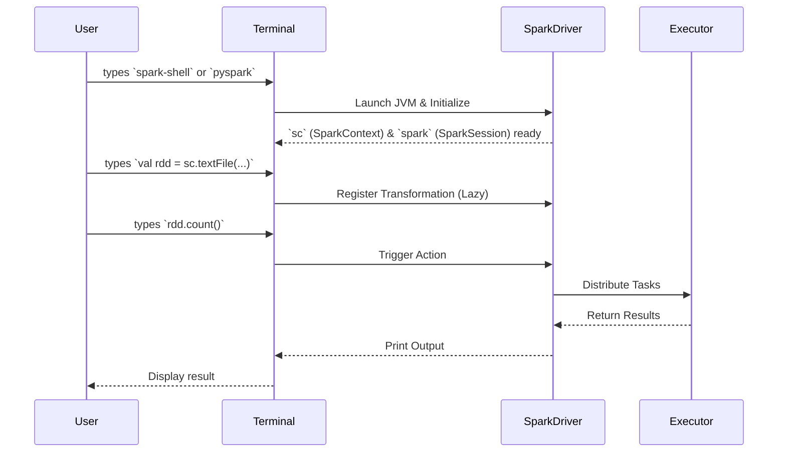

# The Spark Shell

**An interactive REPL environment for rapidly prototyping Spark code and exploring data.**

## Why It Matters
When working with Big Data, compiling and deploying an entire application just to test a single data transformation or check the schema of a CSV file is painfully slow. The Spark Shell solves this by providing a Read-Eval-Print Loop (REPL). It allows data engineers and scientists to write Spark code and get immediate feedback. This instant feedback loop is invaluable for learning the API, debugging complex data pipelines step-by-step, and performing ad-hoc data analysis. Without the Spark Shell, the development cycle for Spark applications would be significantly longer and more frustrating.

## How It Works
The Spark Shell comes in two primary flavors: `spark-shell` for Scala and `pyspark` for Python. When you launch either of these from your terminal, Spark does a lot of heavy lifting behind the scenes. It starts a Spark application locally (or connects to a cluster if configured) and automatically instantiates the core entry points to the Spark API.

Historically (in Spark 1.x), the primary entry point was the `SparkContext`, which the shell automatically makes available as the variable `sc`. The `sc` object is your connection to the Spark cluster and is used to create RDDs, accumulators, and broadcast variables. In modern Spark (2.x and later), the unified entry point is the `SparkSession`, provided in the shell as the variable `spark`. The `spark` object encompasses the `SparkContext` and adds capabilities for working with DataFrames and Spark SQL.

Once the shell is running, you can type any valid Scala or Python code. When you press Enter, the shell evaluates the code. If it's a Spark Transformation, Spark simply adds it to the DAG (Directed Acyclic Graph) of execution. If it's a Spark Action (like `count()` or `show()`), Spark compiles the DAG into physical execution stages, distributes tasks to executors, and returns the result to your terminal. 

Basic navigation in the shell involves using the Tab key for auto-completion (a massive time-saver for discovering available methods on RDDs or DataFrames) and understanding that you are operating within a real, JVM-backed distributed engine, even if it's just running on your laptop.

## Flow Diagram


## Data Visualization
| Shell Command | Action | Internal State Change | Output to User |
| :--- | :--- | :--- | :--- |
| `spark-shell` | Launch REPL | JVM starts, `sc` created | Spark ASCII Art, version info |
| `sc.parallelize(1 to 5)` | Transformation | RDD lineage created | `ParallelCollectionRDD[1]` |
| `.map(_ * 2)` | Transformation | DAG updated with Map step | `MapPartitionsRDD[2]` |
| `.collect()` | Action | Tasks run on executors | `Array(2, 4, 6, 8, 10)` |

## Code Example
```scala
// Scala Spark Shell Example
// Note: 'sc' is already provided by the shell

// 1. Create an RDD from an in-memory list
val textFile = sc.parallelize(Seq(
  "hello spark",
  "hello world",
  "spark is awesome"
))

// 2. Perform a word count (classic Big Data hello world)
val counts = textFile
  // Split each line into words
  .flatMap(line => line.split(" "))
  // Map each word to a (word, 1) tuple
  .map(word => (word, 1))
  // Aggregate the counts by key (the word)
  .reduceByKey(_ + _)

// 3. Trigger computation and print results to the console
counts.collect().foreach(println)

// Expected Output:
// (hello,2)
// (spark,2)
// (world,1)
// (awesome,1)
```

## Common Pitfalls
*   **Forgetting it's a single driver:** The shell runs the driver program on your local machine. If you `collect()` a multi-gigabyte dataset, you will crash the shell with an OutOfMemoryError.
*   **Variable scoping issues:** In the Scala shell, pasting large blocks of code can sometimes lead to weird compilation errors due to how the REPL wraps expressions. Use `:paste` mode.
*   **Ignoring the Web UI:** The shell spins up a Spark Web UI (usually on `http://localhost:4040`). Beginners often forget to look at it, missing out on crucial execution details.
*   **Production reliance:** The shell is for prototyping. Never build production pipelines by piping scripts into `spark-shell`.

## Key Takeaway
The Spark Shell is your interactive sandbox for Big Data, providing immediate access to the Spark runtime (`sc` and `spark`) without the overhead of building and deploying applications.

<br><br><br><br><br><br><br><br><br><br><br><br><br><br><br><br><br><br><br><br>
<br><br><br><br><br><br><br><br><br><br><br><br><br><br><br><br><br><br><br><br>
<br><br><br><br><br><br><br><br><br><br><br><br><br><br><br><br><br><br><br><br>
<br><br><br><br><br><br><br><br><br><br><br><br><br><br><br><br><br><br><br><br>
<br><br><br><br><br><br><br><br><br><br><br><br><br><br><br><br><br><br><br><br>
<br><br><br><br><br><br><br><br><br><br><br><br><br><br><br><br><br><br><br><br>
<br><br><br><br><br><br><br><br><br><br><br><br><br><br><br><br><br><br><br><br>
<br><br><br><br><br><br><br><br><br><br><br><br><br><br><br><br><br><br><br><br>
<br><br><br><br><br><br><br><br><br><br><br><br><br><br><br><br><br><br><br><br>
<br><br><br><br><br><br><br><br><br><br><br><br><br><br><br><br><br><br><br><br>


---

## 🎓 Deep Learning Questions

### Q1: Why Was This Concept Introduced?
Before the Spark Shell, processing large-scale data in traditional Hadoop MapReduce required writing lengthy Java boilerplate code, compiling it into a JAR file, and deploying it to a cluster. This development cycle was slow and hindered rapid experimentation. 
The Spark Shell was introduced to provide an interactive REPL (Read-Eval-Print Loop) environment. It allows developers, data scientists, and engineers to write Spark code and get immediate feedback. This instant interactivity radically lowered the barrier to entry for learning Spark and experimenting with data, significantly accelerating the data discovery and debugging process.

### Q2: What Exactly Is This Concept and How Does It Work?
The Spark Shell is an interactive command-line interface that runs a Spark Application in the background. It comes in two main variants: `spark-shell` (for Scala) and `pyspark` (for Python). 
When you launch the shell, it automatically initializes a JVM (Java Virtual Machine) and sets up the essential Spark entry points—namely, the `SparkContext` (available as the variable `sc`) and the `SparkSession` (available as the variable `spark`). As you type commands, the shell's interpreter evaluates them. Transformations are lazily added to a directed acyclic graph (DAG), and actions trigger actual execution. The driver program (the shell) then distributes tasks to local or remote executors and prints the results directly to your console.

### Q3: Where Should This Concept Be Used?
The Spark Shell is ideal for exploratory data analysis (EDA), rapid prototyping, and debugging. 
- **Data Science:** Data scientists use it to quickly load a sample dataset, inspect its schema, and test feature engineering transformations without writing a full application.
- **Data Engineering:** Engineers use it to debug complex ETL (Extract, Transform, Load) pipelines step-by-step or to test connection strings to external databases like JDBC or cloud storage (S3/HDFS).
- **Learning:** It is the perfect environment for beginners to learn the Spark API and immediately see the results of different operations.

### Q4: Where Should This Concept NOT Be Used?
The Spark Shell is strictly for development, testing, and exploration. It should **never** be used for production deployments.
- **Production Pipelines:** Do not pipe scripts into the Spark Shell for scheduled jobs. Use `spark-submit` to deploy compiled applications or packaged Python scripts.
- **Long-Running Applications:** The shell is tied to your terminal session; if the terminal closes, the Spark application dies. 
- **Heavy Data Retrieval:** Running `.collect()` on massive datasets in the shell will crash the driver node (your local machine or jump host) due to an OutOfMemoryError.

### Q5: How Is This Concept Different from Hadoop?
| Aspect | Hadoop MapReduce | Apache Spark |
| :--- | :--- | :--- |
| **Architecture** | Batch-oriented, disk-based | In-memory compute engine |
| **Performance** | Slow due to disk I/O between steps | Up to 100x faster in memory |
| **Processing Model** | Strict Map and Reduce phases | Rich set of transformations and actions |
| **Memory Usage** | Relies heavily on disk storage | Optimizes in-memory caching |
| **Fault Tolerance** | Replicates data across disk nodes | Uses RDD lineage for recovery |
| **Scalability** | Highly scalable for massive batch jobs | Highly scalable for batch and streaming |
| **Ease of Development** | Verbose Java code, complex setup | Interactive Shell (REPL), concise code |
| **Typical Use Cases** | Nightly batch processing | Real-time analytics, machine learning, EDA |
| **Advantages** | Proven reliability for huge datasets | Speed, versatility, ease of use |
| **Disadvantages** | No interactive shell, high latency | Higher memory requirements |

### Q6: How Can This Concept Be Related to a Traditional RDBMS?
| Spark Shell Concept | Traditional RDBMS Equivalent | Explanation |
| :--- | :--- | :--- |
| `spark-shell` / `pyspark` | SQL CLI (e.g., `psql`, `mysql`) | The interactive terminal used to send commands to the database engine. |
| `spark` (SparkSession) | Database Connection | The entry point to execute queries and interact with the data catalog. |
| Transformations (e.g., `.filter()`) | `WHERE` clause preparation | Building the query execution plan without actually fetching the data. |
| Actions (e.g., `.show()`) | Query Execution (`SELECT *`) | Executing the plan and returning the results to the user's screen. |

### Q7: What Happens Behind the Scenes?
When you launch the Spark Shell and run a job, a series of orchestrations happen:
1. **Driver Initialization:** The shell starts the Driver JVM and initializes `SparkContext`/`SparkSession`.
2. **DAG Creation:** As you type transformations, the Driver builds a logical execution plan (DAG).
3. **Action Trigger:** An action (like `.count()`) forces the Driver to submit the DAG to the DAGScheduler.
4. **Task Distribution:** The DAG is split into Stages and Tasks. The TaskScheduler sends these to Executors.
5. **Execution:** Executors perform the work on partitions of data.
6. **Result Return:** Executors send the computed results back to the Driver to be printed in the shell.

```text
[User Terminal] -> Types commands
       |
[Driver JVM] -> Builds DAG -> [DAG Scheduler] -> Divides into Stages
       |                                                |
       v                                                v
[Spark UI] <- Monitors Progress                 [Task Scheduler] -> Dispatches Tasks
                                                        |
                                       +----------------+----------------+
                                       |                                 |
                                [Executor 1]                      [Executor 2]
                                (Processes Data)                  (Processes Data)
```

### Q8: Performance Considerations, Best Practices, and Common Mistakes
| Category | Recommendation | Why It Matters |
| :--- | :--- | :--- |
| **Best Practice** | Use `:paste` mode in Scala `spark-shell`. | Prevents premature evaluation and scoping errors when pasting multi-line code blocks. |
| **Common Mistake** | Using `.collect()` on large datasets. | Brings all distributed data back to the single Driver node, often causing an OutOfMemoryError. |
| **Performance Tip** | Check the Spark UI (`http://localhost:4040`). | Helps visualize the DAG, track task execution time, and identify data skew or bottlenecks. |
| **Debugging** | Start shell with specific configurations. | Use `--num-executors` or `--executor-memory` when launching the shell to test cluster settings before production. |

### Q9: Interview Questions
**Beginner**
1. **What are the two default variables provided when you launch the Spark Shell?**
   *Answer:* `sc` (SparkContext) and `spark` (SparkSession).
2. **What language does `pyspark` use?**
   *Answer:* Python.
3. **Is the Spark Shell used for production deployments?**
   *Answer:* No, it is strictly for interactive exploration, development, and debugging.

**Intermediate**
1. **How do you paste multi-line code into the Scala `spark-shell` without syntax errors?**
   *Answer:* Use the `:paste` command, paste your code, and press `Ctrl+D` to evaluate it all at once.
2. **Why might the Spark Shell crash if you run `myDataFrame.collect()`?**
   *Answer:* `.collect()` pulls all distributed data into the Driver's memory. If the data exceeds the Driver's available memory, it throws an OutOfMemoryError.
3. **Where can you view the execution details of jobs run in the Spark Shell?**
   *Answer:* In the Spark Web UI, which typically runs on port 4040 of the machine hosting the driver.

**Advanced**
1. **Can you connect a local `spark-shell` to a remote YARN or Standalone cluster?**
   *Answer:* Yes, by passing the `--master` argument when launching the shell (e.g., `spark-shell --master yarn`).
2. **How does the shell handle lazy evaluation differently from standard REPLs?**
   *Answer:* Standard REPLs evaluate expressions immediately. Spark Shell evaluates standard Scala/Python code immediately, but delays executing Spark transformations until a Spark action is called.
3. **How can you add external dependencies (JARs or Python packages) when launching the shell?**
   *Answer:* Use the `--packages` argument for Maven coordinates or `--jars` for local JAR files during launch.

**Scenario-Based**
1. **You need to quickly verify if a massive CSV file in S3 has a corrupted header row. How do you do this?**
   *Answer:* Launch `pyspark`, read the file using `spark.read.csv("s3://path/to/file")`, and run `.show(5)` to inspect the first few rows interactively.
2. **Your Spark Shell is running slowly when performing local tests. How can you give it more resources?**
   *Answer:* Restart the shell with increased driver memory flags, such as `pyspark --driver-memory 4g`.

### Q10: Complete Real-World Example
**Business Problem:** 
A data engineer at an e-commerce company needs to quickly analyze server logs to find the most frequent error codes causing checkout failures. They want to test their logic before writing a production script.

**Sample Dataset (`logs.txt`):**
```text
INFO: User logged in
ERROR: 500 Internal Server Error at checkout
WARN: High latency detected
ERROR: 404 Item Not Found
ERROR: 500 Internal Server Error at payment gateway
```

**Full PySpark Code (to run in `pyspark` shell):**
```python
# Assuming 'spark' (SparkSession) is already initialized by the pyspark shell

# 1. Load the raw text file (lazy transformation)
logs_df = spark.read.text("logs.txt")

# 2. Filter for lines containing "ERROR" (lazy transformation)
errors_only = logs_df.filter(logs_df.value.contains("ERROR"))

# 3. Extract the error code using regex and group by it (lazy transformation)
from pyspark.sql.functions import regexp_extract, col
error_counts = errors_only \
    .withColumn("error_code", regexp_extract(col("value"), r"ERROR: (\d+)", 1)) \
    .groupBy("error_code") \
    .count() \
    .orderBy(col("count").desc())

# 4. Show the results (ACTION - triggers execution)
error_counts.show()
```

**Step-by-Step Execution Walkthrough:**
1. The user types the commands into the `pyspark` REPL.
2. Spark builds a DAG containing the read, filter, extraction, grouping, and ordering steps.
3. No data is processed until `.show()` is executed.
4. Upon `.show()`, the driver distributes tasks to read the file, filter the lines, apply the regex, and aggregate the counts.
5. The final formatted table is printed in the terminal.

**Expected Output:**
```text
+----------+-----+
|error_code|count|
+----------+-----+
|       500|    2|
|       404|    1|
+----------+-----+
```

**Performance Notes:**
For a simple log file, this runs instantly. For gigabytes of logs, it utilizes all local cores. If the regex operation is complex, testing it in the shell first prevents wasting hours on a failed cluster deployment.

### 💡 Key Takeaways
- The Spark Shell provides a REPL for instant feedback and rapid prototyping.
- It comes natively with `sc` (SparkContext) and `spark` (SparkSession) pre-configured.
- It is available for both Scala (`spark-shell`) and Python (`pyspark`).
- Transformations typed in the shell build up a DAG; actions trigger execution.
- It is meant for development and debugging, never for scheduled production jobs.

### ⚠️ Common Misconceptions
- **"The shell is a toy environment."** False. It runs the full Spark engine and can connect to massive production clusters.
- **"Code runs immediately as I type."** False. Only driver-side code runs immediately. Distributed transformations are lazy until an action is called.
- **"I have to import `SparkSession` manually."** False. The shell injects the `spark` variable into your environment automatically.

### 🔗 Related Spark Concepts
- SparkContext & SparkSession
- RDDs and DataFrames
- Transformations and Actions
- Spark Architecture (Driver & Executors)
- Lazy Evaluation

### 📚 References for Further Reading
- Apache Spark Official Documentation
- Learning Spark (O'Reilly)
- Spark: The Definitive Guide (O'Reilly)

