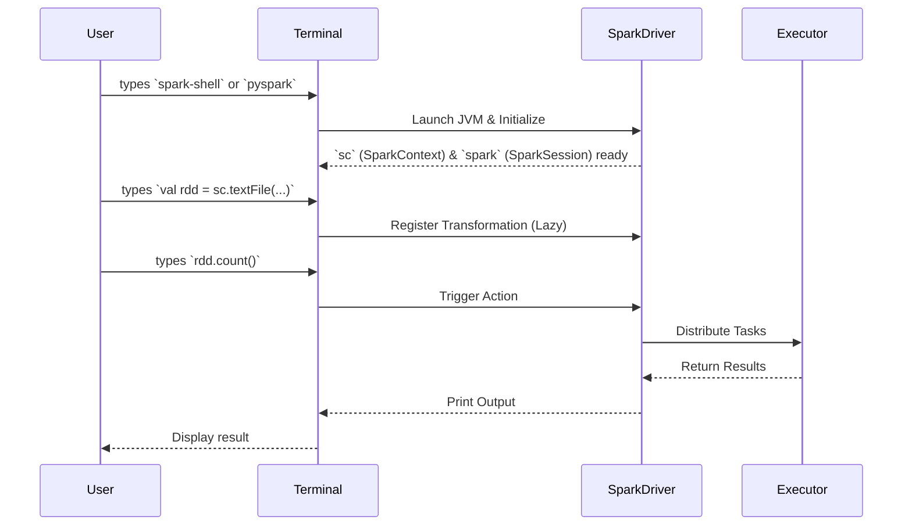

# The Spark Shell

**An interactive REPL environment for rapidly prototyping Spark code and exploring data.**

## Why It Matters
When working with Big Data, compiling and deploying an entire application just to test a single data transformation or check the schema of a CSV file is painfully slow. The Spark Shell solves this by providing a Read-Eval-Print Loop (REPL). It allows data engineers and scientists to write Spark code and get immediate feedback. This instant feedback loop is invaluable for learning the API, debugging complex data pipelines step-by-step, and performing ad-hoc data analysis. Without the Spark Shell, the development cycle for Spark applications would be significantly longer and more frustrating.

## How It Works
The Spark Shell comes in two primary flavors: `spark-shell` for Scala and `pyspark` for Python. When you launch either of these from your terminal, Spark does a lot of heavy lifting behind the scenes. It starts a Spark application locally (or connects to a cluster if configured) and automatically instantiates the core entry points to the Spark API.

Historically (in Spark 1.x), the primary entry point was the `SparkContext`, which the shell automatically makes available as the variable `sc`. The `sc` object is your connection to the Spark cluster and is used to create RDDs, accumulators, and broadcast variables. In modern Spark (2.x and later), the unified entry point is the `SparkSession`, provided in the shell as the variable `spark`. The `spark` object encompasses the `SparkContext` and adds capabilities for working with DataFrames and Spark SQL.

Once the shell is running, you can type any valid Scala or Python code. When you press Enter, the shell evaluates the code. If it's a Spark Transformation, Spark simply adds it to the DAG (Directed Acyclic Graph) of execution. If it's a Spark Action (like `count()` or `show()`), Spark compiles the DAG into physical execution stages, distributes tasks to executors, and returns the result to your terminal. 

Basic navigation in the shell involves using the Tab key for auto-completion (a massive time-saver for discovering available methods on RDDs or DataFrames) and understanding that you are operating within a real, JVM-backed distributed engine, even if it's just running on your laptop.

## Flow Diagram


## Data Visualization
| Shell Command | Action | Internal State Change | Output to User |
| :--- | :--- | :--- | :--- |
| `spark-shell` | Launch REPL | JVM starts, `sc` created | Spark ASCII Art, version info |
| `sc.parallelize(1 to 5)` | Transformation | RDD lineage created | `ParallelCollectionRDD[1]` |
| `.map(_ * 2)` | Transformation | DAG updated with Map step | `MapPartitionsRDD[2]` |
| `.collect()` | Action | Tasks run on executors | `Array(2, 4, 6, 8, 10)` |

## Code Example
```scala
// Scala Spark Shell Example
// Note: 'sc' is already provided by the shell

// 1. Create an RDD from an in-memory list
val textFile = sc.parallelize(Seq(
  "hello spark",
  "hello world",
  "spark is awesome"
))

// 2. Perform a word count (classic Big Data hello world)
val counts = textFile
  // Split each line into words
  .flatMap(line => line.split(" "))
  // Map each word to a (word, 1) tuple
  .map(word => (word, 1))
  // Aggregate the counts by key (the word)
  .reduceByKey(_ + _)

// 3. Trigger computation and print results to the console
counts.collect().foreach(println)

// Expected Output:
// (hello,2)
// (spark,2)
// (world,1)
// (awesome,1)
```

## Common Pitfalls
*   **Forgetting it's a single driver:** The shell runs the driver program on your local machine. If you `collect()` a multi-gigabyte dataset, you will crash the shell with an OutOfMemoryError.
*   **Variable scoping issues:** In the Scala shell, pasting large blocks of code can sometimes lead to weird compilation errors due to how the REPL wraps expressions. Use `:paste` mode.
*   **Ignoring the Web UI:** The shell spins up a Spark Web UI (usually on `http://localhost:4040`). Beginners often forget to look at it, missing out on crucial execution details.
*   **Production reliance:** The shell is for prototyping. Never build production pipelines by piping scripts into `spark-shell`.

## Key Takeaway
The Spark Shell is your interactive sandbox for Big Data, providing immediate access to the Spark runtime (`sc` and `spark`) without the overhead of building and deploying applications.

<br><br><br><br><br><br><br><br><br><br><br><br><br><br><br><br><br><br><br><br>
<br><br><br><br><br><br><br><br><br><br><br><br><br><br><br><br><br><br><br><br>
<br><br><br><br><br><br><br><br><br><br><br><br><br><br><br><br><br><br><br><br>
<br><br><br><br><br><br><br><br><br><br><br><br><br><br><br><br><br><br><br><br>
<br><br><br><br><br><br><br><br><br><br><br><br><br><br><br><br><br><br><br><br>
<br><br><br><br><br><br><br><br><br><br><br><br><br><br><br><br><br><br><br><br>
<br><br><br><br><br><br><br><br><br><br><br><br><br><br><br><br><br><br><br><br>
<br><br><br><br><br><br><br><br><br><br><br><br><br><br><br><br><br><br><br><br>
<br><br><br><br><br><br><br><br><br><br><br><br><br><br><br><br><br><br><br><br>
<br><br><br><br><br><br><br><br><br><br><br><br><br><br><br><br><br><br><br><br>
