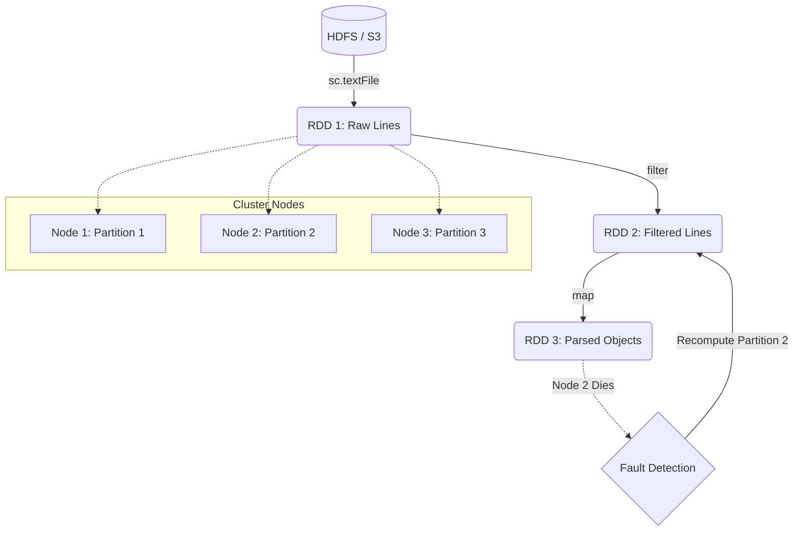

# Resilient Distributed Datasets (RDDs)

**The fundamental, fault-tolerant data abstraction in Apache Spark representing a distributed collection of objects.**

## Why It Matters
Before RDDs, the Hadoop MapReduce framework was the standard for Big Data. However, MapReduce forced developers to write data to physical disk between every single step of a job, making iterative algorithms (like machine learning) painfully slow. RDDs changed the game by allowing data to be cached and processed in-memory across a cluster, resulting in up to 100x speedups. Understanding RDDs is essential because, even if you use higher-level APIs like DataFrames or Spark SQL, those APIs compile down to RDD operations under the hood. To truly debug and optimize Spark, you must understand the RDD.

## How It Works
An RDD is defined by five core properties:
1. **Distributed**: Data is chunked into *partitions* that are scattered across different nodes in the cluster.
2. **Immutable**: Once created, an RDD cannot be changed. You can only create new RDDs by transforming existing ones.
3. **Fault-Tolerant**: Spark tracks the *lineage* (the sequence of transformations) that built an RDD. If a node crashes and a partition is lost, Spark simply looks at the lineage graph and recomputes just that missing partition from the original source. It does not need to replicate data.
4. **Lazily Evaluated**: Operations on RDDs don't execute immediately. Spark waits until an Action is called before it executes the transformations, allowing it to optimize the execution plan.
5. **Typed**: In Scala and Java, RDDs hold objects of a specific type (e.g., `RDD[String]`, `RDD[Person]`).

When you create an RDD (e.g., via `sc.textFile()` or `sc.parallelize()`), Spark divides the data into partitions. A partition is the atomic unit of parallelism in Spark. If you have 100 partitions, Spark can run 100 concurrent tasks to process that data. 

The lineage graph is what makes RDDs "Resilient." Instead of relying on HDFS-style data replication (where every block is stored 3 times over the network), an RDD remembers how it was built. If an executor dies, the Spark Driver detects the failure, identifies which partitions were on that executor, and assigns new tasks to other executors to re-run the lineage graph specifically for those missing partitions.

## Flow Diagram


## Data Visualization
| Action | Lineage / Graph | In-Memory Data State |
| :--- | :--- | :--- |
| `sc.textFile("data.txt")` | `HadoopRDD` | *Empty (Lazy)* |
| `.map(_.toLowerCase)` | `MapPartitionsRDD` -> `HadoopRDD` | *Empty (Lazy)* |
| `.filter(_.contains("error"))` | `MapPartitionsRDD` -> `MapPartitionsRDD` -> `HadoopRDD` | *Empty (Lazy)* |
| `.count()` | Trigger Execution | Partitions are loaded, mapped, filtered, and counted in RAM. |

## Code Example
```python
# PySpark Example demonstrating RDD creation and Lineage
# Assuming 'sc' (SparkContext) is available

# 1. Create an RDD from an external data source
# This creates a HadoopRDD pointing to the file.
logs_rdd = sc.textFile("hdfs://cluster/logs/server.log")

# 2. Transformations build the Lineage Graph
error_logs = logs_rdd.filter(lambda line: "ERROR" in line)
error_messages = error_logs.map(lambda line: line.split(":", 1)[1])

# Inspecting the lineage (returns a string representation of the DAG)
print(error_messages.toDebugString().decode('utf-8'))
# Output will show a MapPartitionsRDD dependent on another MapPartitionsRDD dependent on a HadoopRDD

# 3. Action triggers execution
# Only now is the file actually read, filtered, and mapped.
num_errors = error_messages.count()
print(f"Total Errors: {num_errors}")
```

## Common Pitfalls
*   **Too few partitions:** If you read a massive file but only have 2 partitions, only 2 CPU cores can work on it, leaving the rest of the cluster idle.
*   **Too many partitions:** Millions of tiny partitions cause massive task-scheduling overhead in the Spark Driver, choking the system.
*   **Assuming immutability means slow:** People think creating new RDDs for every step is expensive. It's not; transformations just create logical pointers (lineage), not full data copies in memory.
*   **Caching unnecessarily:** Caching an RDD that is very cheap to recompute can sometimes waste memory and cause garbage collection issues.

## Key Takeaway
RDDs are the bedrock of Spark, providing a distributed, immutable, and fault-tolerant collection that recovers from failures by replaying lineage rather than replicating data.

<br><br><br><br><br><br><br><br><br><br><br><br><br><br><br><br><br><br><br><br>
<br><br><br><br><br><br><br><br><br><br><br><br><br><br><br><br><br><br><br><br>
<br><br><br><br><br><br><br><br><br><br><br><br><br><br><br><br><br><br><br><br>
<br><br><br><br><br><br><br><br><br><br><br><br><br><br><br><br><br><br><br><br>
<br><br><br><br><br><br><br><br><br><br><br><br><br><br><br><br><br><br><br><br>
<br><br><br><br><br><br><br><br><br><br><br><br><br><br><br><br><br><br><br><br>
<br><br><br><br><br><br><br><br><br><br><br><br><br><br><br><br><br><br><br><br>
<br><br><br><br><br><br><br><br><br><br><br><br><br><br><br><br><br><br><br><br>
<br><br><br><br><br><br><br><br><br><br><br><br><br><br><br><br><br><br><br><br>
<br><br><br><br><br><br><br><br><br><br><br><br><br><br><br><br><br><br><br><br>


---

## 🎓 Deep Learning Questions

### Q1: Why Was This Concept Introduced?
Before RDDs, the Hadoop MapReduce framework was the standard for Big Data processing. MapReduce forced developers to write intermediate data to physical disks (HDFS) between every single execution step (Map -> Write -> Reduce -> Write). This caused massive I/O bottlenecks, making iterative algorithms (like machine learning, graph processing) and interactive data mining painfully slow. RDDs (Resilient Distributed Datasets) were introduced to solve this disk I/O bottleneck by enabling **in-memory** data sharing. By keeping data in RAM across iterations and recomputing lost partitions using lineage (instead of replicating data on disk), Spark achieved up to 100x speedups over Hadoop. RDDs overcome the limitations of rigid, disk-bound MapReduce by offering a flexible, lazy, and memory-first abstraction.

### Q2: What Exactly Is This Concept and How Does It Work?
An RDD is a read-only, partitioned collection of records distributed across a cluster. It works by breaking down a large dataset into smaller chunks called **partitions**, which are distributed to worker nodes (Executors).
When you apply a transformation (like `map` or `filter`), Spark does not execute it immediately (Lazy Evaluation). Instead, it builds a **Lineage Graph** (a Directed Acyclic Graph or DAG of operations) tracking how to compute the data. 
Once an action (like `count` or `collect`) is called, Spark's DAG Scheduler optimizes the graph, groups operations into **stages**, and dispatches **tasks** to executors. Because RDDs are immutable, any transformation creates a new RDD. If an executor crashes, Spark uses the lineage to recompute the lost partitions automatically, ensuring fault tolerance without data replication.

### Q3: Where Should This Concept Be Used?
While modern Spark development favors DataFrames/Datasets for most use cases due to Catalyst Optimizer benefits, RDDs are still used in specific scenarios:
*   **Unstructured Data Processing**: When dealing with raw text, media files, or legacy logs lacking a defined schema.
*   **Low-Level Control**: When you need absolute control over physical data placement (custom partitioning) to optimize network traffic.
*   **Complex Custom Logic**: When applying complex, non-SQL functional programming operations (e.g., heavily nested loops or custom state tracking) that don't map well to DataFrame functions.
*   **Legacy Codebases**: Many production systems at companies like Yahoo or early adopters still run RDD-based pipelines.

### Q4: Where Should This Concept NOT Be Used?
*   **Structured/Semi-Structured Data**: Avoid RDDs for CSV, JSON, Parquet, or database tables. Use DataFrames/Datasets, which benefit from the Catalyst Optimizer and Tungsten execution engine (yielding 10x-100x better performance).
*   **Standard ETL Pipelines**: Simple aggregations, joins, and filtering are much slower in RDDs because Spark cannot inspect the contents of RDD objects (they are opaque Python/Java objects) to optimize the query plan.
*   **Memory-Constrained Environments**: Python RDDs suffer from massive serialization overhead (Py4J). DataFrames serialize data efficiently off-heap, while RDDs store full Python objects in memory, leading to out-of-memory errors and slow garbage collection.

### Q5: How Is This Concept Different from Hadoop?
| Aspect | Hadoop MapReduce | Apache Spark (RDDs) |
| :--- | :--- | :--- |
| **Architecture** | Disk-based (writes intermediate data to HDFS). | Memory-based (keeps data in RAM when possible). |
| **Performance** | Slow for iterative/interactive processing. | Up to 100x faster for iterative jobs due to memory cache. |
| **Processing Model** | Rigid Map -> Reduce steps. | Flexible DAG of transformations (map, filter, reduce, join). |
| **Memory Usage** | Very low (constantly flushes to disk). | High (requires substantial RAM for caching). |
| **Fault Tolerance** | Data replication (HDFS). | Lineage graph (recomputes lost data). |
| **Scalability** | Extremely high (petabytes on cheap disks). | High, but memory constraints apply. |
| **Ease of Development** | Verbose Java code. | Concise functional API (Scala, Python, Java). |
| **Typical Use Cases** | Batch processing, ETL. | Machine learning, interactive querying, streaming. |
| **Advantages** | Can process data larger than cluster RAM easily. | Speed, rich API, iterative processing. |
| **Disadvantages** | High disk I/O, slow execution. | Out-of-Memory (OOM) errors if not tuned properly. |

### Q6: How Can This Concept Be Related to a Traditional RDBMS?
| SQL Concept | Spark RDD Equivalent | Explanation |
| :--- | :--- | :--- |
| **Table** | `RDD` | A distributed collection of rows/objects. |
| **Row** | `Element` | A single item in the RDD (e.g., a tuple or custom object). |
| **SELECT / WHERE** | `filter()` / `map()` | Transformations to extract or filter data. |
| **GROUP BY** | `groupByKey()` / `reduceByKey()` | Aggregating data based on a key. |
| **JOIN** | `join()` | Joining two Pair RDDs on a common key. |
| **Execution Plan** | Lineage Graph (DAG) | The logical steps required to compute the final result. |

### Q7: What Happens Behind the Scenes?
1. **Driver**: The central coordinator translates your code into a Lineage Graph.
2. **DAG Scheduler**: Splits the graph into **Stages** based on shuffle boundaries (e.g., a `reduceByKey` triggers a shuffle, ending one stage and starting another).
3. **Task Scheduler**: Breaks stages into **Tasks**. One task corresponds to one **Partition** of the RDD.
4. **Executors**: Worker nodes receive tasks and execute them on their partitions.
5. **Shuffle**: If data needs to be grouped across partitions, executors exchange data over the network.
6. **Memory**: Results are stored in memory (if cached) or written to disk.

```text
Driver Program
      | (Creates Lineage)
      v
DAG Scheduler (Splits into Stages)
      |
      +---> Stage 1 (Map, Filter) ---> Tasks
      |
      +---> [SHUFFLE NETWORK]
      |
      +---> Stage 2 (Reduce) ---> Tasks
                 |
         Executors (Worker Nodes)
         [Task 1 on Partition 1]
         [Task 2 on Partition 2]
```

### Q8: Performance Considerations, Best Practices, and Common Mistakes
| Category | Recommendation | Why It Matters |
| :--- | :--- | :--- |
| **Optimization** | Prefer `reduceByKey()` over `groupByKey()`. | `reduceByKey()` combines data locally on each partition *before* shuffling, drastically reducing network I/O. `groupByKey()` shuffles all data. |
| **Best Practice** | Use `persist()` or `cache()` for reused RDDs. | Prevents Spark from recomputing the entire lineage graph every time an action is called on the same RDD. |
| **Common Mistake** | Using `collect()` on a massive RDD. | `collect()` brings all data back to the Driver node's memory. If the data is larger than the Driver's RAM, it will crash with an OutOfMemoryError. |
| **Tuning** | Choose the right number of partitions. | Too few partitions lead to underutilized CPUs. Too many partitions lead to task scheduling overhead. Rule of thumb: 2-3 tasks per CPU core. |
| **Serialization** | Use Kryo serialization (Java/Scala). | Java's default serialization is slow and bulky. Kryo is up to 10x faster and uses less memory. |

### Q9: Interview Questions

**Beginner**
1. **What does RDD stand for, and what are its key properties?**
   *Answer*: Resilient Distributed Dataset. It is distributed, immutable, fault-tolerant (via lineage), lazily evaluated, and strongly typed.
2. **What is the difference between a Transformation and an Action?**
   *Answer*: Transformations (e.g., map, filter) are lazy and create a new RDD. Actions (e.g., count, collect) trigger the actual execution of the DAG and return results to the Driver or write to storage.
3. **How does Spark achieve fault tolerance?**
   *Answer*: Through the Lineage Graph. Instead of replicating data, Spark remembers the sequence of transformations. If a partition is lost, it recomputes it from the source.

**Intermediate**
4. **Why is `groupByKey` considered slower than `reduceByKey`?**
   *Answer*: `groupByKey` sends all values for a key across the network during the shuffle phase. `reduceByKey` performs local aggregation (map-side combine) before shuffling, minimizing network data transfer.
5. **What is a Partition in Spark?**
   *Answer*: A logical chunk of the RDD stored on a single node. It is the atomic unit of concurrency; one partition = one task = one core used during execution.
6. **What is Lazy Evaluation, and why is it beneficial?**
   *Answer*: Spark waits until an action is called to execute transformations. This allows the DAG optimizer to look at the entire query, fuse operations together, and minimize disk/network I/O.

**Advanced**
7. **How does Spark handle dependencies between RDDs?**
   *Answer*: Through Narrow and Wide dependencies. Narrow dependencies (e.g., map) mean each parent partition is used by at most one child partition (no shuffle). Wide dependencies (e.g., join, groupByKey) require shuffling data across partitions.
8. **What happens if a worker node crashes during a shuffle?**
   *Answer*: The Driver detects the failure and marks the tasks running on that node as failed. It then re-schedules the tasks to compute the lost partitions using the lineage graph.
9. **Why are DataFrames preferred over RDDs in modern Spark?**
   *Answer*: DataFrames use the Catalyst Optimizer to automatically generate highly efficient physical execution plans. They also use the Tungsten engine for off-heap memory management and code generation, bypassing JVM/Python serialization overhead.

**Scenario-Based**
10. **Your Spark job is crashing with an OutOfMemory (OOM) error on the Driver. What is the likely cause?**
    *Answer*: You are likely calling `collect()` on a very large RDD, pulling all distributed data into the single Driver JVM, exceeding its memory limit. Use `take(n)` or save results to distributed storage instead.
11. **You have an RDD with 2 partitions running on a 100-core cluster. Why is it slow, and how do you fix it?**
    *Answer*: Only 2 cores are active; 98 are idle. You need to repartition the RDD using `rdd.repartition(300)` (assuming 3 tasks per core) to increase parallelism.

### Q10: Complete Real-World Example

**Business Problem:** Log Analysis for a Tech Company (e.g., Uber). We need to analyze massive unstructured web server logs to find IP addresses that are repeatedly encountering "500 Internal Server Error" responses, potentially indicating a cyber attack or localized outage.

**Sample Dataset (`server_logs.txt`):**
```text
192.168.1.10 - [10/Oct/2023] "GET /api/v1/users" 200
10.0.0.5 - [10/Oct/2023] "POST /api/v1/payments" 500
192.168.1.11 - [10/Oct/2023] "GET /api/v1/status" 200
10.0.0.5 - [10/Oct/2023] "POST /api/v1/payments" 500
```

**Full Working PySpark Code:**
```python
from pyspark import SparkContext, SparkConf

# Initialize SparkContext
conf = SparkConf().setAppName("LogAnalyzer").setMaster("local[*]")
sc = SparkContext(conf=conf)

# 1. Load data (Lazy Transformation)
logs_rdd = sc.textFile("server_logs.txt")

# 2. Filter for 500 errors (Lazy Transformation)
errors_rdd = logs_rdd.filter(lambda line: " 500" in line)

# 3. Extract IP addresses (Lazy Transformation)
# Split line by space and take the first element (IP)
# Map to (IP, 1) tuple for counting
ips_rdd = errors_rdd.map(lambda line: (line.split(" ")[0], 1))

# 4. Aggregate counts by IP (Lazy Transformation - triggers shuffle)
# reduceByKey is used instead of groupByKey for performance
error_counts = ips_rdd.reduceByKey(lambda a, b: a + b)

# 5. Sort IPs by error count descending (Lazy Transformation)
sorted_errors = error_counts.sortBy(lambda x: x[1], ascending=False)

# 6. Action! Trigger execution and collect top 10 offenders
top_offenders = sorted_errors.take(10)

print("Top IPs with 500 Errors:")
for ip, count in top_offenders:
    print(f"IP: {ip} | Error Count: {count}")

# Stop Spark context
sc.stop()
```

**Step-by-Step Execution Walkthrough:**
1. **DAG Creation**: Spark registers `textFile -> filter -> map -> reduceByKey -> sortBy`.
2. **Action Triggered**: `take(10)` tells Spark to start computing.
3. **Stage 1 (Map-Side)**: Executors read chunks of the text file, filter out non-500 lines, extract the IP, and emit `(IP, 1)`. They also partially sum these counts locally.
4. **Shuffle**: Data is partitioned by IP address and sent across the network.
5. **Stage 2 (Reduce-Side)**: Executors receive the partially summed `(IP, count)` pairs and combine them into a final total for each IP.
6. **Stage 3 (Sort & Return)**: The results are sorted across partitions, and the top 10 are sent back to the Driver.

**Expected Output:**
```text
Top IPs with 500 Errors:
IP: 10.0.0.5 | Error Count: 2
```

**Performance Notes:**
*   Using `reduceByKey` ensures that the sum `a + b` happens locally on each node before network transmission.
*   If this log file is read multiple times for different metrics, caching `logs_rdd.cache()` would prevent reloading from disk.

### 💡 Key Takeaways
- RDDs are the foundation of Spark, providing distributed, fault-tolerant memory abstraction.
- Lineage Graphs ensure fault tolerance by recording transformations, eliminating the need for slow disk replication.
- Lazy Evaluation optimizes execution by deferring computation until an Action is called.
- Data processing in Spark consists of Transformations (lazy) and Actions (eager).
- Partitions dictate the level of parallelism; more partitions = more concurrent tasks.
- While RDDs are powerful, modern Spark applications predominantly use DataFrames for better optimization.

### ⚠️ Common Misconceptions
- **Myth**: RDDs are completely obsolete. **Fact**: They still run under the hood of DataFrames and are essential for unstructured data or complex custom functional programming.
- **Myth**: Immutability causes memory bloat. **Fact**: Lineage pointers are tiny. Spark optimizes memory heavily and relies on garbage collection.
- **Myth**: `groupByKey` and `reduceByKey` are identical. **Fact**: `reduceByKey` is significantly faster due to map-side local aggregations before shuffling.
- **Myth**: Spark is 100% in-memory. **Fact**: Spark spills to disk during massive shuffles or when memory limits are exceeded.

### 🔗 Related Spark Concepts
- Lineage Graph (DAG)
- Transformations and Actions
- Spark Partitions
- Shuffle Architecture
- DataFrames & Datasets (The modern API)

### 📚 References for Further Reading
- Apache Spark Official Documentation
- Learning Spark (O'Reilly)
- Spark: The Definitive Guide (O'Reilly)
