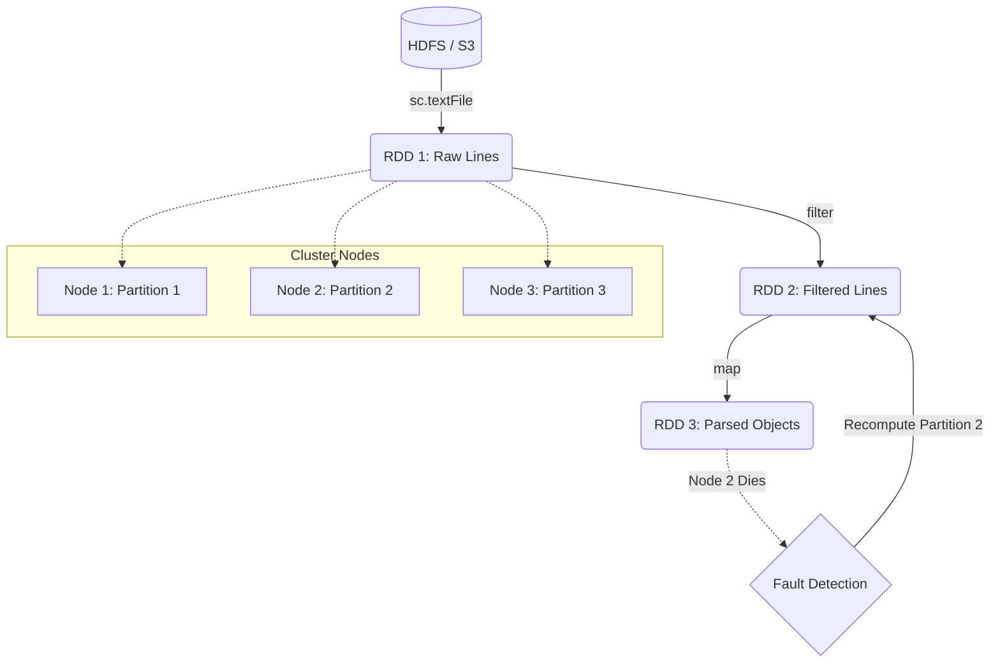

# Resilient Distributed Datasets (RDDs)

**The fundamental, fault-tolerant data abstraction in Apache Spark representing a distributed collection of objects.**

## Why It Matters
Before RDDs, the Hadoop MapReduce framework was the standard for Big Data. However, MapReduce forced developers to write data to physical disk between every single step of a job, making iterative algorithms (like machine learning) painfully slow. RDDs changed the game by allowing data to be cached and processed in-memory across a cluster, resulting in up to 100x speedups. Understanding RDDs is essential because, even if you use higher-level APIs like DataFrames or Spark SQL, those APIs compile down to RDD operations under the hood. To truly debug and optimize Spark, you must understand the RDD.

## How It Works
An RDD is defined by five core properties:
1. **Distributed**: Data is chunked into *partitions* that are scattered across different nodes in the cluster.
2. **Immutable**: Once created, an RDD cannot be changed. You can only create new RDDs by transforming existing ones.
3. **Fault-Tolerant**: Spark tracks the *lineage* (the sequence of transformations) that built an RDD. If a node crashes and a partition is lost, Spark simply looks at the lineage graph and recomputes just that missing partition from the original source. It does not need to replicate data.
4. **Lazily Evaluated**: Operations on RDDs don't execute immediately. Spark waits until an Action is called before it executes the transformations, allowing it to optimize the execution plan.
5. **Typed**: In Scala and Java, RDDs hold objects of a specific type (e.g., `RDD[String]`, `RDD[Person]`).

When you create an RDD (e.g., via `sc.textFile()` or `sc.parallelize()`), Spark divides the data into partitions. A partition is the atomic unit of parallelism in Spark. If you have 100 partitions, Spark can run 100 concurrent tasks to process that data. 

The lineage graph is what makes RDDs "Resilient." Instead of relying on HDFS-style data replication (where every block is stored 3 times over the network), an RDD remembers how it was built. If an executor dies, the Spark Driver detects the failure, identifies which partitions were on that executor, and assigns new tasks to other executors to re-run the lineage graph specifically for those missing partitions.

## Flow Diagram


## Data Visualization
| Action | Lineage / Graph | In-Memory Data State |
| :--- | :--- | :--- |
| `sc.textFile("data.txt")` | `HadoopRDD` | *Empty (Lazy)* |
| `.map(_.toLowerCase)` | `MapPartitionsRDD` -> `HadoopRDD` | *Empty (Lazy)* |
| `.filter(_.contains("error"))` | `MapPartitionsRDD` -> `MapPartitionsRDD` -> `HadoopRDD` | *Empty (Lazy)* |
| `.count()` | Trigger Execution | Partitions are loaded, mapped, filtered, and counted in RAM. |

## Code Example
```python
# PySpark Example demonstrating RDD creation and Lineage
# Assuming 'sc' (SparkContext) is available

# 1. Create an RDD from an external data source
# This creates a HadoopRDD pointing to the file.
logs_rdd = sc.textFile("hdfs://cluster/logs/server.log")

# 2. Transformations build the Lineage Graph
error_logs = logs_rdd.filter(lambda line: "ERROR" in line)
error_messages = error_logs.map(lambda line: line.split(":", 1)[1])

# Inspecting the lineage (returns a string representation of the DAG)
print(error_messages.toDebugString().decode('utf-8'))
# Output will show a MapPartitionsRDD dependent on another MapPartitionsRDD dependent on a HadoopRDD

# 3. Action triggers execution
# Only now is the file actually read, filtered, and mapped.
num_errors = error_messages.count()
print(f"Total Errors: {num_errors}")
```

## Common Pitfalls
*   **Too few partitions:** If you read a massive file but only have 2 partitions, only 2 CPU cores can work on it, leaving the rest of the cluster idle.
*   **Too many partitions:** Millions of tiny partitions cause massive task-scheduling overhead in the Spark Driver, choking the system.
*   **Assuming immutability means slow:** People think creating new RDDs for every step is expensive. It's not; transformations just create logical pointers (lineage), not full data copies in memory.
*   **Caching unnecessarily:** Caching an RDD that is very cheap to recompute can sometimes waste memory and cause garbage collection issues.

## Key Takeaway
RDDs are the bedrock of Spark, providing a distributed, immutable, and fault-tolerant collection that recovers from failures by replaying lineage rather than replicating data.

<br><br><br><br><br><br><br><br><br><br><br><br><br><br><br><br><br><br><br><br>
<br><br><br><br><br><br><br><br><br><br><br><br><br><br><br><br><br><br><br><br>
<br><br><br><br><br><br><br><br><br><br><br><br><br><br><br><br><br><br><br><br>
<br><br><br><br><br><br><br><br><br><br><br><br><br><br><br><br><br><br><br><br>
<br><br><br><br><br><br><br><br><br><br><br><br><br><br><br><br><br><br><br><br>
<br><br><br><br><br><br><br><br><br><br><br><br><br><br><br><br><br><br><br><br>
<br><br><br><br><br><br><br><br><br><br><br><br><br><br><br><br><br><br><br><br>
<br><br><br><br><br><br><br><br><br><br><br><br><br><br><br><br><br><br><br><br>
<br><br><br><br><br><br><br><br><br><br><br><br><br><br><br><br><br><br><br><br>
<br><br><br><br><br><br><br><br><br><br><br><br><br><br><br><br><br><br><br><br>
