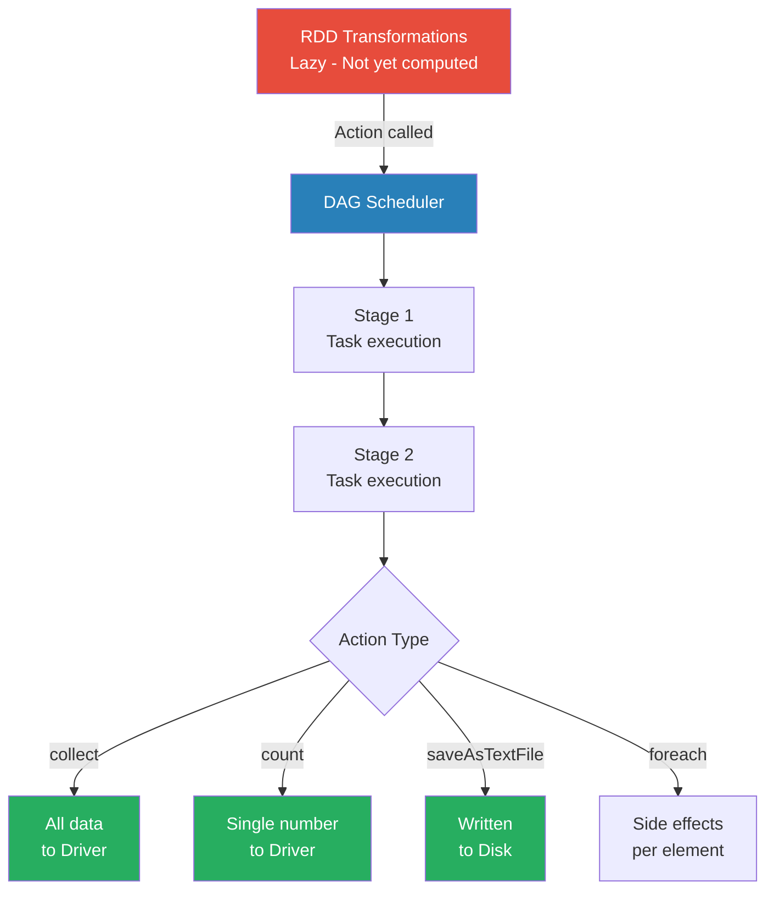

# Actions

**The operations that trigger Spark to execute the DAG of transformations and return results to the driver or storage.**

## Why It Matters
Because Spark evaluates code lazily, you could write a hundred lines of complex data transformations, run the script, and it would finish in milliseconds. Why? Because without an Action, Spark hasn't actually touched the data yet. Actions are the "ignition switch" for your Spark jobs. They are necessary to materialize the results of your hard work. Understanding actions is critical because calling them inappropriately can lead to massive performance bottlenecks or catastrophic OutOfMemory (OOM) errors on your Spark Driver.

## How It Works
When you call an Action on an RDD, Spark's Catalyst optimizer and DAG Scheduler kick in. Spark looks backward from the Action, traces the lineage of transformations all the way back to the source data, and constructs a physical execution plan. It breaks this plan into Stages and Tasks, then distributes those tasks to the worker nodes (executors). 

Actions generally do one of two things:
1.  **Return data to the Driver program:** Actions like `collect()`, `count()`, `first()`, `take(n)`, `reduce()`, and `countByValue()` gather results from all executors and send them back to the central driver node. 
2.  **Write data to external storage:** Actions like `saveAsTextFile()`, `saveAsSequenceFile()`, or saving to a database write the partitioned data directly from the executors to the storage layer (like HDFS or S3).

It is crucial to understand the implications of returning data to the driver. The driver node has a finite amount of RAM. If you call `collect()` on a 50GB RDD, Spark will attempt to serialize all 50GB, send it over the network, and load it into the driver's memory, causing the driver to crash instantly. Therefore, actions like `take(n)` (which only evaluates enough partitions to get `n` elements) or writing to distributed storage are preferred for large datasets.

## Flow Diagram


## Data Visualization
| Action Method | What it Returns | Safe for Massive Data? | Use Case |
| :--- | :--- | :--- | :--- |
| `collect()` | Array of all elements | ❌ NO (Will crash Driver) | Testing small datasets or final aggregated results. |
| `count()` | Long (Integer count) | ✅ YES | Finding the total number of records. |
| `take(n)` | Array of `n` elements | ✅ YES | Peeking at a sample of the data. |
| `first()` | Single element | ✅ YES | Equivalent to `take(1)`. |
| `reduce(func)` | Single element (aggregated) | ✅ YES | Summing numbers or concatenating strings. |
| `saveAsTextFile()` | Unit (Writes to disk) | ✅ YES | Saving the final output pipeline to HDFS/S3. |
| `countByValue()` | Map(Element -> Count) | ⚠️ Depends (Map fits in Driver?) | Frequency counts of unique items. |

## Code Example
```scala
// Scala Spark Example demonstrating various actions
val numbers = sc.parallelize(1 to 100000)

// TRANSFORMATION (Lazy - nothing happens yet)
val evens = numbers.filter(_ % 2 == 0)

// ACTION 1: count() returns a Long to the driver
val totalEvens = evens.count() 
println(s"Total even numbers: $totalEvens") // Output: 50000

// ACTION 2: take() returns an Array to the driver
val firstFiveEvens = evens.take(5)
println(s"First 5 evens: ${firstFiveEvens.mkString(", ")}") // Output: 2, 4, 6, 8, 10

// ACTION 3: reduce() aggregates data across workers, then returns to driver
val sumOfEvens = evens.reduce((a, b) => a + b)
println(s"Sum: $sumOfEvens") 

// ACTION 4: saveAsTextFile writes directly from workers to storage
// The driver only coordinates; it doesn't hold the data.
evens.saveAsTextFile("/tmp/output/even_numbers")
```

## Common Pitfalls
*   **The `collect()` trap:** Calling `collect()` on a massive dataset. This is the #1 cause of driver OOM errors for beginners. Always use `take()` to inspect data.
*   **Multiple Actions = Multiple Executions:** Calling `count()` and then `saveAsTextFile()` on the same RDD will run the entire lineage graph from scratch *twice*. If you need to do this, use `rdd.cache()` before the actions.
*   **Side-effects in `foreach()`:** Using `foreach()` to append to a local list on the driver. `foreach()` runs on the executors, so the local list on the driver will remain empty. You must use Accumulators for this.

## Key Takeaway
Actions are the triggers that compile the lazy lineage graph into physical execution, either returning summaries to the driver or writing massive results to storage.

<br><br><br><br><br><br><br><br><br><br><br><br><br><br><br><br><br><br><br><br>
<br><br><br><br><br><br><br><br><br><br><br><br><br><br><br><br><br><br><br><br>
<br><br><br><br><br><br><br><br><br><br><br><br><br><br><br><br><br><br><br><br>
<br><br><br><br><br><br><br><br><br><br><br><br><br><br><br><br><br><br><br><br>
<br><br><br><br><br><br><br><br><br><br><br><br><br><br><br><br><br><br><br><br>
<br><br><br><br><br><br><br><br><br><br><br><br><br><br><br><br><br><br><br><br>
<br><br><br><br><br><br><br><br><br><br><br><br><br><br><br><br><br><br><br><br>
<br><br><br><br><br><br><br><br><br><br><br><br><br><br><br><br><br><br><br><br>
<br><br><br><br><br><br><br><br><br><br><br><br><br><br><br><br><br><br><br><br>
<br><br><br><br><br><br><br><br><br><br><br><br><br><br><br><br><br><br><br><br>


---

## 🎓 Deep Learning Questions

### Q1: Why Was This Concept Introduced?
Before Spark, distributed computing relied heavily on Hadoop MapReduce, which forced intermediate data to be written to disk after every step. Spark introduced the concept of **lazy evaluation** paired with **actions** to optimize how data is processed in memory. The core problem was that writing to disk is incredibly slow. By separating operations into *transformations* (building a logical plan) and *actions* (executing the plan), Spark can wait until the last possible moment to actually process the data. This delay allows the Catalyst Optimizer to combine multiple transformations into a single stage, avoiding unnecessary data shuffling and minimizing memory overhead. Actions were introduced as the explicit trigger mechanism to tell the engine, "The query plan is complete; now execute it and return the final output."

### Q2: What Exactly Is This Concept and How Does It Work?
An action is an operation that forces Spark to execute the logical Directed Acyclic Graph (DAG) built by transformations and yield a definitive result. When you invoke an action, the DAG Scheduler translates the logical plan into a physical execution plan. This physical plan is divided into stages and tasks, which are distributed across executor nodes in the cluster. 

The executors perform the heavy lifting, processing data partitions in parallel. Depending on the action used, the results take one of two paths: they are either aggregated and sent back to the master **Driver** node (e.g., `count()`, `collect()`), or they are written out to distributed storage (e.g., `saveAsTextFile()`). Because actions are the only operations that initiate actual computation, a Spark script without a single action will instantly complete without processing a single byte of data.

### Q3: Where Should This Concept Be Used?
Actions are mandatory in any Spark job—without them, no work happens. They are used in all distributed data processing scenarios:
- **Data Engineering (Netflix/Uber):** After transforming, cleaning, and joining raw telemetry or user logs, actions like `saveAsParquetFile()` or `write.format("delta").save()` are used to dump the clean data into a data lake for downstream analytics.
- **Data Science/Analytics (Retail/Banking):** When exploring transaction data, scientists use actions like `take(10)` or `show()` to preview a handful of rows to verify data schema and content. 
- **Reporting:** Generating a summary metric, such as total daily revenue, uses `count()` or `reduce()` to return a single aggregate number to the driver, which is then passed to a BI dashboard.

### Q4: Where Should This Concept NOT Be Used?
Certain actions, most notably `collect()`, should **never** be used on massive production datasets. `collect()` attempts to serialize the entire RDD or DataFrame from all executor nodes and send it to the driver node's limited memory. This causes massive network bottlenecks and inevitably crashes the driver with an `OutOfMemoryError`. 

Additionally, you should avoid repeatedly calling actions on the same dataset without caching it first. Because actions trigger re-evaluation of the entire lineage graph from the source, calling `count()` followed by `saveAsTextFile()` on the same uncached RDD will process the data twice, doubling your compute costs and time.

### Q5: How Is This Concept Different from Hadoop?
| Aspect | Hadoop MapReduce | Apache Spark |
| :--- | :--- | :--- |
| **Architecture** | Map -> Reduce -> Write to Disk | Lazy DAG evaluation triggered by an Action |
| **Performance** | Slower, frequent disk I/O | Faster, optimizes transformations in memory before Action |
| **Processing Model** | Execution begins immediately upon job submission | Execution is delayed until an Action is explicitly called |
| **Memory Usage** | High disk footprint | Primarily memory-bound, relies on RAM |
| **Fault Tolerance** | Replicates data on disk | Recomputes missing partitions using the lineage graph triggered by the Action |
| **Scalability** | Scales well but high latency | Scales well with low latency |
| **Ease of Development** | Verbose Java code | Concise API (Python, Scala, SQL, R) |
| **Typical Use Cases** | Batch processing | Batch, Streaming, Machine Learning |
| **Advantages** | Very stable for massive batch jobs | Highly optimized, fast execution plans |
| **Disadvantages** | Rigid execution model | Misusing actions can crash the driver (OOM) |

### Q6: How Can This Concept Be Related to a Traditional RDBMS?
| SQL Concept | Spark Action Equivalent | Explanation |
| :--- | :--- | :--- |
| `SELECT * FROM table` | `collect()` | Retrieves the entire dataset (dangerous on large data). |
| `SELECT COUNT(*) FROM table` | `count()` | Returns the total number of records. |
| `SELECT * FROM table LIMIT 10` | `take(10)` / `show(10)` | Fetches a small sample of the data. |
| `INSERT INTO table SELECT ...` | `write.save()` / `saveAsTextFile()` | Writes processed data into storage. |
| `SUM(column)` | `reduce()` | Aggregates data into a single summary value. |

### Q7: What Happens Behind the Scenes?
When an action is called, Spark transitions from building a logical plan to executing a physical plan.
1. **Action Called:** The driver receives the action request (e.g., `count()`).
2. **DAG Creation:** Spark traces the lineage of transformations and builds a Directed Acyclic Graph (DAG).
3. **DAG Scheduler:** The DAG is split into **Stages** based on shuffle boundaries.
4. **Task Scheduler:** Stages are divided into individual **Tasks** based on data partitions.
5. **Execution:** Executors process tasks in parallel across the cluster.
6. **Result Gathering:** The executors either write results to disk or send their computed partial results back to the driver, which merges them to yield the final output.

```text
[Driver] --> action (e.g., count)
   |
   v
[DAG Scheduler] --> splits into Stages
   |
   v
[Task Scheduler] --> splits into Tasks
   |
   v
[Executors] --> process Tasks (Partitions)
   |
   v
[Driver or Storage] <--- final output
```

### Q8: Performance Considerations, Best Practices, and Common Mistakes
| Category | Recommendation | Why It Matters |
| :--- | :--- | :--- |
| **Performance** | Avoid calling multiple actions on uncached data. | Each action triggers full lineage execution; caching saves compute time. |
| **Best Practice** | Use `take()` or `show()` instead of `collect()` for debugging. | `take()` only processes enough partitions to fulfill the request, saving time and memory. |
| **Common Mistake** | Using `collect()` on large datasets. | Will cause an `OutOfMemoryError` crashing the Driver node. |
| **Optimization** | Be mindful of `countByValue()` on datasets with high cardinality. | Returns a Map to the driver; if there are millions of unique keys, the driver will run out of memory. |
| **Production Tip** | Monitor the Spark UI when an action runs. | The UI only populates execution details (Stages/Tasks) after an action is triggered, crucial for spotting bottlenecks. |

### Q9: Interview Questions

**Beginner:**
1. **What is an action in Spark?** An operation that triggers the execution of the DAG and returns a result to the driver or writes to storage.
2. **Name three common Spark actions.** `collect()`, `count()`, and `saveAsTextFile()`.
3. **Why does Spark wait for an action to execute code?** To allow the Catalyst Optimizer to optimize the entire query plan (lazy evaluation) before processing data.

**Intermediate:**
1. **What happens if you run a Spark script with 100 transformations but no actions?** The script will run instantly, and absolutely no data will be processed.
2. **What is the difference between `take(10)` and `collect()`?** `take(10)` fetches only the first 10 elements (usually from a single partition), while `collect()` fetches the entire dataset to the driver.
3. **How does an action relate to a Spark job?** Every time an action is called, Spark submits a new Job to the cluster.

**Advanced:**
1. **Explain the execution flow when `reduce()` is called.** Executors calculate a local reduction on their partitions, send the partial results to the driver, and the driver performs the final reduction to yield a single value.
2. **Why might `countByValue()` cause an OOM error on the driver?** It returns a Map of every unique element and its count to the driver; if the data has billions of unique keys, the map exceeds driver memory.
3. **How does caching affect the execution of multiple actions?** Caching stores the intermediate data in memory, so subsequent actions read from the cache instead of recomputing the entire DAG from the source.

**Scenario-Based:**
1. **Your driver node keeps crashing with an OutOfMemoryError at the end of a job. What's the likely culprit?** A rogue `collect()` statement, or an aggregation action like `countByValue()` returning massive maps.
2. **You notice your query takes 30 minutes to run `count()`, and then another 30 minutes to `saveAsTextFile()`. How do you fix this?** Use `.cache()` or `.persist()` on the final DataFrame before calling `count()`, so the subsequent save action reuses the cached data.

### Q10: Complete Real-World Example
**Business Problem (Uber):** Uber needs to calculate the total number of rides completed in a day and save the cleaned dataset of rides for downstream machine learning models.

**Sample Dataset:** A CSV of ride events with columns: `ride_id`, `status` (completed, cancelled), `distance`.

**PySpark Code:**
```python
from pyspark.sql import SparkSession

# Initialize Spark Session
spark = SparkSession.builder.appName("UberRideAnalysis").getOrCreate()

# Load raw data (Transformation - lazy)
raw_rides = spark.read.csv("s3://uber-data/raw_rides.csv", header=True, inferSchema=True)

# Filter for completed rides (Transformation - lazy)
completed_rides = raw_rides.filter(raw_rides.status == 'completed')

# Cache the dataset to avoid recomputation when calling multiple actions
completed_rides.cache()

# ACTION 1: count() triggers execution and returns a Long to the driver
total_completed = completed_rides.count()
print(f"Total completed rides today: {total_completed}")

# ACTION 2: show(5) triggers execution (reading from cache) to preview data
print("Preview of completed rides:")
completed_rides.show(5)

# ACTION 3: write.parquet() saves the data to distributed storage
completed_rides.write.mode("overwrite").parquet("s3://uber-data/processed/completed_rides/")

spark.stop()
```

**Step-by-step execution walkthrough:**
1. Spark initializes and registers the transformations (`read`, `filter`). No data is moved yet.
2. The `count()` action is called. The DAG Scheduler kicks in, reads the CSV, filters rows, caches the result in executor memory, and sends the integer count back to the driver.
3. The `show(5)` action is called. Spark retrieves 5 rows directly from the cached memory partitions, avoiding disk read.
4. The `write.parquet()` action is called. Executors write the cached data partitions directly to S3.

**Expected output:**
```
Total completed rides today: 154320
Preview of completed rides:
+-------+---------+--------+
|ride_id|   status|distance|
+-------+---------+--------+
|   1001|completed|     5.2|
|   1003|completed|    12.4|
...
```

**Performance Notes:** By caching `completed_rides` before triggering actions, we prevented Spark from reading and filtering the raw S3 file three separate times, vastly improving performance.

### 💡 Key Takeaways
- Actions are the required "triggers" that execute Spark's lazy transformations.
- They either return data to the driver (`count`, `collect`) or write to storage (`saveAsTextFile`).
- Every action triggers the DAG scheduler to build an execution plan and submit a Spark Job.
- Calling `collect()` on large datasets is dangerous and causes Driver OOM crashes.
- If multiple actions are called on the same dataset, use `.cache()` to avoid redundant computations.

### ⚠️ Common Misconceptions
- **"Transformations process data faster than actions."** Transformations don't process data at all; they just build the logical plan. Only actions process data.
- **"I can use `collect()` if my cluster has lots of RAM."** `collect()` brings all data to the *single driver node*. Cluster RAM is distributed across executors; driver RAM is highly limited.
- **"An action modifies the original RDD."** RDDs are immutable. Actions return new results (integers, arrays) or write data out, but they never change the source dataset.

### 🔗 Related Spark Concepts
- Transformations (map, filter, flatMap)
- Lazy Evaluation
- DAG (Directed Acyclic Graph)
- RDD (Resilient Distributed Dataset)
- Caching and Persistence

### 📚 References for Further Reading
- Apache Spark Official Documentation: RDD Operations
- Learning Spark (O'Reilly) - Chapter 3: RDDs
- Spark: The Definitive Guide (O'Reilly) - Chapter 2: A Gentle Introduction to Spark
