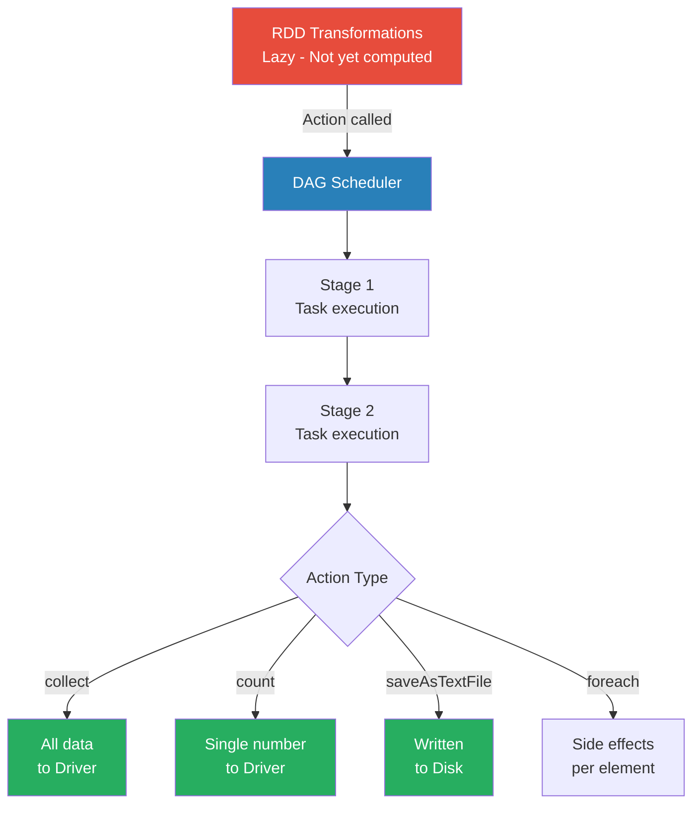

# Actions

**The operations that trigger Spark to execute the DAG of transformations and return results to the driver or storage.**

## Why It Matters
Because Spark evaluates code lazily, you could write a hundred lines of complex data transformations, run the script, and it would finish in milliseconds. Why? Because without an Action, Spark hasn't actually touched the data yet. Actions are the "ignition switch" for your Spark jobs. They are necessary to materialize the results of your hard work. Understanding actions is critical because calling them inappropriately can lead to massive performance bottlenecks or catastrophic OutOfMemory (OOM) errors on your Spark Driver.

## How It Works
When you call an Action on an RDD, Spark's Catalyst optimizer and DAG Scheduler kick in. Spark looks backward from the Action, traces the lineage of transformations all the way back to the source data, and constructs a physical execution plan. It breaks this plan into Stages and Tasks, then distributes those tasks to the worker nodes (executors). 

Actions generally do one of two things:
1.  **Return data to the Driver program:** Actions like `collect()`, `count()`, `first()`, `take(n)`, `reduce()`, and `countByValue()` gather results from all executors and send them back to the central driver node. 
2.  **Write data to external storage:** Actions like `saveAsTextFile()`, `saveAsSequenceFile()`, or saving to a database write the partitioned data directly from the executors to the storage layer (like HDFS or S3).

It is crucial to understand the implications of returning data to the driver. The driver node has a finite amount of RAM. If you call `collect()` on a 50GB RDD, Spark will attempt to serialize all 50GB, send it over the network, and load it into the driver's memory, causing the driver to crash instantly. Therefore, actions like `take(n)` (which only evaluates enough partitions to get `n` elements) or writing to distributed storage are preferred for large datasets.

## Flow Diagram


## Data Visualization
| Action Method | What it Returns | Safe for Massive Data? | Use Case |
| :--- | :--- | :--- | :--- |
| `collect()` | Array of all elements | ❌ NO (Will crash Driver) | Testing small datasets or final aggregated results. |
| `count()` | Long (Integer count) | ✅ YES | Finding the total number of records. |
| `take(n)` | Array of `n` elements | ✅ YES | Peeking at a sample of the data. |
| `first()` | Single element | ✅ YES | Equivalent to `take(1)`. |
| `reduce(func)` | Single element (aggregated) | ✅ YES | Summing numbers or concatenating strings. |
| `saveAsTextFile()` | Unit (Writes to disk) | ✅ YES | Saving the final output pipeline to HDFS/S3. |
| `countByValue()` | Map(Element -> Count) | ⚠️ Depends (Map fits in Driver?) | Frequency counts of unique items. |

## Code Example
```scala
// Scala Spark Example demonstrating various actions
val numbers = sc.parallelize(1 to 100000)

// TRANSFORMATION (Lazy - nothing happens yet)
val evens = numbers.filter(_ % 2 == 0)

// ACTION 1: count() returns a Long to the driver
val totalEvens = evens.count() 
println(s"Total even numbers: $totalEvens") // Output: 50000

// ACTION 2: take() returns an Array to the driver
val firstFiveEvens = evens.take(5)
println(s"First 5 evens: ${firstFiveEvens.mkString(", ")}") // Output: 2, 4, 6, 8, 10

// ACTION 3: reduce() aggregates data across workers, then returns to driver
val sumOfEvens = evens.reduce((a, b) => a + b)
println(s"Sum: $sumOfEvens") 

// ACTION 4: saveAsTextFile writes directly from workers to storage
// The driver only coordinates; it doesn't hold the data.
evens.saveAsTextFile("/tmp/output/even_numbers")
```

## Common Pitfalls
*   **The `collect()` trap:** Calling `collect()` on a massive dataset. This is the #1 cause of driver OOM errors for beginners. Always use `take()` to inspect data.
*   **Multiple Actions = Multiple Executions:** Calling `count()` and then `saveAsTextFile()` on the same RDD will run the entire lineage graph from scratch *twice*. If you need to do this, use `rdd.cache()` before the actions.
*   **Side-effects in `foreach()`:** Using `foreach()` to append to a local list on the driver. `foreach()` runs on the executors, so the local list on the driver will remain empty. You must use Accumulators for this.

## Key Takeaway
Actions are the triggers that compile the lazy lineage graph into physical execution, either returning summaries to the driver or writing massive results to storage.

<br><br><br><br><br><br><br><br><br><br><br><br><br><br><br><br><br><br><br><br>
<br><br><br><br><br><br><br><br><br><br><br><br><br><br><br><br><br><br><br><br>
<br><br><br><br><br><br><br><br><br><br><br><br><br><br><br><br><br><br><br><br>
<br><br><br><br><br><br><br><br><br><br><br><br><br><br><br><br><br><br><br><br>
<br><br><br><br><br><br><br><br><br><br><br><br><br><br><br><br><br><br><br><br>
<br><br><br><br><br><br><br><br><br><br><br><br><br><br><br><br><br><br><br><br>
<br><br><br><br><br><br><br><br><br><br><br><br><br><br><br><br><br><br><br><br>
<br><br><br><br><br><br><br><br><br><br><br><br><br><br><br><br><br><br><br><br>
<br><br><br><br><br><br><br><br><br><br><br><br><br><br><br><br><br><br><br><br>
<br><br><br><br><br><br><br><br><br><br><br><br><br><br><br><br><br><br><br><br>
