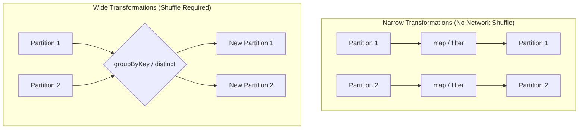

# Transformations

**Lazy operations that create a new RDD from an existing one, building the execution plan without processing data immediately.**

## Why It Matters
Transformations are how you express your business logic in Spark. Whether you are cleaning bad records, parsing JSON, joining datasets, or running statistical algorithms, you do it via transformations. Because they are lazy, Spark can look at all your transformations as a single holistic pipeline and optimize it under the hood. For example, if you map a dataset and then immediately filter it, Spark's engine can fuse these steps together so the data is only read from memory once. Understanding the difference between narrow and wide transformations is the secret to mastering Spark performance.

## How It Works
When you apply a transformation (like `map` or `filter`) to an RDD, Spark does not compute the result right away. Instead, it creates a new RDD object that contains a pointer to the parent RDD and the function to apply. This chain of dependencies forms the Lineage Graph.

Transformations are strictly categorized into two types based on how data moves across the cluster:

1.  **Narrow Transformations:** These are operations where each partition of the parent RDD is used by at most one partition of the child RDD. Examples include `map`, `filter`, and `flatMap`. These are very fast because they require no data movement across the network. A single executor can process a partition entirely in its own memory.
2.  **Wide Transformations (Shuffles):** These occur when data from multiple input partitions must be combined to compute the result. Examples include `distinct`, `groupByKey`, `reduceByKey`, and `intersection`. To perform a wide transformation, Spark must execute a **Shuffle**—writing data to disk and transferring it across the network to different executors based on a key. Shuffles are the most expensive operations in Spark.

Let's look at common transformations:
*   `map(func)`: Passes each element through a function, returning a new RDD of the same size.
*   `flatMap(func)`: Similar to map, but each input can return 0 or more output elements (flattens the result).
*   `filter(func)`: Keeps only elements where the function returns true.
*   `distinct()`: Removes duplicates (Wide transformation!).
*   `sample()`: Returns a random sample of the data.
*   `union(otherRDD)`: Appends two RDDs together.

## Flow Diagram


## Data Visualization
| Input Data | Transformation | Output Data | Type |
| :--- | :--- | :--- | :--- |
| `[1, 2, 3]` | `rdd.map(x => x * 2)` | `[2, 4, 6]` | Narrow |
| `["hello world", "hi"]` | `rdd.flatMap(x => x.split(" "))`| `["hello", "world", "hi"]` | Narrow |
| `[1, 2, 3, 4]` | `rdd.filter(x => x % 2 == 0)` | `[2, 4]` | Narrow |
| `[1, 2, 2, 3]` | `rdd.distinct()` | `[1, 2, 3]` | Wide |
| `[1, 2]` & `[3, 4]` | `rdd1.union(rdd2)` | `[1, 2, 3, 4]` | Narrow |
| `[1, 2]` & `[2, 3]` | `rdd1.intersection(rdd2)` | `[2]` | Wide |

## Code Example
```python
# PySpark Example demonstrating Transformations
# sc is the SparkContext

data = ["apple,red", "banana,yellow", "cherry,red", "apple,red"]
rdd = sc.parallelize(data)

# 1. map (Narrow): Split strings into lists
# Input: ["apple,red"] -> Output: [["apple", "red"]]
parsed_rdd = rdd.map(lambda line: line.split(","))

# 2. filter (Narrow): Keep only red fruit
red_fruits = parsed_rdd.filter(lambda arr: arr[1] == "red")

# 3. map (Narrow): Extract just the fruit name
fruit_names = red_fruits.map(lambda arr: arr[0])

# 4. distinct (Wide - causes a Shuffle): Remove duplicates
unique_red_fruits = fruit_names.distinct()

# ACTION: Trigger computation
print(unique_red_fruits.collect())
# Output: ['apple', 'cherry']
```

## Common Pitfalls
*   **Unintended Shuffles:** Calling `distinct()` or `groupByKey()` casually on massive datasets. This triggers a shuffle, writing gigabytes to disk and thrashing the network.
*   **Not understanding flatMap vs Map:** Using `map` when reading lines of text and splitting them will result in an RDD of Arrays (`RDD[Array[String]]`), whereas `flatMap` gives you an RDD of Strings (`RDD[String]`).
*   **Overusing Union:** Calling `union` in a large loop can create extremely deep lineage graphs that cause StackOverflowErrors during execution.
*   **Assuming lazy means free:** Just because it evaluates instantly doesn't mean it's good code. A terrible transformation pipeline will eventually blow up when the Action is called.

## Key Takeaway
Transformations define your data pipeline lazily; always strive to maximize Narrow transformations and minimize Wide transformations (shuffles) for optimal performance.

<br><br><br><br><br><br><br><br><br><br><br><br><br><br><br><br><br><br><br><br>
<br><br><br><br><br><br><br><br><br><br><br><br><br><br><br><br><br><br><br><br>
<br><br><br><br><br><br><br><br><br><br><br><br><br><br><br><br><br><br><br><br>
<br><br><br><br><br><br><br><br><br><br><br><br><br><br><br><br><br><br><br><br>
<br><br><br><br><br><br><br><br><br><br><br><br><br><br><br><br><br><br><br><br>
<br><br><br><br><br><br><br><br><br><br><br><br><br><br><br><br><br><br><br><br>
<br><br><br><br><br><br><br><br><br><br><br><br><br><br><br><br><br><br><br><br>
<br><br><br><br><br><br><br><br><br><br><br><br><br><br><br><br><br><br><br><br>
<br><br><br><br><br><br><br><br><br><br><br><br><br><br><br><br><br><br><br><br>
<br><br><br><br><br><br><br><br><br><br><br><br><br><br><br><br><br><br><br><br>


---

## 🎓 Deep Learning Questions

### Q1: Why Was This Concept Introduced?
Before Apache Spark, the dominant big data processing paradigm was Hadoop MapReduce. In MapReduce, every processing step required writing intermediate data to disk to ensure fault tolerance. This made iterative algorithms (like machine learning) and interactive data exploration incredibly slow. Spark introduced "Transformations" built on Resilient Distributed Datasets (RDDs) and DataFrames to solve this. Instead of executing operations immediately and persisting data to disk, transformations are lazy—they only build a logical execution plan (lineage). This enables Spark to keep data in-memory between steps and optimize the entire pipeline (e.g., fusing multiple `map` and `filter` operations) before executing, drastically improving performance.

### Q2: What Exactly Is This Concept and How Does It Work?
A transformation is an operation in Spark that takes an existing distributed collection (like an RDD or DataFrame) and returns a new one without mutating the original (due to immutability). Because they are "lazy," applying a transformation does not actually compute the data. Instead, it records the operation in a Directed Acyclic Graph (DAG) called a lineage. 

Transformations are divided into two types:
- **Narrow Transformations:** Each input partition contributes to only one output partition (e.g., `map`, `filter`). They are fast because no data moves across the network.
- **Wide Transformations:** Data from multiple input partitions must be combined to compute the output (e.g., `groupByKey`, `distinct`, `join`). These require a "shuffle," which means writing data to disk and transferring it across the cluster network.

### Q3: Where Should This Concept Be Used?
Transformations are used anytime you need to manipulate, clean, or analyze data in a Spark application. 
- **Data Engineering / ETL:** Companies like Netflix use `filter` and `map` to clean raw telemetry data, drop nulls, and parse JSON payloads. 
- **Feature Engineering:** Uber uses wide transformations like `groupBy` and `join` to calculate aggregate metrics (e.g., average trips per driver) to train machine learning models.
- **Data Analytics:** Retail companies use transformations to join sales data with inventory databases to understand stock levels.

### Q4: Where Should This Concept NOT Be Used?
- **Anti-pattern: Unnecessary Wide Transformations:** Never use a wide transformation like `groupByKey` if a narrow one (or a more optimized wide one like `reduceByKey`) will suffice, as the network shuffle will bottleneck performance.
- **Anti-pattern: Overusing User-Defined Functions (UDFs):** While you can use `map` with custom Python/Scala code, you should avoid it in modern DataFrames. Spark's Catalyst Optimizer cannot inspect custom code, losing built-in optimizations.
- **Anti-pattern: Massive loops of `union`:** Calling `union` in a loop dynamically builds a massive lineage DAG, which can cause driver memory issues and stack overflow errors.

### Q5: How Is This Concept Different from Hadoop?
| Aspect | Hadoop MapReduce | Apache Spark |
| :--- | :--- | :--- |
| **Architecture** | Eager execution; maps and reduces happen in strict phases. | Lazy execution; builds a logical DAG of transformations first. |
| **Performance** | Slow. Writes intermediate data to disk between every Map and Reduce phase. | Fast. Fuses transformations and keeps data in-memory across steps. |
| **Processing Model** | Restricted strictly to Map and Reduce steps. | Rich API (`filter`, `flatMap`, `sample`, `distinct`, etc.). |
| **Memory Usage** | Heavy disk I/O, low memory usage. | High memory usage, caching intermediate results in RAM. |
| **Fault Tolerance** | Achieved through HDFS replication of intermediate data. | Achieved through Lineage (recomputing lost partitions from the source). |

### Q6: How Can This Concept Be Related to a Traditional RDBMS?
| Spark Transformation | SQL Equivalent | Purpose |
| :--- | :--- | :--- |
| `filter()` | `WHERE` / `HAVING` | Retain only rows meeting a specific condition. |
| `map()` / `select()` | `SELECT col1, func(col2)` | Transform individual rows or extract specific columns. |
| `distinct()` | `DISTINCT` | Remove duplicate rows (causes a shuffle in Spark). |
| `union()` | `UNION ALL` | Append datasets together. |
| `groupByKey()` / `groupBy()`| `GROUP BY` | Aggregate data based on key columns. |

### Q7: What Happens Behind the Scenes?
1. **Driver:** When you call a transformation (like `map`), the Spark Driver simply registers it in the DAG and updates the lineage graph. No data is processed.
2. **Action Trigger:** When an action (like `collect` or `write`) is called, the Catalyst Optimizer (for DataFrames) evaluates the DAG.
3. **Stage Boundary:** The DAG Scheduler divides the logical plan into "Stages". A stage boundary is drawn every time a Wide Transformation (Shuffle) is encountered.
4. **Pipelining:** Within a single stage, all Narrow Transformations are "pipelined" together. An executor will read a record, map it, and filter it in a single pass in memory.
5. **Execution:** Tasks are sent to Executors, where they process partitions of data in parallel.

```text
[Partition 1] --> (map + filter pipelined in memory) --> [Shuffle Write]
                                                             |
                                                       (Network Transfer)
                                                             |
[Partition 2] --> (map + filter pipelined in memory) --> [Shuffle Read] --> (reduce/group)
```

### Q8: Performance Considerations, Best Practices, and Common Mistakes
| Category | Recommendation | Why It Matters |
| :--- | :--- | :--- |
| **Performance** | Maximize narrow transformations, minimize wide ones. | Wide transformations require shuffles, which involve heavy network I/O and disk writes. |
| **Optimization** | Filter data as early as possible in your pipeline. | Pushing down filters reduces the amount of data processed in subsequent wide transformations. |
| **Best Practice** | Use DataFrame built-in functions over RDD `map` with UDFs. | Built-in functions run natively in the JVM and are optimized by Catalyst; Python UDFs require expensive serialization. |
| **Mistake** | Using `groupByKey` for aggregation. | `groupByKey` shuffles all data across the network. `reduceByKey` aggregates locally before shuffling, transferring far less data. |

### Q9: Interview Questions
**Beginner:**
1. What is the difference between a transformation and an action? *(Transformations are lazy and build the DAG; actions trigger actual execution.)*
2. Is `filter()` a narrow or wide transformation? *(Narrow, because it processes each partition independently without network shuffles.)*
3. What is a Spark lineage? *(The logical execution plan or DAG of transformations used to track how to compute data and recover from failures.)*

**Intermediate:**
1. Why does `distinct()` cause a shuffle? *(To guarantee uniqueness globally, Spark must compare records across all partitions, requiring data to move across the network by a hash key.)*
2. How does Spark achieve fault tolerance without replicating intermediate data? *(By keeping the lineage DAG. If a partition is lost, Spark re-runs the transformations from the original data source to rebuild just that partition.)*
3. What is pipelining in Spark? *(Fusing multiple narrow transformations like map and filter into a single execution step per partition, avoiding memory/disk overhead.)*

**Advanced:**
1. When might a `join` be a narrow transformation? *(When both datasets are already partitioned identically on the join key (co-partitioned), no shuffle is needed.)*
2. Explain how Catalyst Optimizer handles a `filter` transformation followed by a `map`. *(It might reorder them (Predicate Pushdown) to execute the filter first, minimizing the data passed into the map function.)*
3. How can you debug an overly complex DAG caused by transformations? *(By inspecting the Spark UI's SQL tab, looking at the physical plan, and breaking lineage using `checkpoint()`.)*

**Scenario-Based:**
1. Your Spark job runs out of memory during a transformation pipeline. What do you check? *(Check if a wide transformation is causing data skew, or if an exploding `flatMap` is drastically increasing partition size. Also verify if UDFs are causing serialization overhead.)*
2. You need to process 500GB of JSON logs, parse a date, filter out errors, and count errors by day. How do you design this? *(Read JSON -> Narrow `filter` to keep only errors -> Narrow `map`/`withColumn` to extract the day -> Wide `groupBy` or `reduceByKey` on the day to count.)*

### Q10: Complete Real-World Example
**Business Problem:** 
A retail company wants to analyze raw user clickstream logs from their website. They need to extract the user IDs of people who clicked on "checkout", remove duplicate clicks by the same user, and output a clean list of unique shoppers.

**Sample Dataset:**
```text
user101,homepage
user102,product_page
user101,checkout
user103,checkout
user101,checkout
```

**PySpark Code:**
```python
from pyspark.sql import SparkSession

# Initialize SparkSession
spark = SparkSession.builder.appName("TransformationETL").getOrCreate()

# 1. Load Data (Action-like, but lazy evaluated for DataFrames depending on format)
# Simulating an RDD for core transformation understanding
raw_data = ["user101,homepage", "user102,product_page", "user101,checkout", "user103,checkout", "user101,checkout"]
rdd = spark.sparkContext.parallelize(raw_data)

# 2. map (Narrow Transformation): Split CSV string into a tuple (user_id, action)
parsed_rdd = rdd.map(lambda line: tuple(line.split(",")))

# 3. filter (Narrow Transformation): Keep only 'checkout' actions
checkout_rdd = parsed_rdd.filter(lambda record: record[1] == "checkout")

# 4. map (Narrow Transformation): Extract just the user_id
user_rdd = checkout_rdd.map(lambda record: record[0])

# 5. distinct (Wide Transformation): Remove duplicate users (requires shuffle!)
unique_users_rdd = user_rdd.distinct()

# 6. collect (Action): Trigger the DAG execution
print(unique_users_rdd.collect()) 
# Expected Output: ['user101', 'user103']
```

**Execution Walkthrough:**
1. The driver registers `map`, `filter`, `map`, and `distinct` in the DAG. No data is processed yet.
2. The `collect()` action triggers execution.
3. The DAG is split into two stages. Stage 1 pipelines the first three narrow transformations (`map` -> `filter` -> `map`) in memory across available executors.
4. Stage 1 ends with a shuffle write, partitioning data by `user_id` to ensure duplicates land on the same executor.
5. Stage 2 performs the `distinct` logic on the shuffled data and sends the final result to the driver.

### 💡 Key Takeaways
- Transformations are lazy; they build a logical plan (DAG) and don't execute until an action is called.
- Narrow transformations (`map`, `filter`) are fast and run locally in memory per partition.
- Wide transformations (`groupBy`, `distinct`) require network shuffles and are the primary source of performance bottlenecks.
- Spark's speed comes from its ability to pipeline narrow transformations together without writing to disk.
- Lineage guarantees fault tolerance—lost data can always be recomputed.

### ⚠️ Common Misconceptions
- **"Transformations execute immediately."** False. They only update the DAG.
- **"All transformations are equally expensive."** False. Shuffles (wide transformations) are orders of magnitude slower than narrow ones.
- **"Caching is a transformation."** False. Caching/persisting is an optimization hint, not a transformation of data itself.

### 🔗 Related Spark Concepts
- Spark Actions (the trigger for transformations)
- DAG (Directed Acyclic Graph)
- Shuffling & Partitioning
- Catalyst Optimizer
- Resilient Distributed Datasets (RDDs)

### 📚 References for Further Reading
- Apache Spark Official Documentation
- Learning Spark (O'Reilly)
- Spark: The Definitive Guide (O'Reilly)
