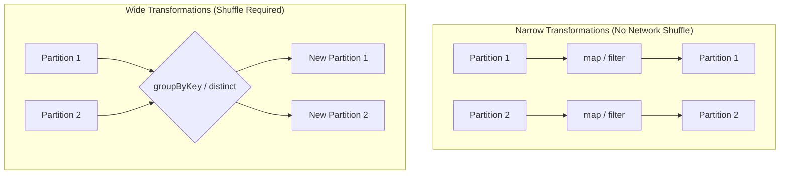

# Transformations

**Lazy operations that create a new RDD from an existing one, building the execution plan without processing data immediately.**

## Why It Matters
Transformations are how you express your business logic in Spark. Whether you are cleaning bad records, parsing JSON, joining datasets, or running statistical algorithms, you do it via transformations. Because they are lazy, Spark can look at all your transformations as a single holistic pipeline and optimize it under the hood. For example, if you map a dataset and then immediately filter it, Spark's engine can fuse these steps together so the data is only read from memory once. Understanding the difference between narrow and wide transformations is the secret to mastering Spark performance.

## How It Works
When you apply a transformation (like `map` or `filter`) to an RDD, Spark does not compute the result right away. Instead, it creates a new RDD object that contains a pointer to the parent RDD and the function to apply. This chain of dependencies forms the Lineage Graph.

Transformations are strictly categorized into two types based on how data moves across the cluster:

1.  **Narrow Transformations:** These are operations where each partition of the parent RDD is used by at most one partition of the child RDD. Examples include `map`, `filter`, and `flatMap`. These are very fast because they require no data movement across the network. A single executor can process a partition entirely in its own memory.
2.  **Wide Transformations (Shuffles):** These occur when data from multiple input partitions must be combined to compute the result. Examples include `distinct`, `groupByKey`, `reduceByKey`, and `intersection`. To perform a wide transformation, Spark must execute a **Shuffle**—writing data to disk and transferring it across the network to different executors based on a key. Shuffles are the most expensive operations in Spark.

Let's look at common transformations:
*   `map(func)`: Passes each element through a function, returning a new RDD of the same size.
*   `flatMap(func)`: Similar to map, but each input can return 0 or more output elements (flattens the result).
*   `filter(func)`: Keeps only elements where the function returns true.
*   `distinct()`: Removes duplicates (Wide transformation!).
*   `sample()`: Returns a random sample of the data.
*   `union(otherRDD)`: Appends two RDDs together.

## Flow Diagram


## Data Visualization
| Input Data | Transformation | Output Data | Type |
| :--- | :--- | :--- | :--- |
| `[1, 2, 3]` | `rdd.map(x => x * 2)` | `[2, 4, 6]` | Narrow |
| `["hello world", "hi"]` | `rdd.flatMap(x => x.split(" "))`| `["hello", "world", "hi"]` | Narrow |
| `[1, 2, 3, 4]` | `rdd.filter(x => x % 2 == 0)` | `[2, 4]` | Narrow |
| `[1, 2, 2, 3]` | `rdd.distinct()` | `[1, 2, 3]` | Wide |
| `[1, 2]` & `[3, 4]` | `rdd1.union(rdd2)` | `[1, 2, 3, 4]` | Narrow |
| `[1, 2]` & `[2, 3]` | `rdd1.intersection(rdd2)` | `[2]` | Wide |

## Code Example
```python
# PySpark Example demonstrating Transformations
# sc is the SparkContext

data = ["apple,red", "banana,yellow", "cherry,red", "apple,red"]
rdd = sc.parallelize(data)

# 1. map (Narrow): Split strings into lists
# Input: ["apple,red"] -> Output: [["apple", "red"]]
parsed_rdd = rdd.map(lambda line: line.split(","))

# 2. filter (Narrow): Keep only red fruit
red_fruits = parsed_rdd.filter(lambda arr: arr[1] == "red")

# 3. map (Narrow): Extract just the fruit name
fruit_names = red_fruits.map(lambda arr: arr[0])

# 4. distinct (Wide - causes a Shuffle): Remove duplicates
unique_red_fruits = fruit_names.distinct()

# ACTION: Trigger computation
print(unique_red_fruits.collect())
# Output: ['apple', 'cherry']
```

## Common Pitfalls
*   **Unintended Shuffles:** Calling `distinct()` or `groupByKey()` casually on massive datasets. This triggers a shuffle, writing gigabytes to disk and thrashing the network.
*   **Not understanding flatMap vs Map:** Using `map` when reading lines of text and splitting them will result in an RDD of Arrays (`RDD[Array[String]]`), whereas `flatMap` gives you an RDD of Strings (`RDD[String]`).
*   **Overusing Union:** Calling `union` in a large loop can create extremely deep lineage graphs that cause StackOverflowErrors during execution.
*   **Assuming lazy means free:** Just because it evaluates instantly doesn't mean it's good code. A terrible transformation pipeline will eventually blow up when the Action is called.

## Key Takeaway
Transformations define your data pipeline lazily; always strive to maximize Narrow transformations and minimize Wide transformations (shuffles) for optimal performance.

<br><br><br><br><br><br><br><br><br><br><br><br><br><br><br><br><br><br><br><br>
<br><br><br><br><br><br><br><br><br><br><br><br><br><br><br><br><br><br><br><br>
<br><br><br><br><br><br><br><br><br><br><br><br><br><br><br><br><br><br><br><br>
<br><br><br><br><br><br><br><br><br><br><br><br><br><br><br><br><br><br><br><br>
<br><br><br><br><br><br><br><br><br><br><br><br><br><br><br><br><br><br><br><br>
<br><br><br><br><br><br><br><br><br><br><br><br><br><br><br><br><br><br><br><br>
<br><br><br><br><br><br><br><br><br><br><br><br><br><br><br><br><br><br><br><br>
<br><br><br><br><br><br><br><br><br><br><br><br><br><br><br><br><br><br><br><br>
<br><br><br><br><br><br><br><br><br><br><br><br><br><br><br><br><br><br><br><br>
<br><br><br><br><br><br><br><br><br><br><br><br><br><br><br><br><br><br><br><br>
