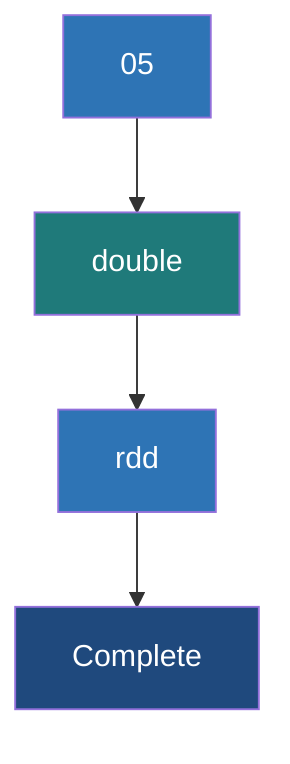

# Double RDD Functions

**A specialized set of statistical and mathematical actions available exclusively on RDDs containing numeric data (Doubles).**

## Why It Matters
When working with data, you frequently need to calculate summary statistics—averages, standard deviations, variances, or data distributions. Writing a custom `reduce` function to calculate standard deviation manually across a distributed cluster is mathematically complex and error-prone. Spark solves this by providing implicit conversions. If your RDD consists solely of numeric values (like `RDD[Double]`), Spark automatically unlocks a suite of specialized functions collectively known as Double RDD functions. This allows data scientists to profile massive datasets with a single line of code.

## How It Works
In Scala, this works via a concept called *implicit conversions*. If you have an `RDD[Double]`, Scala implicitly wraps it in a `DoubleRDDFunctions` class behind the scenes. In Python, these functions are built directly into the base RDD class, but they will throw a runtime error if the underlying data isn't numeric.

These specialized functions are Actions. They trigger execution and compute results across the cluster. The available methods include:
*   `mean()`: Computes the average.
*   `variance()` & `sampleVariance()`: Measures how far the numbers are spread out from the average.
*   `stdev()` & `sampleStdev()`: The standard deviation.
*   `sum()`: Adds all the numbers together.
*   `min()` / `max()`: Finds the extremes.
*   `histogram(buckets)`: Creates a histogram distribution of the data.
*   `stats()`: A highly efficient convenience method that calculates mean, variance, stdev, max, min, and count simultaneously in a single pass over the data.

Using `stats()` is incredibly important for performance. If you were to call `.mean()`, then `.stdev()`, then `.max()`, Spark would execute the entire lineage graph three separate times. `stats()` does it all in one go, returning a `StatCounter` object.

## Flow Diagram


## Data Visualization
| Input RDD[Double] | Function | Result |
| :--- | :--- | :--- |
| `[10.0, 20.0, 30.0]` | `.mean()` | `20.0` |
| `[10.0, 20.0, 30.0]` | `.sum()` | `60.0` |
| `[10.0, 20.0, 30.0]` | `.stdev()` | `8.1649...` |
| `[1.0, 2.0, 5.0, 6.0]` | `.histogram(2)` | `([1.0, 3.5, 6.0], [2, 2])` |
| `[10.0, 20.0, 30.0]` | `.stats()` | `(count: 3, mean: 20.0, stdev: 8.16, max: 30.0, min: 10.0)` |

## Code Example
```scala
// Scala Spark Example demonstrating DoubleRDDFunctions
// Imagine we have a CSV of daily temperatures: "date,temperature"
val weatherData = sc.parallelize(Seq(
  "2023-01-01,72.5",
  "2023-01-02,75.0",
  "2023-01-03,68.2",
  "2023-01-04,70.1",
  "2023-01-05,80.5"
))

// 1. Transform the data into an RDD[Double]
val temperatures = weatherData.map(line => {
  val parts = line.split(",")
  parts(1).toDouble // Extract just the temp as a Double
})

// 2. Compute all statistics in a single pass over the cluster
val summaryStats = temperatures.stats()

println(summaryStats.count) // 5
println(summaryStats.mean)  // 73.26
println(summaryStats.max)   // 80.5
println(summaryStats.min)   // 68.2
println(summaryStats.stdev) // 4.265

// 3. Generate a histogram with 2 buckets
val hist = temperatures.histogram(2)
println(s"Buckets: ${hist._1.mkString(", ")}")
println(s"Counts: ${hist._2.mkString(", ")}")
```

## Common Pitfalls
*   **Data Type Mismatches:** Trying to call `.mean()` on an `RDD[Int]` or `RDD[String]`. In Scala, you must explicitly `.map(_.toDouble)` first.
*   **Multiple Passes:** Calling `.min()`, `.max()`, and `.mean()` sequentially on an uncached RDD. This runs the job three times. Always use `.stats()` to do it in one pass.
*   **Null values:** Spark mathematical functions don't inherently handle nulls gracefully. If your parser results in a `Double.NaN`, it will skew or break your statistics. Always `.filter()` out bad data before running stats.

## Key Takeaway
Double RDD functions unlock powerful, single-pass distributed statistical calculations, provided you properly cast your dataset to an `RDD[Double]`.

<br><br><br><br><br><br><br><br><br><br><br><br><br><br><br><br><br><br><br><br>
<br><br><br><br><br><br><br><br><br><br><br><br><br><br><br><br><br><br><br><br>
<br><br><br><br><br><br><br><br><br><br><br><br><br><br><br><br><br><br><br><br>
<br><br><br><br><br><br><br><br><br><br><br><br><br><br><br><br><br><br><br><br>
<br><br><br><br><br><br><br><br><br><br><br><br><br><br><br><br><br><br><br><br>
<br><br><br><br><br><br><br><br><br><br><br><br><br><br><br><br><br><br><br><br>
<br><br><br><br><br><br><br><br><br><br><br><br><br><br><br><br><br><br><br><br>
<br><br><br><br><br><br><br><br><br><br><br><br><br><br><br><br><br><br><br><br>
<br><br><br><br><br><br><br><br><br><br><br><br><br><br><br><br><br><br><br><br>
<br><br><br><br><br><br><br><br><br><br><br><br><br><br><br><br><br><br><br><br>
<br><br><br><br><br><br><br><br><br><br><br><br><br><br><br><br><br><br><br><br>


---

## 🎓 Deep Learning Questions

### Q1: Why Was This Concept Introduced?
Before Apache Spark, calculating statistical metrics (like variance, standard deviation, and histograms) across a massive distributed dataset using Hadoop MapReduce was a cumbersome and multi-step process. Developers had to write custom reducers, manage state manually, and initiate multiple MapReduce jobs just to get basic statistics. Spark introduced Double RDD Functions (`DoubleRDDFunctions` in Scala) to seamlessly provide highly optimized, built-in mathematical operations. By implicitly converting `RDD[Double]` types, Spark overcomes the limitation of writing verbose boilerplate code, allowing data engineers to extract vital descriptive statistics with a single, highly performant method call.

### Q2: What Exactly Is This Concept and How Does It Work?
Double RDD Functions refer to a specialized suite of actions that are exclusively available on Resilient Distributed Datasets containing numeric floating-point data (`RDD[Double]`). 
Internally, in languages like Scala, this leverages *implicit conversions*. When Spark detects an `RDD[Double]`, it automatically wraps the RDD in a `DoubleRDDFunctions` class. This class exposes methods like `mean()`, `sum()`, `variance()`, `stdev()`, and `histogram()`. A crucial feature is the `stats()` method, which uses a specialized `StatCounter` object under the hood. The `StatCounter` implements an online algorithm (like Welford's algorithm for variance) to compute the count, mean, max, min, and variance in a single, memory-efficient pass over the distributed partitions, later merging the results at the driver.

### Q3: Where Should This Concept Be Used?
Double RDD functions are heavily utilized in Data Profiling, Exploratory Data Analysis (EDA), and Machine Learning preprocessing. 
- **Finance (Banking):** Calculating the rolling variance or standard deviation of stock prices to measure market volatility.
- **IoT & Healthcare:** Analyzing sensor data (e.g., patient heart rates or industrial machine temperatures) to find baseline averages and identify anomalies (max/min thresholds).
- **Retail:** Evaluating customer spending distribution (using `histogram()`) to create pricing tiers. 
Essentially, any production scenario that requires rapid statistical profiling of raw numerical data distributed across a cluster will benefit from these functions.

### Q4: Where Should This Concept NOT Be Used?
This concept should not be used when dealing with complex, multi-column structured data. If you need to compute statistics across multiple columns simultaneously, or perform group-by statistical aggregations, utilizing the DataFrame/Dataset API is significantly better and faster due to the Catalyst Optimizer. Additionally, Double RDD Functions should not be used if the RDD contains non-numeric data, as this will result in serialization or casting errors. Finally, avoid using sequential calls to individual metrics (like `.mean()` followed by `.max()`) on uncached RDDs, as it triggers an anti-pattern of redundant job executions.

### Q5: How Is This Concept Different from Hadoop?
| Aspect | Hadoop MapReduce | Apache Spark (Double RDD) |
| :--- | :--- | :--- |
| **Architecture** | Requires custom Mapper/Reducer classes for stats. | Built-in implicit functions natively available. |
| **Performance** | Slow due to disk I/O between jobs for multiple metrics. | In-memory computation; `stats()` computes everything in 1 pass. |
| **Processing Model** | Batch processing heavily reliant on disk writes. | Lazy evaluation; optimized single-pass action execution. |
| **Memory Usage** | High disk footprint, low memory usage. | Highly efficient memory usage via `StatCounter`. |
| **Fault Tolerance** | Replicates data to HDFS at each step. | RDD lineage graph provides quick recalculation on node failure. |
| **Scalability** | High, but mathematically complex to code for scale. | High, with automatic distributed merging of statistics. |
| **Ease of Development** | Very low (verbose Java code required). | Extremely high (single line `.stats()` call). |
| **Typical Use Cases** | Massive batch processing where speed is secondary. | Fast exploratory data analysis and ML preparation. |
| **Advantages** | Robust for extremely long-running generic tasks. | Rapid, developer-friendly mathematical profiling. |
| **Disadvantages** | No built-in math primitives for distributed arrays. | Requires data to be strictly typed to Doubles. |

### Q6: How Can This Concept Be Related to a Traditional RDBMS?
| SQL Concept | Spark Double RDD Equivalent | Explanation |
| :--- | :--- | :--- |
| `AVG(column)` | `rdd.mean()` | Computes the arithmetic average of the dataset. |
| `SUM(column)` | `rdd.sum()` | Aggregates the total of all numeric values. |
| `STDDEV(column)` | `rdd.stdev()` | Calculates the standard deviation. |
| `MIN(column), MAX(column)` | `rdd.min()`, `rdd.max()` | Finds the lowest and highest values in the dataset. |
| Multiple Aggregations | `rdd.stats()` | Similar to `SELECT COUNT(c), AVG(c), MIN(c), MAX(c) FROM table`. |
| `WIDTH_BUCKET` / `NTILE` | `rdd.histogram(n)` | Groups data into frequency distributions or buckets. |

### Q7: What Happens Behind the Scenes?
When you call `stats()` on an `RDD[Double]`, the execution unfolds seamlessly:
1. **Driver**: Spark translates the `stats()` action into a Spark Job.
2. **DAG & Scheduler**: The DAG Scheduler breaks the job into Stages based on partitions.
3. **Tasks**: Task Scheduler sends tasks to the Executors.
4. **Executors & Partitions**: Each Executor reads its local partition of data. It instantiates a `StatCounter` object. As it iterates over the partition, the `StatCounter` updates its running count, max, min, mean, and variance locally using Welford's algorithm (avoiding numerical instability).
5. **Shuffle/Merge**: The local `StatCounter` from each partition is sent back to the Driver (or merged via a tree-reduce). The Driver calls `merge()` on these counters to combine them into one final global `StatCounter`.
6. **Result**: The final statistics are returned to the user application.

```text
[Driver Program]
       | (Calls .stats() action)
       v
+-----------------------------+
|        DAG Scheduler        |
+-----------------------------+
       | (Creates Tasks)
       v
[Executor 1]       [Executor 2]       [Executor 3]
[Partition 1]      [Partition 2]      [Partition 3]
      |                  |                  |
(StatCounter 1)    (StatCounter 2)    (StatCounter 3)
      \                  |                  /
       \                 |                 /
        \---> [ Tree Reduce / Merge ] <---/
                         |
                         v
             [Global Final StatCounter] -> Returned to User
```

### Q8: Performance Considerations, Best Practices, and Common Mistakes
| Category | Recommendation | Why It Matters |
| :--- | :--- | :--- |
| **Performance Impact** | Always use `stats()` instead of individual metric functions. | Calling `.min()`, `.max()`, and `.mean()` separately forces Spark to evaluate the RDD lineage three times. `stats()` evaluates it once. |
| **Best Practices** | Cache the RDD if multiple distinct mathematical actions are needed. | If you must run `histogram()` and `stats()`, caching prevents re-reading data from the source disk. |
| **Common Mistakes** | Failing to filter out `NaN` or Null values before calculation. | A single `NaN` value will infect the `StatCounter`, making the entire resulting mean/variance `NaN`. |
| **Data Types** | Explicitly cast data using `.map(x => x.toDouble)`. | The implicit conversion only triggers for strictly typed `RDD[Double]`. Integers or Strings will throw errors. |
| **Production Tips** | Be cautious with `histogram(buckets: Array[Double])` on massive skewed data. | Unevenly distributed custom buckets can cause memory spikes if one bucket absorbs 99% of a massive dataset's metadata. |

### Q9: Interview Questions

**Beginner**
1. **What is a Double RDD in Spark?**
   An RDD specifically containing numeric Double values, which automatically gains access to specialized mathematical actions.
2. **How do you calculate the average of an RDD of numbers?**
   Convert it to an `RDD[Double]` and call the `.mean()` action.
3. **What does the `stats()` function return?**
   It returns a `StatCounter` object containing count, mean, stdev, max, min, and variance.

**Intermediate**
1. **Why is calling `stats()` preferred over calling `min()`, `max()`, and `mean()` separately?**
   `stats()` computes all metrics in a single pass over the dataset. Calling them separately triggers three distinct Spark jobs, wasting computation and I/O.
2. **How does Scala enable Double RDD functions on a standard RDD?**
   Through Scala's implicit conversions. An `RDD[Double]` is implicitly converted to a `DoubleRDDFunctions` object.
3. **How does Spark handle the variance calculation internally without causing numerical overflow?**
   It uses Welford's online algorithm within the `StatCounter` object, keeping a running track of the variance per partition and merging them securely.

**Advanced**
1. **If you have a dataset with nulls, how will it affect Double RDD functions and how do you handle it?**
   Nulls or `NaN`s will propagate, turning the final result into `NaN` or throwing NullPointerExceptions. You must use `.filter()` to sanitize the data before statistical evaluation.
2. **Describe the two variations of the `histogram()` function in Spark.**
   One takes an integer `n` (creates `n` evenly spaced buckets), while the other takes an `Array[Double]` (allows the user to define custom bucket boundaries).
3. **Why might `sampleStdev()` be used instead of `stdev()`?**
   `sampleStdev()` applies Bessel's correction (dividing by N-1 instead of N) and is mathematically appropriate when your RDD is a sample of a larger population, rather than the entire population.

**Scenario-Based**
1. **You have an RDD of comma-separated strings representing stock prices. The `.mean()` function throws an error. Why?**
   The RDD is of type `RDD[String]`. You must first map over the RDD and parse the strings into Doubles (e.g., `rdd.map(line => line.split(",")(1).toDouble)`) before the functions become available.
2. **Your Spark job running `.histogram()` is hanging on the reduce phase. What could be the issue?**
   The data might be heavily skewed into a single bucket, or you may have provided an excessively large number of buckets, causing a massive array to be serialized and shipped to the Driver, bottlenecking its memory.

### Q10: Complete Real-World Example

**Business Problem:**
An e-commerce platform like Amazon wants to analyze the distribution of daily product order totals to identify average spending, volatility (standard deviation), and group sales into pricing tiers (histogram) for targeted marketing.

**Sample Dataset:**
A text file (`sales_data.txt`) containing transactions: `TransactionID, OrderTotal`
```text
TXN001, 150.50
TXN002, 25.00
TXN003, 99.99
TXN004, 500.00
TXN005, 12.50
```

**Full Working PySpark Code:**
```python
from pyspark import SparkContext, SparkConf

# Initialize Spark Context
conf = SparkConf().setAppName("OrderAnalytics").setMaster("local[*]")
sc = SparkContext(conf=conf)

# 1. Load the raw text data (RDD[String])
raw_data = sc.parallelize([
    "TXN001,150.50",
    "TXN002,25.00",
    "TXN003,99.99",
    "TXN004,500.00",
    "TXN005,12.50"
])

# 2. Parse the data to extract only the OrderTotal as a float
# This creates the equivalent of an RDD[Double] in PySpark
prices_rdd = raw_data.map(lambda line: float(line.split(",")[1]))

# 3. Use the highly optimized stats() function for a single-pass calculation
summary = prices_rdd.stats()

print("--- Sales Analytics Summary ---")
print(f"Total Transactions: {summary.count()}")
print(f"Average Order: ${summary.mean():.2f}")
print(f"Highest Order: ${summary.max():.2f}")
print(f"Standard Deviation: ${summary.stdev():.2f}")

# 4. Create a histogram with 3 even buckets to see data distribution
# Returns a tuple: (bucket_boundaries, bucket_counts)
hist_buckets, hist_counts = prices_rdd.histogram(3)

print("\n--- Sales Distribution (Histogram) ---")
for i in range(len(hist_counts)):
    print(f"Tier ${hist_buckets[i]:.2f} - ${hist_buckets[i+1]:.2f}: {hist_counts[i]} orders")

# Stop the context
sc.stop()
```

**Step-by-Step Execution Walkthrough:**
1. The driver initializes the SparkContext and distributes the raw strings across available executors.
2. The `map` transformation splits each string by the comma and casts the second element to a `float`.
3. The `stats()` action is triggered. Executors iterate through their data partitions, aggregating count, sum, squares, etc., locally.
4. Executors send their local `StatCounter` objects back to the driver. The driver merges them and returns the final `summary` object.
5. The `histogram(3)` action triggers a second job to evaluate the distribution across 3 evenly spaced buckets based on the min and max values.

**Expected Output:**
```text
--- Sales Analytics Summary ---
Total Transactions: 5
Average Order: $157.60
Highest Order: $500.00
Standard Deviation: $177.89

--- Sales Distribution (Histogram) ---
Tier $12.50 - $175.00: 4 orders
Tier $175.00 - $337.50: 0 orders
Tier $337.50 - $500.00: 1 orders
```

**Performance Notes:**
Because we called an action (`stats`) and then another action (`histogram`), the RDD was evaluated twice. In a massive production scenario, we should call `prices_rdd.cache()` before triggering these actions to keep the parsed doubles in memory and prevent re-parsing the text.

### 💡 Key Takeaways
- Bullet list of 5-7 key insights:
  - Double RDD Functions provide built-in math capabilities strictly for `RDD[Double]` data types.
  - They are accessible implicitly in Scala or natively on Python RDDs containing floats.
  - `stats()` is the most powerful method, fetching count, mean, min, max, and variance in exactly one cluster pass.
  - `histogram()` is highly effective for determining data skew and bucket distribution.
  - Nulls and non-numeric strings must be sanitized before utilizing these functions.

### ⚠️ Common Misconceptions
- Bullet list of 3-5 things people get wrong:
  - **Misconception:** You can call `.mean()` on any numeric type directly. **Reality:** In Scala, the data must strictly be an `RDD[Double]`; integers must be cast first.
  - **Misconception:** Spark caches data automatically when you call multiple metrics like `.min()` and `.max()`. **Reality:** It does not. Calling them sequentially evaluates the entire lineage from disk each time unless explicitly cached.
  - **Misconception:** You need `reduce()` to find the sum or average. **Reality:** Double RDD functions provide highly optimized abstractions so you don't have to write custom reducers for basic math.

### 🔗 Related Spark Concepts
- Bullet list of related topics:
  - Pair RDD Functions (Key-Value aggregations)
  - Spark DataFrame `describe()` and `summary()` functions
  - RDD Caching and Persistence
  - Welford's Algorithm (Online variance computation)
  - Spark Actions vs Transformations

### 📚 References for Further Reading
- Apache Spark Official Documentation
- Learning Spark (O'Reilly)
- Spark: The Definitive Guide (O'Reilly)
