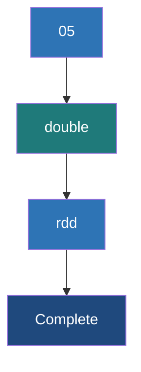

# Double RDD Functions

**A specialized set of statistical and mathematical actions available exclusively on RDDs containing numeric data (Doubles).**

## Why It Matters
When working with data, you frequently need to calculate summary statistics—averages, standard deviations, variances, or data distributions. Writing a custom `reduce` function to calculate standard deviation manually across a distributed cluster is mathematically complex and error-prone. Spark solves this by providing implicit conversions. If your RDD consists solely of numeric values (like `RDD[Double]`), Spark automatically unlocks a suite of specialized functions collectively known as Double RDD functions. This allows data scientists to profile massive datasets with a single line of code.

## How It Works
In Scala, this works via a concept called *implicit conversions*. If you have an `RDD[Double]`, Scala implicitly wraps it in a `DoubleRDDFunctions` class behind the scenes. In Python, these functions are built directly into the base RDD class, but they will throw a runtime error if the underlying data isn't numeric.

These specialized functions are Actions. They trigger execution and compute results across the cluster. The available methods include:
*   `mean()`: Computes the average.
*   `variance()` & `sampleVariance()`: Measures how far the numbers are spread out from the average.
*   `stdev()` & `sampleStdev()`: The standard deviation.
*   `sum()`: Adds all the numbers together.
*   `min()` / `max()`: Finds the extremes.
*   `histogram(buckets)`: Creates a histogram distribution of the data.
*   `stats()`: A highly efficient convenience method that calculates mean, variance, stdev, max, min, and count simultaneously in a single pass over the data.

Using `stats()` is incredibly important for performance. If you were to call `.mean()`, then `.stdev()`, then `.max()`, Spark would execute the entire lineage graph three separate times. `stats()` does it all in one go, returning a `StatCounter` object.

## Flow Diagram


## Data Visualization
| Input RDD[Double] | Function | Result |
| :--- | :--- | :--- |
| `[10.0, 20.0, 30.0]` | `.mean()` | `20.0` |
| `[10.0, 20.0, 30.0]` | `.sum()` | `60.0` |
| `[10.0, 20.0, 30.0]` | `.stdev()` | `8.1649...` |
| `[1.0, 2.0, 5.0, 6.0]` | `.histogram(2)` | `([1.0, 3.5, 6.0], [2, 2])` |
| `[10.0, 20.0, 30.0]` | `.stats()` | `(count: 3, mean: 20.0, stdev: 8.16, max: 30.0, min: 10.0)` |

## Code Example
```scala
// Scala Spark Example demonstrating DoubleRDDFunctions
// Imagine we have a CSV of daily temperatures: "date,temperature"
val weatherData = sc.parallelize(Seq(
  "2023-01-01,72.5",
  "2023-01-02,75.0",
  "2023-01-03,68.2",
  "2023-01-04,70.1",
  "2023-01-05,80.5"
))

// 1. Transform the data into an RDD[Double]
val temperatures = weatherData.map(line => {
  val parts = line.split(",")
  parts(1).toDouble // Extract just the temp as a Double
})

// 2. Compute all statistics in a single pass over the cluster
val summaryStats = temperatures.stats()

println(summaryStats.count) // 5
println(summaryStats.mean)  // 73.26
println(summaryStats.max)   // 80.5
println(summaryStats.min)   // 68.2
println(summaryStats.stdev) // 4.265

// 3. Generate a histogram with 2 buckets
val hist = temperatures.histogram(2)
println(s"Buckets: ${hist._1.mkString(", ")}")
println(s"Counts: ${hist._2.mkString(", ")}")
```

## Common Pitfalls
*   **Data Type Mismatches:** Trying to call `.mean()` on an `RDD[Int]` or `RDD[String]`. In Scala, you must explicitly `.map(_.toDouble)` first.
*   **Multiple Passes:** Calling `.min()`, `.max()`, and `.mean()` sequentially on an uncached RDD. This runs the job three times. Always use `.stats()` to do it in one pass.
*   **Null values:** Spark mathematical functions don't inherently handle nulls gracefully. If your parser results in a `Double.NaN`, it will skew or break your statistics. Always `.filter()` out bad data before running stats.

## Key Takeaway
Double RDD functions unlock powerful, single-pass distributed statistical calculations, provided you properly cast your dataset to an `RDD[Double]`.

<br><br><br><br><br><br><br><br><br><br><br><br><br><br><br><br><br><br><br><br>
<br><br><br><br><br><br><br><br><br><br><br><br><br><br><br><br><br><br><br><br>
<br><br><br><br><br><br><br><br><br><br><br><br><br><br><br><br><br><br><br><br>
<br><br><br><br><br><br><br><br><br><br><br><br><br><br><br><br><br><br><br><br>
<br><br><br><br><br><br><br><br><br><br><br><br><br><br><br><br><br><br><br><br>
<br><br><br><br><br><br><br><br><br><br><br><br><br><br><br><br><br><br><br><br>
<br><br><br><br><br><br><br><br><br><br><br><br><br><br><br><br><br><br><br><br>
<br><br><br><br><br><br><br><br><br><br><br><br><br><br><br><br><br><br><br><br>
<br><br><br><br><br><br><br><br><br><br><br><br><br><br><br><br><br><br><br><br>
<br><br><br><br><br><br><br><br><br><br><br><br><br><br><br><br><br><br><br><br>
