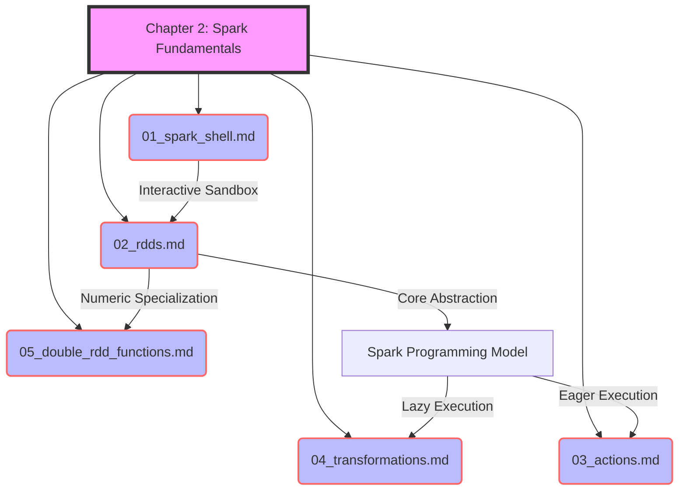

# Chapter 2: Spark Fundamentals Overview

**An introductory overview of the core Apache Spark concepts, laying the foundation for distributed data processing.**

## Why It Matters
Before diving into complex data pipelines, machine learning models, or streaming applications, you must understand how Spark fundamentally thinks about and manages data. In traditional programming, you deal with collections like lists or arrays that reside in a single machine's memory. When data grows to terabytes or petabytes, this paradigm breaks down. Apache Spark introduces a new way of thinking about data—as distributed collections that can be operated on in parallel across hundreds or thousands of machines. 

Understanding these fundamentals is critical because an incorrect mental model of Spark will lead to inefficient code, out-of-memory errors, and slow performance. This chapter introduces the essential building blocks: the interactive Spark Shell for rapid prototyping, Resilient Distributed Datasets (RDDs) for distributed data storage, and the distinction between Transformations (lazy operations) and Actions (eager operations). By mastering these concepts, you will be able to write robust, scalable, and highly optimized Spark applications.

## How It Works
The chapter is structured to progressively build your understanding of Spark's architecture and programming model. It begins with the most accessible entry point: the Spark Shell. This REPL (Read-Eval-Print Loop) environment allows you to interact with a Spark cluster in real-time, executing code line-by-line. It's the perfect sandbox for exploring APIs and testing small snippets of code before packaging them into a full application.

Next, we introduce the Resilient Distributed Dataset (RDD), which is Spark's core abstraction. An RDD represents a read-only, partitioned collection of records that can be operated on in parallel. We'll explore the five core properties of RDDs, including how they achieve fault tolerance through lineage graphs rather than expensive data replication. You'll learn how Spark reconstructs lost partitions automatically when a node fails, ensuring your jobs complete successfully even in unreliable environments.

The core of Spark programming involves manipulating RDDs using two types of operations: Transformations and Actions. Transformations (like `map`, `filter`, and `flatMap`) create a new dataset from an existing one but do not trigger any computation immediately. This is known as lazy evaluation. Spark simply records the lineage of operations. Actions (like `count`, `collect`, and `saveAsTextFile`), on the other hand, return a value to the driver program or write data to external storage, triggering the execution of all preceding transformations in the lineage graph.

Finally, we'll look at specialized RDDs, specifically DoubleRDDs, which provide powerful statistical functions for numerical data. By understanding these concepts in sequence, you'll develop a strong mental model of how Spark works under the hood.

This overview sets the stage for the specific deep-dives in the subsequent files:
1.  **The Spark Shell**: Interactive exploration and the SparkSession.
2.  **Resilient Distributed Datasets (RDDs)**: Distributed, fault-tolerant collections.
3.  **Actions**: Triggering computation and materializing results.
4.  **Transformations**: Building execution plans lazily.
5.  **Double RDD Functions**: Statistical operations on numeric data.

## Flow Diagram


## Data Visualization
| Topic | Concept | Analogy | Key Takeaway |
| :--- | :--- | :--- | :--- |
| **Spark Shell** | REPL Environment | A sandbox playground | Immediate feedback for rapid prototyping. |
| **RDDs** | Distributed Collections | A jigsaw puzzle spread across tables | Fault-tolerant, immutable data chunks. |
| **Actions** | Execution Triggers | Pressing "Start" on a microwave | The engine doesn't run until you ask for results. |
| **Transformations** | Lazy Operations | Writing a recipe | Planning the steps without cooking yet. |
| **Double RDDs** | Statistical Utilities | A built-in calculator | Easy math on distributed numbers. |

## Code Example
```scala
// A complete example demonstrating the concepts of Chapter 2
// 1. Spark Shell provides the 'sc' (SparkContext)
// 2. RDD Creation
val rawData = sc.parallelize(List(
  "spark is fast", 
  "spark is fun", 
  "hadoop is good but spark is better"
))

// 3. Transformations (Lazy)
val words = rawData.flatMap(line => line.split(" "))
val wordPairs = words.map(word => (word, 1))
val wordCounts = wordPairs.reduceByKey(_ + _)

// 4. Action (Triggers execution)
val topWords = wordCounts.sortBy(_._2, false).take(3)

// Print results
topWords.foreach(println)
// Output:
// (spark,3)
// (is,3)
// (fast,1)
```

## Common Pitfalls
*   **Skipping the basics:** Jumping straight to DataFrames/SQL without understanding RDDs and lineage. When things break, you won't know why.
*   **Confusing Transformations and Actions:** Trying to print a transformation result directly and getting an RDD object reference instead of data.
*   **Assuming eager execution:** Writing a complex pipeline and wondering why it "runs instantly" (it hasn't run yet, because no action was called).
*   **Running heavy jobs in the Shell:** Using the Spark Shell for massive production workloads instead of submitting compiled applications.
*   **Ignoring partition sizes:** Creating RDDs with too few or too many partitions, leading to skewed processing or overhead.

## Key Takeaway
Mastering the Spark Shell, RDDs, Transformations, and Actions is the fundamental prerequisite for writing scalable and resilient big data applications.

<br><br><br><br><br><br><br><br><br><br><br><br><br><br><br><br><br><br><br><br>
<br><br><br><br><br><br><br><br><br><br><br><br><br><br><br><br><br><br><br><br>
<br><br><br><br><br><br><br><br><br><br><br><br><br><br><br><br><br><br><br><br>
<br><br><br><br><br><br><br><br><br><br><br><br><br><br><br><br><br><br><br><br>
<br><br><br><br><br><br><br><br><br><br><br><br><br><br><br><br><br><br><br><br>
<br><br><br><br><br><br><br><br><br><br><br><br><br><br><br><br><br><br><br><br>
<br><br><br><br><br><br><br><br><br><br><br><br><br><br><br><br><br><br><br><br>
<br><br><br><br><br><br><br><br><br><br><br><br><br><br><br><br><br><br><br><br>
<br><br><br><br><br><br><br><br><br><br><br><br><br><br><br><br><br><br><br><br>
<br><br><br><br><br><br><br><br><br><br><br><br><br><br><br><br><br><br><br><br>
<br><br><br><br><br><br><br><br><br><br><br><br><br><br><br><br><br><br><br><br>
<br><br><br><br><br><br><br><br><br><br><br><br><br><br><br><br><br><br><br><br>
<br><br><br><br><br><br><br><br><br><br><br><br><br><br><br><br><br><br><br><br>
<br><br><br><br><br><br><br><br><br><br><br><br><br><br><br><br><br><br><br><br>
<br><br><br><br><br><br><br><br><br><br><br><br><br><br><br><br><br><br><br><br>


---

## 🎓 Deep Learning Questions

### Q1: Why Was This Concept Introduced?
Before Apache Spark, Hadoop MapReduce was the standard for big data processing. However, MapReduce had a significant limitation: it wrote intermediate data back to physical disks between every step of a computation. This disk I/O was incredibly slow, making iterative algorithms (like machine learning or graph processing) and interactive data exploration practically impossible. Spark introduced the Resilient Distributed Dataset (RDD) and the concept of in-memory computing with lazy evaluation. By keeping data in memory across iterations and only computing results when explicitly requested (via Actions), Spark eliminated the massive disk read/write overhead. This paradigm shift reduced processing times from hours to seconds and enabled interactive analytics via the Spark Shell, completely changing how engineers approached distributed data.

### Q2: What Exactly Is This Concept and How Does It Work?
Spark Fundamentals rely on a simple but powerful programming model centered around RDDs (Resilient Distributed Datasets). An RDD is a partitioned, immutable collection of records spread across a cluster. 

The core working principle is based on **Lazy Evaluation**. When you apply a **Transformation** (like `map` or `filter`) to an RDD, Spark does not process the data immediately. Instead, it builds a Directed Acyclic Graph (DAG) of logical steps, recording the lineage (the recipe) of operations. The actual execution is deferred until an **Action** (like `count` or `collect`) is invoked. Once an Action is called, the Spark engine optimizes the DAG, breaks it into Stages and Tasks, and sends those tasks to the worker nodes (Executors). The executors process the partitions of data in parallel, entirely in memory when possible, and return the final result to the driver.

### Q3: Where Should This Concept Be Used?
The foundational RDD model and lazy evaluation shine in scenarios where fine-grained control over distributed execution is required:
- **Unstructured Data Processing:** Parsing complex log files, raw text, or binary data where rigid schemas (like DataFrames) don't apply.
- **Complex Iterative Algorithms:** Writing custom machine learning models or graph traversal algorithms that require low-level manipulation of data partitions.
- **Legacy Code Migration:** Translating old Hadoop MapReduce jobs directly into Spark without reshaping the data into a tabular format.
- **Interactive Prototyping:** Data Scientists at Netflix or Uber use the Spark Shell for ad-hoc querying and rapid exploration of petabyte-scale datasets.

### Q4: Where Should This Concept NOT Be Used?
- **Structured or Semi-Structured Data:** If your data looks like a table (CSV, JSON, Parquet, or SQL tables), you should NOT use raw RDDs. Instead, use DataFrames or Datasets, which benefit from the Catalyst Optimizer.
- **Simple ETL Pipelines:** For standard aggregations, filtering, and joining, the DataFrame API provides much better performance and easier syntax.
- **Low-Latency Streaming:** While micro-batching uses RDDs under the hood, developers should use the Structured Streaming API rather than managing low-level RDD streams manually.

### Q5: How Is This Concept Different from Hadoop?
| Aspect | Hadoop MapReduce | Apache Spark (RDDs) |
| :--- | :--- | :--- |
| **Architecture** | Disk-based intermediate storage | In-memory processing via RDDs |
| **Performance** | Slower due to heavy Disk I/O | Up to 100x faster for in-memory jobs |
| **Processing Model** | Strict Map-then-Reduce paradigm | Flexible DAG of transformations |
| **Memory Usage** | Minimal, relies on disk | Heavy, requires sufficient RAM |
| **Fault Tolerance** | Data replication across HDFS | Lineage graphs recalculate lost partitions |
| **Scalability** | Massive, strictly linear | Massive, but sensitive to memory constraints |
| **Ease of Development** | Verbose Java code | Concise API in Scala, Python, Java, R |
| **Typical Use Cases** | Batch processing, archiving | Interactive analytics, machine learning, ETL |
| **Advantages** | Highly reliable for memory-starved jobs | Blazing fast, developer-friendly |
| **Disadvantages** | Slow for iterative algorithms | Can throw OutOfMemory (OOM) errors easily |

### Q6: How Can This Concept Be Related to a Traditional RDBMS?
| Spark Concept | RDBMS SQL Equivalent | Explanation |
| :--- | :--- | :--- |
| **RDD** | A Database Table | The underlying distributed data structure storing the records. |
| **Transformation (`filter`)** | `WHERE` clause | Filtering out rows without changing the original data. |
| **Transformation (`map`)** | `SELECT` clause | Modifying or selecting specific columns/fields. |
| **Action (`count`)** | `SELECT COUNT(*)` | Triggering the query to actually calculate a result. |
| **Action (`collect`)** | `SELECT *` | Fetching all the results back to the client application. |
| **Lazy Evaluation** | Preparing a SQL View/Query Plan | Defining the query logic before actually executing it on the database. |

### Q7: What Happens Behind the Scenes?
1. **Driver Program:** The developer writes code calling Transformations and Actions on RDDs.
2. **Lineage / DAG:** As Transformations are called, Spark builds a logical Directed Acyclic Graph (DAG) representing the lineage. No execution happens.
3. **Action Trigger:** When an Action is called, the Spark Context submits the DAG to the DAG Scheduler.
4. **Stages & Tasks:** The DAG Scheduler breaks the graph into Stages (separated by shuffle boundaries). Each Stage is divided into Tasks (one task per data partition).
5. **Execution:** The Task Scheduler sends Tasks to Executors on worker nodes.
6. **In-Memory Processing:** Executors run the tasks in parallel, keeping intermediate data in RAM.

```text
[Driver (User Code)] 
       | (Calls Action)
       v
[DAG Scheduler] ----> Divides logical plan into Stages
       |
       v
[Task Scheduler] ---> Creates Tasks based on Partitions
       |
       v
[Cluster Manager] --> Allocates resources
       |
       +-------------------+-------------------+
       |                   |                   |
[Executor 1]        [Executor 2]        [Executor N]
(Processes Part 1)  (Processes Part 2)  (Processes Part 3)
```

### Q8: Performance Considerations, Best Practices, and Common Mistakes
| Category | Recommendation | Why It Matters |
| :--- | :--- | :--- |
| **Performance** | Avoid `collect()` on large datasets. | `collect()` brings all data back to the driver. If the data exceeds the driver's memory, the application will crash with an OutOfMemoryError. |
| **Optimization** | Use `persist()` or `cache()` for reused RDDs. | If you perform multiple Actions on the same RDD, Spark recomputes the entire lineage from scratch unless the RDD is explicitly cached in memory. |
| **Best Practice** | Filter data as early as possible. | Applying `filter` before `map` or `join` reduces the volume of data passed through the network, minimizing Shuffle overhead. |
| **Common Mistake** | Misunderstanding Lazy Evaluation. | Developers often wonder why their script runs instantly and doesn't write files. It's usually because they forgot to append an Action at the end of their pipeline. |

### Q9: Interview Questions

#### Beginner
1. **What is the difference between a Transformation and an Action?**
   *Answer:* Transformations (like `map`) are lazy and return a new RDD without computing results. Actions (like `count`) are eager, trigger the computation of the DAG, and return a value or write data to storage.
2. **What does RDD stand for and what is it?**
   *Answer:* Resilient Distributed Dataset. It is Spark's core abstraction—an immutable, partitioned collection of elements that can be operated on in parallel.
3. **Why is Spark faster than Hadoop MapReduce?**
   *Answer:* Spark processes data in memory and chains operations via a DAG, completely avoiding the expensive intermediate disk writes that MapReduce performs between every step.

#### Intermediate
1. **How does Spark achieve fault tolerance without replicating data?**
   *Answer:* Spark uses the RDD lineage graph. If a partition of data is lost due to a node failure, Spark can recompute that exact partition from the original dataset using the recorded sequence of transformations.
2. **What is Lazy Evaluation and why is it beneficial?**
   *Answer:* Lazy evaluation delays execution until an Action is called. This allows Spark's DAG Scheduler to optimize the entire execution plan globally (e.g., pipelining operations together) before running anything.
3. **What happens if you call an Action twice on an un-cached RDD?**
   *Answer:* Spark will recompute the entire DAG lineage from the source data for both Actions. To avoid this, you must explicitly `cache()` the RDD before the first Action.

#### Advanced
1. **Explain the role of the DAG Scheduler.**
   *Answer:* The DAG Scheduler converts the logical lineage graph into a physical execution plan. It identifies "Stages" based on shuffle boundaries (wide dependencies) and generates sets of tasks for each stage to be sent to executors.
2. **How does a Wide Dependency differ from a Narrow Dependency?**
   *Answer:* Narrow dependencies (e.g., `map`) mean each parent partition is used by at most one child partition, allowing pipelined execution. Wide dependencies (e.g., `reduceByKey`) require data from multiple parent partitions, forcing a network Shuffle and defining a new Stage.
3. **What are DoubleRDDs and why are they important?**
   *Answer:* DoubleRDDs are specialized RDDs of numerical data implicitly converted by Spark. They provide extra statistical functions out-of-the-box, such as `mean()`, `variance()`, and `histogram()`, which are not available on standard RDDs.

#### Scenario-Based
1. **Your Spark application runs perfectly on a small sample but throws an OutOfMemoryError in production. What is the most likely cause?**
   *Answer:* You might be using an Action like `collect()` that pulls the entire massive dataset to the driver node, exhausting its memory. Use `take(n)` or write to distributed storage instead.
2. **You are processing web logs. You want to extract errors, count them, and then save the unique error types. The job is taking too long. How do you optimize it?**
   *Answer:* Because you are performing multiple actions (counting, then finding unique types) on the parsed logs, you should `cache()` the RDD containing the extracted error logs so the raw parsing doesn't happen twice.

### Q10: Complete Real-World Example
**Business Problem:** A retail company (like Amazon) wants to analyze raw server access logs to identify how many times users experienced a "404 Not Found" error, and which endpoint caused the most errors.
**Sample Dataset:** Unstructured raw server logs (text file).

```python
from pyspark.sql import SparkSession

# 1. Initialize SparkSession (creates the Driver context)
spark = SparkSession.builder \
    .appName("LogAnalysisFundamentals") \
    .master("local[*]") \
    .getOrCreate()
sc = spark.sparkContext

# Sample Data creation (simulating a text file load)
raw_logs = [
    '192.168.0.1 - - [10/Oct/2023] "GET /index.html" 200',
    '192.168.0.2 - - [10/Oct/2023] "GET /products/123" 404',
    '192.168.0.3 - - [10/Oct/2023] "GET /cart" 500',
    '192.168.0.4 - - [10/Oct/2023] "GET /products/123" 404',
    '192.168.0.5 - - [10/Oct/2023] "GET /checkout" 200'
]

# 2. Create the RDD
logs_rdd = sc.parallelize(raw_logs)

# 3. Transformations (Lazy Evaluation - nothing runs yet)
# Filter only lines containing a 404 error
error_404_rdd = logs_rdd.filter(lambda line: "404" in line)

# Extract just the endpoint (e.g., "/products/123")
# We split by '"' to get the request, then split by space to get the endpoint
endpoints_rdd = error_404_rdd.map(lambda line: line.split('"')[1].split(' ')[1])

# Create Key-Value pairs for counting
kv_rdd = endpoints_rdd.map(lambda endpoint: (endpoint, 1))

# Aggregate counts by endpoint (Wide Transformation - requires Shuffle)
counts_rdd = kv_rdd.reduceByKey(lambda a, b: a + b)

# 4. Cache intermediate result if we plan to use it multiple times
counts_rdd.cache()

# 5. Actions (Triggers the DAG Execution)
# First Action: Print the total unique missing endpoints
total_missing = counts_rdd.count()
print(f"Total Unique Missing Endpoints: {total_missing}")

# Second Action: Get the top endpoint
top_missing_endpoint = counts_rdd.sortBy(lambda x: x[1], ascending=False).first()
print(f"Most Frequent Missing Endpoint: {top_missing_endpoint}")

# Stop Spark
spark.stop()
```

**Step-by-step execution walkthrough:**
1. `parallelize` creates the base RDD across worker memory.
2. `filter` and `map` operations are chained together in a single Stage because they are narrow dependencies. Spark builds the DAG.
3. `reduceByKey` defines a new Stage because it requires shuffling data across nodes to group identical endpoints together.
4. Calling `count()` triggers the first full execution. Spark processes the DAG, caches the final aggregated `counts_rdd`, and returns the integer result.
5. Calling `first()` triggers execution again, but because `counts_rdd` is cached, it skips the log parsing and shuffling, only running the sorting logic.

**Expected Output:**
```text
Total Unique Missing Endpoints: 1
Most Frequent Missing Endpoint: ('/products/123', 2)
```

### 💡 Key Takeaways
- Spark processes data in memory, vastly outperforming Hadoop's disk-based MapReduce.
- The RDD is the foundational data structure: immutable, distributed, and resilient.
- Transformations build the DAG lazily; nothing executes until an Action is called.
- Lineage graphs provide fault tolerance by recomputing lost partitions instead of replicating data.
- Caching is essential when reusing an RDD for multiple Actions to avoid re-evaluating the entire lineage.

### ⚠️ Common Misconceptions
- **"Spark is entirely in-memory."** False. Spark aggressively uses memory, but during massive Shuffles or when memory is full, it will spill data to disk.
- **"Transformations execute immediately."** False. They are lazy and only build the execution plan.
- **"I should always use RDDs."** False. In modern Spark, DataFrames/Spark SQL are preferred for most workloads due to their built-in optimizer; RDDs are for unstructured, low-level manipulation.

### 🔗 Related Spark Concepts
- DataFrame and Dataset API
- Spark Catalyst Optimizer
- DAG Scheduler and Task Execution
- Narrow vs. Wide Dependencies (Shuffles)

### 📚 References for Further Reading
- Apache Spark Official Documentation
- Learning Spark (O'Reilly)
- Spark: The Definitive Guide (O'Reilly)
