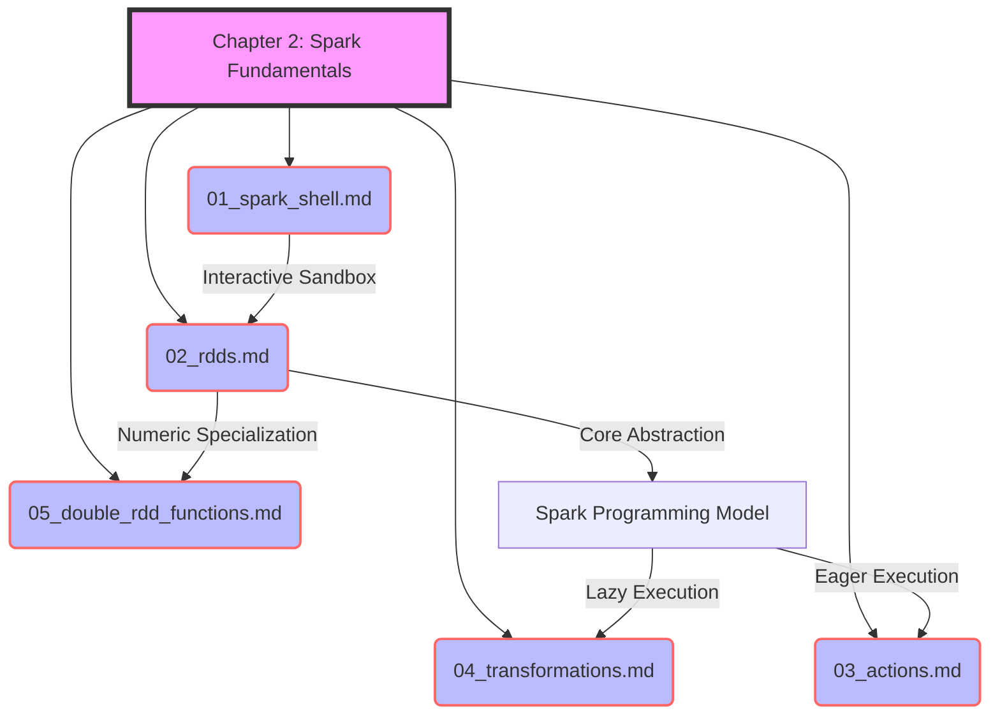

# Chapter 2: Spark Fundamentals Overview

**An introductory overview of the core Apache Spark concepts, laying the foundation for distributed data processing.**

## Why It Matters
Before diving into complex data pipelines, machine learning models, or streaming applications, you must understand how Spark fundamentally thinks about and manages data. In traditional programming, you deal with collections like lists or arrays that reside in a single machine's memory. When data grows to terabytes or petabytes, this paradigm breaks down. Apache Spark introduces a new way of thinking about data—as distributed collections that can be operated on in parallel across hundreds or thousands of machines. 

Understanding these fundamentals is critical because an incorrect mental model of Spark will lead to inefficient code, out-of-memory errors, and slow performance. This chapter introduces the essential building blocks: the interactive Spark Shell for rapid prototyping, Resilient Distributed Datasets (RDDs) for distributed data storage, and the distinction between Transformations (lazy operations) and Actions (eager operations). By mastering these concepts, you will be able to write robust, scalable, and highly optimized Spark applications.

## How It Works
The chapter is structured to progressively build your understanding of Spark's architecture and programming model. It begins with the most accessible entry point: the Spark Shell. This REPL (Read-Eval-Print Loop) environment allows you to interact with a Spark cluster in real-time, executing code line-by-line. It's the perfect sandbox for exploring APIs and testing small snippets of code before packaging them into a full application.

Next, we introduce the Resilient Distributed Dataset (RDD), which is Spark's core abstraction. An RDD represents a read-only, partitioned collection of records that can be operated on in parallel. We'll explore the five core properties of RDDs, including how they achieve fault tolerance through lineage graphs rather than expensive data replication. You'll learn how Spark reconstructs lost partitions automatically when a node fails, ensuring your jobs complete successfully even in unreliable environments.

The core of Spark programming involves manipulating RDDs using two types of operations: Transformations and Actions. Transformations (like `map`, `filter`, and `flatMap`) create a new dataset from an existing one but do not trigger any computation immediately. This is known as lazy evaluation. Spark simply records the lineage of operations. Actions (like `count`, `collect`, and `saveAsTextFile`), on the other hand, return a value to the driver program or write data to external storage, triggering the execution of all preceding transformations in the lineage graph.

Finally, we'll look at specialized RDDs, specifically DoubleRDDs, which provide powerful statistical functions for numerical data. By understanding these concepts in sequence, you'll develop a strong mental model of how Spark works under the hood.

This overview sets the stage for the specific deep-dives in the subsequent files:
1.  **The Spark Shell**: Interactive exploration and the SparkSession.
2.  **Resilient Distributed Datasets (RDDs)**: Distributed, fault-tolerant collections.
3.  **Actions**: Triggering computation and materializing results.
4.  **Transformations**: Building execution plans lazily.
5.  **Double RDD Functions**: Statistical operations on numeric data.

## Flow Diagram


## Data Visualization
| Topic | Concept | Analogy | Key Takeaway |
| :--- | :--- | :--- | :--- |
| **Spark Shell** | REPL Environment | A sandbox playground | Immediate feedback for rapid prototyping. |
| **RDDs** | Distributed Collections | A jigsaw puzzle spread across tables | Fault-tolerant, immutable data chunks. |
| **Actions** | Execution Triggers | Pressing "Start" on a microwave | The engine doesn't run until you ask for results. |
| **Transformations** | Lazy Operations | Writing a recipe | Planning the steps without cooking yet. |
| **Double RDDs** | Statistical Utilities | A built-in calculator | Easy math on distributed numbers. |

## Code Example
```scala
// A complete example demonstrating the concepts of Chapter 2
// 1. Spark Shell provides the 'sc' (SparkContext)
// 2. RDD Creation
val rawData = sc.parallelize(List(
  "spark is fast", 
  "spark is fun", 
  "hadoop is good but spark is better"
))

// 3. Transformations (Lazy)
val words = rawData.flatMap(line => line.split(" "))
val wordPairs = words.map(word => (word, 1))
val wordCounts = wordPairs.reduceByKey(_ + _)

// 4. Action (Triggers execution)
val topWords = wordCounts.sortBy(_._2, false).take(3)

// Print results
topWords.foreach(println)
// Output:
// (spark,3)
// (is,3)
// (fast,1)
```

## Common Pitfalls
*   **Skipping the basics:** Jumping straight to DataFrames/SQL without understanding RDDs and lineage. When things break, you won't know why.
*   **Confusing Transformations and Actions:** Trying to print a transformation result directly and getting an RDD object reference instead of data.
*   **Assuming eager execution:** Writing a complex pipeline and wondering why it "runs instantly" (it hasn't run yet, because no action was called).
*   **Running heavy jobs in the Shell:** Using the Spark Shell for massive production workloads instead of submitting compiled applications.
*   **Ignoring partition sizes:** Creating RDDs with too few or too many partitions, leading to skewed processing or overhead.

## Key Takeaway
Mastering the Spark Shell, RDDs, Transformations, and Actions is the fundamental prerequisite for writing scalable and resilient big data applications.

<br><br><br><br><br><br><br><br><br><br><br><br><br><br><br><br><br><br><br><br>
<br><br><br><br><br><br><br><br><br><br><br><br><br><br><br><br><br><br><br><br>
<br><br><br><br><br><br><br><br><br><br><br><br><br><br><br><br><br><br><br><br>
<br><br><br><br><br><br><br><br><br><br><br><br><br><br><br><br><br><br><br><br>
<br><br><br><br><br><br><br><br><br><br><br><br><br><br><br><br><br><br><br><br>
<br><br><br><br><br><br><br><br><br><br><br><br><br><br><br><br><br><br><br><br>
<br><br><br><br><br><br><br><br><br><br><br><br><br><br><br><br><br><br><br><br>
<br><br><br><br><br><br><br><br><br><br><br><br><br><br><br><br><br><br><br><br>
<br><br><br><br><br><br><br><br><br><br><br><br><br><br><br><br><br><br><br><br>
<br><br><br><br><br><br><br><br><br><br><br><br><br><br><br><br><br><br><br><br>
<br><br><br><br><br><br><br><br><br><br><br><br><br><br><br><br><br><br><br><br>
<br><br><br><br><br><br><br><br><br><br><br><br><br><br><br><br><br><br><br><br>
<br><br><br><br><br><br><br><br><br><br><br><br><br><br><br><br><br><br><br><br>
<br><br><br><br><br><br><br><br><br><br><br><br><br><br><br><br><br><br><br><br>
<br><br><br><br><br><br><br><br><br><br><br><br><br><br><br><br><br><br><br><br>
