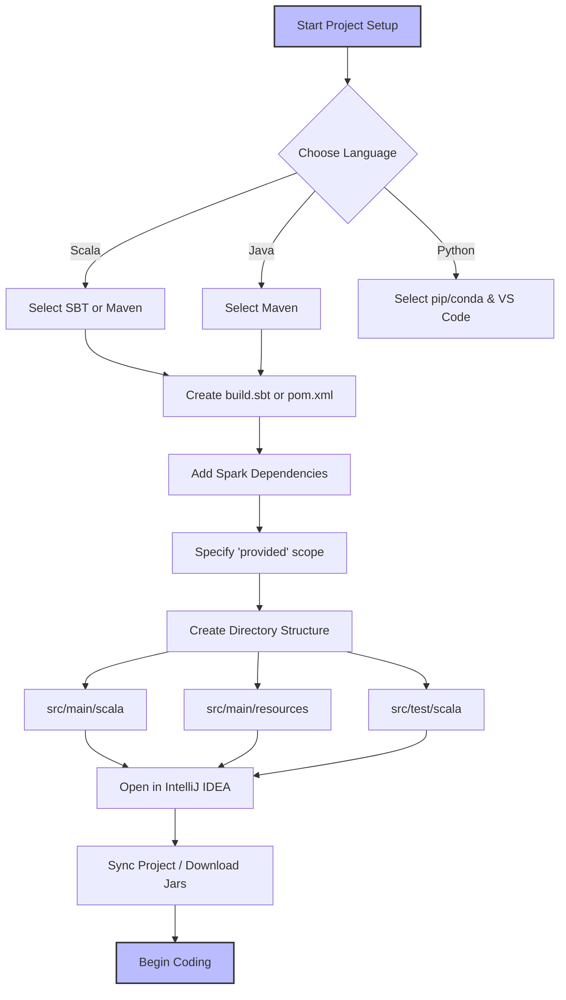

# Spark Projects in IDEs

**Setting up robust Apache Spark projects in IDEs like IntelliJ IDEA or Eclipse using build tools like Maven and SBT.**

## Why It Matters
Before writing a single line of production Spark code, you need a development environment. Unlike writing quick Python scripts in a text editor, enterprise Spark applications (especially those written in Scala or Java) require robust dependency management, compilation checks, and testing frameworks. Setting up a project correctly in an IDE ensures that you have access to features like auto-completion, refactoring tools, and immediate syntax highlighting. More importantly, using a standardized build tool (Maven or SBT) ensures that any other developer on your team can clone the repository, build the project, and run it without spending hours configuring their local environment. It brings reproducibility to data engineering.

## How It Works
Setting up a Spark project involves three main components: the IDE, the Build Tool, and the Project Structure.

**1. The IDE:** IntelliJ IDEA is widely considered the best IDE for Scala and Spark development, offering a powerful Scala plugin. Eclipse is also viable, especially for Java-heavy organizations, using the Scala IDE plugin. VS Code is increasingly popular for PySpark development due to its lightweight nature and excellent Python extensions. The IDE's role is to provide a productive coding interface and integrate seamlessly with the chosen build tool.

**2. The Build Tool (Maven vs. SBT):** 
*   **Maven:** A mature, XML-based build tool prevalent in the Java ecosystem. It defines the project in a `pom.xml` file. Maven is excellent for Java Spark projects and is well-understood by most enterprise CI/CD pipelines.
*   **SBT (Scala Build Tool):** The standard for Scala projects. It uses a Scala-based DSL defined in a `build.sbt` file. SBT provides incremental compilation, which is significantly faster for Scala code than Maven, and it handles Scala's complex versioning (where libraries must match the major Scala version) much more elegantly.

**3. Project Structure:** Both Maven and SBT enforce a standard directory structure:
*   `src/main/scala`: Your application code.
*   `src/main/resources`: Configuration files (e.g., `log4j.properties`).
*   `src/test/scala`: Unit and integration tests.
This separation of concerns ensures that test code and configuration do not accidentally end up in the production deployment artifact.

When configuring dependencies, you must include `spark-core` (for RDDs and basic Spark functionality) and `spark-sql` (for DataFrames and Datasets). Crucially, these dependencies should be marked as `provided`. This tells the build tool to use them for compilation but *not* to include them in the final packaged JAR, because the Spark cluster will already provide them at runtime.

## Flow Diagram



## Data Visualization

**Project Directory Structure:**

| Directory/File | Purpose | Contents |
| :--- | :--- | :--- |
| `my-spark-app/` | Root project folder | Contains build files and source code |
| ├── `build.sbt` (or `pom.xml`) | Build configuration | Dependencies, scala version, plugins |
| ├── `project/` | SBT specific folder | `build.properties`, `plugins.sbt` |
| ├── `src/` | Source code root | All code and resources |
| │   ├── `main/` | Production code | Code deployed to cluster |
| │   │   ├── `scala/` | Scala source code | `.scala` files organized by package |
| │   │   └── `resources/` | Configuration | `log4j.properties`, `application.conf` |
| │   └── `test/` | Testing code | Unit and integration tests |
| │       ├── `scala/` | Scala test code | ScalaTest or JUnit test classes |
| │       └── `resources/` | Test data | Sample JSON/CSV for testing |

## Code Example

**Sample `build.sbt` for a Spark Project:**

```scala
// The name of your project
name := "spark-in-action-chapter3"

// The version of your application
version := "1.0.0"

// The Scala version MUST match the version your Spark cluster is compiled against
scalaVersion := "2.12.15"

// A variable to keep Spark versions consistent
val sparkVersion = "3.3.0"

// Library Dependencies
libraryDependencies ++= Seq(
  // spark-core provides basic Spark functionality (RDDs, Context)
  // % "provided" means the cluster provides this jar, don't bundle it
  "org.apache.spark" %% "spark-core" % sparkVersion % "provided",
  
  // spark-sql provides DataFrame/Dataset API
  "org.apache.spark" %% "spark-sql" % sparkVersion % "provided",
  
  // Example of a library you MIGHT want to bundle (not provided by Spark)
  "com.typesafe" % "config" % "1.4.2",
  
  // Testing framework
  "org.scalatest" %% "scalatest" % "3.2.12" % Test
)

// Resolvers for downloading dependencies (usually Maven Central is enough)
resolvers += Resolver.mavenCentral
```

**Sample `pom.xml` snippet (for Maven users):**

```xml
<properties>
    <maven.compiler.source>1.8</maven.compiler.source>
    <maven.compiler.target>1.8</maven.compiler.target>
    <scala.version>2.12.15</scala.version>
    <spark.version>3.3.0</spark.version>
</properties>

<dependencies>
    <!-- Spark Core -->
    <dependency>
        <groupId>org.apache.spark</groupId>
        <artifactId>spark-core_2.12</artifactId>
        <version>${spark.version}</version>
        <scope>provided</scope>
    </dependency>
    <!-- Spark SQL -->
    <dependency>
        <groupId>org.apache.spark</groupId>
        <artifactId>spark-sql_2.12</artifactId>
        <version>${spark.version}</version>
        <scope>provided</scope>
    </dependency>
</dependencies>
```

## Common Pitfalls

*   **Scala Version Mismatch:** Compiling your project with Scala 2.13 when the Spark cluster expects Scala 2.12. This will result in immediate runtime errors (`NoSuchMethodError` or class not found).
*   **Forgetting `provided` Scope:** If you omit `% "provided"`, your build tool will package the entire Spark framework into your application JAR. This inflates the JAR size massively (hundreds of megabytes) and can cause conflicts with the cluster's Spark version.
*   **IDE Synchronization Issues:** Adding a dependency to `build.sbt` but forgetting to refresh/sync the IDE. IntelliJ won't recognize the new library, leading to red squiggly lines in your code despite the build file being correct.
*   **Mixing Build Tools:** Having both a `pom.xml` and a `build.sbt` in the same directory. Pick one tool and stick with it to avoid confusion.
*   **Ignoring log4j configuration:** Running local tests without a `log4j.properties` file in `src/main/resources` results in console spam with extremely verbose INFO logs from Spark, hiding your application's actual output.

## Key Takeaway
A correctly configured project structure with SBT or Maven, explicitly marking Spark dependencies as `provided`, is the non-negotiable foundation for writing reliable, production-ready Apache Spark applications.


---

## 🎓 Deep Learning Questions

### Q1: Why Was This Concept Introduced?
Before IDEs and robust build tools (Maven/SBT), developers wrote Big Data scripts using basic text editors and manually uploaded libraries to clusters. This manual process was error-prone, lacked auto-completion, and caused "dependency hell" where incompatible libraries crashed jobs at runtime. Apache Spark, written in Scala, introduced the need for strict version matching between Scala, Spark, and third-party libraries. Build tools like SBT and Maven were adopted to automate this dependency management, while IDEs like IntelliJ IDEA provided intelligent code completion, real-time error checking, and seamless integration with these build tools. This transition overcame the limitations of manual deployment, enabling reproducible builds, automated testing, and reliable enterprise-grade data engineering pipelines.

### Q2: What Exactly Is This Concept and How Does It Work?
A Spark project setup involves integrating an IDE (IntelliJ/Eclipse) with a build tool (SBT/Maven) to manage source code, dependencies, and compilation.
How it works:
1. **Definition**: You define your project dependencies (like `spark-core` and `spark-sql`) in a configuration file (`build.sbt` or `pom.xml`).
2. **Resolution**: The build tool connects to remote repositories (like Maven Central) and downloads the required JAR files.
3. **Integration**: The IDE reads the build file, indexes the downloaded libraries, and provides auto-completion and syntax highlighting.
4. **Compilation**: When you build the project, the tool compiles your Scala/Java/Python code.
5. **Packaging**: The tool packages your compiled code and any non-provided third-party libraries into an "Uber JAR" or "Fat JAR", ready to be deployed to a Spark cluster via `spark-submit`.

### Q3: Where Should This Concept Be Used?
Production-grade IDE and build tool setups should be used in almost all enterprise data engineering environments.
- **Financial Institutions**: When building critical ETL pipelines that require strict version control, unit testing, and CI/CD integration.
- **Tech Companies (Netflix, Uber)**: For developing complex machine learning pipelines or large-scale data transformation applications written in Scala or Java.
- **Collaborative Teams**: Whenever multiple developers are working on the same Spark codebase, a standardized SBT/Maven setup ensures everyone has the exact same development environment.
It is essential for any project that goes beyond a single script and requires automated testing, versioning, and deployment.

### Q4: Where Should This Concept NOT Be Used?
You should NOT use a heavy IDE and SBT/Maven setup for:
- **Exploratory Data Analysis (EDA)**: If you just want to quickly inspect a CSV file or test a simple hypothesis, opening an IDE and writing a `build.sbt` is overkill. Use a Jupyter Notebook or Databricks Notebook instead.
- **Quick Ad-Hoc Queries**: For fast SQL-like querying on existing data, Spark SQL via `spark-sql` CLI or a notebook interface is much faster to start.
- **Pure PySpark Prototyping**: While VS Code is great for Python, you don't need Maven or SBT for pure PySpark scripts. Python relies on `pip` or `conda` for environments, so a Java-based build tool introduces unnecessary complexity unless you are writing custom Scala UDFs.

### Q5: How Is This Concept Different from Hadoop?
| Aspect | Hadoop MapReduce Development | Apache Spark Development (Scala/SBT) |
| :--- | :--- | :--- |
| **Primary Language** | Java | Scala, Python, Java |
| **Standard Build Tool** | Maven (XML-based) | SBT (Scala DSL) or Maven |
| **Dependency Complexity** | Simpler Java dependencies | Complex due to strict Scala major version matching |
| **IDE Integration** | Eclipse historically dominated | IntelliJ IDEA is the absolute standard for Scala |
| **Packaging** | Standard JARs | "Fat JARs" using sbt-assembly or maven-shade-plugin |
| **Testing** | MRUnit (often clunky) | ScalaTest (highly expressive and fluent) |
| **Ease of Development** | Highly verbose, lots of boilerplate | Concise, functional syntax with rapid feedback |

### Q6: How Can This Concept Be Related to a Traditional RDBMS?
| RDBMS / SQL Concept | Spark IDE & Build Tool Equivalent | Explanation |
| :--- | :--- | :--- |
| SQL Server Management Studio / DBeaver | IntelliJ IDEA / VS Code | The graphical environment where you write, analyze, and test your code. |
| Database Drivers (JDBC/ODBC) | `build.sbt` or `pom.xml` dependencies | The mechanism to fetch the exact libraries needed to connect and process data. |
| Stored Procedures | Compiled Spark Application (JAR) | Packaged, reusable logic deployed to the execution engine. |
| `CREATE SCRIPT` | Build and Package commands (`sbt clean assembly`) | The process of preparing the code for production deployment. |

### Q7: What Happens Behind the Scenes?
When you build a Spark project in an IDE, a precise sequence of events occurs to prepare your code for the cluster:
1. **Source Code**: You write `.scala` or `.py` files in the IDE.
2. **Dependency Resolution**: SBT/Maven checks the local cache (`~/.ivy2` or `~/.m2`) and downloads missing dependencies from Maven Central.
3. **Compilation**: The Scala compiler (`scalac`) translates your code into Java Bytecode (`.class` files).
4. **Assembly/Shading**: A plugin (like `sbt-assembly`) gathers your compiled code and all third-party libraries (excluding those marked as `provided`) and bundles them into a single large file.
5. **Deployment Artifact**: The resulting Fat JAR is generated, ready for `spark-submit`.

```text
+-------------+      +-------------------+      +------------------+      +-------------------+
|  Write Code | ---> | Resolve Libraries | ---> | Compile to Class | ---> | Package Fat JAR   |
| (IntelliJ)  |      |   (SBT / Maven)   |      |    (scalac)      |      | (sbt-assembly)    |
+-------------+      +-------------------+      +------------------+      +-------------------+
                                                                                   |
                                                                                   v
                                                                          +-------------------+
                                                                          |   spark-submit    |
                                                                          +-------------------+
```

### Q8: Performance Considerations, Best Practices, and Common Mistakes
| Category | Recommendation | Why It Matters |
| :--- | :--- | :--- |
| **Best Practice** | Use the `provided` scope for Spark core libraries. | Prevents bundling Spark itself into your JAR, which causes massive file sizes and classloader conflicts at runtime. |
| **Optimization** | Use an assembly plugin (e.g., `sbt-assembly`). | Bundles your app and third-party dependencies into one JAR, avoiding `ClassNotFound` errors on worker nodes. |
| **Common Mistake** | Ignoring Scala versioning (e.g., mixing 2.12 and 2.13). | Scala binaries are not backward compatible across major versions. Mismatches cause immediate runtime failures. |
| **Best Practice** | Exclude unused transitive dependencies. | Keeps the final Fat JAR small, reducing network transfer time when submitting the job to the cluster. |
| **Production Tip** | Shade conflicting libraries. | If your app needs a different version of a library (like Guava) than Spark uses, shading renames the packages to prevent conflicts. |

### Q9: Interview Questions

**Beginner**
1. **Why do we use SBT or Maven for Spark projects instead of just zipping files?**
   *Answer:* They automate dependency management, handle compilation, and package applications consistently, preventing missing libraries and runtime errors.
2. **What does the `provided` keyword mean in a `build.sbt` file?**
   *Answer:* It tells the build tool to use the library for compilation but NOT to include it in the final packaged JAR, as the Spark cluster already provides it.
3. **Which IDE is most recommended for Scala-based Spark development?**
   *Answer:* IntelliJ IDEA with the official Scala plugin is the industry standard due to its excellent syntax highlighting, auto-completion, and SBT integration.

**Intermediate**
4. **What happens if you compile a Spark app with Scala 2.13 but deploy it to a cluster running Scala 2.12?**
   *Answer:* The application will fail immediately with `NoSuchMethodError` or `ClassNotFoundException` because Scala minor versions (2.12 vs 2.13) are not binary compatible.
5. **What is an "Uber JAR" or "Fat JAR" and why is it needed for Spark?**
   *Answer:* It is a single JAR file containing your application code PLUS all its third-party dependencies. It is needed because Spark worker nodes do not automatically have your custom libraries installed.
6. **How do you handle a situation where your application needs a newer version of a library that Spark already uses internally?**
   *Answer:* You use a shading plugin (like `sbt-assembly` shading or Maven shade plugin) to rename your application's version of the library's packages, preventing classloader conflicts.

**Advanced**
7. **Explain the directory structure of a standard Maven/SBT project and why separation of concerns matters.**
   *Answer:* `src/main/scala` holds production code, `src/main/resources` holds production configs. `src/test/...` holds testing equivalents. This prevents test data or testing libraries from being accidentally packaged into the production deployment artifact.
8. **How does incremental compilation in SBT benefit Spark developers compared to Maven?**
   *Answer:* SBT tracks file changes and only recompiles the files that were modified (and their dependents), drastically reducing compile times for large Scala projects compared to Maven's traditional full-build approach.
9. **How do you submit a Spark application JAR that was built using Maven or SBT?**
   *Answer:* You use the `spark-submit` command, specifying the `--class` (main class), the path to the Fat JAR, and any application-specific arguments.

**Scenario-Based**
10. **Your team is migrating from PySpark in Jupyter Notebooks to Scala Spark. They complain that writing code in IntelliJ is "slower" because they have to compile. How do you justify the setup?**
    *Answer:* I would explain that while the initial setup and compile times introduce a slight delay, the IDE catches type errors instantly, automated unit testing prevents production bugs, and the build tool ensures reproducible deployments—saving countless hours of debugging in production.
11. **You submitted a Spark job and it failed with a `java.lang.SecurityException: Invalid signature file digest for Manifest main attributes`. What caused this and how do you fix it?**
    *Answer:* This happens when building a Fat JAR that includes signed dependencies. The fix is to configure `sbt-assembly` or Maven Shade to exclude `META-INF/*.SF`, `*.DSA`, and `*.RSA` files during the packaging process.

### Q10: Complete Real-World Example
**Business Problem:** A retail company needs a robust, testable Spark application to aggregate daily sales data. They require a standard SBT project structure so the CI/CD pipeline can automatically test and package the code.

**Sample Dataset description:** A CSV file (`sales.csv`) containing `transaction_id`, `store_id`, `amount`, and `date`.

**Project Structure:**
```text
retail-aggregator/
├── build.sbt
└── src/
    └── main/
        └── scala/
            └── com/retail/SalesAggregator.scala
```

**Full working Scala Spark code (`build.sbt`):**
```scala
name := "retail-aggregator"
version := "1.0"
scalaVersion := "2.12.15"

val sparkVersion = "3.3.0"

libraryDependencies ++= Seq(
  "org.apache.spark" %% "spark-core" % sparkVersion % "provided",
  "org.apache.spark" %% "spark-sql" % sparkVersion % "provided"
)
```

**Full working Scala Spark code (`SalesAggregator.scala`):**
```scala
package com.retail

import org.apache.spark.sql.SparkSession
import org.apache.spark.sql.functions._

object SalesAggregator {
  def main(args: Array[String]): Unit = {
    // 1. Initialize SparkSession (The entry point)
    val spark = SparkSession.builder()
      .appName("Retail Sales Aggregator")
      // .master("local[*]") // Usually passed via spark-submit, not hardcoded in prod
      .getOrCreate()

    // 2. Read the dataset
    val inputPath = if (args.length > 0) args(0) else "data/sales.csv"
    val salesDF = spark.read.option("header", "true").csv(inputPath)

    // 3. Process the data: Total sales per store
    val aggregatedDF = salesDF
      .withColumn("amount", col("amount").cast("double"))
      .groupBy("store_id")
      .agg(sum("amount").alias("total_sales"))
      .orderBy(desc("total_sales"))

    // 4. Output the result
    aggregatedDF.show()

    // 5. Clean up
    spark.stop()
  }
}
```

**Step-by-step execution walkthrough:**
1. A developer imports the `build.sbt` into IntelliJ IDEA.
2. SBT automatically downloads `spark-core` and `spark-sql`.
3. The developer writes the `SalesAggregator.scala` code, utilizing IDE auto-completion.
4. The developer runs `sbt clean package` (or `sbt assembly`) in the terminal.
5. The CI/CD pipeline takes the resulting JAR and submits it to the cluster: `spark-submit --class com.retail.SalesAggregator target/scala-2.12/retail-aggregator_2.12-1.0.jar hdfs://data/sales.csv`.

**Expected output:**
```text
+--------+-----------+
|store_id|total_sales|
+--------+-----------+
|     102|    4500.50|
|     101|    3200.00|
|     105|    1100.25|
+--------+-----------+
```

**Performance notes:** Ensure the Spark dependencies are marked as `"provided"` in `build.sbt` to keep the JAR size small and prevent classloader issues during execution.
**When this approach is best:** This structured approach is best for production pipelines, scheduled batch jobs, and large collaborative codebases where reliability and automated testing are paramount.

### 💡 Key Takeaways
- IntelliJ IDEA combined with SBT is the industry standard for Scala Spark development.
- The `provided` scope is crucial; never bundle Spark itself into your application JAR.
- A standard project structure separates production code, configuration, and testing logic.
- Building a "Fat JAR" is the standard way to deploy applications with third-party dependencies.
- Strict Scala version matching between your project and the Spark cluster is mandatory.

### ⚠️ Common Misconceptions
- **"I can just use Python scripts without a build tool."** While true for simple PySpark, complex projects with UDFs or dependencies still benefit from packaging tools like Poetry or building wheels.
- **"Maven is better because it's older."** In the Scala/Spark ecosystem, SBT is generally preferred due to its deep understanding of Scala versioning and incremental compilation speeds.
- **"I need to include Spark in my JAR so the cluster can run it."** False. The cluster already has Spark binaries; including them causes massive conflicts.

### 🔗 Related Spark Concepts
- Spark Submit & Deployment Modes
- SBT Assembly and Shading
- Spark Session and Entry Points
- Unit Testing in Spark (ScalaTest)

### 📚 References for Further Reading
- Apache Spark Official Documentation
- Learning Spark (O'Reilly)
- Spark: The Definitive Guide (O'Reilly)
