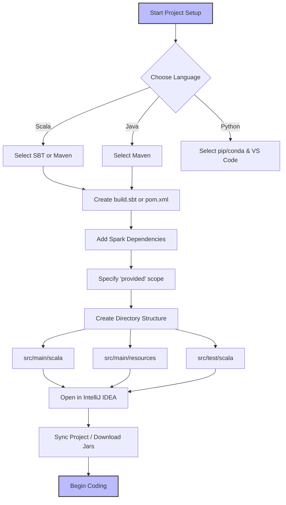

# Spark Projects in IDEs

**Setting up robust Apache Spark projects in IDEs like IntelliJ IDEA or Eclipse using build tools like Maven and SBT.**

## Why It Matters
Before writing a single line of production Spark code, you need a development environment. Unlike writing quick Python scripts in a text editor, enterprise Spark applications (especially those written in Scala or Java) require robust dependency management, compilation checks, and testing frameworks. Setting up a project correctly in an IDE ensures that you have access to features like auto-completion, refactoring tools, and immediate syntax highlighting. More importantly, using a standardized build tool (Maven or SBT) ensures that any other developer on your team can clone the repository, build the project, and run it without spending hours configuring their local environment. It brings reproducibility to data engineering.

## How It Works
Setting up a Spark project involves three main components: the IDE, the Build Tool, and the Project Structure.

**1. The IDE:** IntelliJ IDEA is widely considered the best IDE for Scala and Spark development, offering a powerful Scala plugin. Eclipse is also viable, especially for Java-heavy organizations, using the Scala IDE plugin. VS Code is increasingly popular for PySpark development due to its lightweight nature and excellent Python extensions. The IDE's role is to provide a productive coding interface and integrate seamlessly with the chosen build tool.

**2. The Build Tool (Maven vs. SBT):** 
*   **Maven:** A mature, XML-based build tool prevalent in the Java ecosystem. It defines the project in a `pom.xml` file. Maven is excellent for Java Spark projects and is well-understood by most enterprise CI/CD pipelines.
*   **SBT (Scala Build Tool):** The standard for Scala projects. It uses a Scala-based DSL defined in a `build.sbt` file. SBT provides incremental compilation, which is significantly faster for Scala code than Maven, and it handles Scala's complex versioning (where libraries must match the major Scala version) much more elegantly.

**3. Project Structure:** Both Maven and SBT enforce a standard directory structure:
*   `src/main/scala`: Your application code.
*   `src/main/resources`: Configuration files (e.g., `log4j.properties`).
*   `src/test/scala`: Unit and integration tests.
This separation of concerns ensures that test code and configuration do not accidentally end up in the production deployment artifact.

When configuring dependencies, you must include `spark-core` (for RDDs and basic Spark functionality) and `spark-sql` (for DataFrames and Datasets). Crucially, these dependencies should be marked as `provided`. This tells the build tool to use them for compilation but *not* to include them in the final packaged JAR, because the Spark cluster will already provide them at runtime.

## Flow Diagram



## Data Visualization

**Project Directory Structure:**

| Directory/File | Purpose | Contents |
| :--- | :--- | :--- |
| `my-spark-app/` | Root project folder | Contains build files and source code |
| ├── `build.sbt` (or `pom.xml`) | Build configuration | Dependencies, scala version, plugins |
| ├── `project/` | SBT specific folder | `build.properties`, `plugins.sbt` |
| ├── `src/` | Source code root | All code and resources |
| │   ├── `main/` | Production code | Code deployed to cluster |
| │   │   ├── `scala/` | Scala source code | `.scala` files organized by package |
| │   │   └── `resources/` | Configuration | `log4j.properties`, `application.conf` |
| │   └── `test/` | Testing code | Unit and integration tests |
| │       ├── `scala/` | Scala test code | ScalaTest or JUnit test classes |
| │       └── `resources/` | Test data | Sample JSON/CSV for testing |

## Code Example

**Sample `build.sbt` for a Spark Project:**

```scala
// The name of your project
name := "spark-in-action-chapter3"

// The version of your application
version := "1.0.0"

// The Scala version MUST match the version your Spark cluster is compiled against
scalaVersion := "2.12.15"

// A variable to keep Spark versions consistent
val sparkVersion = "3.3.0"

// Library Dependencies
libraryDependencies ++= Seq(
  // spark-core provides basic Spark functionality (RDDs, Context)
  // % "provided" means the cluster provides this jar, don't bundle it
  "org.apache.spark" %% "spark-core" % sparkVersion % "provided",
  
  // spark-sql provides DataFrame/Dataset API
  "org.apache.spark" %% "spark-sql" % sparkVersion % "provided",
  
  // Example of a library you MIGHT want to bundle (not provided by Spark)
  "com.typesafe" % "config" % "1.4.2",
  
  // Testing framework
  "org.scalatest" %% "scalatest" % "3.2.12" % Test
)

// Resolvers for downloading dependencies (usually Maven Central is enough)
resolvers += Resolver.mavenCentral
```

**Sample `pom.xml` snippet (for Maven users):**

```xml
<properties>
    <maven.compiler.source>1.8</maven.compiler.source>
    <maven.compiler.target>1.8</maven.compiler.target>
    <scala.version>2.12.15</scala.version>
    <spark.version>3.3.0</spark.version>
</properties>

<dependencies>
    <!-- Spark Core -->
    <dependency>
        <groupId>org.apache.spark</groupId>
        <artifactId>spark-core_2.12</artifactId>
        <version>${spark.version}</version>
        <scope>provided</scope>
    </dependency>
    <!-- Spark SQL -->
    <dependency>
        <groupId>org.apache.spark</groupId>
        <artifactId>spark-sql_2.12</artifactId>
        <version>${spark.version}</version>
        <scope>provided</scope>
    </dependency>
</dependencies>
```

## Common Pitfalls

*   **Scala Version Mismatch:** Compiling your project with Scala 2.13 when the Spark cluster expects Scala 2.12. This will result in immediate runtime errors (`NoSuchMethodError` or class not found).
*   **Forgetting `provided` Scope:** If you omit `% "provided"`, your build tool will package the entire Spark framework into your application JAR. This inflates the JAR size massively (hundreds of megabytes) and can cause conflicts with the cluster's Spark version.
*   **IDE Synchronization Issues:** Adding a dependency to `build.sbt` but forgetting to refresh/sync the IDE. IntelliJ won't recognize the new library, leading to red squiggly lines in your code despite the build file being correct.
*   **Mixing Build Tools:** Having both a `pom.xml` and a `build.sbt` in the same directory. Pick one tool and stick with it to avoid confusion.
*   **Ignoring log4j configuration:** Running local tests without a `log4j.properties` file in `src/main/resources` results in console spam with extremely verbose INFO logs from Spark, hiding your application's actual output.

## Key Takeaway
A correctly configured project structure with SBT or Maven, explicitly marking Spark dependencies as `provided`, is the non-negotiable foundation for writing reliable, production-ready Apache Spark applications.
