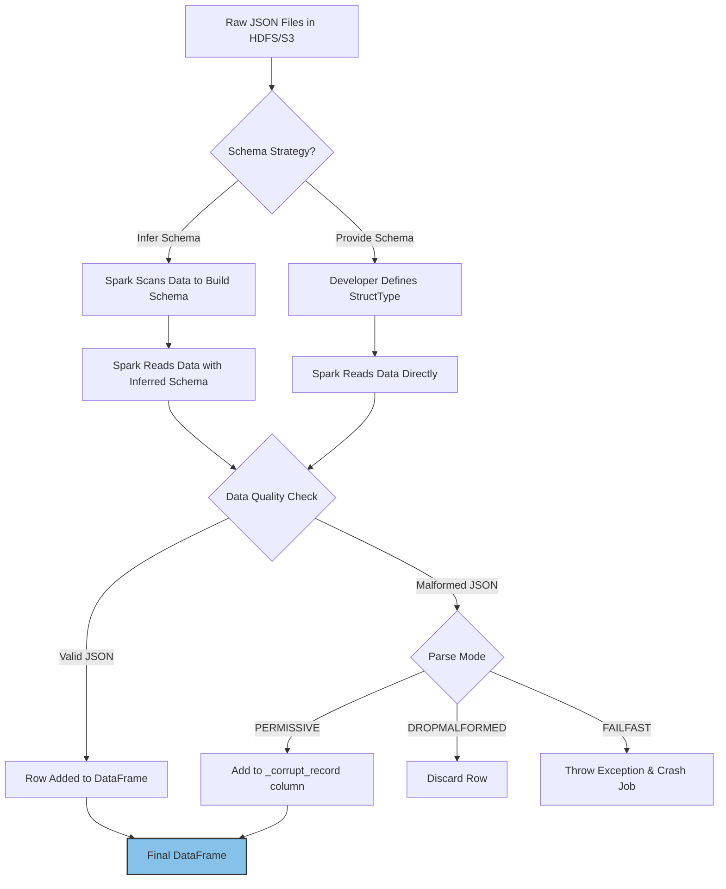

# Loading JSON Data

**Ingesting, parsing, and inferring schemas from semi-structured JSON datasets using Spark's powerful DataFrame API.**

## Why It Matters
JSON (JavaScript Object Notation) is the ubiquitous data format of the web. APIs, log files, webhook payloads, and streaming data sources (like Kafka) heavily rely on JSON due to its human-readable and flexible, semi-structured nature. In data engineering, extracting insights from this JSON data is a daily task. Spark excels at this because it can automatically infer the schema of complex, nested JSON files, saving developers from writing hundreds of lines of boilerplate parsing code. Understanding how Spark handles JSON—including its capabilities and limitations regarding schema inference and malformed records—is essential for building resilient data ingestion pipelines.

## How It Works
Loading JSON in Spark has evolved significantly. In older Spark versions (using the RDD API), developers had to load JSON as text files using `sparkContext.textFile()` and then manually map over each line, using a JSON parsing library (like Jackson, Circe, or Gson) to extract fields. This approach was tedious, error-prone, and required handling missing fields and schema variations manually.

Modern Spark uses the DataFrame API via `spark.read.json()`. This powerful reader can automatically scan the JSON file (or a sample of it) to infer the schema. It detects data types (strings, integers, arrays) and handles nested structures by creating `StructType` columns. 

However, schema inference has a cost: Spark must read the data once just to figure out the schema, and then read it again to actually load the data. For large datasets, this double-pass is computationally expensive. Therefore, in production, it is highly recommended to explicitly define a schema using `StructType` and `StructField`. Providing a predefined schema avoids the inference phase, speeds up the job, and ensures that data types are strictly enforced (e.g., ensuring an ID is read as a Long, not an Integer, preventing overflow).

Spark's JSON reader also offers several options to handle real-world messy data. The most important is the `mode` option:
*   `PERMISSIVE` (default): Attempts to parse as much as possible. Malformed records are placed in a designated column (usually `_corrupt_record`).
*   `DROPMALFORMED`: Ignores the entire row if it contains malformed JSON.
*   `FAILFAST`: Immediately throws an exception and stops the job upon encountering the first malformed record.

The GitHub Archive dataset, often used in Spark examples, provides an excellent case study for JSON loading. It consists of highly nested JSON records representing GitHub events (pushes, forks, issues), demonstrating Spark's ability to flatten and query complex hierarchies seamlessly.

## Flow Diagram



## Data Visualization

**Handling Malformed JSON (Permissive Mode):**

*Input Data (data.json):*
```json
{"name": "Alice", "age": 30}
{"name": "Bob", "age": 25}
{"name": "Charlie", age: 35}  // Malformed: missing quotes around key
{"name": "David"}
```

*Output DataFrame:*

| name | age | _corrupt_record |
| :--- | :--- | :--- |
| Alice | 30 | null |
| Bob | 25 | null |
| null | null | {"name": "Charlie", age: 35} |
| David | null | null |

## Code Example

```scala
import org.apache.spark.sql.SparkSession
import org.apache.spark.sql.types._

object JsonLoadingExample {
  def main(args: Array[String]): Unit = {
    val spark = SparkSession.builder()
      .appName("JSON Loading")
      .master("local[*]")
      .getOrCreate()

    // 1. The old way: RDDs + Manual Parsing (Avoid this if possible)
    // val rdd = spark.sparkContext.textFile("path/to/data.json")
    // val parsedRdd = rdd.map(line => customJsonParser(line))

    // 2. The easy way: DataFrame with Schema Inference
    // Warning: Requires reading data twice. Good for exploration.
    val inferredDf = spark.read
      .option("inferSchema", "true") // Often default for JSON, but good to be explicit
      .json("src/main/resources/github_events_sample.json")
      
    inferredDf.printSchema()

    // 3. The production way: DataFrame with Explicit Schema
    // Defining a schema for a subset of the GitHub Archive dataset
    val githubSchema = StructType(Array(
      StructField("id", StringType, nullable = true),
      StructField("type", StringType, nullable = true),
      StructField("actor", StructType(Array(
        StructField("id", LongType, nullable = true),
        StructField("login", StringType, nullable = true)
      )), nullable = true),
      StructField("created_at", StringType, nullable = true)
    ))

    val explicitDf = spark.read
      .schema(githubSchema)
      .option("mode", "DROPMALFORMED") // Ignore bad records instead of crashing
      .json("src/main/resources/github_events_sample.json")

    explicitDf.show(5, truncate = false)

    // 4. Flattening nested JSON
    // Accessing nested fields using dot notation
    val flattenedDf = explicitDf.select(
      explicitDf("id").alias("event_id"),
      explicitDf("type").alias("event_type"),
      explicitDf("actor.login").alias("user_login")
    )

    flattenedDf.show(5)

    spark.stop()
  }
}
```

## Common Pitfalls

*   **Relying on Schema Inference in Production:** This is the most common mistake. It slows down ingestion significantly and can cause jobs to fail if the schema changes slightly in a new batch of data (e.g., an integer field suddenly receives a float value, causing a type mismatch if the initial inference was based on a sample).
*   **Multi-line JSON:** By default, Spark expects JSON to be "newline-delimited" (NDJSON), where each line is a complete, valid JSON object. If your file is a single large JSON array spanning multiple lines, Spark will fail to read it unless you add `.option("multiline", "true")`. Multiline parsing is slower and cannot be easily parallelized.
*   **Ignoring Malformed Records:** Using `FAILFAST` on messy data will constantly crash your pipeline. Conversely, silently ignoring them with `DROPMALFORMED` might mean you lose valuable data without knowing. The best practice is `PERMISSIVE` and actively monitoring the `_corrupt_record` column.
*   **Case Sensitivity Issues:** While JSON keys are case-sensitive, Spark SQL's default behavior might cause issues if you have keys that differ only in casing (e.g., "ID" and "id").

## Key Takeaway
While Spark's automatic JSON schema inference is excellent for prototyping, production-grade applications demand explicitly defined schemas and robust handling of malformed records to ensure stability and performance.
