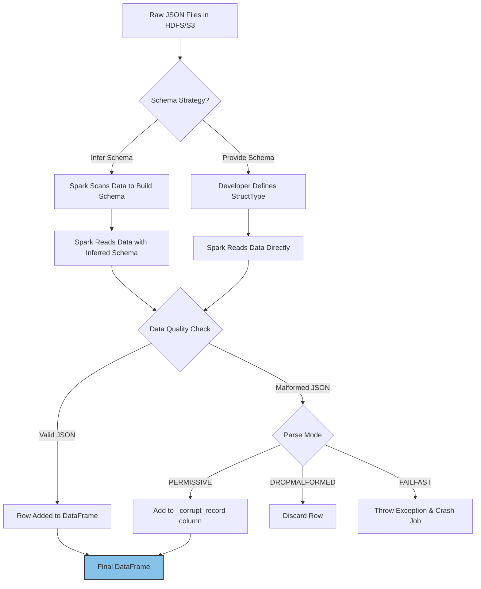

# Loading JSON Data

**Ingesting, parsing, and inferring schemas from semi-structured JSON datasets using Spark's powerful DataFrame API.**

## Why It Matters
JSON (JavaScript Object Notation) is the ubiquitous data format of the web. APIs, log files, webhook payloads, and streaming data sources (like Kafka) heavily rely on JSON due to its human-readable and flexible, semi-structured nature. In data engineering, extracting insights from this JSON data is a daily task. Spark excels at this because it can automatically infer the schema of complex, nested JSON files, saving developers from writing hundreds of lines of boilerplate parsing code. Understanding how Spark handles JSON—including its capabilities and limitations regarding schema inference and malformed records—is essential for building resilient data ingestion pipelines.

## How It Works
Loading JSON in Spark has evolved significantly. In older Spark versions (using the RDD API), developers had to load JSON as text files using `sparkContext.textFile()` and then manually map over each line, using a JSON parsing library (like Jackson, Circe, or Gson) to extract fields. This approach was tedious, error-prone, and required handling missing fields and schema variations manually.

Modern Spark uses the DataFrame API via `spark.read.json()`. This powerful reader can automatically scan the JSON file (or a sample of it) to infer the schema. It detects data types (strings, integers, arrays) and handles nested structures by creating `StructType` columns. 

However, schema inference has a cost: Spark must read the data once just to figure out the schema, and then read it again to actually load the data. For large datasets, this double-pass is computationally expensive. Therefore, in production, it is highly recommended to explicitly define a schema using `StructType` and `StructField`. Providing a predefined schema avoids the inference phase, speeds up the job, and ensures that data types are strictly enforced (e.g., ensuring an ID is read as a Long, not an Integer, preventing overflow).

Spark's JSON reader also offers several options to handle real-world messy data. The most important is the `mode` option:
*   `PERMISSIVE` (default): Attempts to parse as much as possible. Malformed records are placed in a designated column (usually `_corrupt_record`).
*   `DROPMALFORMED`: Ignores the entire row if it contains malformed JSON.
*   `FAILFAST`: Immediately throws an exception and stops the job upon encountering the first malformed record.

The GitHub Archive dataset, often used in Spark examples, provides an excellent case study for JSON loading. It consists of highly nested JSON records representing GitHub events (pushes, forks, issues), demonstrating Spark's ability to flatten and query complex hierarchies seamlessly.

## Flow Diagram



## Data Visualization

**Handling Malformed JSON (Permissive Mode):**

*Input Data (data.json):*
```json
{"name": "Alice", "age": 30}
{"name": "Bob", "age": 25}
{"name": "Charlie", age: 35}  // Malformed: missing quotes around key
{"name": "David"}
```

*Output DataFrame:*

| name | age | _corrupt_record |
| :--- | :--- | :--- |
| Alice | 30 | null |
| Bob | 25 | null |
| null | null | {"name": "Charlie", age: 35} |
| David | null | null |

## Code Example

```scala
import org.apache.spark.sql.SparkSession
import org.apache.spark.sql.types._

object JsonLoadingExample {
  def main(args: Array[String]): Unit = {
    val spark = SparkSession.builder()
      .appName("JSON Loading")
      .master("local[*]")
      .getOrCreate()

    // 1. The old way: RDDs + Manual Parsing (Avoid this if possible)
    // val rdd = spark.sparkContext.textFile("path/to/data.json")
    // val parsedRdd = rdd.map(line => customJsonParser(line))

    // 2. The easy way: DataFrame with Schema Inference
    // Warning: Requires reading data twice. Good for exploration.
    val inferredDf = spark.read
      .option("inferSchema", "true") // Often default for JSON, but good to be explicit
      .json("src/main/resources/github_events_sample.json")
      
    inferredDf.printSchema()

    // 3. The production way: DataFrame with Explicit Schema
    // Defining a schema for a subset of the GitHub Archive dataset
    val githubSchema = StructType(Array(
      StructField("id", StringType, nullable = true),
      StructField("type", StringType, nullable = true),
      StructField("actor", StructType(Array(
        StructField("id", LongType, nullable = true),
        StructField("login", StringType, nullable = true)
      )), nullable = true),
      StructField("created_at", StringType, nullable = true)
    ))

    val explicitDf = spark.read
      .schema(githubSchema)
      .option("mode", "DROPMALFORMED") // Ignore bad records instead of crashing
      .json("src/main/resources/github_events_sample.json")

    explicitDf.show(5, truncate = false)

    // 4. Flattening nested JSON
    // Accessing nested fields using dot notation
    val flattenedDf = explicitDf.select(
      explicitDf("id").alias("event_id"),
      explicitDf("type").alias("event_type"),
      explicitDf("actor.login").alias("user_login")
    )

    flattenedDf.show(5)

    spark.stop()
  }
}
```

## Common Pitfalls

*   **Relying on Schema Inference in Production:** This is the most common mistake. It slows down ingestion significantly and can cause jobs to fail if the schema changes slightly in a new batch of data (e.g., an integer field suddenly receives a float value, causing a type mismatch if the initial inference was based on a sample).
*   **Multi-line JSON:** By default, Spark expects JSON to be "newline-delimited" (NDJSON), where each line is a complete, valid JSON object. If your file is a single large JSON array spanning multiple lines, Spark will fail to read it unless you add `.option("multiline", "true")`. Multiline parsing is slower and cannot be easily parallelized.
*   **Ignoring Malformed Records:** Using `FAILFAST` on messy data will constantly crash your pipeline. Conversely, silently ignoring them with `DROPMALFORMED` might mean you lose valuable data without knowing. The best practice is `PERMISSIVE` and actively monitoring the `_corrupt_record` column.
*   **Case Sensitivity Issues:** While JSON keys are case-sensitive, Spark SQL's default behavior might cause issues if you have keys that differ only in casing (e.g., "ID" and "id").

## Key Takeaway
While Spark's automatic JSON schema inference is excellent for prototyping, production-grade applications demand explicitly defined schemas and robust handling of malformed records to ensure stability and performance.


---

## 🎓 Deep Learning Questions

### Q1: Why Was This Concept Introduced?
Before the DataFrame API, reading JSON data in Spark meant loading text files via the Resilient Distributed Dataset (RDD) API (`sparkContext.textFile`) and writing custom parsing logic using libraries like Jackson or Gson. This approach was highly tedious, brittle, and notoriously slow since it lacked optimization. Developers spent substantial time writing boilerplate code just to deal with missing fields, schema variations, and type checking.

Spark introduced native JSON support in the DataFrame/Dataset API (`spark.read.json`) to automate this heavy lifting. By providing automatic schema inference, it eliminated the need for manual parsing. It also leverages Spark's Catalyst Optimizer, reading the data in a much more efficient, columnar-friendly manner and pushing down filters. It transformed JSON ingestion from a complex coding task into a simple, single-line operation.

### Q2: What Exactly Is This Concept and How Does It Work?
JSON loading in Spark is a built-in data source connector that reads JSON files and converts them into structured DataFrames. 

When you use `spark.read.json()`, Spark initiates a distributed read operation. By default, it expects JSON lines (NDJSON), where every line is a complete JSON object. 
If schema inference is enabled, Spark performs an initial pass over the data (or a sample) to detect data types (like String, Long, Array) and nested structures, generating a `StructType`. It then performs a second pass to actually parse the records and populate the DataFrame. If you provide an explicit schema upfront, Spark skips the inference phase, using the provided schema to parse the data directly in a single pass. During parsing, it handles missing fields by injecting nulls and flags malformed records based on the configured mode (`PERMISSIVE`, `DROPMALFORMED`, or `FAILFAST`).

### Q3: Where Should This Concept Be Used?
JSON loading is extensively used in modern data architectures due to the ubiquity of JSON:
*   **Web Analytics (Netflix, Spotify):** Ingesting clickstream data, user events, and interaction logs that are often nested and semi-structured.
*   **Streaming Data Ingestion (Uber, Lyft):** Consuming real-time location data or telemetry payloads from Kafka streams, which are heavily serialized as JSON.
*   **API Integrations (SaaS platforms):** Extracting data from RESTful APIs (like Salesforce, GitHub, or Stripe) where the standard response format is JSON.
*   **IoT & Telemetry:** Reading device sensor logs that frequently change schemas or have varying attributes.

### Q4: Where Should This Concept NOT Be Used?
*   **Massive Analytical Workloads:** JSON is a row-based, plain-text format. It lacks built-in compression, indexing, and statistics. For heavy analytical queries or repeated reads, Parquet or ORC is vastly superior.
*   **Strictly Structured Relational Data:** If the source data is strictly tabular without nested fields, CSV or Parquet is much more efficient to parse and store.
*   **Single Massive JSON Arrays:** Reading a single multi-gigabyte JSON array (using `.option("multiline", "true")`) forces Spark to read it on a single node, completely destroying distributed processing benefits. 
*   **Extremely Deep Nesting:** While Spark handles nested JSON, nesting hundreds of levels deep can cause the Catalyst Optimizer to choke and memory overhead to spike.

### Q5: How Is This Concept Different from Hadoop?
| Aspect | Hadoop MapReduce | Apache Spark |
| :--- | :--- | :--- |
| **Architecture** | Relies on custom InputFormats and external JSON libraries (like Jackson). | Built-in JSON data source connector integrated with Catalyst. |
| **Performance** | Slow; requires heavy disk I/O and manual parsing logic. | Fast; optimizes parsing, avoids object overhead via Tungsten. |
| **Processing Model** | Map and Reduce phases for custom parsing. | DataFrame API abstracting the parsing process completely. |
| **Schema Handling** | Schema on read, but manually enforced in code. | Automatic schema inference or explicit `StructType` application. |
| **Ease of Development** | High boilerplate; custom code for nested fields. | Single line of code: `spark.read.json("path")`. |
| **Fault Tolerance** | Standard MapReduce retry mechanisms. | Handles malformed records gracefully with `PERMISSIVE` mode. |

### Q6: How Can This Concept Be Related to a Traditional RDBMS?
| Spark JSON Concept | Traditional RDBMS Equivalent | Explanation |
| :--- | :--- | :--- |
| `spark.read.json()` | `LOAD DATA INFILE` | Both load external data, but Spark handles nested hierarchies. |
| `inferSchema` | Table Auto-Creation (rare in RDBMS) | Spark figures out the columns dynamically; RDBMS usually requires strict DDL. |
| `StructType` Schema | `CREATE TABLE` DDL | Defining the exact columns and data types before loading. |
| `PERMISSIVE` Mode | Error Logging Tables | Instead of failing the transaction, bad rows go to a corrupt record bin. |
| Dot Notation (`a.b`) | JSON Extraction Functions | Spark allows dot notation; SQL uses `JSON_EXTRACT()` or `->`. |

### Q7: What Happens Behind the Scenes?
Explain step-by-step:
1. **Driver:** Parses the command and creates a logical plan to read the JSON path.
2. **DAG & Scheduler:** Spark checks the file system (e.g., HDFS/S3) for the files, calculating how to split them (for NDJSON, it splits by HDFS blocks).
3. **Tasks:** Spark spawns tasks across Executors to read file partitions.
4. **Executors:** Each task reads its assigned JSON chunk line by line.
5. **Parsing:** The Jackson parser inside Spark evaluates each line against the provided schema.
6. **Memory:** Valid records are encoded into Spark's internal Tungsten binary format.

```text
[Driver: spark.read.json] 
       |
       v
[File System (S3/HDFS)] --> Split into Block 1, Block 2, Block 3
       |
       v
[Executors: Jackson Parser]
       |-- Task 1: Reads lines 1-1000
       |-- Task 2: Reads lines 1001-2000
       v
[Schema Enforcement] --> If bad row and PERMISSIVE -> _corrupt_record
       |
       v
[Tungsten Binary Format] --> Populates DataFrame
```

### Q8: Performance Considerations, Best Practices, and Common Mistakes
| Category | Recommendation | Why It Matters |
| :--- | :--- | :--- |
| **Performance** | **Avoid `inferSchema` in production.** Provide a explicit `StructType`. | Inference requires reading the data twice. Explicit schemas cut job time by up to 50%. |
| **Optimization** | **Convert JSON to Parquet** for downstream tasks. | JSON parsing is CPU-intensive. Parquet allows columnar projection and predicate pushdown. |
| **Best Practice** | **Use NDJSON (JSON Lines).** | Standard JSON requires `multiline=true`, which cannot be distributed across executors. |
| **Common Mistake** | **Ignoring `PERMISSIVE` mode logging.** | Silently dropping records with `DROPMALFORMED` causes unnoticed data loss. |
| **Debugging** | **Sample data first.** Use `.sample()` when defining schemas for massive datasets. | Generating a manual schema for complex JSON is hard; inferring on a small sample helps build the baseline. |

### Q9: Interview Questions

**Beginner**
1. **How do you read a JSON file in modern Spark?** 
   *Answer:* Using the DataFrame API: `spark.read.json("path/to/file.json")`.
2. **What does `inferSchema` do when reading JSON?**
   *Answer:* It tells Spark to scan the data to automatically determine the column names and data types, including nested structures.
3. **What is the default parsing mode for JSON in Spark?**
   *Answer:* The default is `PERMISSIVE`, which parses valid fields and puts malformed JSON strings into a `_corrupt_record` column.

**Intermediate**
4. **Why is reading JSON with `multiline=true` dangerous for large files?**
   *Answer:* It forces Spark to read the entire file on a single executor because it cannot split a single large JSON array, causing OutOfMemory errors and destroying parallel processing.
5. **How do you flatten a nested JSON structure in a DataFrame?**
   *Answer:* By using dot notation in the `select` statement, e.g., `df.select("user.address.city")`.
6. **Why should you avoid `inferSchema` in production pipelines?**
   *Answer:* It requires an extra pass over the data, doubling I/O overhead. It also risks job failures if new data types contradict previous inferences.

**Advanced**
7. **Explain how Spark handles a schema evolution scenario where a field is an Integer in file A but a Struct in file B?**
   *Answer:* Spark will attempt to find a common compatible type. If they are incompatible (like Integer vs. Struct), Spark will cast the column to a String type to prevent data loss.
8. **How does Tungsten memory management improve JSON processing after ingestion?**
   *Answer:* Once parsed, JSON objects are converted into Tungsten's flat, binary format. This avoids Java object overhead, reduces garbage collection, and ensures CPU cache-friendly operations for subsequent transformations.
9. **How would you implement a robust data quality pipeline for JSON ingestion?**
   *Answer:* Define an explicit schema. Read with `PERMISSIVE` mode and a designated `columnNameOfCorruptRecord`. Split the resulting DataFrame: write valid records to Parquet, and write the corrupt records to a dead-letter queue (DLQ) path for alerting and manual review.

**Scenario-Based**
10. **You are tasked with ingesting 5TB of JSON logs daily. The pipeline is taking 6 hours. How do you optimize it?**
    *Answer:* I would ensure `inferSchema` is false and provide a strict `StructType`. I would verify the JSON is newline-delimited to allow distributed reads. Finally, I would immediately write the parsed DataFrame out to Parquet and run all subsequent analytical queries on the Parquet files instead of the raw JSON.

### Q10: Complete Real-World Example
**Business Problem:** A retail analytics company (like Shopify) needs to ingest streaming webhook payloads containing customer purchase events. The payloads are nested JSON. They need to extract the data, discard completely broken records, but keep valid ones, flattening the hierarchy for the data warehouse.

**Sample Dataset (`purchases.json`):**
```json
{"event_id": "e1", "timestamp": "2023-10-01T10:00:00Z", "customer": {"id": 101, "tier": "gold"}, "amount": 250.50}
{"event_id": "e2", "timestamp": "2023-10-01T10:05:00Z", "customer": {"id": 102, "tier": "silver"}, "amount": 15.00}
{"event_id": "e3", "timestamp": "2023-10-01T10:10:00Z", "customer": {"id": 103}, "amount": 99.99}
{"event_id": "e4", malformed_payload_missing_quotes}
```

**Full Working PySpark Code:**
```python
from pyspark.sql import SparkSession
from pyspark.sql.types import StructType, StructField, StringType, IntegerType, DoubleType

# Initialize SparkSession
spark = SparkSession.builder \
    .appName("Retail JSON Ingestion") \
    .getOrCreate()

# 1. Define the explicit schema to avoid inference penalty
purchase_schema = StructType([
    StructField("event_id", StringType(), True),
    StructField("timestamp", StringType(), True),
    StructField("customer", StructType([
        StructField("id", IntegerType(), True),
        StructField("tier", StringType(), True)
    ]), True),
    StructField("amount", DoubleType(), True),
    StructField("_corrupt_record", StringType(), True) # Catch basin for bad data
])

# 2. Read the JSON files with PERMISSIVE mode
df_raw = spark.read \
    .schema(purchase_schema) \
    .option("mode", "PERMISSIVE") \
    .option("columnNameOfCorruptRecord", "_corrupt_record") \
    .json("path/to/purchases.json")

# 3. Separate valid data from bad data (Dead Letter Queue pattern)
df_bad = df_raw.filter(df_raw["_corrupt_record"].isNotNull())
df_valid = df_raw.filter(df_raw["_corrupt_record"].isNull()).drop("_corrupt_record")

# 4. Flatten the nested customer struct for the data warehouse
df_flattened = df_valid.select(
    "event_id",
    "timestamp",
    "customer.id".alias("customer_id"),
    "customer.tier".alias("customer_tier"),
    "amount"
)

# Show results
print("Valid and Flattened Data:")
df_flattened.show()

print("Corrupt Records (Send to DLQ):")
df_bad.select("_corrupt_record").show(truncate=False)

spark.stop()
```

**Expected Output:**
```text
Valid and Flattened Data:
+--------+--------------------+-----------+-------------+------+
|event_id|           timestamp|customer_id|customer_tier|amount|
+--------+--------------------+-----------+-------------+------+
|      e1|2023-10-01T10:00:00Z|        101|         gold| 250.5|
|      e2|2023-10-01T10:05:00Z|        102|       silver|  15.0|
|      e3|2023-10-01T10:10:00Z|        103|         null| 99.99|
+--------+--------------------+-----------+-------------+------+

Corrupt Records (Send to DLQ):
+------------------------------------------------+
|_corrupt_record                                 |
+------------------------------------------------+
|{"event_id": "e4", malformed_payload_missing... |
+------------------------------------------------+
```

**Performance Notes:** By defining the `StructType`, Spark reads this dataset in exactly one pass. Using the Dead Letter Queue pattern ensures the pipeline never crashes due to anomalous webhook payloads.

### 💡 Key Takeaways
- Spark's DataFrame API (`spark.read.json`) drastically simplifies JSON ingestion compared to old RDD map-parsing.
- Always use an explicit `StructType` schema in production to avoid the costly double-read of `inferSchema`.
- `PERMISSIVE` mode is the safest way to read real-world data without crashing jobs or silently dropping records.
- Standard Spark JSON processing requires JSON Lines (NDJSON). Multiline JSON destroys parallel execution.
- Flatten nested JSON structures early using dot notation before writing to columnar formats like Parquet.

### ⚠️ Common Misconceptions
- **"Spark is a good database for querying raw JSON."** Spark is an engine. Querying raw JSON repeatedly is very slow. You should parse JSON once and save it as Parquet.
- **"Multiline JSON is fine if the cluster is large."** No, `multiline=true` forces reading the entire file onto a single node, bottlenecking the whole cluster regardless of its size.
- **"DROPMALFORMED is the best way to handle bad data."** It silently deletes data. `PERMISSIVE` combined with a `_corrupt_record` column is much safer for audits.

### 🔗 Related Spark Concepts
- DataFrame API & Catalyst Optimizer
- Parquet & ORC File Formats
- Schema Evolution
- Dead Letter Queues (DLQ) in Spark Structured Streaming

### 📚 References for Further Reading
- Apache Spark Official Documentation: JSON Files
- Learning Spark (O'Reilly)
- Spark: The Definitive Guide (O'Reilly)
