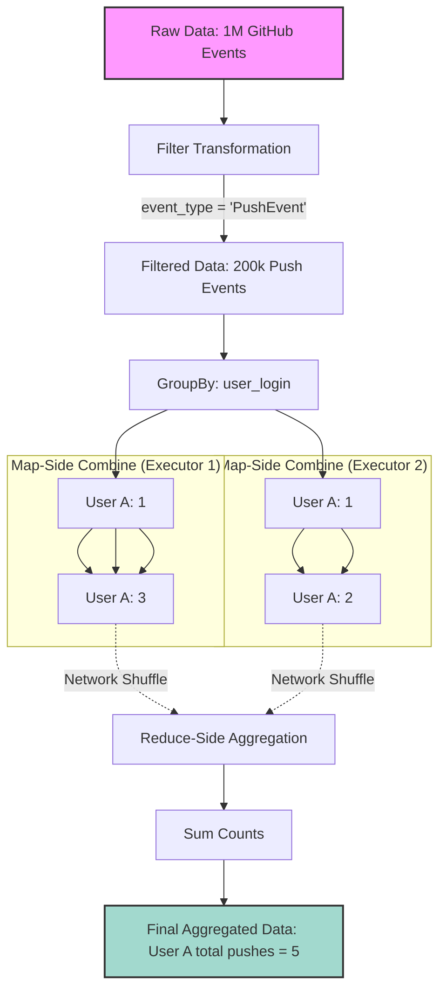

# Filtering and Aggregating

**Transforming raw datasets by narrowing down rows and summarizing data to extract meaningful metrics using Spark's core transformation functions.**

## Why It Matters
Raw data is rarely useful in its original state. A massive dataset containing billions of server logs or user events holds potential, but the actual value comes from filtering out the noise and aggregating the remainder into key performance indicators (KPIs) or analytical summaries. Filtering reduces the volume of data moving through the cluster, minimizing network shuffling and memory usage. Aggregating turns millions of individual events into concise, actionable insights (like daily active users, total revenue per region, or average response time). Mastering these two operations is the core of day-to-day data engineering and ETL (Extract, Transform, Load) processes.

## How It Works
Filtering and aggregation operate differently depending on whether you are using the older RDD API or the modern DataFrame/Dataset API.

**Filtering:**
*   **RDDs:** Use the `filter()` method, which takes a function returning a Boolean. If the function returns `true` for a record, the record is kept. This requires writing raw Scala/Python functions, which Spark executes as opaque bytecode, preventing Spark's Catalyst optimizer from heavily optimizing the operation.
*   **DataFrames:** You can use `filter()` or `where()` (they are aliases). Instead of raw functions, you pass Column expressions (e.g., `col("age") > 18` or SQL strings like `"age > 18"`). Because Spark understands the semantics of Column expressions, the Catalyst optimizer can perform "Predicate Pushdown"—filtering the data at the storage level (like Parquet files) before it even enters Spark's memory.

**Aggregating:**
Aggregation involves grouping data by one or more keys and then applying an aggregate function (like `sum`, `count`, `avg`, `min`, `max`) to the grouped values.
*   **RDDs:** Aggregation is famously tricky. Operations like `groupByKey()` are notorious for causing OutOfMemory errors because they pull all values for a single key into the memory of a single executor before processing. Better alternatives include `reduceByKey()` or `aggregateByKey()`, which perform a "map-side combine." This means they partially aggregate data on the local node *before* shuffling it across the network, drastically reducing data transfer.
*   **DataFrames:** The DataFrame API simplifies this immensely. You use the `groupBy()` method followed by `agg()` or specific aggregation functions. Under the hood, Spark SQL's Catalyst optimizer automatically implements map-side combinations and hash-based aggregations, ensuring high performance without the developer needing to manually implement `aggregateByKey`.

In our GitHub Archive example, a common aggregation pipeline involves filtering for specific event types (e.g., "PushEvent") and then grouping by the user to count how many pushes each user made.

## Flow Diagram



## Data Visualization

**End-to-End Filtering and Aggregation Pipeline:**

*Step 1: Raw DataFrame*
| user_login | event_type | repo_name |
| :--- | :--- | :--- |
| alice | PushEvent | spark-core |
| bob | IssueEvent | spark-sql |
| alice | PushEvent | spark-mllib |
| charlie | PushEvent | hadoop |
| alice | IssueEvent | spark-core |

*Step 2: Filter (`event_type === "PushEvent"`)*
| user_login | event_type | repo_name |
| :--- | :--- | :--- |
| alice | PushEvent | spark-core |
| alice | PushEvent | spark-mllib |
| charlie | PushEvent | hadoop |

*Step 3: GroupBy & Aggregate (`groupBy("user_login").count()`)*
| user_login | count |
| :--- | :--- |
| alice | 2 |
| charlie | 1 |

## Code Example

```scala
import org.apache.spark.sql.SparkSession
import org.apache.spark.sql.functions._

object FilterAndAggregate {
  def main(args: Array[String]): Unit = {
    val spark = SparkSession.builder()
      .appName("Filter and Aggregate Example")
      .master("local[*]")
      .getOrCreate()

    // Load data (assuming explicit schema from previous step)
    val df = spark.read.json("src/main/resources/github_events.json")

    // --- FILTERING ---
    // Using Column Expressions (Recommended for performance)
    val pushEventsDf = df.filter(col("type") === "PushEvent")
    
    // Using SQL Strings (Also optimized by Catalyst)
    val specificRepoDf = pushEventsDf.where("repo.name = 'apache/spark'")

    // --- AGGREGATING ---
    // Example 1: Simple Count by Key
    val pushCountByUser = pushEventsDf
      .groupBy("actor.login")
      .count()
      .orderBy(desc("count")) // Sort to find the most active users

    println("Top users by push count:")
    pushCountByUser.show(5)

    // Example 2: Multiple Aggregations using .agg()
    // Let's assume we have numerical data in our JSON
    val complexAggDf = pushEventsDf
      .groupBy("repo.name")
      .agg(
        count("id").alias("total_pushes"),
        approx_count_distinct("actor.login").alias("unique_contributors")
      )

    println("Repository Statistics:")
    complexAggDf.show(5)

    spark.stop()
  }
}
```

## Common Pitfalls

*   **Using `groupByKey` on RDDs:** As mentioned, this is a fatal mistake in large-scale Spark processing. It causes massive data shuffling and frequent memory exhaustion. Always prefer DataFrame aggregations, or if using RDDs, `reduceByKey`.
*   **Filtering Late:** Applying filters *after* joining or aggregating datasets. Always filter as early as possible in your pipeline. Reducing the data volume upfront speeds up all subsequent operations and reduces memory pressure.
*   **Confusing `where` and `filter`:** In Spark DataFrames, they are functionally identical aliases. Arguing over which to use is a matter of stylistic preference, though `where` is often preferred by those with strong SQL backgrounds.
*   **Null Handling in Aggregations:** Forgetting that aggregate functions like `sum` or `avg` often ignore null values, which might skew calculations if not explicitly handled (e.g., using `coalesce` or `na.fill`).
*   **Sorting before Grouping:** Attempting to sort data globally before a `groupBy` operation is usually a waste of resources, as the shuffle required for grouping will destroy the sort order. Always order *after* aggregation.

## Key Takeaway
Always filter data as early as possible to minimize data volume, and leverage the DataFrame API's `groupBy` and `agg` methods to let Spark's Catalyst optimizer automatically handle complex, distributed aggregation logic efficiently.
