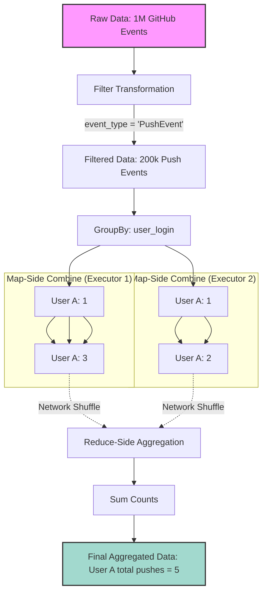

# Filtering and Aggregating

**Transforming raw datasets by narrowing down rows and summarizing data to extract meaningful metrics using Spark's core transformation functions.**

## Why It Matters
Raw data is rarely useful in its original state. A massive dataset containing billions of server logs or user events holds potential, but the actual value comes from filtering out the noise and aggregating the remainder into key performance indicators (KPIs) or analytical summaries. Filtering reduces the volume of data moving through the cluster, minimizing network shuffling and memory usage. Aggregating turns millions of individual events into concise, actionable insights (like daily active users, total revenue per region, or average response time). Mastering these two operations is the core of day-to-day data engineering and ETL (Extract, Transform, Load) processes.

## How It Works
Filtering and aggregation operate differently depending on whether you are using the older RDD API or the modern DataFrame/Dataset API.

**Filtering:**
*   **RDDs:** Use the `filter()` method, which takes a function returning a Boolean. If the function returns `true` for a record, the record is kept. This requires writing raw Scala/Python functions, which Spark executes as opaque bytecode, preventing Spark's Catalyst optimizer from heavily optimizing the operation.
*   **DataFrames:** You can use `filter()` or `where()` (they are aliases). Instead of raw functions, you pass Column expressions (e.g., `col("age") > 18` or SQL strings like `"age > 18"`). Because Spark understands the semantics of Column expressions, the Catalyst optimizer can perform "Predicate Pushdown"—filtering the data at the storage level (like Parquet files) before it even enters Spark's memory.

**Aggregating:**
Aggregation involves grouping data by one or more keys and then applying an aggregate function (like `sum`, `count`, `avg`, `min`, `max`) to the grouped values.
*   **RDDs:** Aggregation is famously tricky. Operations like `groupByKey()` are notorious for causing OutOfMemory errors because they pull all values for a single key into the memory of a single executor before processing. Better alternatives include `reduceByKey()` or `aggregateByKey()`, which perform a "map-side combine." This means they partially aggregate data on the local node *before* shuffling it across the network, drastically reducing data transfer.
*   **DataFrames:** The DataFrame API simplifies this immensely. You use the `groupBy()` method followed by `agg()` or specific aggregation functions. Under the hood, Spark SQL's Catalyst optimizer automatically implements map-side combinations and hash-based aggregations, ensuring high performance without the developer needing to manually implement `aggregateByKey`.

In our GitHub Archive example, a common aggregation pipeline involves filtering for specific event types (e.g., "PushEvent") and then grouping by the user to count how many pushes each user made.

## Flow Diagram



## Data Visualization

**End-to-End Filtering and Aggregation Pipeline:**

*Step 1: Raw DataFrame*
| user_login | event_type | repo_name |
| :--- | :--- | :--- |
| alice | PushEvent | spark-core |
| bob | IssueEvent | spark-sql |
| alice | PushEvent | spark-mllib |
| charlie | PushEvent | hadoop |
| alice | IssueEvent | spark-core |

*Step 2: Filter (`event_type === "PushEvent"`)*
| user_login | event_type | repo_name |
| :--- | :--- | :--- |
| alice | PushEvent | spark-core |
| alice | PushEvent | spark-mllib |
| charlie | PushEvent | hadoop |

*Step 3: GroupBy & Aggregate (`groupBy("user_login").count()`)*
| user_login | count |
| :--- | :--- |
| alice | 2 |
| charlie | 1 |

## Code Example

```scala
import org.apache.spark.sql.SparkSession
import org.apache.spark.sql.functions._

object FilterAndAggregate {
  def main(args: Array[String]): Unit = {
    val spark = SparkSession.builder()
      .appName("Filter and Aggregate Example")
      .master("local[*]")
      .getOrCreate()

    // Load data (assuming explicit schema from previous step)
    val df = spark.read.json("src/main/resources/github_events.json")

    // --- FILTERING ---
    // Using Column Expressions (Recommended for performance)
    val pushEventsDf = df.filter(col("type") === "PushEvent")
    
    // Using SQL Strings (Also optimized by Catalyst)
    val specificRepoDf = pushEventsDf.where("repo.name = 'apache/spark'")

    // --- AGGREGATING ---
    // Example 1: Simple Count by Key
    val pushCountByUser = pushEventsDf
      .groupBy("actor.login")
      .count()
      .orderBy(desc("count")) // Sort to find the most active users

    println("Top users by push count:")
    pushCountByUser.show(5)

    // Example 2: Multiple Aggregations using .agg()
    // Let's assume we have numerical data in our JSON
    val complexAggDf = pushEventsDf
      .groupBy("repo.name")
      .agg(
        count("id").alias("total_pushes"),
        approx_count_distinct("actor.login").alias("unique_contributors")
      )

    println("Repository Statistics:")
    complexAggDf.show(5)

    spark.stop()
  }
}
```

## Common Pitfalls

*   **Using `groupByKey` on RDDs:** As mentioned, this is a fatal mistake in large-scale Spark processing. It causes massive data shuffling and frequent memory exhaustion. Always prefer DataFrame aggregations, or if using RDDs, `reduceByKey`.
*   **Filtering Late:** Applying filters *after* joining or aggregating datasets. Always filter as early as possible in your pipeline. Reducing the data volume upfront speeds up all subsequent operations and reduces memory pressure.
*   **Confusing `where` and `filter`:** In Spark DataFrames, they are functionally identical aliases. Arguing over which to use is a matter of stylistic preference, though `where` is often preferred by those with strong SQL backgrounds.
*   **Null Handling in Aggregations:** Forgetting that aggregate functions like `sum` or `avg` often ignore null values, which might skew calculations if not explicitly handled (e.g., using `coalesce` or `na.fill`).
*   **Sorting before Grouping:** Attempting to sort data globally before a `groupBy` operation is usually a waste of resources, as the shuffle required for grouping will destroy the sort order. Always order *after* aggregation.

## Key Takeaway
Always filter data as early as possible to minimize data volume, and leverage the DataFrame API's `groupBy` and `agg` methods to let Spark's Catalyst optimizer automatically handle complex, distributed aggregation logic efficiently.


---

## 🎓 Deep Learning Questions

### Q1: Why Was This Concept Introduced?
Before Apache Spark, analyzing big data typically required MapReduce. Filtering data involved writing verbose Map tasks, and aggregations required complex combinations of Combiners and Reducers. This process involved extensive disk I/O, as intermediate results were written back to disk, slowing down workflows considerably. Spark introduced high-level RDD APIs like `filter`, `reduceByKey`, and `aggregateByKey`, which performed computations in-memory and supported map-side combinations automatically, significantly reducing network shuffling. Later, Spark introduced the DataFrame API, which revolutionized filtering and aggregation by adding the Catalyst Optimizer. This engine allowed Spark to push filters down to the storage level (e.g., reading only needed data from Parquet) and intelligently plan aggregations using Hash-based and Sort-based execution, freeing developers from managing low-level distributed computing mechanics.

### Q2: What Exactly Is This Concept and How Does It Work?
**Filtering** evaluates each row or record against a specific condition (predicate). If the condition is true, the row is kept; if false, it is discarded. In Spark DataFrames, this is executed using `.filter()` or `.where()`. The Catalyst optimizer can often apply "predicate pushdown," filtering data at the source before it even enters Spark's memory.

**Aggregating** combines multiple rows into a single summary row based on grouping columns. It operates via `.groupBy()` followed by an aggregation function like `.count()`, `.sum()`, or `.avg()`. Internally, Spark executes aggregations in two phases:
1. **Partial Aggregation (Map-Side Combine):** Each executor groups and aggregates the data in its local partitions.
2. **Final Aggregation (Reduce-Side):** The partially aggregated data is shuffled across the network based on the grouping keys. Then, a final aggregation computes the exact metric for each key. This two-step process minimizes the amount of data transferred over the network.

### Q3: Where Should This Concept Be Used?
Filtering and aggregation are ubiquitous in big data processing. Key use cases include:
*   **E-Commerce (Amazon):** Filtering out inactive users and aggregating total daily sales per product category to compute revenue KPIs.
*   **Streaming (Netflix):** Filtering log events to capture only video playback errors, then grouping by device type to identify platform-specific bugs.
*   **Ride-Hailing (Uber):** Filtering for completed rides within a specific city and calculating the average fare and trip duration over the last 24 hours.
*   **Cybersecurity:** Filtering network logs for abnormal IP addresses and aggregating access attempts by IP to detect brute-force attacks.
Whenever raw data needs to be reduced into actionable metrics or when noise needs to be eliminated, filtering and aggregation are the right tools.

### Q4: Where Should This Concept NOT Be Used?
*   **Do not use RDD `groupByKey()`:** It forces all values for a single key into memory on a single node without a map-side combine, leading to massive network shuffles and frequent `OutOfMemoryError`s. Use `reduceByKey` or DataFrame aggregations instead.
*   **Do not aggregate before filtering:** Always filter first. Grouping and aggregating an entire dataset only to filter out 90% of the aggregated results wastes immense compute resources.
*   **Do not use distinct counts on massive cardinality:** Exact `countDistinct()` on highly unique columns (like user IDs across billions of rows) requires moving all distinct values across the network. If approximate counts are acceptable, use `approx_count_distinct()` instead.
*   **Avoid heavy User Defined Functions (UDFs) in filters:** Using Python UDFs inside `.filter()` forces Spark to deserialize data out of its optimized format, bypassing Catalyst optimizations like predicate pushdown. Use native Spark SQL functions.

### Q5: How Is This Concept Different from Hadoop?

| Aspect | Hadoop MapReduce | Apache Spark |
| :--- | :--- | :--- |
| **Architecture** | Requires custom Mapper for filtering, Reducer for aggregation. | High-level APIs (`filter`, `groupBy`, `agg`). |
| **Performance** | Slow; writes intermediate aggregation steps to disk. | Fast; in-memory map-side combine and Catalyst optimization. |
| **Processing Model** | Disk-based, batch-oriented Map and Reduce phases. | In-memory DAG (Directed Acyclic Graph) execution. |
| **Optimization** | Developer must manually optimize Combiners. | Catalyst Optimizer automatically plans efficient execution. |
| **Ease of Development** | Verbose Java code. | Concise SQL-like expressions (Scala, Python, SQL). |
| **Predicate Pushdown** | Limited, relies on manual input format handling. | Built-in for columnar formats like Parquet/ORC. |

### Q6: How Can This Concept Be Related to a Traditional RDBMS?

| Spark DataFrame API | SQL Equivalent | Purpose |
| :--- | :--- | :--- |
| `df.filter(col("age") > 18)` | `WHERE age > 18` | Filters rows before aggregation. |
| `df.where("age > 18")` | `WHERE age > 18` | Exact same as `.filter()`. |
| `df.groupBy("department")` | `GROUP BY department` | Groups rows by a specific key. |
| `df.agg(sum("salary"))` | `SUM(salary)` | Applies an aggregate function to grouped data. |
| `df.filter(col("salary") > 1000)` | `HAVING sum(salary) > 1000` | Applied *after* aggregation (if filtering on agg result). |

### Q7: What Happens Behind the Scenes?
1. **Driver:** Reads the user code `df.filter(...).groupBy(...).count()`.
2. **DAG Generation:** Catalyst Optimizer creates a logical plan, applies optimizations (Predicate Pushdown), and creates a physical plan.
3. **Tasks to Executors:** The physical plan is divided into stages and tasks sent to executors.
4. **Stage 1 (Map/Filter/Combine):** Executors read data, apply the filter condition locally. They then perform a partial aggregation (e.g., counting filtered records per key within their local partition).
5. **Shuffle:** The partially aggregated data is grouped by key and exchanged across the network to destination executors.
6. **Stage 2 (Reduce/Final Aggregation):** Destination executors receive partial aggregates for specific keys and combine them into final exact counts.

```text
[Source Data]
      |
[Executor 1: Filter & Partial Agg] ---> (KeyA: 5, KeyB: 2) --+
      |                                                      |-- SHUFFLE --+--> [Executor 3: Final Agg KeyA] (KeyA: 15)
[Executor 2: Filter & Partial Agg] ---> (KeyA: 10, KeyB: 8) -+             |--> [Executor 4: Final Agg KeyB] (KeyB: 10)
```

### Q8: Performance Considerations, Best Practices, and Common Mistakes

| Category | Recommendation | Why It Matters |
| :--- | :--- | :--- |
| **Optimization** | **Filter Early:** Place `.filter()` as early as possible in your code. | Reduces the volume of data that needs to be shuffled, joined, or aggregated later. |
| **Storage** | Use Columnar Formats (Parquet/ORC). | Allows Spark to use Predicate Pushdown to skip reading irrelevant data blocks entirely. |
| **Performance** | Use `approx_count_distinct` for large datasets. | Exact distinct counts cause massive shuffles. Approximations (HyperLogLog) are much faster with <5% error. |
| **Common Mistake** | Using RDD `groupByKey()`. | Causes `OutOfMemoryError` because it pulls all values for a key into a single array without local pre-aggregation. |
| **Best Practice** | Use built-in functions over UDFs for filtering/aggregation. | Built-in functions operate directly on JVM memory. Python UDFs cause expensive serialization overhead. |

### Q9: Interview Questions

#### Beginner
1. **What is the difference between `filter()` and `where()` in Spark DataFrames?**
   *Answer:* There is no difference; they are exact aliases of each other. `where` is provided for SQL familiarity.
2. **Why is `reduceByKey` better than `groupByKey` in RDDs?**
   *Answer:* `reduceByKey` aggregates data locally on each partition (map-side combine) before shuffling. `groupByKey` shuffles all raw data across the network, leading to high network I/O and OOM errors.
3. **Name three common aggregation functions in Spark.**
   *Answer:* `count()`, `sum()`, `avg()` (or `mean()`), `min()`, `max()`.

#### Intermediate
4. **What is Predicate Pushdown in Spark?**
   *Answer:* An optimization where Spark pushes filter conditions down to the data source (like Parquet). Instead of reading all data into memory and then filtering, it only reads the blocks that satisfy the filter, massively saving I/O.
5. **How does Spark handle aggregation under the hood for DataFrames?**
   *Answer:* It uses a two-phase aggregation: Hash-based partial aggregation on the executors (map-side combine), followed by a shuffle, and then a final Hash or Sort-based aggregation to produce the result.
6. **How do you calculate multiple aggregations at once on a DataFrame?**
   *Answer:* By chaining `.agg()` after `.groupBy()`. Example: `df.groupBy("dept").agg(sum("salary"), avg("age"))`.

#### Advanced
7. **Explain the difference between HashAggregate and SortAggregate in Spark's physical plan.**
   *Answer:* HashAggregate uses an in-memory hash map to compute aggregations, which is very fast but requires mutable states in memory. If memory runs low, or if the aggregation functions don't support hash-based processing, Spark falls back to SortAggregate, which sorts the data by key first and then aggregates sequentially.
8. **How do you handle data skew during aggregation?**
   *Answer:* If one key has vastly more data than others, it causes a straggler task. You can solve this by "salting" the keys—adding a random number to the key to distribute the large key across multiple partitions, performing a partial aggregation, and then doing a second aggregation without the salt.
9. **How would you optimize a query doing `countDistinct` on a billion-row DataFrame?**
   *Answer:* Using `approx_count_distinct()` instead. It uses the HyperLogLog algorithm to provide an estimated distinct count (usually within 2-5% accuracy) while completely avoiding the massive shuffle required by exact distinct counting.

#### Scenario-Based
10. **You have a 10TB dataset of web logs. You need to group by user ID and collect a list of all URLs visited by each user. How do you approach this, and what is the risk?**
    *Answer:* You would use `.groupBy("user_id").agg(collect_list("url"))`. The massive risk here is memory exhaustion. Unlike `sum` or `count`, `collect_list` cannot be combined in a fixed memory footprint. If a user visited a million URLs, the single executor handling that user ID will crash with an OutOfMemoryError.
11. **Your Spark job applies a filter `col("status") == "ERROR"`, then joins with another table, then groups by region. The job is very slow. How do you investigate?**
    *Answer:* I would look at the Spark UI's SQL tab. First, check if Predicate Pushdown occurred for the filter. If reading JSON/CSV, it won't push down. Second, I'd check the volume of data entering the join. The filter is placed correctly (before the join), but I'd ensure no UDFs are blocking optimization.

### Q10: Complete Real-World Example

**Business Problem:**
A streaming service (like Netflix) wants to identify which geographic regions have the most users experiencing app crashes. They have massive raw server logs, and they need a daily summary to prioritize engineering efforts.

**Dataset:** `server_logs.json`
```json
{"user_id": "u1", "region": "US-East", "event_type": "play", "timestamp": "2023-10-01T10:00:00Z"}
{"user_id": "u2", "region": "EU-West", "event_type": "crash", "timestamp": "2023-10-01T10:05:00Z"}
{"user_id": "u3", "region": "US-East", "event_type": "crash", "timestamp": "2023-10-01T10:10:00Z"}
{"user_id": "u1", "region": "US-East", "event_type": "crash", "timestamp": "2023-10-01T10:15:00Z"}
```

**PySpark Code:**
```python
from pyspark.sql import SparkSession
from pyspark.sql.functions import col, count, desc

# 1. Initialize SparkSession
spark = SparkSession.builder \
    .appName("RegionCrashAnalytics") \
    .getOrCreate()

# 2. Load the raw data
raw_logs_df = spark.read.json("server_logs.json")

# 3. FILTERING: Keep only crash events
# This minimizes the data moving forward in the pipeline
crash_logs_df = raw_logs_df.filter(col("event_type") == "crash")

# 4. AGGREGATING: Group by region and count crashes
crash_summary_df = crash_logs_df \
    .groupBy("region") \
    .agg(
        count("user_id").alias("total_crashes")
    ) \
    .orderBy(desc("total_crashes")) # Sort to find worst regions

# 5. Show results
crash_summary_df.show()

# Expected Output:
# +-------+-------------+
# | region|total_crashes|
# +-------+-------------+
# |US-East|            2|
# |EU-West|            1|
# +-------+-------------+

spark.stop()
```

**Step-by-Step Execution Walkthrough:**
1.  Spark creates a logical plan to read the JSON, filter, group, and order.
2.  During execution, executors scan the JSON. They immediately apply the `event_type == 'crash'` filter row-by-row.
3.  Each executor performs a local map-side combine. If Executor 1 has two crashes for `US-East`, it locally groups them into `(US-East: 2)` before shuffling.
4.  Data is shuffled across the network based on the `region` key.
5.  Final aggregation sums the partial counts for each region, applies the descending sort, and returns the result.

**Performance Notes:**
Because we filtered *before* the `.groupBy()`, only the crash records were shuffled across the network. If we had grouped by region first, calculated total events, and *then* filtered for crashes, Spark would have pointlessly shuffled and tracked normal playback events, wasting massive network bandwidth.

### 💡 Key Takeaways
- Filter as early as possible in your data pipeline to reduce memory usage and shuffle size.
- `where()` and `filter()` are strictly identical in Spark DataFrames.
- DataFrame `.groupBy()` automatically utilizes optimized map-side combinations (HashAggregate).
- Always avoid RDD `.groupByKey()` due to OutOfMemory risks; use `.reduceByKey()` instead.
- Catalyst optimizer enables "Predicate Pushdown", skipping irrelevant data reads at the disk level when using columnar formats like Parquet.

### ⚠️ Common Misconceptions
- **Misconception:** You should aggregate all data before filtering to get a complete picture. **Reality:** Filtering late causes immense performance bottlenecks. Always filter first.
- **Misconception:** Python UDFs inside a `.filter()` are fine. **Reality:** They destroy performance by breaking Catalyst optimization and forcing data serialization outside the JVM.
- **Misconception:** `.where()` is for SQL people and `.filter()` is for developers, so they must work differently. **Reality:** They map to the exact same underlying Catalyst logical plan node.

### 🔗 Related Spark Concepts
- Predicate Pushdown
- Catalyst Optimizer
- Data Shuffling
- RDDs vs DataFrames
- Map-Side Combiner

### 📚 References for Further Reading
- Apache Spark Official Documentation
- Learning Spark (O'Reilly)
- Spark: The Definitive Guide (O'Reilly)
