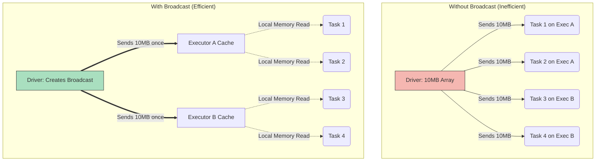

# Broadcast Variables

**Distributing large, read-only data efficiently across all worker nodes to optimize lookups and avoid network bottlenecks.**

## Why It Matters
In distributed computing, transferring data across the network (shuffling) is the most expensive operation. When a Spark transformation requires external data—such as a lookup table mapping country codes to country names, or a list of bad IP addresses to filter out—Spark's default behavior is to serialize that variable and send it to *every single task* that requires it. If you have a 10MB lookup table and 10,000 tasks running across your cluster, Spark will send that 10MB file 10,000 times, resulting in 100GB of redundant network traffic. This severely degrades performance. Broadcast Variables solve this by sending the large read-only variable to each *executor* only once, caching it in memory so that all tasks running on that executor can share it.

## How It Works
Broadcast variables are read-only shared variables. They are created on the driver program and distributed to the worker nodes using efficient, peer-to-peer BitTorrent-like algorithms. 

When you create a broadcast variable in the driver (using `sparkContext.broadcast(variable)`), Spark wraps the variable in a `Broadcast` object. Instead of sending the actual data with the task serialization closure, Spark sends a reference to the `Broadcast` object. 

When an executor receives a task, it checks if it already has the data for that `Broadcast` reference in its block manager. 
1. If it does, the task reads the data from local memory. 
2. If it doesn't, the executor fetches the data. Because of the BitTorrent-like protocol, executors can fetch pieces of the broadcast variable from each other, not just from the driver. This prevents the driver's network interface from becoming a bottleneck when broadcasting large variables to hundreds of nodes.

**When to use them:**
*   **Large Lookup Tables:** E.g., mapping user IDs to demographic profiles.
*   **Machine Learning Models:** Broadcasting a trained model to worker nodes so they can apply predictions to streaming data.
*   **Static Configurations:** Sending a large dictionary of configuration parameters.

**When NOT to use them:**
*   For small variables (e.g., an integer threshold or a short string). The overhead of creating a broadcast variable isn't worth it.
*   For data that exceeds the memory of the executor. If the variable is larger than the available executor memory, it will cause an OutOfMemory error.
*   For data that changes. Broadcast variables are strictly immutable.

## Flow Diagram



## Data Visualization

**Performance Comparison (Conceptual):**

| Scenario | Variable Size | Tasks | Total Network Traffic (No Broadcast) | Total Network Traffic (With Broadcast, 10 Executors) |
| :--- | :--- | :--- | :--- | :--- |
| Small Threshold | 1 KB | 10,000 | ~10 MB (Negligible) | ~10 KB (Overhead not worth it) |
| IP Blacklist | 10 MB | 10,000 | **100 GB** (Severe Bottleneck) | **100 MB** (Highly Efficient) |
| Zip Code Map | 50 MB | 5,000 | **250 GB** (Crash Risk) | **500 MB** (Highly Efficient) |

## Code Example

```scala
import org.apache.spark.sql.SparkSession
import org.apache.spark.sql.functions._
import scala.io.Source

object BroadcastExample {
  def main(args: Array[String]): Unit = {
    val spark = SparkSession.builder()
      .appName("Broadcast Variables Example")
      .master("local[*]")
      .getOrCreate()
      
    val sc = spark.sparkContext

    // 1. Create a large, static dataset on the driver
    // In a real scenario, you might read this from a database or a file
    val countryCodeMap: Map[String, String] = Map(
      "US" -> "United States",
      "GB" -> "United Kingdom",
      "CA" -> "Canada",
      "IN" -> "India",
      "FR" -> "France"
      // ... potentially thousands of entries
    )

    // 2. Create the Broadcast Variable
    // Spark sends this map to the executors once
    val broadcastCountryCodes = sc.broadcast(countryCodeMap)

    // 3. Load the main dataset (e.g., user logs containing country codes)
    import spark.implicits._
    val userLogsDf = Seq(
      (1, "alice", "US"),
      (2, "bob", "GB"),
      (3, "charlie", "IN"),
      (4, "david", "US")
    ).toDF("user_id", "name", "country_code")

    // 4. Use the Broadcast Variable inside a UDF (User Defined Function)
    // The UDF will read from the executor's local memory
    val lookupCountryName = udf((code: String) => {
      // Access the value using .value
      broadcastCountryCodes.value.getOrElse(code, "Unknown")
    })

    // 5. Apply the transformation
    val enrichedDf = userLogsDf.withColumn(
      "country_name", 
      lookupCountryName(col("country_code"))
    )

    enrichedDf.show()
    
    // Note: If you are joining two DataFrames and one is small, 
    // you can use the broadcast() hint instead of doing this manually.
    // enrichedDf.join(broadcast(smallDf), "key")

    spark.stop()
  }
}
```

## Common Pitfalls

*   **Modifying Broadcast Variables:** Attempting to update a broadcast variable inside a task. Broadcast variables are strictly read-only. Trying to modify them will either result in an error or inconsistent state across nodes.
*   **Broadcasting Datasets that are Too Large:** If your lookup table is 10GB and your executor memory is only 8GB, your executors will crash with OutOfMemory errors. Broadcast variables must fit comfortably in memory.
*   **Forgetting `.value`:** When using a broadcast variable in a function, you must call `.value` (e.g., `myVar.value`) to access the underlying data. Referencing the broadcast wrapper object directly will fail.
*   **Overusing Broadcast:** Broadcasting tiny variables (like a single integer or boolean flag). The overhead of the BitTorrent distribution mechanism is slower than simply letting Spark serialize the small variable naturally.
*   **Driver Memory Limits:** The driver must hold the entire broadcast variable in memory to serialize and distribute it. If the variable is huge, you might need to increase driver memory, not just executor memory.

## Key Takeaway
Broadcast variables are the optimal solution for efficiently distributing large, read-only lookup tables across a Spark cluster, dramatically reducing network traffic and speeding up joins and mappings.
