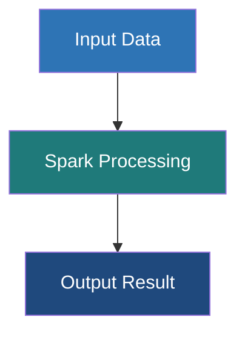

# Uberjars (Fat JARs)

**Packaging a compiled application alongside all of its external dependencies into a single, comprehensive JAR file for seamless deployment.**

## Why It Matters
When you write a Spark application in Java or Scala, your code rarely works in isolation. You likely depend on external libraries—perhaps a custom JSON parser, a database driver (like PostgreSQL JDBC), or a specific logging framework. When you run your code locally in an IDE, the build tool automatically resolves and provides these libraries. However, when you deploy your application to a Spark cluster using `spark-submit`, the cluster worker nodes *only* have access to standard Spark and Hadoop libraries. If your code calls a third-party library that isn't on the cluster, the job will crash with a dreaded `ClassNotFoundException` or `NoClassDefFoundError`. 

The solution is an **Uberjar** (also known as a Fat JAR). By bundling your compiled code and all your third-party dependencies into one single massive JAR file, you guarantee that wherever your application runs, it has everything it needs to execute successfully.

## How It Works
Creating an uberjar requires specific plugins for your build tool, as standard compilation only packages your own source code.

**SBT (Scala Build Tool):**
In the Scala ecosystem, the standard tool is `sbt-assembly`. You add the plugin to your `project/plugins.sbt` file. When you run the `sbt assembly` command, the plugin:
1. Compiles your source code.
2. Identifies all library dependencies defined in `build.sbt`.
3. Unpacks the JAR files of those dependencies.
4. Repackages all the unpacked `.class` files, along with your compiled classes, into a single new JAR file.

**Maven (Java/Scala):**
For Maven, the `maven-assembly-plugin` or the `maven-shade-plugin` is used. The `shade` plugin is generally preferred for complex Spark projects because it can handle **dependency conflicts**.

**The Dependency Conflict Problem (Jar Hell):**
What happens if your application requires Google Guava version 28.0, but the Spark cluster environment itself loads Guava version 14.0? Because Spark's classes are often loaded first by the JVM, your application might be forced to use the older v14.0, leading to a `NoSuchMethodError` when you call a feature that only exists in v28.0. 
This is resolved via **Shading** (relocation). Build plugins like `sbt-assembly` or `maven-shade-plugin` can rewrite the byte code of your dependencies during the packaging phase. They rename the packages (e.g., changing `com.google.common` to `my.app.shaded.com.google.common`). This completely isolates your dependencies from the cluster's dependencies, preventing conflicts.

**The `provided` Scope:**
It is critical that you do not include Spark's own libraries (`spark-core`, `spark-sql`) in your uberjar. The cluster already provides these. Including them drastically increases your jar size (from ~10MB to ~300MB) and risks massive version conflicts. You instruct the build tool to exclude them by marking them as `provided` in your configuration.

## Flow Diagram



## Data Visualization

**Understanding the Contents of an Uberjar:**

To verify what is inside your jar, you can use the standard Unix `jar` or `unzip` command:
`jar tf target/scala-2.12/my-app-assembly-1.0.jar | grep "\.class"`

| Path Inside Jar | Source Origin | Reason it is there |
| :--- | :--- | :--- |
| `com/manning/spark/MyApp.class` | Your Source Code | The main execution logic |
| `com/typesafe/config/Config.class` | External Library | Brought in by sbt-assembly |
| `org/postgresql/Driver.class` | External Library | Brought in by sbt-assembly |
| `org/apache/spark/SparkContext.class` | **MISSING** | Correctly excluded via `provided` scope |

## Code Example

**Configuring `sbt-assembly`:**

1. Create/edit `project/plugins.sbt`:
```scala
// Add the sbt-assembly plugin
addSbtPlugin("com.eed3si9n" % "sbt-assembly" % "1.2.0")
```

2. Configure `build.sbt`:
```scala
name := "spark-uberjar-example"
version := "1.0"
scalaVersion := "2.12.15"

// Mark Spark dependencies as PROVIDED so they aren't bundled
libraryDependencies ++= Seq(
  "org.apache.spark" %% "spark-core" % "3.3.0" % "provided",
  "org.apache.spark" %% "spark-sql" % "3.3.0" % "provided",
  
  // This WILL be bundled in the uberjar
  "com.typesafe" % "config" % "1.4.2"
)

// Assembly Merge Strategy (Crucial for resolving duplicate files in dependencies)
assembly / assemblyMergeStrategy := {
  // Discard metadata files that commonly clash
  case PathList("META-INF", xs @ _*) => MergeStrategy.discard
  // Standard merge strategy for everything else
  case x => MergeStrategy.first
}
```

**Building the Jar:**
```bash
# Run this in your terminal at the project root
sbt clean assembly

# Output will indicate the location:
# [info] Packaging .../target/scala-2.12/spark-uberjar-example-assembly-1.0.jar ...
```

## Common Pitfalls

*   **Forgetting to mark Spark as `provided`:** This results in a massive 200MB+ jar file that takes a long time to upload to the cluster and frequently causes `java.lang.SecurityException: Invalid signature file digest` due to conflicting signed jars.
*   **Merge Strategy Errors:** When two dependencies contain files with the exact same path (often in `META-INF`), the assembly process will fail with a "deduplicate" error. You must implement an `assemblyMergeStrategy` (as shown in the code example) to tell the build tool which file to keep or to discard them both.
*   **Testing against a different Spark version:** Packaging an uberjar compiled against Spark 3.3 and deploying it to a cluster running Spark 2.4. The uberjar won't save you from API incompatibility errors.
*   **Over-Shading:** Applying shading blindly to everything can make debugging a nightmare, as stack traces will show unfamiliar, relocated package names (e.g., `my.shade.org.apache.commons...`) instead of the original names.
*   **Not testing the Uberjar locally:** Always test the fully built uberjar using `spark-submit --master local[*]` before deploying it to production to catch missing classes early.

## Key Takeaway
The uberjar is the standardized deployment artifact for compiled Spark applications; mastering build plugins like `sbt-assembly` and understanding dependency scoping (`provided`) prevents runtime failures and dependency hell in production.
