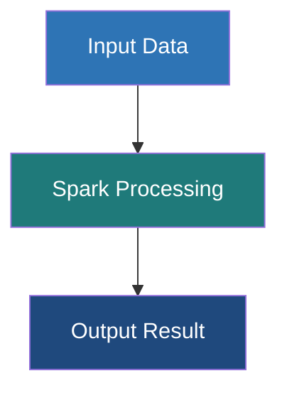

# Uberjars (Fat JARs)

**Packaging a compiled application alongside all of its external dependencies into a single, comprehensive JAR file for seamless deployment.**

## Why It Matters
When you write a Spark application in Java or Scala, your code rarely works in isolation. You likely depend on external libraries—perhaps a custom JSON parser, a database driver (like PostgreSQL JDBC), or a specific logging framework. When you run your code locally in an IDE, the build tool automatically resolves and provides these libraries. However, when you deploy your application to a Spark cluster using `spark-submit`, the cluster worker nodes *only* have access to standard Spark and Hadoop libraries. If your code calls a third-party library that isn't on the cluster, the job will crash with a dreaded `ClassNotFoundException` or `NoClassDefFoundError`. 

The solution is an **Uberjar** (also known as a Fat JAR). By bundling your compiled code and all your third-party dependencies into one single massive JAR file, you guarantee that wherever your application runs, it has everything it needs to execute successfully.

## How It Works
Creating an uberjar requires specific plugins for your build tool, as standard compilation only packages your own source code.

**SBT (Scala Build Tool):**
In the Scala ecosystem, the standard tool is `sbt-assembly`. You add the plugin to your `project/plugins.sbt` file. When you run the `sbt assembly` command, the plugin:
1. Compiles your source code.
2. Identifies all library dependencies defined in `build.sbt`.
3. Unpacks the JAR files of those dependencies.
4. Repackages all the unpacked `.class` files, along with your compiled classes, into a single new JAR file.

**Maven (Java/Scala):**
For Maven, the `maven-assembly-plugin` or the `maven-shade-plugin` is used. The `shade` plugin is generally preferred for complex Spark projects because it can handle **dependency conflicts**.

**The Dependency Conflict Problem (Jar Hell):**
What happens if your application requires Google Guava version 28.0, but the Spark cluster environment itself loads Guava version 14.0? Because Spark's classes are often loaded first by the JVM, your application might be forced to use the older v14.0, leading to a `NoSuchMethodError` when you call a feature that only exists in v28.0. 
This is resolved via **Shading** (relocation). Build plugins like `sbt-assembly` or `maven-shade-plugin` can rewrite the byte code of your dependencies during the packaging phase. They rename the packages (e.g., changing `com.google.common` to `my.app.shaded.com.google.common`). This completely isolates your dependencies from the cluster's dependencies, preventing conflicts.

**The `provided` Scope:**
It is critical that you do not include Spark's own libraries (`spark-core`, `spark-sql`) in your uberjar. The cluster already provides these. Including them drastically increases your jar size (from ~10MB to ~300MB) and risks massive version conflicts. You instruct the build tool to exclude them by marking them as `provided` in your configuration.

## Flow Diagram



## Data Visualization

**Understanding the Contents of an Uberjar:**

To verify what is inside your jar, you can use the standard Unix `jar` or `unzip` command:
`jar tf target/scala-2.12/my-app-assembly-1.0.jar | grep "\.class"`

| Path Inside Jar | Source Origin | Reason it is there |
| :--- | :--- | :--- |
| `com/manning/spark/MyApp.class` | Your Source Code | The main execution logic |
| `com/typesafe/config/Config.class` | External Library | Brought in by sbt-assembly |
| `org/postgresql/Driver.class` | External Library | Brought in by sbt-assembly |
| `org/apache/spark/SparkContext.class` | **MISSING** | Correctly excluded via `provided` scope |

## Code Example

**Configuring `sbt-assembly`:**

1. Create/edit `project/plugins.sbt`:
```scala
// Add the sbt-assembly plugin
addSbtPlugin("com.eed3si9n" % "sbt-assembly" % "1.2.0")
```

2. Configure `build.sbt`:
```scala
name := "spark-uberjar-example"
version := "1.0"
scalaVersion := "2.12.15"

// Mark Spark dependencies as PROVIDED so they aren't bundled
libraryDependencies ++= Seq(
  "org.apache.spark" %% "spark-core" % "3.3.0" % "provided",
  "org.apache.spark" %% "spark-sql" % "3.3.0" % "provided",
  
  // This WILL be bundled in the uberjar
  "com.typesafe" % "config" % "1.4.2"
)

// Assembly Merge Strategy (Crucial for resolving duplicate files in dependencies)
assembly / assemblyMergeStrategy := {
  // Discard metadata files that commonly clash
  case PathList("META-INF", xs @ _*) => MergeStrategy.discard
  // Standard merge strategy for everything else
  case x => MergeStrategy.first
}
```

**Building the Jar:**
```bash
# Run this in your terminal at the project root
sbt clean assembly

# Output will indicate the location:
# [info] Packaging .../target/scala-2.12/spark-uberjar-example-assembly-1.0.jar ...
```

## Common Pitfalls

*   **Forgetting to mark Spark as `provided`:** This results in a massive 200MB+ jar file that takes a long time to upload to the cluster and frequently causes `java.lang.SecurityException: Invalid signature file digest` due to conflicting signed jars.
*   **Merge Strategy Errors:** When two dependencies contain files with the exact same path (often in `META-INF`), the assembly process will fail with a "deduplicate" error. You must implement an `assemblyMergeStrategy` (as shown in the code example) to tell the build tool which file to keep or to discard them both.
*   **Testing against a different Spark version:** Packaging an uberjar compiled against Spark 3.3 and deploying it to a cluster running Spark 2.4. The uberjar won't save you from API incompatibility errors.
*   **Over-Shading:** Applying shading blindly to everything can make debugging a nightmare, as stack traces will show unfamiliar, relocated package names (e.g., `my.shade.org.apache.commons...`) instead of the original names.
*   **Not testing the Uberjar locally:** Always test the fully built uberjar using `spark-submit --master local[*]` before deploying it to production to catch missing classes early.

## Key Takeaway
The uberjar is the standardized deployment artifact for compiled Spark applications; mastering build plugins like `sbt-assembly` and understanding dependency scoping (`provided`) prevents runtime failures and dependency hell in production.

---

## 🎓 Deep Learning Questions

### Q1: Why Was This Concept Introduced?
Before Uberjars, deploying distributed applications was a nightmare. Developers had to manually ensure that every worker node in a cluster had the exact same third-party libraries installed. If you used a custom JSON parser, you had to ask the cluster administrator to pre-install it on 100+ machines, or you had to pass dozens of individual JAR files using `spark-submit --jars a.jar,b.jar,c.jar`. 

This approach was brittle, error-prone, and caused frequent `ClassNotFoundException` errors when a file was missed or updated incorrectly. Uberjars (Fat JARs) were introduced to solve this deployment friction. By bundling the application code and all its dependencies into one self-contained, portable artifact, developers can deploy anywhere without worrying about the cluster's pre-existing library state.

### Q2: What Exactly Is This Concept and How Does It Work?
An Uberjar is simply a standard Java Archive (JAR) file that contains not only your application's compiled `.class` files, but also all the `.class` files from your external third-party dependencies. 

It works during the build phase (using tools like Maven or SBT). The build plugin:
1. Resolves the dependency tree of your project.
2. Downloads all the required third-party JARs.
3. Unzips/extracts these JARs to get their raw `.class` files and resources.
4. Deduplicates files with the same name (using a Merge Strategy).
5. Repackages everything into a single, massive `.jar` file.

When you submit this Uberjar to Spark, the Spark Driver ships this single file to all Executor nodes, ensuring every task has the necessary code to execute.

### Q3: Where Should This Concept Be Used?
Uberjars are the industry standard for deploying production-grade Scala and Java Spark applications. 
- **Banking:** When joining transaction streams using proprietary, custom-built encryption libraries that must be shipped with the job.
- **Healthcare:** Processing medical records requiring specialized HL7 or FHIR parsing libraries that are not native to Spark.
- **Data Engineering:** Extracting data from obscure databases requiring specific JDBC drivers (e.g., legacy Oracle databases or Snowflake) bundled directly with the application.
Anytime your Spark job relies on non-standard libraries, an Uberjar is the best deployment mechanism.

### Q4: Where Should This Concept NOT Be Used?
- **Core Spark Libraries:** Never bundle `spark-core` or `spark-sql` inside your Uberjar. The cluster already has them. Bundling them causes massive jar inflation (300MB+) and severe runtime conflicts.
- **Pure Python/PySpark Projects:** Python code does not use JAR files for Python dependencies. Instead, PySpark uses `.zip`, `.whl` files, or virtual environments (`pex`/`conda`). (Though PySpark *can* use an Uberjar if it needs a custom JVM library).
- **Ad-Hoc Data Exploration:** When experimenting in a Jupyter/Zeppelin notebook, dynamically downloading packages via `--packages` is faster and easier than compiling an Uberjar.

### Q5: How Is This Concept Different from Hadoop?

| Aspect | Hadoop MapReduce | Apache Spark (Uberjars) |
| :--- | :--- | :--- |
| **Dependency Management** | Relied heavily on `DistributedCache` to ship files or `libjars` command-line argument. | Uses build-time Uberjars to bundle everything into one artifact. |
| **Execution Model** | Required manual setup of HADOOP_CLASSPATH on nodes. | The Spark Driver automatically ships the Uberjar to all Executors. |
| **Conflict Resolution** | Extremely difficult (Jar Hell). Often required cluster-wide environment changes. | Build tools (Maven Shade / SBT Assembly) can rewrite (shade) package names to prevent conflicts. |
| **Developer Experience** | Tedious, requiring sysadmin intervention for library updates. | Self-contained. Developers control dependencies entirely through build files. |
| **Typical Use Cases** | On-premise, static clusters with tightly controlled libraries. | Cloud-native, ephemeral clusters (Databricks, EMR) where dependencies change per job. |

### Q6: How Can This Concept Be Related to a Traditional RDBMS?

| Aspect | Traditional RDBMS | Apache Spark Uberjars |
| :--- | :--- | :--- |
| **Custom Functions** | Installing a DBA-approved extension (e.g., PostGIS) globally on the database server. | Bundling a geographic library in an Uberjar. No cluster admin required. |
| **Execution Scope** | Extensions affect the entire database and all users. | Uberjars are job-specific. Job A and Job B can use different library versions simultaneously. |
| **Deployment** | Running `CREATE EXTENSION` or copying `.dll`/`.so` files to the server. | Simply passing the `.jar` to `spark-submit`. |
| **Isolation** | Low isolation. A buggy extension can crash the database server. | High isolation. Dependencies are scoped to the JVM running that specific Spark application. |

### Q7: What Happens Behind the Scenes?
When you build and deploy an Uberjar, a multi-step process occurs across the build machine and the cluster:

```text
[Build Phase - Local Machine]
App Code + Dep 1 (JSON) + Dep 2 (JDBC)
       |
  SBT/Maven Plugin
       | (Unzips, resolves duplicates, merges)
       v
  Uberjar (app.jar)

[Deployment Phase - Spark Cluster]
   spark-submit --class MyApp app.jar
       |
       v
  Spark Driver (Loads app.jar into its Classpath)
       |
       |--- Broadcasts app.jar via HTTP/Torrent ---|
       v                                           v
Executor 1 (Node A)                        Executor 2 (Node B)
(Downloads app.jar to local disk)          (Downloads app.jar to local disk)
(Loads classes into Executor JVM)          (Loads classes into Executor JVM)
```
1. The **Build Tool** flattens all dependencies into one JAR.
2. `spark-submit` starts the **Driver**, loading the Uberjar into its JVM classpath.
3. The Driver acts as a file server, and **Executors** fetch the Uberjar.
4. Executors load the Uberjar into their JVMs, allowing tasks to execute third-party code.

### Q8: Performance Considerations, Best Practices, and Common Mistakes

| Category | Recommendation | Why It Matters |
| :--- | :--- | :--- |
| **Best Practice** | Use the `provided` scope for Spark libraries. | Prevents your JAR from swelling to 300MB+ and stops catastrophic version conflicts with the cluster's Spark version. |
| **Optimization** | Use Shading for conflicting libraries. | If you need Guava v30 but Spark uses v14, shading renames your Guava package so both can coexist in the same JVM. |
| **Performance** | Keep the Uberjar small. | Large JARs take longer to distribute over the network to 100+ Executors, slowing down job startup time. |
| **Mistake** | Ignoring Merge Strategy warnings. | SBT/Maven will fail if two dependencies have a `reference.conf` or `META-INF` file. You must explicitly define a discard/first strategy. |
| **Production Tip** | Host large Uberjars on cloud storage (S3/ADLS). | Instead of uploading from your laptop, deploying via an S3 path (`s3://bucket/app.jar`) is much faster for the cluster to download. |

### Q9: Interview Questions

**Beginner:**
1. **What is an Uberjar in Spark?**
   *Answer:* A single compiled JAR file that contains both your application code and all its external third-party dependencies, making it easily deployable.
2. **Why shouldn't you include `spark-core` in your Uberjar?**
   *Answer:* Because the Spark cluster already provides it. Including it inflates the file size and causes version conflicts. It should be marked as `provided`.
3. **What build tools are commonly used to create Uberjars in Spark?**
   *Answer:* SBT (using `sbt-assembly`) for Scala, and Maven (using `maven-shade-plugin` or `maven-assembly-plugin`) for Java/Scala.

**Intermediate:**
4. **What is the "Merge Strategy" in `sbt-assembly`?**
   *Answer:* It defines rules for handling files with the same name found in multiple dependency JARs (e.g., keeping the first, concatenating them, or discarding them, commonly used for `META-INF`).
5. **How does an Uberjar reach the executor nodes?**
   *Answer:* When you submit the job, the Spark Driver distributes the JAR file to the working directories of all Executor nodes before tasks are launched.
6. **If you are using pure PySpark, do you need an Uberjar?**
   *Answer:* Generally no, unless your PySpark job needs to call custom JVM/Scala code. Pure Python dependencies are managed using `.whl`, `.zip`, or `pex` files.

**Advanced:**
7. **Explain the concept of "Shading" and why it's necessary.**
   *Answer:* Shading rewrites the bytecode to rename a dependency's package (e.g., `com.google` to `my.shaded.com.google`). This prevents "Jar Hell" when your application and Spark's internal classpath require different versions of the same library.
8. **How does Spark handle the JVM Classpath when an Uberjar is submitted?**
   *Answer:* By default, Spark appends the user's Uberjar to the classpath. If `--conf spark.executor.userClassPathFirst=true` is set, Spark loads classes from the Uberjar before its own system classes, though this is risky.
9. **You get a `java.lang.SecurityException: Invalid signature file digest`. What caused this?**
   *Answer:* A signed dependency JAR was unzipped and merged into your Uberjar, breaking the cryptographic signature in `META-INF`. The merge strategy must discard `META-INF/*.RSA`, `*.DSA`, and `*.SF` files.

**Scenario-Based:**
10. **You wrote a PySpark job that needs to read from a legacy proprietary database, which only offers a Java JDBC driver. How do you deploy this?**
    *Answer:* I would package the JDBC driver into an Uberjar (or just use the raw driver jar if there are no sub-dependencies) and submit the PySpark job using `spark-submit --jars database-driver.jar my_pyspark_script.py`.

### Q10: Complete Real-World Example

**Business Problem:**
A ride-sharing company (like Uber) processes GPS coordinates using PySpark. To group rides geographically, they need to convert Latitude/Longitude into H3 Hexagon IDs. The official, highly optimized H3 library is written in Java. The data engineers must package this Java library as an Uberjar and call it from PySpark.

**Sample Dataset (`rides.csv`):**
```csv
ride_id,lat,lon
R101,37.775938,-122.415315
R102,40.712776,-74.005974
```

**Step 1: The Scala/Java Uberjar Build (`build.sbt`)**
First, we build an Uberjar containing the H3 Java library.
```scala
name := "h3-spark-dependency"
version := "1.0"
scalaVersion := "2.12.15"

// We only package the H3 library. Spark is provided by the cluster.
libraryDependencies += "com.uber" % "h3" % "3.7.0"
```
Running `sbt assembly` produces `target/h3-spark-dependency-assembly-1.0.jar`.

**Step 2: Full Working PySpark Code**
Now, we use PySpark to register the Java class loaded from our Uberjar.

```python
from pyspark.sql import SparkSession
from pyspark.sql.types import StringType
from pyspark.sql.functions import col, udf

# 1. Initialize SparkSession (in a real cluster, the --jars flag passes the Uberjar)
# Command: spark-submit --jars h3-spark-dependency-assembly-1.0.jar geo_processor.py
spark = SparkSession.builder \
    .appName("H3_Geo_Processing") \
    .getOrCreate()

def get_h3_index(lat, lon, resolution=9):
    """
    Python wrapper that uses Py4J to call the Java H3 library 
    which was distributed via our Uberjar.
    """
    # Access the JVM environment running in the Spark Executor
    jvm = spark.sparkContext._jvm
    
    # Instantiate the Java H3Core class from the Uberjar
    h3_core = jvm.com.uber.h3core.H3Core.newInstance()
    
    # Call the Java method to get the hexagon ID
    try:
        hex_addr = h3_core.geoToH3Address(float(lat), float(lon), resolution)
        return hex_addr
    except Exception as e:
        return None

# 2. Register the Python wrapper as a Spark UDF
h3_udf = udf(get_h3_index, StringType())

# 3. Load the data
df = spark.read.csv("rides.csv", header=True, inferSchema=True)

# 4. Apply the UDF to generate the H3 Hexagon ID
enriched_df = df.withColumn("h3_hex_id", h3_udf(col("lat"), col("lon")))

# 5. Show the results
enriched_df.show(truncate=False)

# Expected Output:
# +-------+---------+-----------+---------------+
# |ride_id|lat      |lon        |h3_hex_id      |
# +-------+---------+-----------+---------------+
# |R101   |37.775938|-122.415315|89283082803ffff|
# |R102   |40.712776|-74.005974 |892a100d203ffff|
# +-------+---------+-----------+---------------+
```

**Step-by-Step Execution Walkthrough:**
1. The developer compiles the H3 Java library into a Fat JAR (`h3-spark-dependency-assembly-1.0.jar`).
2. `spark-submit` is executed with `--jars`. The Spark Driver distributes the JAR to all Executor nodes.
3. The PySpark script starts, and the Executors load the H3 Java classes into their JVMs.
4. The DataFrame is read, and the Python UDF is triggered for each row.
5. The Py4J bridge allows the Python UDF to instantiate the Java `H3Core` class (which exists because of the Uberjar) and compute the hexagon ID efficiently.

**Performance Notes:**
Calling Java from Python (via Py4J) inside a UDF incurs serialization overhead. For extreme scale, the UDF itself should be written entirely in Scala, packaged in the Uberjar, and registered natively in Spark SQL. However, deploying the library via an Uberjar is required in both cases.

### 💡 Key Takeaways
- Uberjars simplify deployment by bundling application code and third-party dependencies into one portable file.
- `sbt-assembly` and `maven-shade-plugin` are the standard tools for creating them.
- Always set Spark framework libraries (`spark-core`, `spark-sql`) to `provided` scope to avoid massive JAR sizes and conflicts.
- "Shading" resolves version conflicts by rewriting the package names of problematic dependencies.
- A robust Merge Strategy is required to handle duplicate files (like `META-INF`) across dependencies.

### ⚠️ Common Misconceptions
- **"I need an Uberjar for my Python dependencies."** Wrong. Uberjars are for JVM (Java/Scala) dependencies. Python dependencies use `.whl`, `.zip`, or environment tools.
- **"Uberjars make the code run faster."** False. They only solve deployment and class-loading issues; they do not improve processing speed.
- **"I should package everything to be safe."** Wrong. Packaging cluster-provided jars (like Hadoop and Spark) causes severe errors.

### 🔗 Related Spark Concepts
- PySpark Dependency Management (`pex`, `.whl`)
- Spark Classloaders
- `spark-submit` Configuration
- UDFs (User Defined Functions)

### 📚 References for Further Reading
- Apache Spark Official Documentation
- Learning Spark (O'Reilly)
- Spark: The Definitive Guide (O'Reilly)
