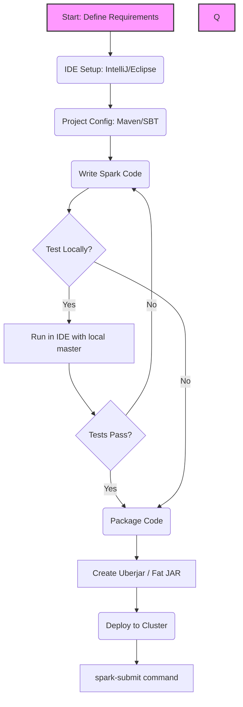

# Chapter 3: Writing Spark Applications

**An overview of the complete lifecycle of developing, building, and deploying Apache Spark applications from a local IDE to a production cluster.**

## Why It Matters
When learning Apache Spark, beginners often start with the Spark shell (REPL) or notebooks (like Jupyter or Databricks). While these environments are fantastic for exploratory data analysis and prototyping, they do not reflect how production data engineering is done. Real-world Spark applications are written in IDEs, built using build tools like Maven or SBT, and deployed to clusters using `spark-submit`. Understanding this lifecycle is critical because it bridges the gap between writing a few lines of Spark code and deploying a robust, scalable, and testable data pipeline that can run unattended in a production environment. Without mastering the application lifecycle, a Spark developer cannot effectively collaborate with a team, manage dependencies, or ensure their code is reliable.

## How It Works
The journey from code to production in Spark involves several distinct steps, each requiring specific tools and knowledge. 

First, the development environment must be set up. This involves choosing an Integrated Development Environment (IDE) such as IntelliJ IDEA, Eclipse, or Visual Studio Code. Alongside the IDE, a build tool is essential. In the Scala ecosystem, SBT (Scala Build Tool) is the de facto standard, while Maven is more common for Java and also widely used for Scala. These tools manage project dependencies, such as the `spark-core` and `spark-sql` libraries, ensuring that the correct versions are downloaded and compiled against.

Once the project is set up, the actual application logic is written. This typically starts with creating a `SparkSession` (or `SparkContext` in older versions), which serves as the entry point to Spark's capabilities. Data is then loaded from various sources, such as JSON files, CSVs, or databases. The data is processed using transformations (like `filter`, `map`, `groupBy`) and actions (like `count`, `save`). Advanced features like broadcast variables might be employed to optimize performance when dealing with large lookup tables.

After the code is written, it must be packaged for deployment. Spark applications are often deployed to clusters that do not have the application's specific dependencies installed. To solve this, an "uberjar" (or fat JAR) is created. This is a single Java Archive (JAR) file that contains not only the compiled application code but also all of its dependencies, ensuring that the application can run anywhere without missing libraries.

Finally, the packaged application is submitted to a Spark cluster using the `spark-submit` script. This script allows the user to specify various execution parameters, such as the cluster manager (YARN, Mesos, Kubernetes, or Standalone), the deploy mode (client or cluster), and resource allocations (number of executors, memory per executor). The cluster manager then takes over, distributing the application across the available nodes and executing it in parallel.

## Flow Diagram



## Data Visualization

| Phase | Tool/Component | Input | Output | Purpose |
| :--- | :--- | :--- | :--- | :--- |
| **Setup** | IDE (IntelliJ) | Developer Intent | Project Structure | Provide coding environment |
| **Build Config** | Maven / SBT | Dependencies list | Downloaded Jars | Manage external libraries |
| **Coding** | Scala / Python | Raw Data | Transformed Data | Implement business logic |
| **Packaging** | SBT Assembly | App Code + Deps | Uberjar (.jar) | Bundle everything for deploy |
| **Deployment** | spark-submit | Uberjar + Args | Cluster Execution | Run app on distributed cluster |

## Code Example

```scala
// A simple object to demonstrate the structure of a Spark Application
import org.apache.spark.sql.SparkSession

object Chapter3OverviewApp {
  def main(args: Array[String]): Unit = {
    // 1. Initialize SparkSession
    val spark = SparkSession.builder()
      .appName("Chapter 3 Overview Application")
      // .master("local[*]") // Usually passed via spark-submit in production
      .getOrCreate()

    // 2. Application Logic (Loading Data)
    // In a real application, this path would likely be parameterized
    val dataPath = "hdfs://namenode:8020/user/data/input.json"
    
    try {
      val df = spark.read.json(dataPath)
      
      // 3. Transformation
      val processedDf = df.filter(df("status") === "active")
      
      // 4. Action (Output)
      processedDf.write.parquet("hdfs://namenode:8020/user/data/output.parquet")
      
      println("Application completed successfully.")
    } catch {
      case e: Exception =>
        println(s"An error occurred: ${e.getMessage}")
        e.printStackTrace()
    } finally {
      // 5. Clean up
      spark.stop()
    }
  }
}
```

## Common Pitfalls

*   **Hardcoding Paths and Master:** Leaving `.master("local[*]")` in code meant for production. This overrides cluster manager settings and forces the app to run locally on the driver node.
*   **Dependency Conflicts (Jar Hell):** Including libraries in the uberjar that conflict with Spark's own internal libraries, leading to runtime `NoSuchMethodError` or `ClassNotFoundException`.
*   **Ignoring the Build Tool:** Trying to manually download and add JARs to the IDE instead of letting Maven or SBT manage them, resulting in un-reproducible builds.
*   **Forgetting to Stop SparkSession:** Not calling `spark.stop()` at the end of the application, which can leave resources hanging on the cluster.
*   **Assuming Local Execution equals Cluster Execution:** Code that works on a small sample locally might fail spectacularly on a cluster due to serialization issues or memory limits when handling full datasets.

## Key Takeaway
Mastering the Spark application lifecycle—from IDE setup and dependency management to creating an uberjar and deploying with `spark-submit`—is what separates a casual Spark user from a professional Data Engineer.
