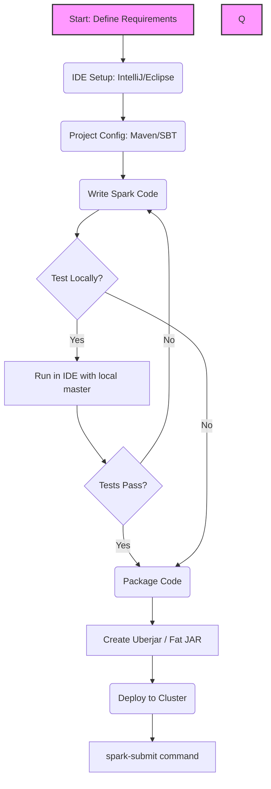

# Chapter 3: Writing Spark Applications

**An overview of the complete lifecycle of developing, building, and deploying Apache Spark applications from a local IDE to a production cluster.**

## Why It Matters
When learning Apache Spark, beginners often start with the Spark shell (REPL) or notebooks (like Jupyter or Databricks). While these environments are fantastic for exploratory data analysis and prototyping, they do not reflect how production data engineering is done. Real-world Spark applications are written in IDEs, built using build tools like Maven or SBT, and deployed to clusters using `spark-submit`. Understanding this lifecycle is critical because it bridges the gap between writing a few lines of Spark code and deploying a robust, scalable, and testable data pipeline that can run unattended in a production environment. Without mastering the application lifecycle, a Spark developer cannot effectively collaborate with a team, manage dependencies, or ensure their code is reliable.

## How It Works
The journey from code to production in Spark involves several distinct steps, each requiring specific tools and knowledge. 

First, the development environment must be set up. This involves choosing an Integrated Development Environment (IDE) such as IntelliJ IDEA, Eclipse, or Visual Studio Code. Alongside the IDE, a build tool is essential. In the Scala ecosystem, SBT (Scala Build Tool) is the de facto standard, while Maven is more common for Java and also widely used for Scala. These tools manage project dependencies, such as the `spark-core` and `spark-sql` libraries, ensuring that the correct versions are downloaded and compiled against.

Once the project is set up, the actual application logic is written. This typically starts with creating a `SparkSession` (or `SparkContext` in older versions), which serves as the entry point to Spark's capabilities. Data is then loaded from various sources, such as JSON files, CSVs, or databases. The data is processed using transformations (like `filter`, `map`, `groupBy`) and actions (like `count`, `save`). Advanced features like broadcast variables might be employed to optimize performance when dealing with large lookup tables.

After the code is written, it must be packaged for deployment. Spark applications are often deployed to clusters that do not have the application's specific dependencies installed. To solve this, an "uberjar" (or fat JAR) is created. This is a single Java Archive (JAR) file that contains not only the compiled application code but also all of its dependencies, ensuring that the application can run anywhere without missing libraries.

Finally, the packaged application is submitted to a Spark cluster using the `spark-submit` script. This script allows the user to specify various execution parameters, such as the cluster manager (YARN, Mesos, Kubernetes, or Standalone), the deploy mode (client or cluster), and resource allocations (number of executors, memory per executor). The cluster manager then takes over, distributing the application across the available nodes and executing it in parallel.

## Flow Diagram



## Data Visualization

| Phase | Tool/Component | Input | Output | Purpose |
| :--- | :--- | :--- | :--- | :--- |
| **Setup** | IDE (IntelliJ) | Developer Intent | Project Structure | Provide coding environment |
| **Build Config** | Maven / SBT | Dependencies list | Downloaded Jars | Manage external libraries |
| **Coding** | Scala / Python | Raw Data | Transformed Data | Implement business logic |
| **Packaging** | SBT Assembly | App Code + Deps | Uberjar (.jar) | Bundle everything for deploy |
| **Deployment** | spark-submit | Uberjar + Args | Cluster Execution | Run app on distributed cluster |

## Code Example

```scala
// A simple object to demonstrate the structure of a Spark Application
import org.apache.spark.sql.SparkSession

object Chapter3OverviewApp {
  def main(args: Array[String]): Unit = {
    // 1. Initialize SparkSession
    val spark = SparkSession.builder()
      .appName("Chapter 3 Overview Application")
      // .master("local[*]") // Usually passed via spark-submit in production
      .getOrCreate()

    // 2. Application Logic (Loading Data)
    // In a real application, this path would likely be parameterized
    val dataPath = "hdfs://namenode:8020/user/data/input.json"
    
    try {
      val df = spark.read.json(dataPath)
      
      // 3. Transformation
      val processedDf = df.filter(df("status") === "active")
      
      // 4. Action (Output)
      processedDf.write.parquet("hdfs://namenode:8020/user/data/output.parquet")
      
      println("Application completed successfully.")
    } catch {
      case e: Exception =>
        println(s"An error occurred: ${e.getMessage}")
        e.printStackTrace()
    } finally {
      // 5. Clean up
      spark.stop()
    }
  }
}
```

## Common Pitfalls

*   **Hardcoding Paths and Master:** Leaving `.master("local[*]")` in code meant for production. This overrides cluster manager settings and forces the app to run locally on the driver node.
*   **Dependency Conflicts (Jar Hell):** Including libraries in the uberjar that conflict with Spark's own internal libraries, leading to runtime `NoSuchMethodError` or `ClassNotFoundException`.
*   **Ignoring the Build Tool:** Trying to manually download and add JARs to the IDE instead of letting Maven or SBT manage them, resulting in un-reproducible builds.
*   **Forgetting to Stop SparkSession:** Not calling `spark.stop()` at the end of the application, which can leave resources hanging on the cluster.
*   **Assuming Local Execution equals Cluster Execution:** Code that works on a small sample locally might fail spectacularly on a cluster due to serialization issues or memory limits when handling full datasets.

## Key Takeaway
Mastering the Spark application lifecycle—from IDE setup and dependency management to creating an uberjar and deploying with `spark-submit`—is what separates a casual Spark user from a professional Data Engineer.


---

## 🎓 Deep Learning Questions

### Q1: Why Was This Concept Introduced?
Before formal Spark applications and the `spark-submit` framework, deploying distributed processing jobs (like Hadoop MapReduce) was notoriously complex. It required tedious manual packaging of dependencies, verbose XML configurations, and complicated deployment scripts. Spark introduced the unified application lifecycle (IDE project structure + build tools + `spark-submit`) to standardize and simplify deployment. This overcomes the limitation of environment inconsistency, ensuring that everything the application needs is bundled together (via uberjars/fat JARs or dependency packaging), providing a single, flexible command to deploy across Local, YARN, Mesos, or Kubernetes clusters without changing the source code.

### Q2: What Exactly Is This Concept and How Does It Work?
Writing a production Spark application involves creating a standalone, compiled (or fully packaged) program rather than executing ad-hoc commands in a notebook or REPL. It starts by setting up a project using a build tool (Maven/SBT for Scala/Java, or Pipenv/Poetry for PySpark). 
The internal working and execution flow:
1. **Development:** Code is written in an IDE, defining a `SparkSession` as the entry point, followed by data loading, transformations, and actions.
2. **Packaging:** The code and all external dependencies are bundled into an **uberjar** (for JVM) or a `.zip`/`.whl` package (for Python).
3. **Submission:** The `spark-submit` script sends this package to the Cluster Manager.
4. **Execution:** The Cluster Manager allocates resources. A Driver process starts, translates the application logic into a Directed Acyclic Graph (DAG) of stages and tasks, and distributes these tasks to Executor processes across the cluster for parallel execution.

### Q3: Where Should This Concept Be Used?
This formalized application lifecycle must be used for any production-grade data engineering or machine learning pipeline. 
- **Netflix:** Building robust, automated ETL pipelines that process terabytes of viewing history daily to refresh recommendation models.
- **Banking:** Deploying fraud detection algorithms that require strict version control, unit testing, and automated CI/CD deployment pipelines to secure on-premise clusters.
- **Uber:** Packaging complex geospatial aggregation logic to run as scheduled batch jobs coordinated by Apache Airflow.
Whenever Spark code needs to be repeatable, version-controlled, tested, and scheduled, standalone Spark applications are the mandatory standard.

### Q4: Where Should This Concept NOT Be Used?
Do NOT use the full IDE-to-uberjar deployment lifecycle for rapid prototyping, initial data exploration, or one-off ad-hoc queries. The compile-package-deploy cycle is too slow for these exploratory tasks. In those scenarios, interactive notebooks (Databricks, Jupyter) or the Spark REPL are vastly superior for immediate feedback.
**Anti-patterns:** Hardcoding cluster configurations (like `.master("local")`) or static file paths directly in the application code. This defeats the purpose of packaging, making the app impossible to deploy across different environments (Dev/Test/Prod) without modifying and recompiling the code.

### Q5: How Is This Concept Different from Hadoop?

| Aspect | Hadoop MapReduce | Apache Spark |
| :--- | :--- | :--- |
| **Architecture** | Heavy reliance on disk I/O; map and reduce phases. | In-memory processing with DAG execution. |
| **Performance** | Slow due to disk writes between map and reduce steps. | Up to 100x faster in memory, 10x faster on disk. |
| **Processing Model** | Strictly Map and Reduce operations. | High-level APIs (SQL, DataFrames, MLlib, Streaming). |
| **Memory Usage** | Disk-bound, low memory requirements. | Memory-bound, optimized via Tungsten. |
| **Fault Tolerance** | Replicates data to disk after every step. | Recomputes lost partitions using RDD lineage (DAG). |
| **Scalability** | Scales to thousands of nodes. | Scales to thousands of nodes efficiently. |
| **Ease of Development** | Verbose Java code, complex deployment. | Concise code (Python, Scala, SQL), simpler `spark-submit`. |
| **Typical Use Cases** | Legacy batch processing. | ETL, Machine Learning, Streaming, Interactive Analytics. |
| **Advantages** | Very stable for massive, long-running batch jobs. | Speed, unified engine, developer productivity. |
| **Disadvantages** | Difficult to write, debug, and maintain. | High memory consumption, complex tuning required. |

### Q6: How Can This Concept Be Related to a Traditional RDBMS?

| Spark Application Concept | Traditional RDBMS Equivalent | Explanation |
| :--- | :--- | :--- |
| `SparkSession` | Database Connection Pool | The entry point to communicate with the system. |
| `spark-submit` | Executing a stored procedure or SQL script | The mechanism to launch a predefined set of instructions. |
| Uberjar / Fat JAR | Compiled SQL Package / PL/SQL Module | Bundling all necessary logic and dependencies into one deployable unit. |
| Cluster Manager (YARN) | Database Engine Resource Manager | Allocates CPU and memory for the execution of the query. |
| DataFrame | Table or View | The structured data being manipulated. |
| Action (e.g., `.write`) | `INSERT INTO ... SELECT` | The command that actually executes the processing and writes the result. |

### Q7: What Happens Behind the Scenes?
When a Spark application is submitted via `spark-submit`:
1. **Submission:** `spark-submit` connects to the Cluster Manager (e.g., YARN) and requests resources for the Driver.
2. **Driver Initialization:** The Driver process starts, running your `main()` method and initializing the `SparkSession`.
3. **DAG Generation:** As the Driver reads transformations (like `filter`, `groupBy`), it builds a logical plan, then a physical Directed Acyclic Graph (DAG). No data is processed yet (Lazy Evaluation).
4. **Action Triggered:** An action (like `write` or `collect`) triggers the execution.
5. **Stages & Tasks:** The DAG Scheduler breaks the DAG into **Stages** based on shuffle boundaries. Each stage is divided into **Tasks** (one task per data partition).
6. **Task Scheduling:** The Task Scheduler sends tasks to the **Executors** allocated by the Cluster Manager.
7. **Execution & Shuffle:** Executors process their local partitions. If a stage requires grouping data, a **Shuffle** occurs, transferring data across the network between executors.
8. **Completion:** The final output is written to storage, the `SparkSession` stops, and cluster resources are released.

```text
+-------------------+      +-------------------+      +-------------------+
|   Developer IDE   | ---> |  Build Tool (SBT) | ---> |     Uberjar     |
+-------------------+      +-------------------+      +-------------------+
                                                              |
                                                              v
+-------------------+      +-------------------+      +-------------------+
|  Storage (HDFS)   | <--- |     Executors     | <--- |   spark-submit    |
| (Read/Write Data) |      | (Process Tasks)   |      |  (Cluster Mgr)    |
+-------------------+      +-------------------+      +-------------------+
                                   ^
                                   |
                           +-------------------+
                           |   Driver (DAG)    |
                           +-------------------+
```

### Q8: Performance Considerations, Best Practices, and Common Mistakes

| Category | Recommendation | Why It Matters |
| :--- | :--- | :--- |
| **Packaging** | Build an Uberjar / Fat JAR | Ensures all third-party dependencies are available on worker nodes, preventing `ClassNotFoundException`. |
| **Configuration** | Do not hardcode `.master()` in code | Allows the same artifact to be deployed anywhere. Use `spark-submit --master` instead. |
| **Dependency Mgmt** | Exclude Spark libraries from the Uberjar | Spark is already on the cluster. Including it bloats the JAR size and causes version conflicts (`provided` scope in Maven). |
| **Deployment** | Use `cluster` deploy mode for production | In `client` mode, if the submission machine dies, the app fails. `cluster` mode runs the driver inside the cluster. |
| **Memory** | Tune executor memory and cores properly | Assigning too much memory per executor leads to long GC pauses; too little causes OOM errors. Sweet spot is usually 5 cores. |

### Q9: Interview Questions

**Beginner:**
1. **What is `spark-submit`?**
   *Answer:* A command-line script used to launch applications on a Spark cluster, allowing you to specify cluster managers, deploy modes, and resources.
2. **What is an Uberjar (Fat JAR)?**
   *Answer:* A single JAR file that contains both your compiled application code and all its external library dependencies.
3. **Why do we use build tools like Maven or SBT with Spark?**
   *Answer:* To manage library dependencies, compile code consistently, and package the application into a deployable artifact.

**Intermediate:**
1. **What is the difference between `client` and `cluster` deploy mode?**
   *Answer:* In `client` mode, the Driver runs on the machine where `spark-submit` was executed. In `cluster` mode, the Driver runs inside the cluster on a worker node.
2. **How do you handle Python dependencies in PySpark applications?**
   *Answer:* By passing a `.zip` file of dependencies using the `--py-files` flag in `spark-submit`, or using virtual environments like Conda on the cluster.
3. **What happens if you hardcode `.master("local")` and deploy to a cluster?**
   *Answer:* The application will ignore the cluster manager and run entirely on the local machine (the Driver), leading to resource starvation and failure.

**Advanced:**
1. **How do you resolve a `NoSuchMethodError` when deploying a Spark app?**
   *Answer:* This usually indicates a dependency version conflict (Jar Hell). You resolve it by analyzing the dependency tree and excluding conflicting transient dependencies from your build file.
2. **Explain how broadcast variables are deployed to executors.**
   *Answer:* The Driver serializes the broadcast variable and sends it via a BitTorrent-like protocol to all Executors, where it is cached in memory for tasks to read.
3. **How does the DAG Scheduler determine stage boundaries?**
   *Answer:* Stage boundaries are created whenever a wide transformation (e.g., `groupBy`, `join`) requires a data shuffle across the network.

**Scenario-Based:**
1. **Your Spark application runs fine locally but throws a `ClassNotFoundException` on the cluster. What went wrong?**
   *Answer:* You likely didn't package your external dependencies into an uberjar, or you provided a JAR compiled against a different Scala/Java version than the cluster supports.
2. **You need to deploy a Spark app daily that processes sensitive financial data. How do you parameterize it?**
   *Answer:* Remove all hardcoded paths and configurations. Use `args` in the `main` method to accept input/output paths, and pass environment-specific configs via `spark-submit --conf`.

### Q10: Complete Real-World Example

**Business Problem:** A retail company needs a scheduled daily batch job to read raw sales transactions from cloud storage, filter out cancelled orders, calculate total revenue per store, and save the aggregated results to a data warehouse.

**Sample Dataset (`sales.json`):**
```json
{"transaction_id": 101, "store_id": 1, "amount": 50.0, "status": "completed"}
{"transaction_id": 102, "store_id": 2, "amount": 150.0, "status": "cancelled"}
{"transaction_id": 103, "store_id": 1, "amount": 20.0, "status": "completed"}
```

**Full Working PySpark Code (`retail_aggregator.py`):**
```python
import sys
from pyspark.sql import SparkSession
from pyspark.sql.functions import sum as _sum, col

def process_sales(input_path, output_path):
    # 1. Initialize SparkSession (No hardcoded master!)
    spark = SparkSession.builder \
        .appName("Daily Retail Aggregator") \
        .getOrCreate()
        
    try:
        # 2. Load Data
        df = spark.read.json(input_path)
        
        # 3. Transformations
        # Filter completed orders
        completed_sales = df.filter(col("status") == "completed")
        
        # Aggregate revenue per store
        revenue_per_store = completed_sales.groupBy("store_id") \
            .agg(_sum("amount").alias("total_revenue"))
            
        # 4. Action: Write output
        revenue_per_store.write.mode("overwrite").parquet(output_path)
        
        print(f"Successfully processed sales data and wrote to {output_path}")
        
    except Exception as e:
        print(f"Job failed: {str(e)}")
        raise e
    finally:
        # 5. Cleanup
        spark.stop()

if __name__ == "__main__":
    if len(sys.argv) != 3:
        print("Usage: retail_aggregator.py <input_path> <output_path>")
        sys.exit(-1)
        
    in_path = sys.argv[1]
    out_path = sys.argv[2]
    process_sales(in_path, out_path)
```

**Step-by-Step Execution Walkthrough:**
1. Code is written and saved as `retail_aggregator.py`.
2. The application is submitted via terminal:
   `spark-submit --master yarn --deploy-mode cluster retail_aggregator.py s3://bucket/sales.json s3://bucket/output/`
3. The cluster manager allocates a Driver.
4. The Driver parses the arguments and builds the DAG (Read -> Filter -> GroupBy -> Write).
5. Executors process the JSON, perform a shuffle for the `groupBy`, and write Parquet files in parallel.

**Expected Output (Parquet content read back):**
```text
+--------+-------------+
|store_id|total_revenue|
+--------+-------------+
|       1|         70.0|
+--------+-------------+
```

**Performance Notes:** Parquet is used for the output as it is highly compressed and optimized for analytical querying by downstream BI tools.

### 💡 Key Takeaways
- Interactive notebooks are for prototyping; standalone applications are for production.
- Use build tools (SBT, Maven) to manage dependencies and create an uberjar.
- Never hardcode environment configurations (`.master()`, paths) in production code.
- `spark-submit` is the universal bridge between your code and any cluster manager.
- Always remember to call `spark.stop()` to cleanly release cluster resources.

### ⚠️ Common Misconceptions
- **Misconception:** You can just copy your notebook code directly into production. **Reality:** Notebook code usually lacks testing, error handling, parameterization, and proper dependency management.
- **Misconception:** Including Spark jars in your uberjar makes it "more complete". **Reality:** It causes version conflicts and bloats the file size; Spark libraries must be set to `provided`.
- **Misconception:** `client` deploy mode is fine for production. **Reality:** If the edge node goes down, your app crashes. Use `cluster` mode.

### 🔗 Related Spark Concepts
- SparkSession Architecture
- Transformations vs. Actions
- Lazy Evaluation & DAG
- Cluster Managers (YARN, Mesos, K8s)

### 📚 References for Further Reading
- Apache Spark Official Documentation
- Learning Spark (O'Reilly)
- Spark: The Definitive Guide (O'Reilly)
