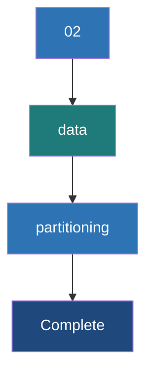

# Data Partitioning

**Data Partitioning is the process of dividing a large distributed dataset into smaller, logical chunks (partitions) that can be processed in parallel across different nodes in a Spark cluster.**

## Why It Matters
Partitioning is the single most important factor determining the parallelism and performance of a Spark application. If you have 1000 CPU cores but your data is split into only 2 partitions, exactly 2 cores will work while 998 sit idle. Conversely, if you have too many tiny partitions, the overhead of task scheduling will outweigh the actual processing time. Furthermore, intelligent partitioning (co-locating data with the same key on the same node) can completely eliminate the need for expensive network shuffles during joins and aggregations.

## How It Works

A partition is an atomic chunk of data stored on a single node in the cluster. Every RDD or DataFrame consists of one or more partitions. When a Spark job runs, it launches one Task per partition for a given stage.

### Controlling Partitions
- **Default Partitions**: Spark determines the default number of partitions based on the cluster configuration (e.g., `spark.default.parallelism`) or the underlying storage system (e.g., one partition per HDFS block).
- **`repartition(num)`**: Shuffles all data across the network to create a uniform distribution of data into the specified number of partitions. Expensive, but necessary if data is heavily skewed or if you need to drastically increase parallelism.
- **`coalesce(num)`**: Reduces the number of partitions without a full network shuffle by simply merging existing partitions on the same node. Only works for decreasing partition count.

### Partitioning Strategies (Partitioner)
For Pair RDDs, Spark supports specific partitioning strategies that dictate exactly which partition a key-value pair belongs to:
1. **HashPartitioner**: The default. Calculates `hash(key) % numPartitions`. Keys with the same hash go to the same partition.
2. **RangePartitioner**: Used for sorting. Samples the data to determine boundaries, ensuring that keys in one partition are strictly less than keys in the next partition.
3. **Custom Partitioner**: You can write a class that extends Spark's Partitioner to implement domain-specific logic (e.g., partitioning by domain name in a URL string).

### Pre-Partitioning to Eliminate Shuffles
If two RDDs are pre-partitioned using the exact same Partitioner (e.g., `HashPartitioner(100)`), Spark knows that all records with Key 'X' in RDD 1 are on the same node as records with Key 'X' in RDD 2. When joining them, Spark performs a **Narrow Dependency** join—requiring zero network shuffling.

## Flow Diagram



## Data Visualization

### Repartition vs Coalesce

| Current State (4 Partitions) | Goal | Command | Network Shuffle? | Resulting Distribution |
|------------------------------|------|---------|------------------|------------------------|
| P1(10MB), P2(10MB), P3(10MB), P4(10MB) | Reduce to 2 | `coalesce(2)` | **No** | P1+P2 (20MB), P3+P4 (20MB) on existing nodes |
| P1(10MB), P2(10MB), P3(10MB), P4(10MB) | Increase to 8 | `repartition(8)` | **Yes** | 8 Partitions (5MB each) scattered across cluster |
| P1(1MB), P2(1MB), P3(30MB), P4(8MB) (Skewed!) | Fix Skew | `repartition(4)` | **Yes** | 4 Partitions (10MB each) evenly distributed |

## Code Example

```python
from pyspark import SparkContext, SparkConf

conf = SparkConf().setAppName("PartitioningExample").setMaster("local[4]")
sc = SparkContext(conf=conf)

# 1. Creating data and checking default partitions
data = range(1, 10000)
rdd = sc.parallelize(data)
print(f"Default partitions: {rdd.getNumPartitions()}")

# 2. Coalesce (Decreasing partitions without full shuffle)
coalesced_rdd = rdd.coalesce(2)
print(f"Partitions after coalesce: {coalesced_rdd.getNumPartitions()}")

# 3. Repartition (Increasing partitions or fixing skew, requires shuffle)
repartitioned_rdd = rdd.repartition(10)
print(f"Partitions after repartition: {repartitioned_rdd.getNumPartitions()}")

# 4. partitionBy for Pair RDDs (Pre-partitioning)
pair_data = [(i % 10, i) for i in range(1, 1000)]
pair_rdd = sc.parallelize(pair_data)

# Apply HashPartitioner with 5 partitions
# This forces a shuffle now, but saves shuffles later
partitioned_pair_rdd = pair_rdd.partitionBy(5)

# Verify the partitioner exists
print(f"Partitioner: {partitioned_pair_rdd.partitioner}") 
# Output in Scala/Java would explicitly show HashPartitioner

def custom_partitioner(key):
    # Send even keys to partition 0, odd to partition 1
    return 0 if key % 2 == 0 else 1

custom_partitioned_rdd = pair_rdd.partitionBy(2, custom_partitioner)
```

## Common Pitfalls
* **Using `repartition()` instead of `coalesce()` to downscale**: `repartition` always triggers a full network shuffle. If you are writing a massive dataset to a few files, use `coalesce()` to merge partitions locally and save massive network overhead.
* **The "Too Many Partitions" Problem**: Creating millions of partitions for a small dataset. The Spark task scheduler takes a few milliseconds per task. If processing the data takes less time than scheduling the task, overhead kills performance.
* **The "Too Few Partitions" Problem**: Having massive partitions (e.g., >200MB) can lead to OutOfMemory (OOM) errors on executors because the data for a single partition cannot fit into memory during processing.
* **Losing the Partitioner**: Operations like `map` on a Pair RDD clear the partitioner because Spark assumes you might have changed the key. Use `mapValues` to retain it.

## Key Takeaway
**Proper data partitioning ensures maximum cluster utilization and avoids memory errors; leverage `coalesce` to shrink data without shuffling, and pre-partition Pair RDDs to eliminate shuffles during joins.**
