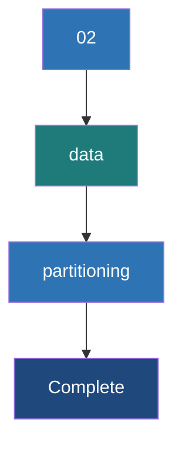

# Data Partitioning

**Data Partitioning is the process of dividing a large distributed dataset into smaller, logical chunks (partitions) that can be processed in parallel across different nodes in a Spark cluster.**

## Why It Matters
Partitioning is the single most important factor determining the parallelism and performance of a Spark application. If you have 1000 CPU cores but your data is split into only 2 partitions, exactly 2 cores will work while 998 sit idle. Conversely, if you have too many tiny partitions, the overhead of task scheduling will outweigh the actual processing time. Furthermore, intelligent partitioning (co-locating data with the same key on the same node) can completely eliminate the need for expensive network shuffles during joins and aggregations.

## How It Works

A partition is an atomic chunk of data stored on a single node in the cluster. Every RDD or DataFrame consists of one or more partitions. When a Spark job runs, it launches one Task per partition for a given stage.

### Controlling Partitions
- **Default Partitions**: Spark determines the default number of partitions based on the cluster configuration (e.g., `spark.default.parallelism`) or the underlying storage system (e.g., one partition per HDFS block).
- **`repartition(num)`**: Shuffles all data across the network to create a uniform distribution of data into the specified number of partitions. Expensive, but necessary if data is heavily skewed or if you need to drastically increase parallelism.
- **`coalesce(num)`**: Reduces the number of partitions without a full network shuffle by simply merging existing partitions on the same node. Only works for decreasing partition count.

### Partitioning Strategies (Partitioner)
For Pair RDDs, Spark supports specific partitioning strategies that dictate exactly which partition a key-value pair belongs to:
1. **HashPartitioner**: The default. Calculates `hash(key) % numPartitions`. Keys with the same hash go to the same partition.
2. **RangePartitioner**: Used for sorting. Samples the data to determine boundaries, ensuring that keys in one partition are strictly less than keys in the next partition.
3. **Custom Partitioner**: You can write a class that extends Spark's Partitioner to implement domain-specific logic (e.g., partitioning by domain name in a URL string).

### Pre-Partitioning to Eliminate Shuffles
If two RDDs are pre-partitioned using the exact same Partitioner (e.g., `HashPartitioner(100)`), Spark knows that all records with Key 'X' in RDD 1 are on the same node as records with Key 'X' in RDD 2. When joining them, Spark performs a **Narrow Dependency** join—requiring zero network shuffling.

## Flow Diagram



## Data Visualization

### Repartition vs Coalesce

| Current State (4 Partitions) | Goal | Command | Network Shuffle? | Resulting Distribution |
|------------------------------|------|---------|------------------|------------------------|
| P1(10MB), P2(10MB), P3(10MB), P4(10MB) | Reduce to 2 | `coalesce(2)` | **No** | P1+P2 (20MB), P3+P4 (20MB) on existing nodes |
| P1(10MB), P2(10MB), P3(10MB), P4(10MB) | Increase to 8 | `repartition(8)` | **Yes** | 8 Partitions (5MB each) scattered across cluster |
| P1(1MB), P2(1MB), P3(30MB), P4(8MB) (Skewed!) | Fix Skew | `repartition(4)` | **Yes** | 4 Partitions (10MB each) evenly distributed |

## Code Example

```python
from pyspark import SparkContext, SparkConf

conf = SparkConf().setAppName("PartitioningExample").setMaster("local[4]")
sc = SparkContext(conf=conf)

# 1. Creating data and checking default partitions
data = range(1, 10000)
rdd = sc.parallelize(data)
print(f"Default partitions: {rdd.getNumPartitions()}")

# 2. Coalesce (Decreasing partitions without full shuffle)
coalesced_rdd = rdd.coalesce(2)
print(f"Partitions after coalesce: {coalesced_rdd.getNumPartitions()}")

# 3. Repartition (Increasing partitions or fixing skew, requires shuffle)
repartitioned_rdd = rdd.repartition(10)
print(f"Partitions after repartition: {repartitioned_rdd.getNumPartitions()}")

# 4. partitionBy for Pair RDDs (Pre-partitioning)
pair_data = [(i % 10, i) for i in range(1, 1000)]
pair_rdd = sc.parallelize(pair_data)

# Apply HashPartitioner with 5 partitions
# This forces a shuffle now, but saves shuffles later
partitioned_pair_rdd = pair_rdd.partitionBy(5)

# Verify the partitioner exists
print(f"Partitioner: {partitioned_pair_rdd.partitioner}") 
# Output in Scala/Java would explicitly show HashPartitioner

def custom_partitioner(key):
    # Send even keys to partition 0, odd to partition 1
    return 0 if key % 2 == 0 else 1

custom_partitioned_rdd = pair_rdd.partitionBy(2, custom_partitioner)
```

## Common Pitfalls
* **Using `repartition()` instead of `coalesce()` to downscale**: `repartition` always triggers a full network shuffle. If you are writing a massive dataset to a few files, use `coalesce()` to merge partitions locally and save massive network overhead.
* **The "Too Many Partitions" Problem**: Creating millions of partitions for a small dataset. The Spark task scheduler takes a few milliseconds per task. If processing the data takes less time than scheduling the task, overhead kills performance.
* **The "Too Few Partitions" Problem**: Having massive partitions (e.g., >200MB) can lead to OutOfMemory (OOM) errors on executors because the data for a single partition cannot fit into memory during processing.
* **Losing the Partitioner**: Operations like `map` on a Pair RDD clear the partitioner because Spark assumes you might have changed the key. Use `mapValues` to retain it.

## Key Takeaway
**Proper data partitioning ensures maximum cluster utilization and avoids memory errors; leverage `coalesce` to shrink data without shuffling, and pre-partition Pair RDDs to eliminate shuffles during joins.**


---

## 🎓 Deep Learning Questions

### Q1: Why Was This Concept Introduced?
Before data partitioning existed in distributed frameworks, processing massive datasets sequentially on a single machine was the only option, which was slow and limited by the hardware of that single node. As datasets grew to petabyte scales, horizontal scaling became necessary. Spark introduced Data Partitioning to explicitly control how a large dataset is broken down and distributed across the cluster. Without partitioning, Spark wouldn't know how to divide the work among multiple executors and cores. Partitioning overcomes the limitation of single-node bottlenecks, enabling massive parallel execution and minimizing network bottlenecks by intentionally grouping related data (like same keys) onto the same physical machines to avoid expensive data movement during operations like joins.

### Q2: What Exactly Is This Concept and How Does It Work?
Data Partitioning is the process of physically dividing a large logical dataset (RDD or DataFrame) into smaller, manageable chunks called partitions. Each partition resides on a single node within the Spark cluster. 
When an action is called, Spark's driver breaks the job down into stages and tasks. The fundamental rule is: **One Task is launched per Partition**. If you have 100 partitions, Spark will launch 100 parallel tasks to process them. Spark uses a `Partitioner` (like Hash or Range) to decide which record goes to which partition. For example, a HashPartitioner computes the hash of a key and applies a modulo operation (`hash(key) % num_partitions`) to assign it to a specific partition. This guarantees that all identical keys end up in the exact same partition on the same machine.

### Q3: Where Should This Concept Be Used?
Partitioning is ubiquitous in Spark, but explicitly managing it is critical in:
- **E-Commerce / Retail (Amazon, Walmart)**: When joining a massive `Orders` table with a `Customers` table, pre-partitioning both by `customer_id` ensures that the join happens locally on each node without shuffling terabytes of data across the network.
- **Financial Services (Banking)**: When running aggregations like calculating the total transaction volume per account. Partitioning by `account_id` speeds up the aggregation.
- **Streaming / IoT**: When reading high-throughput data from Kafka, the number of Spark partitions typically aligns with Kafka partitions to maintain optimal read parallelism.
- **Data Warehousing / ETL**: Before writing final output to Parquet or Delta Lake, coalescing or repartitioning is used to ensure file sizes are optimal (around 128MB - 1GB) rather than creating thousands of tiny files.

### Q4: Where Should This Concept NOT Be Used?
- **Avoid `repartition()` for shrinking data**: If you simply want to reduce the number of partitions before writing to storage, do not use `repartition()`. It will trigger a full network shuffle. Use `coalesce()` instead, which minimizes data movement.
- **Avoid over-partitioning small datasets**: If your dataset is only 50MB, partitioning it into 1000 chunks will result in severe overhead. The Spark scheduler will spend more time launching tasks than actually processing the data.
- **Avoid naive partitioning on highly skewed keys**: If you partition by `country` and 90% of your users are in the "USA", one partition will be massive (causing OOM errors and straggler tasks) while the others are empty. This is an anti-pattern.

### Q5: How Is This Concept Different from Hadoop?
| Aspect | Hadoop MapReduce | Apache Spark |
|--------|------------------|--------------|
| **Architecture** | Relies strictly on HDFS block sizes and custom Partitioner classes written in Java. | More dynamic; handles partitioning in memory and supports Hash, Range, and Custom partitioners natively. |
| **Performance** | Always writes intermediate partitioned data to disk between Map and Reduce phases. | Keeps partitioned data in memory between operations whenever possible, drastically improving speed. |
| **Processing Model** | Number of maps equals number of input splits; reducers are configured explicitly. | Number of partitions dictates the number of parallel tasks; can be dynamically repartitioned mid-flow. |
| **Memory Usage** | Less sensitive to partition sizes as it aggressively spills to disk. | Highly sensitive; oversized partitions will crash executors (OOM) because it attempts to process in memory. |
| **Fault Tolerance** | Recomputes from disk blocks. | Recomputes lost partitions dynamically using the RDD lineage (DAG). |
| **Scalability** | Excellent for massive batch jobs, but slow. | Excellent, highly tunable via `repartition` and `coalesce` for speed and scale. |
| **Ease of Development** | Requires verbose Java code to implement a custom partitioner. | One-liners in Python/Scala (`df.repartition(10, "col")`) or SQL. |
| **Typical Use Cases** | Legacy batch processing, ETL. | Real-time analytics, machine learning, modern fast ETL. |
| **Advantages** | Robust disk-based partitioning handles almost any size. | Extremely fast, flexible, and allows dynamic shuffling optimization. |
| **Disadvantages** | Very slow due to disk I/O during shuffle. | Requires careful tuning to avoid OOM errors from data skew. |

### Q6: How Can This Concept Be Related to a Traditional RDBMS?
| Aspect | Traditional RDBMS | Apache Spark |
|--------|-------------------|--------------|
| **Concept** | Table Partitioning / Sharding | RDD / DataFrame Partitioning |
| **Purpose** | To improve query performance (e.g., partition elimination) and manageability (dropping old data). | To enable parallel processing across a distributed cluster of machines. |
| **Execution** | A query might only scan specific partitions (e.g., `WHERE year = 2023`). | Spark assigns different CPU cores to process different partitions simultaneously. |
| **Data Placement** | Usually on a single massive disk array or distributed across shards. | Explicitly distributed across the RAM/Disk of multiple worker nodes. |
| **Distribution Logic** | Range partitioning by Date or Hash partitioning by ID. | HashPartitioner, RangePartitioner, or Custom logic applied dynamically. |

### Q7: What Happens Behind the Scenes?
When a Spark action triggers a job that involves partitioning:

1. **Driver**: Analyzes the DAG and determines the required partitions.
2. **DAG Scheduler**: Splits the logical plan into Stages based on where shuffles (repartitioning) occur. 
3. **Task Scheduler**: Launches one Task for every partition in the stage.
4. **Executors**: Execute the tasks. If data needs to be repartitioned, a **Shuffle** occurs.
5. **Shuffle Phase**: 
   - *Shuffle Write*: Executors write their data out to local disk, bucketed by the target partition.
   - *Shuffle Read*: Executors pull the specific buckets they need over the network to form the new partitions.

```text
+-------------------+       +-------------------+       +-------------------+
|  Executor 1       |       |   Network         |       |  Executor 1       |
|  Partition A      | ----> |   Shuffle Phase   | ----> |  New Partition 1  |
|  (Keys: 1, 2, 3)  |       |   (Hash/Range)    |       |  (Keys: 1, 4)     |
+-------------------+       +-------------------+       +-------------------+
                                     |
+-------------------+                |                  +-------------------+
|  Executor 2       |                v                  |  Executor 2       |
|  Partition B      | --------------------------------> |  New Partition 2  |
|  (Keys: 4, 5, 6)  |                                   |  (Keys: 2, 5)     |
+-------------------+                                   +-------------------+
```

### Q8: Performance Considerations, Best Practices, and Common Mistakes
| Category | Recommendation | Why It Matters |
|----------|----------------|----------------|
| **Optimization** | Aim for partition sizes between 100MB and 200MB. | Too small = scheduling overhead. Too large = OOM errors and garbage collection pauses. |
| **Best Practice** | Use `coalesce()` to reduce partitions, not `repartition()`. | `coalesce()` avoids a full network shuffle by merging partitions residing on the same node. |
| **Common Mistake** | Using `repartition()` excessively without reason. | Triggers expensive cross-network shuffles, significantly degrading performance. |
| **Production Tip** | Set `spark.sql.shuffle.partitions` based on your data size. | The default is 200. For large datasets, this is too small. A good rule of thumb is 2-3x the number of total cluster cores. |
| **Data Skew** | Salting keys before partitioning if one key is dominant. | Prevents one executor from getting overloaded while others finish quickly and sit idle. |
| **Debugging** | Check the Spark UI "Stages" tab for uneven Task durations. | If one task takes 10 minutes and 199 tasks take 5 seconds, you have severe data skew in your partitions. |

### Q9: Interview Questions

**Beginner**
1. **What is a partition in Apache Spark?**
   It is a logical chunk of a distributed dataset residing on a single physical node in the cluster.
2. **What is the difference between `repartition()` and `coalesce()`?**
   `repartition` does a full shuffle to increase or decrease partitions. `coalesce` minimizes shuffles by merging local partitions, used only for decreasing counts.
3. **How many tasks does Spark launch for a stage with 50 partitions?**
   Exactly 50 tasks. One task per partition.

**Intermediate**
4. **Why is it important to choose the right number of partitions?**
   Too few means idle CPU cores and potential OOM errors. Too many means massive task scheduling overhead.
5. **What happens to the Partitioner if you use the `map()` transformation on a Pair RDD?**
   Spark drops the partitioner because `map` can change the key. You should use `mapValues()` to preserve the partitioner.
6. **What is a HashPartitioner?**
   A mechanism that groups data by applying a hash function to the key and modulo the number of partitions, guaranteeing same keys end up on the same node.

**Advanced**
7. **Explain how pre-partitioning can completely eliminate shuffles during a join.**
   If both RDDs/DataFrames are previously partitioned using the identical Partitioner (e.g., HashPartitioner with 100 partitions), Spark knows matching keys are co-located. It performs a narrow dependency join with zero network movement.
8. **How do you handle a massive data skew on a specific key (e.g., "Null" or a default ID)?**
   Use "salting" - append a random number (1 to N) to the skewed key, perform a partial aggregation to reduce the volume, then remove the salt and perform the final aggregation.
9. **How does `spark.sql.shuffle.partitions` affect performance, and when should you change it?**
   It determines the number of partitions created after wide transformations (joins, aggregations). Change it from the default 200 when dealing with very large data to ensure partition sizes remain ~100-200MB.

**Scenario-Based**
10. **Your Spark job joins two 500GB tables. The job runs out of memory (OOM) on a specific executor, while others finish successfully. What is the root cause and how do you fix it?**
    **Answer**: The root cause is Data Skew. One partition contains a disproportionate amount of data for a specific key, overloading that single executor. To fix it, you can identify the skewed key, salt the keys to distribute them evenly across the cluster, or use broadcast joins if one of the tables can be filtered down to a small size.
11. **You are writing a 10GB DataFrame to S3. It creates 10,000 tiny files of 1MB each, slowing down subsequent reads. How do you optimize this write process?**
    **Answer**: The DataFrame currently has 10,000 partitions. Before calling `.write()`, apply `.coalesce(50)`. This will merge the partitions locally without shuffling, resulting in 50 files of 200MB each, which is highly optimal for cloud storage reads.

### Q10: Complete Real-World Example
**Business Problem**: A global ride-sharing company (like Uber) needs to calculate the total revenue generated per city every day. The data is massive and currently skewed because cities like New York and London have 100x more rides than smaller towns.

**Sample Dataset**: `rides_data` containing `(city_id, ride_cost)`.

**PySpark Code**:
```python
from pyspark.sql import SparkSession
from pyspark.sql.functions import col, sum, rand, concat_ws, lit, split

# Initialize Spark Session
spark = SparkSession.builder \
    .appName("RideRevenueAggregation") \
    .config("spark.sql.shuffle.partitions", "50") \
    .getOrCreate()

# 1. Create dummy skewed data (New York = ID 1 has heavy skew)
data = [("1", 25.0)] * 100000 + [("2", 15.0)] * 1000 + [("3", 10.0)] * 500
df = spark.createDataFrame(data, ["city_id", "ride_cost"])

# PROBLEM: A direct groupBy("city_id") would send 100,000 records to one executor.
# direct_agg = df.groupBy("city_id").agg(sum("ride_cost"))

# SOLUTION: Salting to fix Data Skew

# Step A: Add a random salt (between 0 and 9) to the city_id to distribute the heavy key
# e.g., "1" becomes "1_4", "1_7", etc.
salted_df = df.withColumn("salted_city_id", concat_ws("_", col("city_id"), (rand() * 10).cast("int")))

# Step B: Perform a partial aggregation on the salted keys
# This distributes the massive New York aggregation across up to 10 executors
partial_agg_df = salted_df.groupBy("salted_city_id").agg(sum("ride_cost").alias("partial_sum"))

# Step C: Remove the salt to get back the original city_id
# Split the string by "_" and take the first part
unsalted_df = partial_agg_df.withColumn("city_id", split(col("salted_city_id"), "_").getItem(0))

# Step D: Perform the final aggregation
# Now we are only aggregating 10 rows per city, eliminating the memory bottleneck
final_agg_df = unsalted_df.groupBy("city_id").agg(sum("partial_sum").alias("total_revenue"))

final_agg_df.show()

# If writing to disk, ensure we don't output too many files
# final_agg_df.coalesce(1).write.parquet("s3://bucket/output/")
```

**Step-by-step Execution**:
1. We generate a dataset heavily skewed towards city_id "1".
2. We append a random salt suffix (0-9) to the `city_id` to artificially create 10 sub-keys for every real key.
3. We perform a partial aggregation grouped by the salted keys. This shuffle is evenly distributed because the dominant key is split 10 ways.
4. We strip the salt off.
5. We perform a final grouping on the true `city_id`. Since the first aggregation reduced 100,000 rows to just 10 rows, this final shuffle uses virtually no memory.

**Expected Output**:
```text
+-------+-------------+
|city_id|total_revenue|
+-------+-------------+
|      3|       5000.0|
|      1|    2500000.0|
|      2|      15000.0|
+-------+-------------+
```

**Performance Notes**:
By salting the keys before the first aggregation, we avoided an OutOfMemoryError on the executor handling city_id 1. The trade-off is two shuffle phases instead of one, but it guarantees job completion and utilizes the entire cluster evenly.

### 💡 Key Takeaways
- Partitioning dictates the degree of parallelism in Spark; one partition equals one task.
- `repartition()` causes a full network shuffle and should be used to increase parallelism or evenly distribute skewed data.
- `coalesce()` shrinks the number of partitions locally without a full network shuffle; ideal for formatting output files.
- Pre-partitioning identical keys using the same Partitioner completely eliminates expensive network shuffles during joins.
- Unhandled data skew is the most common cause of Spark job failures and straggler tasks.

### ⚠️ Common Misconceptions
- **"More partitions always mean faster processing"**: False. Too many partitions cause massive task scheduling overhead that exceeds the actual data processing time.
- **"repartition() and coalesce() do the exact same thing"**: False. `repartition` shuffles data across the network; `coalesce` merely combines local partitions to avoid network I/O.
- **"Spark automatically fixes skewed partitions"**: False (mostly). Unless using Adaptive Query Execution (AQE) in newer Spark versions, developers must manually salt keys or adjust partitioning to fix skew.

### 🔗 Related Spark Concepts
- Shuffling
- The Spark UI (Stages and Tasks)
- Adaptive Query Execution (AQE)
- RDD vs DataFrames
- Narrow vs Wide Dependencies

### 📚 References for Further Reading
- Apache Spark Official Documentation
- Learning Spark (O'Reilly)
- Spark: The Definitive Guide (O'Reilly)
