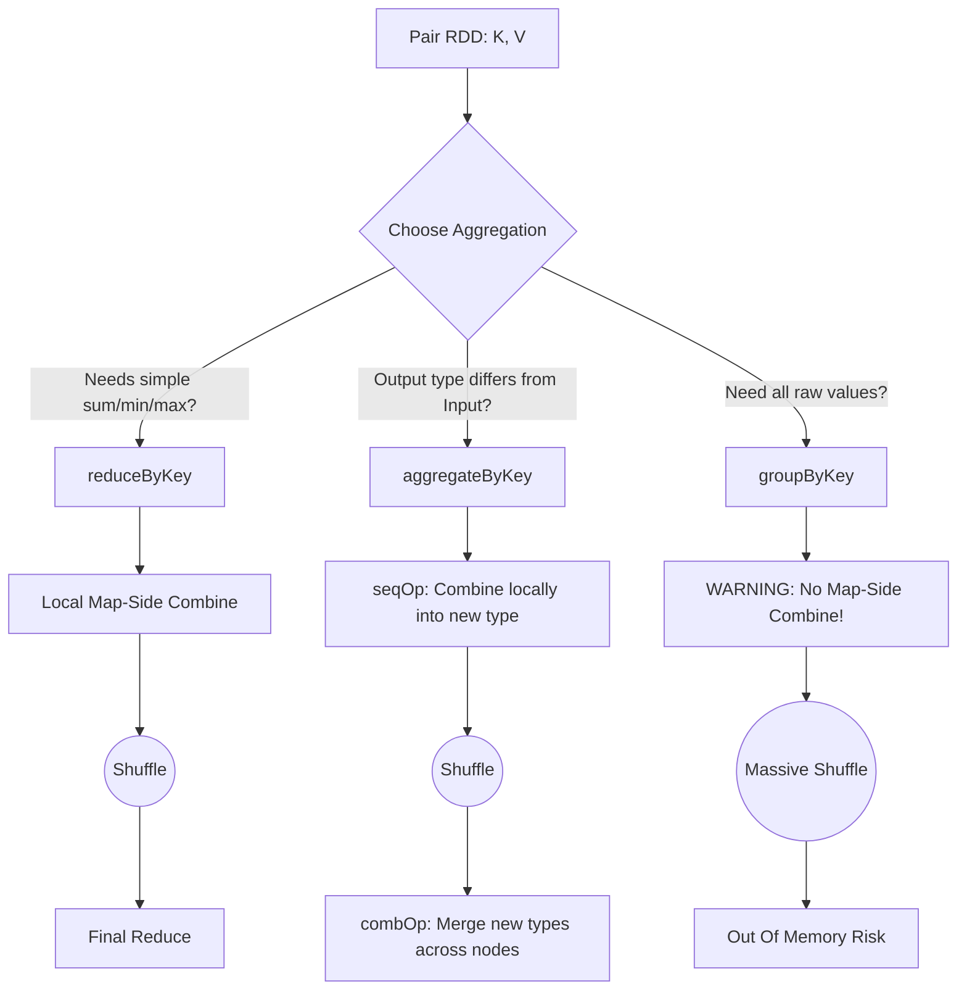

# Grouping and Sorting

**Grouping and Sorting are fundamental data transformation techniques in Spark that aggregate related records together and order them, relying heavily on Pair RDDs and physical network shuffles.**

## Why It Matters
Business logic almost always requires aggregations—calculating total revenue per region, finding the most active users, or sorting logs by timestamp. How you choose to group and sort data in Spark directly impacts application stability. Using the wrong grouping function can crash your cluster, and failing to understand secondary sorting means you might resort to moving data out of Spark into local Python/Scala collections to sort it, defeating the purpose of distributed computing.

## How It Works

### Grouping Abstractions
Spark provides multiple ways to group data by a key, ranked from least to most efficient:
1. **`groupByKey()`**: Groups all values for a key into an iterable collection. Performs NO map-side combine. All raw data is shuffled over the network.
2. **`reduceByKey(func)`**: Combines values for a key using an associative and commutative function. Performs a map-side combine (local aggregation) before shuffling. Both input and output must be the same type.
3. **`aggregateByKey(zeroValue)(seqOp, combOp)`**: The most flexible API. Allows the output type to be different from the input type. You provide a starting value, a function to combine elements within a partition (`seqOp`), and a function to combine aggregated results across partitions (`combOp`).
4. **`combineByKey()`**: The underlying engine for most key-based aggregations. Highly customizable, allowing you to define how to create an accumulator, merge a value into it, and merge two accumulators.

### Sorting
- **`sortByKey(ascending)`**: For Pair RDDs, this sorts the RDD across partitions. Spark uses a `RangePartitioner` to ensure that data in Partition 1 is strictly less than data in Partition 2.
- **Secondary Sort**: Spark does not guarantee the order of values *within* a group after `reduceByKey` or `groupByKey`. If you need values sorted within a key, you must use a "Secondary Sort" pattern: restructure your key to be a composite `(Key, SortKey)`, sort by the composite key, and then group or map.

## Flow Diagram



## Data Visualization

### `aggregateByKey` Execution

**Goal**: Calculate the average score per user. Input: `("UserA", 90)`, `("UserA", 100)`.
Output needs to be `(Sum, Count)` so we can do division. Input is `Int`, Output is `Tuple`.

| Phase | Input Data | Operation Applied | Output |
|-------|------------|-------------------|--------|
| **Initialization** | `("UserA", 90)` | Apply `zeroValue = (0, 0)` | Accumulator ready |
| **Map-Side (Partition 1)** | `90`, `100` | `seqOp(acc, val): (acc.sum + val, acc.count + 1)` | `("UserA", (190, 2))` |
| **Map-Side (Partition 2)** | `80` | `seqOp(acc, val): (acc.sum + val, acc.count + 1)` | `("UserA", (80, 1))` |
| **Shuffle** | | Send to Reducer | |
| **Reduce-Side** | `(190, 2)`, `(80, 1)`| `combOp(acc1, acc2): (acc1.sum + acc2.sum, ...)` | `("UserA", (270, 3))` |
| **Final Map** | `("UserA", (270, 3))`| `mapValues(v -> v.sum / v.count)` | `("UserA", 90.0)` |

## Code Example

```python
from pyspark import SparkContext, SparkConf

conf = SparkConf().setAppName("GroupingSorting").setMaster("local[*]")
sc = SparkContext(conf=conf)

data = [
    ("Math", 85), ("English", 90), 
    ("Math", 95), ("Science", 80), 
    ("English", 92), ("Math", 70)
]
rdd = sc.parallelize(data)

# 1. reduceByKey (Simple, same type)
# Calculate total sum of scores per subject
total_scores = rdd.reduceByKey(lambda x, y: x + y)

# 2. aggregateByKey (Complex, different type)
# Calculate Average Score per subject. 
# We need to track (Sum_of_Scores, Count_of_Scores)
zero_value = (0, 0)

# seqOp: runs locally on each partition
# acc is (sum, count), value is the score
def seq_op(acc, value):
    return (acc[0] + value, acc[1] + 1)

# combOp: runs across partitions to merge the accumulators
def comb_op(acc1, acc2):
    return (acc1[0] + acc2[0], acc1[1] + acc2[1])

sum_count_rdd = rdd.aggregateByKey(zero_value, seq_op, comb_op)

# Final step: calculate average
averages = sum_count_rdd.mapValues(lambda v: v[0] / v[1])
print(f"Averages: {averages.collect()}")

# 3. sortByKey
# Sort the averages alphabetically by subject
sorted_averages = averages.sortByKey(ascending=True)
print(f"Sorted Averages: {sorted_averages.collect()}")

# 4. Secondary Sort Pattern
# Goal: Sort by Subject ASC, then by Score DESC
# Step 1: Make composite key
composite_rdd = rdd.map(lambda x: ((x[0], -x[1]), x[1]))
# Step 2: Sort by composite key
sorted_composite = composite_rdd.sortByKey()
# Step 3: Strip out the complex key to get the final result
final_secondary_sort = sorted_composite.map(lambda x: (x[0][0], x[1]))
print(f"Secondary Sort Result: {final_secondary_sort.collect()}")
```

## Common Pitfalls
* **Assuming DataFrames `groupBy` acts like `groupByKey`**: In Spark SQL/DataFrames, calling `df.groupBy("col").agg(...)` is highly optimized and actually behaves more like `reduceByKey` under the hood using Hash Aggregation. It is safe to use. Only the RDD `groupByKey` is dangerous.
* **Secondary Sort Memory Leaks**: Attempting to group all data for a key using `groupByKey` and then sorting the resulting list in normal Python/Scala code. If the group has millions of records, sorting it locally will cause an OutOfMemoryError. Use the distributed secondary sort pattern instead.
* **Wrong operations in `aggregateByKey`**: If your `seqOp` or `combOp` are not commutative and associative, your results will be non-deterministic because the order in which Spark processes partitions and merges them is not guaranteed.

## Key Takeaway
**Always push aggregations as close to the map phase as possible using `reduceByKey` or `aggregateByKey`, and use composite keys for secondary sorting rather than attempting to sort grouped lists in local memory.**


---

## 🎓 Deep Learning Questions

### Q1: Why Was This Concept Introduced?
Before Apache Spark, aggregating data in Hadoop MapReduce was heavily I/O bound. Each stage required writing intermediate grouping data to disk, causing massive performance overhead. Furthermore, Hadoop sorting mechanisms lacked the rich, programmatic in-memory flexibility to do advanced key-value manipulation. Spark introduced a versatile set of RDD grouping methods (`reduceByKey`, `aggregateByKey`, `groupByKey`) to keep data in-memory and perform intelligent map-side reductions (pre-aggregations) before incurring expensive network shuffles. This allowed Spark to drastically reduce the amount of data transferred across the cluster compared to Hadoop, solving the fundamental limitation of slow, disk-heavy aggregations.

### Q2: What Exactly Is This Concept and How Does It Work?
Grouping and sorting in Spark involve organizing distributed partitions of data so that records with the same key reside together.
Internally, when you call `reduceByKey`, Spark applies the reducing function locally on each partition first (map-side combine). It squashes multiple values for the same key into a single value, reducing data volume. Then, a "Shuffle" occurs where Spark partitions the aggregated results using a HashPartitioner, sending identical keys across the network to the same Executor. Finally, a reduce-side combine merges the data. 
Sorting (`sortByKey`) uses a `RangePartitioner`. It samples the data to determine boundaries, then distributes the data so that all keys in partition 1 are strictly less than those in partition 2, allowing for a globally sorted output when the partitions are read sequentially.

### Q3: Where Should This Concept Be Used?
- **Retail & E-commerce (Amazon):** Calculating total daily sales per product category, or finding the top 5 highest-selling items.
- **Log Analysis (Cybersecurity):** Grouping server logs by IP address to count failed login attempts and sorting them to identify malicious actors.
- **Streaming & Ride-Sharing (Uber):** Aggregating total trip distances per driver ID or finding the average wait time per city zone.
- **Finance (Banking):** Grouping transactions by account ID and sorting them chronologically to compute daily balances.

### Q4: Where Should This Concept NOT Be Used?
- **Do not use `groupByKey()`** when you simply need to sum, count, or average values. It pulls all raw data across the network, causing massive shuffles and OutOfMemory (OOM) errors.
- **Do not sort entire datasets unnecessarily.** Global sorting is very expensive due to range partitioning and shuffling. If you only need the "top N" items, use the `takeOrdered()` action instead of full sorting.
- **Avoid complex custom objects as keys** if they lack a properly implemented `hashCode` and `equals` method, as this will break Spark's partitioning and grouping logic.

### Q5: How Is This Concept Different from Hadoop?
| Aspect | Hadoop MapReduce | Apache Spark |
|--------|------------------|--------------|
| **Architecture** | Disk-based intermediate writes for shuffling. | In-memory processing, shuffles rely on memory and spill to disk only if needed. |
| **Performance** | High latency due to HDFS writes between map and reduce. | 10x-100x faster due to map-side combiners and memory caching. |
| **Processing Model** | Strict Map -> Sort -> Reduce pipeline. | Flexible DAG, multiple transformations before a shuffle. |
| **Memory Usage** | Very low memory footprint, highly disk-reliant. | High memory footprint, requires careful tuning to avoid OOM. |
| **Fault Tolerance** | Replication on HDFS. | Lineage graph (DAG) recomputes lost partitions. |
| **Scalability** | Excellent for massive, batch-only jobs. | Excellent, handles both batch and interactive workloads. |
| **Ease of Development**| Verbose Java code. | Concise APIs in Scala, Python, SQL, and Java. |
| **Typical Use Cases** | Nightly batch processing of massive logs. | Iterative algorithms, real-time analytics, machine learning. |
| **Advantages** | Very stable for long-running, cheap hardware jobs. | Speed, rich API, integrated ecosystem (SQL, MLlib). |
| **Disadvantages** | Slow, hard to program, inefficient for iterative jobs. | Can suffer from OOM errors if memory isn't managed well. |

### Q6: How Can This Concept Be Related to a Traditional RDBMS?
| Spark Concept | SQL RDBMS Equivalent | Explanation |
|---------------|----------------------|-------------|
| `groupByKey()` / `reduceByKey()` | `GROUP BY column` | Aggregates data based on a common key. |
| `reduceByKey(x+y)` | `SUM(column) ... GROUP BY key` | Performs a sum aggregation grouped by the key. |
| `sortByKey(ascending=False)` | `ORDER BY column DESC` | Sorts the resulting records. |
| Secondary Sort | `ORDER BY col1, col2 DESC` | Sorting by multiple keys. |
| `aggregateByKey` | `SUM()`, `AVG()`, `COUNT()` | Complex aggregations where output differs from input. |

### Q7: What Happens Behind the Scenes?
1. **Driver**: Translates the grouping/sorting code into a logical DAG.
2. **DAG Scheduler**: Identifies that a shuffle is required (e.g., `reduceByKey`) and splits the job into two Stages: Map Stage and Reduce Stage.
3. **Tasks**: The Map Stage tasks apply map-side combining on the Executors.
4. **Executors & Partitions**: Each Executor processes its partition, squashing duplicate keys. 
5. **Shuffle**: Data is partitioned by key hash and written to local disk shuffle files.
6. **Reduce Stage**: Executors pull the relevant shuffle files across the network, perform final aggregation, and yield the new RDD.

```text
[Executor 1: Part 1] -> (Map-side combine) -> [Shuffle Write]
                                                    \
                                                  (Network Shuffle)
                                                    /
[Executor 2: Part 2] -> (Map-side combine) -> [Shuffle Read] -> [Final Reduce] -> Output RDD
```

### Q8: Performance Considerations, Best Practices, and Common Mistakes
| Category | Recommendation | Why It Matters |
|----------|----------------|----------------|
| **Performance** | Prefer `reduceByKey` over `groupByKey`. | Avoids shuffling all raw data, significantly reducing network I/O and memory pressure. |
| **Optimization** | Use DataFrames/Spark SQL instead of RDDs for grouping. | Catalyst Optimizer automatically applies hash aggregation and optimal execution plans. |
| **Best Practices** | Filter data *before* grouping. | Reduces the amount of data processed during the expensive shuffle phase. |
| **Common Mistakes** | Using `groupByKey` to count items. | Extremely inefficient; pulls every item across the network instead of just sending partial counts. |
| **Production Tips** | Tune `spark.sql.shuffle.partitions`. | The default is 200. Adjust based on cluster size and data volume to prevent skew and small files. |
| **Debugging** | Watch for Data Skew. | If one key is vastly larger than others, one Executor will OOM. Consider salting keys. |

### Q9: Interview Questions

**Beginner:**
1. **What is the difference between `groupByKey` and `reduceByKey`?**
   `reduceByKey` performs local aggregation (map-side combine) before shuffling data, while `groupByKey` shuffles all raw data across the network, making it much slower and prone to OOM errors.
2. **How do you sort an RDD in Spark?**
   You can use the `sortByKey()` transformation on a Pair RDD to sort by the keys, or use `sortBy()` to sort by a specific function.
3. **What is a map-side combine?**
   It's an optimization where Spark aggregates values for the same key locally on an Executor's partition before sending the data over the network.

**Intermediate:**
1. **When would you use `aggregateByKey` over `reduceByKey`?**
   When the output type of the aggregation needs to be different from the input type (e.g., inputting integers but outputting a tuple of sum and count to calculate an average).
2. **What is Secondary Sorting in Spark?**
   Secondary sorting is the process of sorting values within a group. Spark doesn't do this automatically. You must create a composite key (Key, SortValue), sort by it, and then extract the final values.
3. **What is Data Skew and how does it affect grouping?**
   Data skew happens when a few keys have significantly more records than others. During grouping, all records for a skewed key go to a single Executor, causing slow tasks or OutOfMemory crashes.

**Advanced:**
1. **Explain the parameters of `aggregateByKey`.**
   It takes three arguments: `zeroValue` (initial accumulator), `seqOp` (function to combine a value into the accumulator within a partition), and `combOp` (function to merge accumulators across partitions).
2. **How does `sortByKey` partition the data?**
   It uses a `RangePartitioner`, which samples the RDD to determine range boundaries, ensuring that keys in a lower partition are strictly less than keys in a higher partition.
3. **Can you explain how HashPartitioner works during `reduceByKey`?**
   It computes `hash(key) % numPartitions` to determine which Executor will receive all values for that specific key during the shuffle phase.

**Scenario-Based:**
1. **Your Spark job using `groupByKey` crashes with an OOM error. How do you fix it?**
   Replace `groupByKey` with `reduceByKey` or `aggregateByKey` to reduce the data volume via map-side combining before the shuffle. Alternatively, migrate to DataFrames for optimized Catalyst execution.
2. **You need to find the top 3 highest paid employees in every department. How do you approach this in Spark?**
   Using RDDs, this requires a secondary sort or `combineByKey`. Using DataFrames/SQL, it is best solved using Window functions (`rank()` or `row_number()` over a window partitioned by department and ordered by salary descending).

### Q10: Complete Real-World Example

**Business Problem (Uber):**
Uber wants to analyze driver earnings to find the average earnings per ride for each driver. The data comes in as `(DriverID, RideEarnings)`.

**Sample Dataset:**
```text
("Driver1", 15.0), ("Driver2", 20.0), ("Driver1", 25.0), ("Driver3", 10.0), ("Driver2", 30.0)
```

**Full Working PySpark Code:**
```python
from pyspark import SparkContext, SparkConf

# Initialize SparkContext
conf = SparkConf().setAppName("UberDriverEarnings").setMaster("local[*]")
sc = SparkContext(conf=conf)

# Sample Dataset: (DriverID, RideEarnings)
earnings_data = [
    ("Driver1", 15.0), ("Driver2", 20.0), 
    ("Driver1", 25.0), ("Driver3", 10.0), 
    ("Driver2", 30.0), ("Driver1", 20.0)
]
rdd = sc.parallelize(earnings_data)

# We need to find the average earning per driver. 
# This requires tracking (TotalEarnings, NumberOfRides) per driver.
# We will use aggregateByKey since the input is Float, but output must be a Tuple(Float, Int)

# 1. zeroValue: (sum, count)
zero_val = (0.0, 0)

# 2. seqOp: Local partition aggregation
def seq_op(acc, earning):
    # acc[0] is current sum, acc[1] is current count
    return (acc[0] + earning, acc[1] + 1)

# 3. combOp: Cross-partition aggregation
def comb_op(acc1, acc2):
    return (acc1[0] + acc2[0], acc1[1] + acc2[1])

# Apply aggregateByKey
aggregated_rdd = rdd.aggregateByKey(zero_val, seq_op, comb_op)

# Calculate the final average: TotalEarnings / NumberOfRides
average_earnings_rdd = aggregated_rdd.mapValues(lambda stats: stats[0] / stats[1])

# Sort the results by average earnings in descending order (highest earners first)
# We swap key and value for sorting, then swap back
sorted_earnings = average_earnings_rdd \
    .map(lambda x: (x[1], x[0])) \
    .sortByKey(ascending=False) \
    .map(lambda x: (x[1], x[0]))

print(sorted_earnings.collect())
# Expected Output: [('Driver2', 25.0), ('Driver1', 20.0), ('Driver3', 10.0)]
```

**Step-by-Step Execution Walkthrough:**
1. **Parallelize:** Data is split into partitions across Executors.
2. **`aggregateByKey` (Map Phase):** On each partition, `seqOp` aggregates the earnings and counts the rides for each driver locally.
3. **Shuffle:** Spark uses a hash partitioner to send all partial sums/counts for "Driver1", "Driver2", etc., to the same respective reducers.
4. **`aggregateByKey` (Reduce Phase):** `combOp` merges the partial sums and counts together.
5. **`mapValues`:** A simple division is performed on the final tuple to yield the average.
6. **`sortByKey`:** Keys and values are temporarily swapped to sort the dataset by the float averages in descending order, then swapped back.

**Performance Notes:**
By using `aggregateByKey`, the amount of data sent over the network is drastically reduced compared to grouping all raw ride earnings into massive lists using `groupByKey`. 

**When this approach is best:**
This approach is essential when performing complex mathematical aggregations (like averages, variances, or statistical modeling) where the intermediate state being tracked is fundamentally different from the raw input data format.

### 💡 Key Takeaways
- `reduceByKey` and `aggregateByKey` perform map-side reductions, making them highly efficient and resilient to large datasets.
- `groupByKey` pulls all data over the network uncompressed, making it an anti-pattern for simple aggregations.
- Spark sorting via `sortByKey` utilizes range partitioning to guarantee global order.
- To sort data inside groups, you must implement a Composite Key (Secondary Sort) pattern.
- Always filter data early in the DAG before applying any grouping or sorting transformations to minimize shuffle sizes.

### ⚠️ Common Misconceptions
- **"groupByKey is just like SQL GROUP BY."** False. SQL `GROUP BY` paired with aggregations is heavily optimized (like `reduceByKey`). Spark's RDD `groupByKey` behaves poorly because it literally groups all raw data into lists.
- **"Spark handles data skew automatically."** False. If one group key is massively larger than the rest, sorting or grouping will cause OOM errors on that specific Executor partition.
- **"Sorting within groups happens automatically."** False. `reduceByKey` only guarantees keys are distinct; it does not sort the values inside those keys.

### 🔗 Related Spark Concepts
- Spark Shuffling Mechanism
- HashPartitioner vs RangePartitioner
- DataFrames Hash Aggregation
- RDD Lineage and DAG Execution
- Data Skew and Salting

### 📚 References for Further Reading
- Apache Spark Official Documentation (RDD Programming Guide)
- Learning Spark (O'Reilly) - Chapter on Key-Value Pair Operations
- Spark: The Definitive Guide (O'Reilly) - Aggregations and Shuffles
