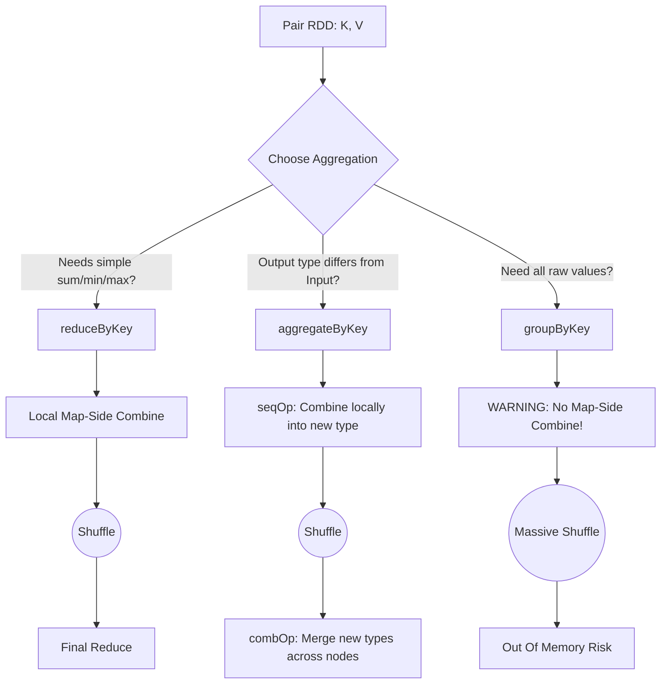

# Grouping and Sorting

**Grouping and Sorting are fundamental data transformation techniques in Spark that aggregate related records together and order them, relying heavily on Pair RDDs and physical network shuffles.**

## Why It Matters
Business logic almost always requires aggregations—calculating total revenue per region, finding the most active users, or sorting logs by timestamp. How you choose to group and sort data in Spark directly impacts application stability. Using the wrong grouping function can crash your cluster, and failing to understand secondary sorting means you might resort to moving data out of Spark into local Python/Scala collections to sort it, defeating the purpose of distributed computing.

## How It Works

### Grouping Abstractions
Spark provides multiple ways to group data by a key, ranked from least to most efficient:
1. **`groupByKey()`**: Groups all values for a key into an iterable collection. Performs NO map-side combine. All raw data is shuffled over the network.
2. **`reduceByKey(func)`**: Combines values for a key using an associative and commutative function. Performs a map-side combine (local aggregation) before shuffling. Both input and output must be the same type.
3. **`aggregateByKey(zeroValue)(seqOp, combOp)`**: The most flexible API. Allows the output type to be different from the input type. You provide a starting value, a function to combine elements within a partition (`seqOp`), and a function to combine aggregated results across partitions (`combOp`).
4. **`combineByKey()`**: The underlying engine for most key-based aggregations. Highly customizable, allowing you to define how to create an accumulator, merge a value into it, and merge two accumulators.

### Sorting
- **`sortByKey(ascending)`**: For Pair RDDs, this sorts the RDD across partitions. Spark uses a `RangePartitioner` to ensure that data in Partition 1 is strictly less than data in Partition 2.
- **Secondary Sort**: Spark does not guarantee the order of values *within* a group after `reduceByKey` or `groupByKey`. If you need values sorted within a key, you must use a "Secondary Sort" pattern: restructure your key to be a composite `(Key, SortKey)`, sort by the composite key, and then group or map.

## Flow Diagram



## Data Visualization

### `aggregateByKey` Execution

**Goal**: Calculate the average score per user. Input: `("UserA", 90)`, `("UserA", 100)`.
Output needs to be `(Sum, Count)` so we can do division. Input is `Int`, Output is `Tuple`.

| Phase | Input Data | Operation Applied | Output |
|-------|------------|-------------------|--------|
| **Initialization** | `("UserA", 90)` | Apply `zeroValue = (0, 0)` | Accumulator ready |
| **Map-Side (Partition 1)** | `90`, `100` | `seqOp(acc, val): (acc.sum + val, acc.count + 1)` | `("UserA", (190, 2))` |
| **Map-Side (Partition 2)** | `80` | `seqOp(acc, val): (acc.sum + val, acc.count + 1)` | `("UserA", (80, 1))` |
| **Shuffle** | | Send to Reducer | |
| **Reduce-Side** | `(190, 2)`, `(80, 1)`| `combOp(acc1, acc2): (acc1.sum + acc2.sum, ...)` | `("UserA", (270, 3))` |
| **Final Map** | `("UserA", (270, 3))`| `mapValues(v -> v.sum / v.count)` | `("UserA", 90.0)` |

## Code Example

```python
from pyspark import SparkContext, SparkConf

conf = SparkConf().setAppName("GroupingSorting").setMaster("local[*]")
sc = SparkContext(conf=conf)

data = [
    ("Math", 85), ("English", 90), 
    ("Math", 95), ("Science", 80), 
    ("English", 92), ("Math", 70)
]
rdd = sc.parallelize(data)

# 1. reduceByKey (Simple, same type)
# Calculate total sum of scores per subject
total_scores = rdd.reduceByKey(lambda x, y: x + y)

# 2. aggregateByKey (Complex, different type)
# Calculate Average Score per subject. 
# We need to track (Sum_of_Scores, Count_of_Scores)
zero_value = (0, 0)

# seqOp: runs locally on each partition
# acc is (sum, count), value is the score
def seq_op(acc, value):
    return (acc[0] + value, acc[1] + 1)

# combOp: runs across partitions to merge the accumulators
def comb_op(acc1, acc2):
    return (acc1[0] + acc2[0], acc1[1] + acc2[1])

sum_count_rdd = rdd.aggregateByKey(zero_value, seq_op, comb_op)

# Final step: calculate average
averages = sum_count_rdd.mapValues(lambda v: v[0] / v[1])
print(f"Averages: {averages.collect()}")

# 3. sortByKey
# Sort the averages alphabetically by subject
sorted_averages = averages.sortByKey(ascending=True)
print(f"Sorted Averages: {sorted_averages.collect()}")

# 4. Secondary Sort Pattern
# Goal: Sort by Subject ASC, then by Score DESC
# Step 1: Make composite key
composite_rdd = rdd.map(lambda x: ((x[0], -x[1]), x[1]))
# Step 2: Sort by composite key
sorted_composite = composite_rdd.sortByKey()
# Step 3: Strip out the complex key to get the final result
final_secondary_sort = sorted_composite.map(lambda x: (x[0][0], x[1]))
print(f"Secondary Sort Result: {final_secondary_sort.collect()}")
```

## Common Pitfalls
* **Assuming DataFrames `groupBy` acts like `groupByKey`**: In Spark SQL/DataFrames, calling `df.groupBy("col").agg(...)` is highly optimized and actually behaves more like `reduceByKey` under the hood using Hash Aggregation. It is safe to use. Only the RDD `groupByKey` is dangerous.
* **Secondary Sort Memory Leaks**: Attempting to group all data for a key using `groupByKey` and then sorting the resulting list in normal Python/Scala code. If the group has millions of records, sorting it locally will cause an OutOfMemoryError. Use the distributed secondary sort pattern instead.
* **Wrong operations in `aggregateByKey`**: If your `seqOp` or `combOp` are not commutative and associative, your results will be non-deterministic because the order in which Spark processes partitions and merges them is not guaranteed.

## Key Takeaway
**Always push aggregations as close to the map phase as possible using `reduceByKey` or `aggregateByKey`, and use composite keys for secondary sorting rather than attempting to sort grouped lists in local memory.**
